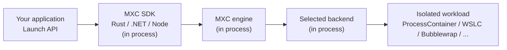

# Microsoft eXecution Container (MXC)

> **Audience:** MXC consumers

MXC is a **sandboxed code execution system** for running untrusted code
(agentic actions, plugins, and tools) on Windows, Linux, and macOS. It provides
multiple containment backends, from OS-native process sandboxes to full VMs,
behind a unified containment model and typed SDKs.

## Features

- **Cross-platform**: Windows, Linux, and macOS support with
  platform-appropriate containment backends
- **JSON-based configuration**: Versioned container-creation requests and
  security policies
- **Multiple containment backends**: ProcessContainer, Windows Sandbox, LXC,
  Bubblewrap, Seatbelt, MicroVM (Nanvix), Hyperlight, IsolationSession, and WSLC
- **Policy-driven sandboxing**:
  - **Filesystem policy**: Read-only, read-write, and denied path lists
  - **Network policy**: Proxy support, outbound controls, and backend-dependent
    host filtering
  - **UI policy**: Clipboard, display, and GUI access controls
- **State-aware lifecycle**: Provision, start, execute, stop, and deprovision
  persistent containers
- **Rust, .NET, and Node SDKs**: Versioned APIs for one-shot and state-aware
  execution
- **Diagnostics**: Tools to understand access-denied failures in a container

## What is MXC?

MXC is a dependency built into your app.



Your application specifies:

- The container type
- The containment rules
- The workload command

MXC validates the request, selects the backend, and launches the workload in
the resulting container.

### What container types are supported?

MXC runs workloads through platform-appropriate container backends on Windows,
Linux, and macOS.

| Runtime platform | Default backend | Other backends | Minimum host OS |
|---|---|---|---|
| Windows 11 x64 / ARM64 | `processcontainer` | `windows_sandbox`, `wslc`, `microvm`, `hyperlight`, `isolation_session` | `processcontainer`: 26100 (24H2)<br>`isolation_session`: 26340.9212 ([Insider Preview](https://learn.microsoft.com/en-us/windows-insider/release-notes/experimental/preview-build-26340-9212)) |
| Linux x64 / ARM64 | `bubblewrap` | `lxc`, `microvm`, `hyperlight` | - |
| macOS ARM64 / x64 | `seatbelt` | - | - |

**Experimental backends**: `windows_sandbox`, `microvm`, and `hyperlight`.

**Note:** `windows_sandbox` integrates the existing Windows Sandbox product,
which is a full VM.

See [Windows OS-version policy support](docs/backends/process-container/os-version-support.md)
for exact filesystem, network, and UI policy support in `processcontainer`.

### The Windows ProcessContainer (24H2+)

ProcessContainer is MXC's default Windows containment backend. It uses
Windows' strongest OS-native process-containment primitives to enforce
filesystem, network, and UI policy without the startup and memory cost of a
VM. This makes it well suited to frequent, short-lived agentic and sandboxed
workloads. MXC provides the typed, versioned policy model and runtime selection
needed to use these primitives consistently across supported Windows releases.

## How do I use MXC?

Install an SDK through your package manager. You do not need to clone this
repository.

| SDK | Install | Public V1 API |
|---|---|---|
| Rust | `cargo add mxc-sdk` | `mxc_sdk::v1` |
| .NET | `dotnet add package Microsoft.Mxc.Sdk` | `Microsoft.Mxc.Sdk.V1` |
| Node | `npm install @microsoft/mxc-sdk` | `@microsoft/mxc-sdk/v1` |

The Node and .NET packages include the native runtime assets. The Rust crate
builds the MXC SDK, engine, and selected backends into the consuming
application.

**Non-SDK consumption:** Platform-specific executor binaries, such as
`wxc-exec.exe`, accept JSON container-creation requests defined by the
[stable schema](schemas/stable/). Use an executor for testing or when a typed
SDK cannot be embedded in the application.

### SDK & runtime requirements

- A supported runtime platform and the prerequisites for the selected backend
- Rust when consuming `mxc-sdk`, .NET 8 or later for `Microsoft.Mxc.Sdk`, or
  Node.js 24 or later for `@microsoft/mxc-sdk`
- On Windows, Node.js 24.21.0 or later within the Node.js 24 release line, or
  Node.js 26.8.0 or later, for native standard-I/O transfer

## Running a contained workload

For complete SDK samples, see the
[Rust, .NET, and Node samples](samples/README.md).

### Node SDK

```bash
npm install @microsoft/mxc-sdk
```

```typescript
import { spawn, type ContainerRequest } from '@microsoft/mxc-sdk/v1';

const request: ContainerRequest = {
  command: 'node -e "console.log(\'hello from container\')"',
  network: { egress: { default: 'deny' } },
  timeoutMs: 30_000,
};

const child = await spawn(request);
try {
  child.standardOutput?.on('data', (data) => process.stdout.write(data));
  child.standardError?.on('data', (data) => process.stderr.write(data));
  const outcome = await child.wait();
  console.log('exit:', outcome.exitCode);
} finally {
  child.dispose();
}
```

See the runnable
[streaming standard-I/O sample](samples/run-with-io-stdio-streaming/) and the
[SDK API reference](docs/api-reference/README.md).

### Check containment support (probe)

On Windows, `wxc-exec --probe [config.json]`, Node `probe(request?)`, .NET
`MxcContainer.Probe(request?)`, and Rust `mxc_sdk::v1::probe(request)` report
which ProcessContainer tier can enforce a specific request. The probe does not
create a container. See the
[support-check samples](samples/dryrun-check-containment-support/).

### Executor binary

Executors accept a JSON container request. See the
[schema documentation](docs/schema.md) for the complete format.

```bash
# File path
wxc-exec.exe config.json

# Base64-encoded request
wxc-exec.exe --config-base64 <base64-encoded-json>
```

Arguments after the required `--` separator are the workload command line:

- Windows: `wxc-exec.exe config.json -- powershell.exe -NoProfile -Command "Write-Output 'hello world'"`
- Linux: `./lxc-exec config.json -- sh -c "printf 'hello world\n'"`
- macOS: `./mxc-exec-mac config.json -- sh -c "printf 'hello world\n'"`

**Note:** Executor use requires a prebuilt release artifact or a
[source build](#building-from-source). An SDK package is the preferred path for
applications.

## Schema

There is a JSON schema underneath the SDK for the containment-workload
configuration.

The JSON schema defines a complete container-creation request: the workload to
run, the containment backend, and the filesystem, network, UI, and lifecycle
policy MXC must enforce.

Released, immutable stable schemas live in [`schemas/stable/`](schemas/stable).
The in-progress development schema lives in [`schemas/dev/`](schemas/dev). The
current versions are tracked in
[`schemas/schema-version.json`](schemas/schema-version.json).

Use the latest stable schema for new JSON requests. SDK consumers do not
select a schema version; each versioned SDK API owns its matching contract.

## My application won't run in the sandbox!

Your application will hit access issues when running in a sandbox, until you've
had time to tune your containment rules. We're here to help.

### Debug console mode

Native executors normally reserve standard input, output, and error for the
workload. Use `--debug` for MXC diagnostic output:

```bash
wxc-exec.exe --debug config.json
```

See [MXC diagnostics](docs/development/guides/diagnostics.md) for the complete
developer reference.

### Audit mode

> **Warning:** `--audit` turns off all sandbox security for the workload being
> analyzed. Never use it to run untrusted code.

Audit mode helps a policy author find access-denied failures and reconstruct a
ProcessContainer policy that grants the files and capabilities a trusted tool
actually needs. On supported Windows releases, run:

```bash
wxc-exec.exe --audit policy.json
```

MXC records the observed accesses and produces policy-authoring artifacts. See
[logging access denied](docs/logging-access-denied.md) for safe
deny-and-record diagnostics, audit outputs, and supported workflows.

## Telemetry

Official Microsoft builds can send optional diagnostic telemetry to Microsoft.
Telemetry is off unless the individual run opts in, the Windows user has
explicitly consented, administrative policy permits collection, and your
application enables the telemetry option in a contained workload request. An
administrator can block telemetry but cannot grant consent for the user.

Local open-source builds are not configured to route telemetry to Microsoft,
and telemetry is a no-op on non-Windows platforms. See
[telemetry policy and consent](docs/telemetry.md) for controls and privacy
details.

## Building from source

Build from source when developing MXC, changing the native runtime, or using
the standalone executor binaries instead of a packaged SDK. Repository builds
produce the platform-native runtime and executors and stage the native assets
used by the Node SDK.

Build prerequisites are:

- [Rust](https://rustup.rs/), pinned to version **1.93** by
  `src/rust-toolchain.toml`
- Node.js 24 or later and npm
- The platform toolchain and prerequisites described by the selected backend

### Full build

#### Windows

```bash
build.bat                  # Release build for current architecture
build.bat --all            # Release build for both x64 and ARM64
```

#### Linux

```bash
./build.sh                 # Release build
```

#### macOS

```bash
./build-mac.sh             # Release build for native architecture
./build-mac.sh --all       # Both Apple Silicon and Intel
```

Component builds, formatting, linting, and tests are documented in the
[local development guide](docs/development/build-and-test/local-development.md).

### Project structure

```text
src/        Rust workspace, native executors, and Rust SDK
sdk/        Node and .NET SDKs
samples/    Runnable Rust, .NET, and Node scenarios
schemas/    Stable and development JSON request schemas
docs/       Consumer and developer documentation
tests/      Test collateral, configurations, and host-dependent suites
scripts/    Build, validation, packaging, and utility scripts
```

See [repository architecture](docs/development/architecture/repository-architecture.md)
for crate responsibilities, dependency direction, and execution surfaces.

## Documentation

### Consumer documentation

| Document | Repository location | Purpose |
|---|---|---|
| SDK samples | [`samples/`](samples/README.md) | Runnable Rust, .NET, and Node scenarios |
| SDK API reference | [`docs/api-reference/`](docs/api-reference/README.md) | Supported V1 operations and types |
| JSON schema | [`docs/schema.md`](docs/schema.md) | Container request and containment policy reference |
| Configuration examples | [`docs/examples.md`](docs/examples.md) | Annotated JSON requests |
| Container lifecycle | [`docs/container-lifecycle.md`](docs/container-lifecycle.md) | Persistent container lifecycle overview |
| Logging access denied | [`docs/logging-access-denied.md`](docs/logging-access-denied.md) | Diagnose blocked accesses and author policy |
| Telemetry | [`docs/telemetry.md`](docs/telemetry.md) | Consent and administrative controls |
| Backend guides | [`docs/backends/`](docs/backends/) | Platform and backend prerequisites and behavior |

Repository contributors should start with the
[MXC development documentation](docs/development/README.md).

## Contributing

See [CONTRIBUTING.md](CONTRIBUTING.md) for contribution guidelines.

## License

See [LICENSE.md](LICENSE.md) for details.
