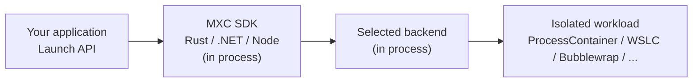

# Microsoft eXecution Container (MXC)

MXC is a **sandboxed code execution system** for running untrusted code
(model output, plugins, and tools) on Windows, Linux, and macOS. It provides
multiple containment backends, from OS-native process sandboxes to full VMs,
behind a unified containment model and typed SDKs.

## Features

- **Cross-platform**: Windows, Linux, and macOS support with
  platform-appropriate containment backends
- **JSON-based configuration**: Versioned container-creation requests and
  security policies
- **Multiple containment backends**: ProcessContainer, Windows Sandbox, LXC,
  Bubblewrap, Seatbelt, MicroVM (Nanvix), Hyperlight, IsolationSession, and WSLC
- **Policy-driven sandboxing**:
  - **Filesystem policy**: Read-only, read-write, and denied path lists
  - **Network policy**: Proxy support, outbound controls, and backend-dependent
    host filtering
  - **UI policy**: Clipboard, display, and GUI access controls
- **State-aware lifecycle**: Provision, start, execute, stop, and deprovision
  persistent containers
- **Rust, .NET, and Node SDKs**: Versioned APIs for one-shot and state-aware
  execution
- **Diagnostics**: Tools to understand access-denied failures in a container

## What is MXC?

MXC is an SDK dependency that builds into your app.



Your application specifies:

- The container type
- The containment rules
- The workload command

MXC validates the request, selects the backend, and launches the workload in
the resulting container.

### What container types are supported?

MXC runs workloads through platform-appropriate container backends on Windows,
Linux, and macOS.

| Runtime platform | Default backend | Other backends | Minimum host OS |
|---|---|---|---|
| Windows 11 x64 / ARM64 | `processcontainer` | `windows_sandbox`\*, `wslc`, `microvm`\*, `hyperlight`\*, `isolation_session` | [Windows OS-version support](docs/backends/process-container/os-version-support.md)|
| Linux x64 / ARM64 | `bubblewrap` | `lxc`, `microvm`, `hyperlight` | - |
| macOS ARM64 / x64 | `seatbelt` | - | - |

\* These backends are **experimental**.

## How do I use MXC?

Install an SDK through your package manager. You do not need to clone this
repository.

| SDK | Package |
|---|---|
| Rust | [https://crates.io/crates/mxc-sdk](https://crates.io/crates/mxc-sdk) |
| .NET | [https://www.nuget.org/packages/Microsoft.Mxc.Sdk](https://www.nuget.org/packages/Microsoft.Mxc.Sdk) |
| Node | [https://www.npmjs.com/package/@microsoft/mxc-sdk](https://www.npmjs.com/package/@microsoft/mxc-sdk) |

The Node and .NET packages include the native runtime assets. The Rust crate
builds the MXC SDK, engine, and selected backends into the consuming
application.

**Non-SDK consumption:** Platform-specific executor binaries, such as
`wxc-exec.exe`, accept JSON container-creation requests defined by the
[stable schema](schemas/stable/). Use for testing or when the
SDK cannot be embedded in your app.

## Running a contained workload

For complete SDK samples, see the
[Rust, .NET, and Node samples](samples/README.md).

### Sample Node snippet

```typescript
import { spawn, type ContainerRequest } from '@microsoft/mxc-sdk/v1';

const request: ContainerRequest = {
  command: 'node -e "console.log(\'hello from container\')"',
  network: { egress: { default: 'deny' } },
  timeoutMs: 30_000,
};

const child = await spawn(request);
```

See the runnable
[streaming standard-I/O sample](samples/run-with-io-stdio-streaming/) and the
[SDK API reference](docs/api-reference/README.md).

## My application won't run in the sandbox!

Your application will hit access issues when running in a sandbox, until you've
had time to tune your containment rules. We're here to help.

### Debug console mode

Native executors normally reserve standard input, output, and error for the
workload. Use `--debug` for MXC diagnostic output:

```bash
wxc-exec.exe --debug config.json
```

See [MXC diagnostics](docs/development/guides/diagnostics.md) for the complete
developer reference.

### Audit mode

> **Warning:** `--audit` turns off all sandbox security for the workload being
> analyzed. Never use it to run untrusted code.

Audit mode helps a policy author find access-denied failures and reconstruct a
ProcessContainer policy that grants the files and capabilities a trusted tool
actually needs. On supported Windows releases, run:

```bash
wxc-exec.exe --audit policy.json
```

MXC records the observed accesses and produces policy-authoring artifacts. See
[logging access denied](docs/logging-access-denied.md) for safe
deny-and-record diagnostics, audit outputs, and supported workflows.

## Telemetry

Official Microsoft builds can send optional diagnostic telemetry to Microsoft.
Telemetry is off unless the individual run opts in, the Windows user has
explicitly consented, administrative policy permits collection, and your
application enables the telemetry option in a contained workload request. An
administrator can block telemetry but cannot grant consent for the user.

Local open-source builds are not configured to route telemetry to Microsoft,
and telemetry is a no-op on non-Windows platforms. See
[telemetry policy and consent](docs/telemetry.md) for controls and privacy
details.

## Building from source

Build from source when developing MXC, changing the native runtime, or using
the standalone executor binaries instead of a packaged SDK. Repository builds
produce the platform-native runtime and executors and stage the native assets
used by the Node SDK.

Build prerequisites are:

- [Rust](https://rustup.rs/), pinned to version **1.93** by
  `src/rust-toolchain.toml`
- Node.js 24 or later and npm
- The platform toolchain and prerequisites described by the selected backend

### Build

#### Windows

```bash
build.bat --all             # Release build for current architecture
```

#### Linux

```bash
./build.sh --all            # Release build
```

#### macOS

```bash
./build-mac.sh --all        # Release build for native architecture
```

## Documentation

### Consumer documentation

| Document | Repository location | Purpose |
|---|---|---|
| SDK samples | [`samples/`](samples/README.md) | Runnable Rust, .NET, and Node scenarios |
| SDK API reference | [`docs/api-reference/`](docs/api-reference/README.md) | Supported V1 operations and types |
| Container lifecycle | [`docs/container-lifecycle.md`](docs/container-lifecycle.md) | Persistent container lifecycle overview |
| Logging access denied | [`docs/logging-access-denied.md`](docs/logging-access-denied.md) | Diagnose blocked accesses and author policy |
| Telemetry | [`docs/telemetry.md`](docs/telemetry.md) | Consent and administrative controls |
| Backend guides | [`docs/backends/`](docs/backends/) | Platform and backend prerequisites and behavior |

Repository contributors should start with the
[MXC development documentation](docs/development/README.md).

## Contributing

See [CONTRIBUTING.md](CONTRIBUTING.md) for contribution guidelines.

## License

See [LICENSE.md](LICENSE.md) for details.
