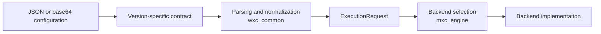
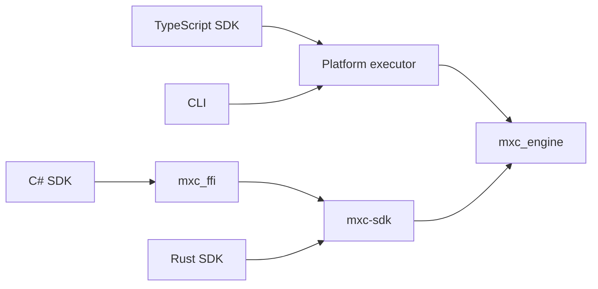

# Repository architecture

MXC is a Rust workspace with TypeScript and C# SDKs. This page summarizes the
repository layout and the main execution layers. Backend behavior is documented
in the corresponding guides under `docs/`.

## Repository layout

| Path | Contents |
|------|----------|
| `src/core/` | Shared models, versioned contracts, execution engine, Rust SDK, and executors |
| `src/backends/` | Containment backends and backend-specific support |
| `src/ffi/` | Native interfaces used by language bindings |
| `src/host/` | Host preparation and helper processes |
| `src/mxc_telemetry/` | Cross-platform telemetry facade |
| `src/testing/` | Rust E2E infrastructure, drivers, proxies, and probes |
| `src/tools/` | Developer and diagnostic tools |
| `sdk/` | TypeScript and C# SDKs |
| `schemas/` | Released and development configuration schemas |
| `tests/` | Configurations, examples, and host-dependent test scripts |
| `scripts/` | Build, CI, generation, and validation utilities |

The workspace members and shared Rust dependencies are declared in
`src/Cargo.toml`.

## Main Rust crates

| Crate | Role |
|-------|------|
| `wxc_common` | Runtime models, parsing, errors, validation helpers, logging, and backend-neutral traits |
| `mxc_config_contract` | Closed request types for registered schema versions |
| `mxc_engine` | Backend selection, execution, lifecycle dispatch, host discovery, and policy construction |
| `mxc-sdk` | Public Rust API over `mxc_engine` |
| `wxc`, `lxc`, `mxc_darwin` | Windows, Linux, and macOS executor binaries |
| `learning_mode_core` | Cross-platform denial models, analysis interfaces, and output artifacts |
| `mxc_schema_support` | Schema and TypeScript generation support |
| `mxc_telemetry` | ETW TraceLogging provider and non-Windows no-op implementation; consent and policy gating live in `wxc_common` |
| `mxc_build_common` | Windows binary metadata generation |
| `mxc_pty` | Shared pseudo-terminal support |

`wxc_common` provides the backend-neutral foundation. Backend crates generally
depend on it, while `mxc_engine` depends on the platform backends and owns
dispatch. The existing optional `wxc_common` dependency on `nanvix_common`
provides shared MicroVM data and constants.

## Backend layout

Most backends have a `common` crate containing their validation and execution
logic. Backends with additional processes use several crates:

| Area | Structure |
|------|-----------|
| ProcessContainer | `backends/process_container/common/` |
| Bubblewrap, LXC, Seatbelt, Hyperlight | `backends/<backend>/common/` |
| Windows Sandbox | `common/`, `lifecycle/`, `daemon/`, and `guest/` |
| WSLC | `common/` and `daemon/` |
| IsolationSession | bindings and `common/` |
| NanVix | common data, build support, binaries, and runner crates |
| Windows Learning Mode | Windows implementation over `learning_mode_core` |

Shared parsing and normalization live in `wxc_common`; backend-specific policy
validation and enforcement live with each backend.

## Request flow

Production parsing selects an exact registered contract. Version-specific
adapters produce `CommonRequestIR`, and shared normalization constructs the
runtime `ExecutionRequest`. See [Versioning](versioning.md) and
[Schema code generation](schema-codegen.md).

State-aware requests follow the same parsing path and produce a typed lifecycle
operation. See the
[State-aware sandbox API](state-aware-lifecycle/mxc-state-aware-sandbox-api.md).

## Execution surfaces

| Surface | Description |
|---------|-------------|
| Run-to-completion | Starts a workload, waits, and returns its outcome and output |
| Streaming | Returns a live process handle with streams, wait, and kill operations |
| State-aware lifecycle | Uses separate provision, start, exec, stop, and deprovision calls |

The common traits are defined in `wxc_common`; `mxc_engine` dispatches each
surface to the selected backend.

## SDK and binding paths

`mxc_ffi` is the C ABI used by the C# SDK. Its generated C# P/Invoke file is
created during the C# build. Generated TypeScript wire types come from the
schema tooling.

## Tests

| Test area | Location |
|-----------|----------|
| Rust unit and contract tests | Alongside their crates |
| Executor E2E tests | `src/testing/wxc_e2e_tests/` |
| Host-dependent backend suites | [`tests/scripts/`](../tests/scripts/README.md) |
| Scheduled backend validation | [CI validation infrastructure](ci-validation-infrastructure.md) |
