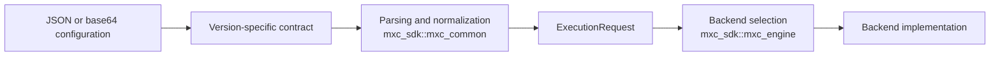
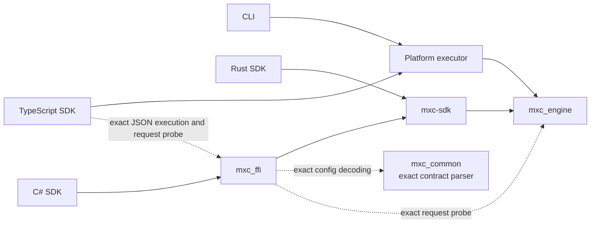

# Repository architecture

MXC is a Rust workspace with TypeScript and C# SDKs. This page summarizes the
repository layout and the main execution layers. Backend behavior is documented
in the corresponding guides under `docs/`.

## Repository layout

| Path | Contents |
|------|----------|
| `src/mxc-sdk/src/core/` | Engine, exact contracts, shared runtime, telemetry, and cross-backend support modules |
| `src/mxc-sdk/src/backends/` | Backend validation, policy, bindings, and execution modules |
| `src/ffi/` | Native interfaces used by language bindings |
| `src/host/` | Host preparation and helper processes |
| `src/testing/` | Rust E2E infrastructure, drivers, proxies, and probes |
| `src/tools/` | Thin executors and developer tools |
| `sdk/` | TypeScript and C# SDKs |
| `schemas/` | Released and development configuration schemas |
| `tests/` | Configurations, examples, and host-dependent test scripts |
| `scripts/` | Build, CI, generation, and validation utilities |

The workspace members and shared Rust dependencies are declared in
`src/Cargo.toml`.

## Main Rust packages

| Package | Role |
|-------|------|
| `mxc-sdk` | Public Rust API and the internal engine, exact contracts, shared runtime, backend implementations, telemetry, build support, and schema support |
| `mxc_ffi` | C ABI shared/static library used by language SDKs |
| `wxc`, `lxc`, `mxc_darwin` | Windows, Linux, and macOS executor binaries |
| Host helpers and tools | PLM, host preparation, diagnostics, schema generation, and test executables |

Within `mxc-sdk`, `mxc_common` remains the backend-neutral foundation and
`mxc_engine` owns dispatch. Backend modules depend on shared modules through
`crate::...` paths; they are not separately published Cargo packages.

## Backend layout

Backend validation and execution logic lives in modules under
`src/mxc-sdk/src/backends/`. Required daemon and guest process boundaries are
binary targets of the same publishable package under `src/mxc-sdk/src/bin/`:

| Area | Structure |
|------|-----------|
| ProcessContainer | `src/mxc-sdk/src/backends/process_container/common/` |
| Bubblewrap, LXC, Seatbelt, Hyperlight | Corresponding folders under `src/mxc-sdk/src/backends/` |
| Windows Sandbox | SDK common/lifecycle modules plus `src/mxc-sdk/src/bin/windows_sandbox_{daemon,guest}/` |
| WSLC | `src/mxc-sdk/src/backends/wslc/common/` plus `src/mxc-sdk/src/bin/wslc_daemon/` |
| IsolationSession | SDK bindings and runtime modules under `backends/isolation_session/` |
| NanVix | SDK common, runner, binary-staging, and build modules under `backends/nanvix/` |
| Windows Learning Mode | `src/mxc-sdk/src/core/learning_mode_windows/` over the shared core module |

Shared parsing and normalization live in the `mxc_common` module; backend-specific policy
validation and enforcement live with each backend.

`mxc_engine/src/backend_registry.rs` owns backend registration metadata,
including experimental classification, keyed by the shared `ContainmentBackend`
enum. Runtime authorization consults that registry. Exact-contract publication,
build-feature availability, and host-capability probing remain separate; the
registry neither dispatches workloads nor adds backend dependencies to
`mxc_common`.

## Request flow

```mermaid
flowchart LR
    config["JSON or base64 configuration"]
    contract["Version-specific contract"]
    common["Parsing and normalization<br/>mxc_sdk::mxc_common"]
    request["ExecutionRequest"]
    engine["Backend selection<br/>mxc_sdk::mxc_engine"]
    backend["Backend implementation"]

    config --> contract --> common --> request --> engine --> backend
```

Production parsing selects an exact registered contract. Version-specific
adapters produce the private `CommonRequestIR` normalization input, and shared
normalization constructs the runtime `ExecutionRequest`. No rolling
whole-request parser or model remains. See
[Versioning](versioning.md) and [Schema code generation](schema-codegen.md).

State-aware requests follow the same parsing path and produce a typed lifecycle
operation. See the
[State-aware sandbox API](state-aware-lifecycle/mxc-state-aware-sandbox-api.md).

## Execution surfaces

| Surface | Description |
|---------|-------------|
| Run-to-completion | Starts a workload, waits, and returns its outcome and output |
| Streaming | Returns a live process handle with streams, wait, and kill operations |
| State-aware lifecycle | Uses separate provision, start, exec, stop, and deprovision calls |

The common traits are defined in `mxc_sdk::mxc_common`;
`mxc_sdk::mxc_engine` dispatches each surface to the selected backend.

## SDK and binding paths

```mermaid
flowchart LR
    typescript["TypeScript SDK"]
    cli["CLI"]
    csharp["C# SDK"]
    rust["Rust SDK"]
    executor["Platform executor"]
    ffi["mxc_ffi"]
    sdk["mxc-sdk"]
    engine["mxc_engine"]
    common["mxc_common<br/>exact contract parser"]

    typescript --> executor
    typescript -. exact JSON execution and request probe .-> ffi
    cli --> executor
    csharp --> ffi --> sdk
    ffi -. exact config decoding .-> common
    ffi -. exact request probe .-> engine
    rust --> sdk
    executor --> engine
    sdk --> engine
```

`mxc_ffi` is the C ABI used by the Node and C# SDKs. Its generated C# P/Invoke
file is created during the C# build. Both SDKs map their high-level requests to
SDK-owned exact configuration JSON before calling the native execution or
request-probe exports. The shared `mxc_common` contract parser decodes the
declared exact version before the typed engine operation runs; there is no
private binding-request parser. The public Rust SDK exposes the
typed `SandboxRequest` probe API. Generated TypeScript wire types come from the
schema tooling.

## Tests

| Test area | Location |
|-----------|----------|
| Rust unit and contract tests | Under `src/mxc-sdk/src/` and `src/mxc-sdk/tests/` |
| Executor E2E tests | `src/mxc-sdk/tests/wxc_e2e_tests_*` |
| Host-dependent backend suites | [`tests/scripts/`](../tests/scripts/README.md) |
| Scheduled backend validation | [CI validation infrastructure](ci-validation-infrastructure.md) |
