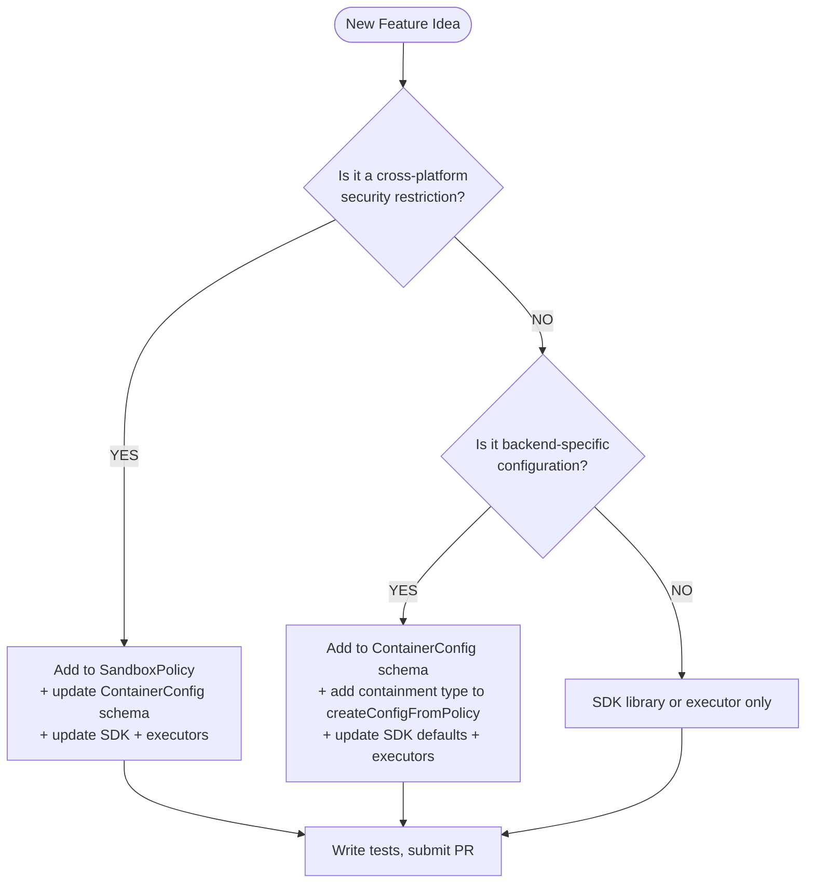

# Adding a New Feature

> **Stable schemas are immutable once shipped.** Files in
> `schemas/stable/` that are already published in a release must not be
> edited. Add experimental work to `schemas/dev/` only, then carry it
> into a *new* stable schema file at promotion time (per
> [Promoting to Stable](#promoting-to-stable) below).
>
> **Stable schemas document only the non-experimental surface.**
> Experimental backends, the `experimental.*` block, and any in-progress
> shapes live solely in `schemas/dev/` — they must not be mirrored into
> a stable file. Configs that need editor validation for experimental
> fields should point `$schema` at the dev file. The `--experimental`
> runtime gate is unchanged: it still controls execution regardless of
> which schema validated the config.

## Prerequisites

Read these in order:

1. [Sandbox Policy spec](sandbox-policy/v1/policy.md): what
Policy and ContainerConfig are, design principles.
2. [Versioning Design](versioning.md): how policy/schema/SDK
versions relate and when to bump.

## Step 0: Where does my feature go?

**Important:** Any change to the Config schema also requires
changes to the TypeScript SDK library (`@microsoft/mxc-sdk`),
because the SDK library generates the Config. There is no
"Config-only" change that doesn't touch the SDK library.

> **Terminology:** "SDK library" refers to the TypeScript npm
> package (`@microsoft/mxc-sdk`). wxc-exec and lxc-exec are the
> Rust executors that ship alongside the SDK library but are
> separate components.

Use this flowchart to determine where your feature goes:

### Decision Flowchart



## Step 1: Write a Feature Spec

Write the spec before any code, including OS changes. The spec
is how the team aligns on what to build.

Create a spec document with:

1. **Problem statement**: what user problem does this solve?
2. **Policy changes**: if cross-platform security restriction,
propose additions to Policy.
3. **ContainerConfig changes**: proposed schema additions,
including which backends are affected and what SDK defaults
should be.
4. **Default values**: what happens when the field is omitted
(must be most-restrictive for policy; secure defaults for
Config).
5. **OS changes (if applicable)**: high-level design for any
new OS APIs, kernel behaviors, or system primitives needed.
Which OS repo? What does the API look like? Coordinate with
the OS engineer.
6. **Backward compatibility**: impact on existing requests
7. **Test plan**: how to test at each layer
8. **Submit a PR** for review.

## Step 2: OS changes (if applicable)

> OS work can happen in parallel with schema and executor
> changes. The SDK library should be updated last since it is
> customer-facing. We recommend submitting a feature spec to
> the MXC repo first so the team can align on how the feature
> flows through all layers.

For detailed OS contribution steps (FlatBuffer schema, processmodel,
BaseContainerRunner), see [process-container/guide.md](process-container/guide.md).

## Step 3+: Implementation

If your feature touches SandboxPolicy, update
`sdk/src/types.ts`:

- Field must be optional (default-deny)
- Default value must be the most restrictive option
- Include JSDoc with description and default

If your feature adds policy or config fields, you will need
to plumb them through `createConfigFromPolicy()` in
`sdk/src/sandbox.ts`. See the
[worked example in the Sandbox Policy spec](sandbox-policy/v1/policy.md#10-worked-example-ui-policy)
for a walkthrough.

---

## Walkthrough

Adding a feature may touch these files:

| File | What to change |
|------|----------------|
| `src/core/wxc_common/src/wire.rs` | Add a `gpuIsolation` field + `GpuIsolation` struct to the wire `Experimental` model (the schema is generated from this) |
| `schemas/dev/mxc-config.schema.0.8.0-dev.json` | **Generated** — regenerate with `mxc_schema_gen` after editing the wire model; do not hand-edit |
| `src/core/wxc_common/src/models.rs` | Add `GpuIsolationConfig` struct, add field to `ExperimentalConfig` |
| `src/core/wxc_common/src/config_parser.rs` | Map the new wire field to the domain struct in `convert_wire_config` |
| Runner (`appcontainer.rs` or `lxc_runner.rs`) | Feature logic, guarded behind `experimental_enabled` |
| `tests/configs/` | Test config exercising your feature |

## Step 1: Add the field to the wire model (the schema source of truth)

The JSON schema is **generated** from the Rust wire model
(`src/core/wxc_common/src/wire.rs`); you never hand-edit
`schemas/dev/mxc-config.schema.0.8.0-dev.json`. Add your feature as a typed field
on the wire `Experimental` struct (which is intentionally permissive — no
`deny_unknown_fields` — so in-flux experimental shapes stay forward-compatible):

```rust
// in wire.rs
pub struct Experimental {
    pub compartments: Option<Compartments>,
    pub gpu_isolation: Option<GpuIsolation>,            // ← add this
    // ...
}

/// GPU device isolation (experimental).
#[derive(Debug, Clone, Serialize, Deserialize)]
#[cfg_attr(feature = "schema-gen", derive(schemars::JsonSchema))]
#[serde(rename_all = "camelCase")]
pub struct GpuIsolation {
    /// GPU device index to assign to the container.
    pub device_index: Option<u32>,
    /// GPU memory limit in megabytes. 0 = no limit.
    pub memory_limit_mb: Option<u32>,
    /// Allow CUDA runtime access inside the container.
    pub allow_cuda: Option<bool>,
}
```

The `///` doc comments become schema `description`s and `#[schemars(...)]`
attributes become constraints. Then regenerate the committed schema:

```
cargo run --manifest-path src/Cargo.toml -p mxc_schema_gen -- schemas/dev/mxc-config.schema.0.8.0-dev.json
```

The `check-schema-codegen.js` CI gate fails if the committed schema drifts from
the wire model, so the regenerate step is mandatory.

## Step 2: Add the model struct

In `src/core/wxc_common/src/models.rs`, `ExperimentalConfig` already exists with
`compartments`. Add your `GpuIsolationConfig` struct and a field for it:

```rust
/// GPU isolation settings (experimental).
#[derive(Clone, Debug, Default, Serialize, Deserialize)]
pub struct GpuIsolationConfig {
    pub device_index: u32,
    pub memory_limit_mb: u32,
    pub allow_cuda: bool,
}
```

Add it to the existing `ExperimentalConfig`:

```rust
pub struct ExperimentalConfig {
    pub compartments: Option<CompartmentsConfig>,
    pub gpu_isolation: Option<GpuIsolationConfig>,   // ← add this
}
```

## Step 3: Map the wire field to the domain model

The parser deserializes JSON directly into the wire model (`wire::MxcConfig`),
so your `wire::GpuIsolation` from Step 1 is the parse target. In
`config_parser.rs`, map it to the domain struct inside `convert_wire_config`
where the `experimental` block is converted:

```rust
let experimental = if let Some(raw_exp) = cfg.experimental {
    // ... existing feature mappings ...
    let gpu_isolation = raw_exp.gpu_isolation.map(|g| GpuIsolationConfig {
        device_index: g.device_index.unwrap_or(0),
        memory_limit_mb: g.memory_limit_mb.unwrap_or(0),
        allow_cuda: g.allow_cuda.unwrap_or(false),
    });
    ExperimentalConfig {
        // ... existing fields ...
        gpu_isolation,
    }
} else {
    ExperimentalConfig::default()
};
```

Prefer destructuring the wire struct (`let wire::GpuIsolation { device_index, .. }`)
in any standalone mapping helper so that adding a wire field without mapping it
becomes a compile error rather than a silent runtime drop.

Add tests to verify:
- `gpuIsolation` config parses correctly and maps to `ExecutionRequest.experimental`
- Missing optional fields use defaults
- Unknown fields under `experimental` are tolerated (forward compatibility — the
  experimental surface is intentionally permissive)

## Step 4: Implement the feature in the runner

> The `--experimental` CLI flag and `experimental_enabled` field on
> `ExecutionRequest` already exist from when `compartments` was added. No changes
> needed in `main.rs`.

The full flow is:

```
main.rs: cli.experimental → request.experimental_enabled = true
main.rs: runner.run(&request, &mut logger)
  → runner checks request.experimental_enabled
    → reads request.experimental.gpu_isolation
      → applies the feature
```

In the appropriate runner (`appcontainer.rs`, `lxc_runner.rs`, etc.), guard
your feature behind `experimental_enabled`:

```rust
fn run(&mut self, request: &ExecutionRequest, logger: &mut Logger) -> ScriptResponse {
    // ... normal execution (filesystem, network, etc.) ...

    if request.experimental_enabled {
        // existing experimental feature
        if let Some(ref compartments) = request.experimental.compartments {
            self.apply_compartments(compartments, logger)?;
        }

        // new experimental feature
        if let Some(ref gpu) = request.experimental.gpu_isolation {
            self.apply_gpu_isolation(gpu, logger)?;
        }
    }

    // ... execute the script ...
}
```

**Important:** Your experimental code must not break the stable code path. When
`experimental_enabled` is false, behavior must be identical to before your
change.

**Validation:** Schema validation for your feature should happen in the feature
component (e.g., `apply_gpu_isolation()`), not in `config_parser.rs`. The parser
only deserializes the JSON into structs — the feature component owns validating
that the config values are correct, compatible, and make sense for the current
backend. This keeps `config_parser.rs` lean and lets each feature evolve its
validation independently.

## Step 5: Add a test config

Create a test config that exercises your feature:

```json
{
  "version": "0.6.0-alpha",
  "containment": "processcontainer",
  "process": {
    "commandLine": "cmd.exe /c echo gpu isolation test"
  },
  "experimental": {
    "gpuIsolation": {
      "deviceIndex": 0,
      "memoryLimitMb": 1024,
      "allowCuda": true
    }
  }
}
```

Run it with and without the flag to verify:

```bash
# With flag — experimental feature is active
wxc-exec.exe tests/configs/experimental_gpu_isolation.json --experimental --debug

# Without flag — experimental section silently ignored, normal execution
wxc-exec.exe tests/configs/experimental_gpu_isolation.json --debug
```

Verify three things:
1. **With `--experimental`:** debug output shows your feature was applied
   (e.g., "Applying GPU isolation: device 0, 1024MB limit")
2. **Without `--experimental`:** no trace of your feature in the output,
   process executes normally
3. **Stable features unaffected:** filesystem, network, and other policies
   still work exactly as before in both modes

## Step 6: Update the SDK (if needed)

If your feature should be accessible from the TypeScript SDK, add
`experimental` to the `SandboxSpawnOptions` interface in `sdk/src/sandbox.ts`:

```typescript
export interface SandboxSpawnOptions {
  debug?: boolean;
  experimental?: boolean;
}
```

The SDK passes `--experimental` to the underlying binary when this is set.

## Promoting to Stable

When your experimental feature is ready to ship:

1. Move the field from the wire `Experimental` struct to the top-level
   `MxcConfig` (e.g., `experimental.gpuIsolation` → top-level `gpuIsolation`),
   then regenerate the schema with `mxc_schema_gen`
2. Move the struct from `ExperimentalConfig` to `ExecutionRequest`
3. Map the now-top-level wire field in `convert_wire_config` (and add
   `deny_unknown_fields` to the wire struct so the promoted, stable surface is
   closed)
4. Remove the `if request.experimental_enabled` guard
5. Bump the minor version
6. Add a parser error for configs still referencing the feature under
   `experimental`: `"gpuIsolation has moved to the stable section"`.
   This error should persist for at least one release cycle so users have
   time to migrate, then it can be relaxed to the standard "unknown field"
   behavior.

## Checklist

- [ ] Schema updated in `schemas/dev/mxc-config.schema.X.Y.Z-dev.json`
- [ ] Model struct added to `models.rs`
- [ ] Parsing added to `config_parser.rs` with unit tests
- [ ] `--experimental` flag wired through (if not already)
- [ ] Feature logic guarded behind `experimental_enabled` in the runner
- [ ] Test config created and verified with and without `--experimental`
- [ ] Stable code path is unaffected (all existing tests pass)
- [ ] SDK updated if feature is SDK-accessible
