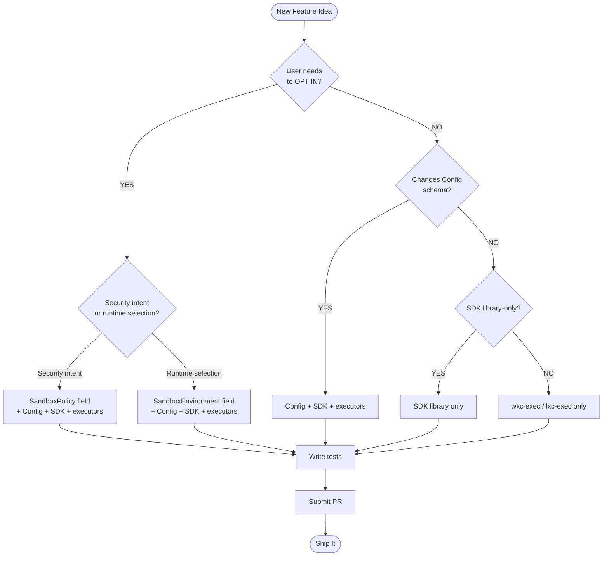

# Adding a New Feature

> **Do not modify stable schemas.** Files in `schemas/stable/` are
> immutable release artifacts. All experimental work happens in
> `schemas/dev/` only. Stable schemas are updated solely during the
> promotion process when an experimental feature ships.

## Prerequisites

Read these in order:

1. [SandboxRequest spec](sandbox-policy/v1/policy.md): what
SandboxRequest is (policy + environment), design principles.
2. [SandboxRequest reference](sandbox-policy/v1/reference.md):
every field, type, default, and example.
3. [Versioning Design](versioning.md): how policy/schema/SDK
versions relate and when to bump.

## Step 0: Where does my feature go?

**Important:** Any change to the Config schema also requires
changes to the TypeScript SDK library (`@microsoft/mxc-sdk`),
because the SDK library generates the Config. There is no
"Config-only" change that doesn't touch the SDK library.

> **Terminology:** "SDK library" refers to the TypeScript npm
> package (`@microsoft/mxc-sdk`). wxc-exec and lxc-exec are the
> Rust executors that ship alongside the SDK library but are
> separate components.

Use this flowchart to determine where your feature goes:

### Decision Flowchart



## Step 1: Write a Feature Spec

Write the spec before any code, including OS changes. The spec
is how the team aligns on what to build.

Create a spec document with:

1. **Problem statement**: what user problem does this solve?
2. **SandboxRequest changes**: proposed additions to
SandboxPolicy (intent) or SandboxEnvironment (runtime), with
justification
3. **Config schema changes**: proposed JSON Schema additions,
including which backends are affected
4. **Mapping rules**: how policy/environment fields map to
Config fields per backend
5. **Default values**: what happens when the field is omitted
(must be most-restrictive)
6. **OS changes (if applicable)**: high-level design for any
new OS APIs, kernel behaviors, or system primitives needed.
Which OS repo? What does the API look like? Coordinate with
the OS engineer.
7. **Backward compatibility**: impact on existing requests
8. **Test plan**: how to test at each layer

Submit a PR for review.

## Step 2: OS changes (if applicable)

> **Do not start OS work without an approved feature spec.**
> The spec ensures the OS API can be translated through Config
> into SandboxRequest. Without the spec, OS work may produce
> APIs that can't be plumbed end-to-end.

For detailed OS contribution steps (FlatBuffer schema, processmodel,
BaseContainerRunner), see [os-developers-guide.md](os-developers-guide.md).

## Step 3+: Implementation

If your feature touches SandboxRequest, update
`sdk/src/types.ts`:

- Field must be optional (default-deny)
- Default value must be the most restrictive option
- Include JSDoc with description and default

If your feature touches `buildSandboxConfig`, update
`sdk/src/sandbox.ts` with the mapping logic.

For Config schema, Rust parser, backend runner, tests, and
version bump, follow the walkthrough below.

---

## Walkthrough

Adding a feature may touch these files:

| File | What to change |
|------|----------------|
| `schemas/dev/mxc-config.schema.0.5.0-dev.json` | Add `gpuIsolation` as a feature under `experimental` |
| `src/wxc_common/src/models.rs` | Add `GpuIsolationConfig` struct, add field to `ExperimentalConfig` |
| `src/wxc_common/src/config_parser.rs` | Add `gpuIsolation` field to `RawExperimental` |
| Runner (`appcontainer.rs` or `lxc_runner.rs`) | Feature logic, guarded behind `experimental_enabled` |
| `test_configs/` | Test config exercising your feature |

## Step 1: Update the schema

In `schemas/dev/mxc-config.schema.0.5.0-dev.json`, the `experimental` section already
exists with `compartments` as a feature. Add `gpuIsolation` as a new
feature with its own typed schema:

```json
"experimental": {
  "type": "object",
  "description": "Experimental features. Only active when --experimental is passed.",
  "properties": {
    "compartments": {
      "type": "object",
      "description": "Network compartment isolation (experimental).",
      "properties": {
        "namespace": {
          "type": "string",
          "description": "Compartment namespace identifier."
        },
        "isolationLevel": {
          "type": "integer",
          "minimum": 1,
          "description": "Isolation level (1 = shared network, 2 = separate stack, 3 = full isolation)."
        }
      }
    },
    "gpuIsolation": {
      "type": "object",
      "description": "GPU device isolation (experimental).",
      "properties": {
        "deviceIndex": {
          "type": "integer",
          "minimum": 0,
          "description": "GPU device index to assign to the container."
        },
        "memoryLimitMb": {
          "type": "integer",
          "minimum": 0,
          "description": "GPU memory limit in megabytes. 0 = no limit."
        },
        "allowCuda": {
          "type": "boolean",
          "default": false,
          "description": "Allow CUDA runtime access inside the container."
        }
      },
      "required": ["deviceIndex", "memoryLimitMb"]
    }
  }
}
```

Each experimental feature is its own typed property under `experimental` —
the same pattern as stable features (`filesystem`, `network`) under the
top-level config. This gives editors full autocomplete and validation.

## Step 2: Add the model struct

In `src/wxc_common/src/models.rs`, `ExperimentalConfig` already exists with
`compartments`. Add your `GpuIsolationConfig` struct and a field for it:

```rust
/// GPU isolation settings (experimental).
#[derive(Clone, Debug, Default, Serialize, Deserialize)]
pub struct GpuIsolationConfig {
    pub device_index: u32,
    pub memory_limit_mb: u32,
    pub allow_cuda: bool,
}
```

Add it to the existing `ExperimentalConfig`:

```rust
pub struct ExperimentalConfig {
    pub compartments: Option<CompartmentsConfig>,
    pub gpu_isolation: Option<GpuIsolationConfig>,   // ← add this
}
```

## Step 3: Parse the experimental section

In `src/wxc_common/src/config_parser.rs`, the `RawExperimental` struct already
exists with `compartments`. Add `gpu_isolation`:

```rust
#[derive(Deserialize, Default)]
struct RawExperimental {
    compartments: Option<RawCompartments>,          // existing
    #[serde(rename = "gpuIsolation")]
    gpu_isolation: Option<RawGpuIsolation>,         // ← add this
}

#[derive(Deserialize)]
struct RawGpuIsolation {
    #[serde(rename = "deviceIndex")]
    device_index: u32,
    #[serde(rename = "memoryLimitMb")]
    memory_limit_mb: u32,
    #[serde(rename = "allowCuda")]
    allow_cuda: Option<bool>,
}
```

In `convert_raw_config()`, map it directly — no name matching needed. Each
feature should own its parsing via a constructor:

```rust
let mut experimental = ExperimentalConfig::default();

if let Some(raw_exp) = raw.experimental {
    if let Some(c) = raw_exp.compartments {
        experimental.compartments = Some(CompartmentsConfig::from_raw(c)?);
    }
    if let Some(g) = raw_exp.gpu_isolation {
        experimental.gpu_isolation = Some(GpuIsolationConfig::from_raw(g)?);
    }
}
```

Each feature implements its own `from_raw()` constructor to keep
`convert_raw_config()` clean:

```rust
impl GpuIsolationConfig {
    fn from_raw(raw: RawGpuIsolation) -> Result<Self, String> {
        Ok(Self {
            device_index: raw.device_index,
            memory_limit_mb: raw.memory_limit_mb,
            allow_cuda: raw.allow_cuda.unwrap_or(false),
        })
    }
}
```

Add tests to verify:
- `gpuIsolation` config parses correctly
- Missing optional fields use defaults
- Unknown fields under `experimental` are ignored (forward compatibility)

Also ensure that `convert_raw_config()` populates `CodexRequest.experimental`:

```rust
Ok(CodexRequest {
    // ... existing fields ...
    experimental,   // ← include the parsed experimental config
})
```

## Step 4: Implement the feature in the runner

> The `--experimental` CLI flag and `experimental_enabled` field on
> `CodexRequest` already exist from when `compartments` was added. No changes
> needed in `main.rs`.

The full flow is:

```
main.rs: cli.experimental → request.experimental_enabled = true
main.rs: runner.run(&request, &mut logger)
  → runner checks request.experimental_enabled
    → reads request.experimental.gpu_isolation
      → applies the feature
```

In the appropriate runner (`appcontainer.rs`, `lxc_runner.rs`, etc.), guard
your feature behind `experimental_enabled`:

```rust
fn run(&mut self, request: &CodexRequest, logger: &mut Logger) -> ScriptResponse {
    // ... normal execution (filesystem, network, etc.) ...

    if request.experimental_enabled {
        // existing experimental feature
        if let Some(ref compartments) = request.experimental.compartments {
            self.apply_compartments(compartments, logger)?;
        }

        // new experimental feature
        if let Some(ref gpu) = request.experimental.gpu_isolation {
            self.apply_gpu_isolation(gpu, logger)?;
        }
    }

    // ... execute the script ...
}
```

**Important:** Your experimental code must not break the stable code path. When
`experimental_enabled` is false, behavior must be identical to before your
change.

**Validation:** Schema validation for your feature should happen in the feature
component (e.g., `apply_gpu_isolation()`), not in `config_parser.rs`. The parser
only deserializes the JSON into structs — the feature component owns validating
that the config values are correct, compatible, and make sense for the current
backend. This keeps `config_parser.rs` lean and lets each feature evolve its
validation independently.

## Step 5: Add a test config

Create a test config that exercises your feature:

```json
{
  "version": "0.4.0-alpha",
  "containment": "appcontainer",
  "process": {
    "commandLine": "cmd.exe /c echo gpu isolation test"
  },
  "experimental": {
    "gpuIsolation": {
      "deviceIndex": 0,
      "memoryLimitMb": 1024,
      "allowCuda": true
    }
  }
}
```

Run it with and without the flag to verify:

```bash
# With flag — experimental feature is active
wxc-exec.exe test_configs/experimental_gpu_isolation.json --experimental --debug

# Without flag — experimental section silently ignored, normal execution
wxc-exec.exe test_configs/experimental_gpu_isolation.json --debug
```

Verify three things:
1. **With `--experimental`:** debug output shows your feature was applied
   (e.g., "Applying GPU isolation: device 0, 1024MB limit")
2. **Without `--experimental`:** no trace of your feature in the output,
   process executes normally
3. **Stable features unaffected:** filesystem, network, and other policies
   still work exactly as before in both modes

## Step 6: Update the SDK (if needed)

If your feature should be accessible from the TypeScript SDK, add
`experimental` to the `SandboxSpawnOptions` interface in `sdk/src/sandbox.ts`:

```typescript
export interface SandboxSpawnOptions {
  debug?: boolean;
  experimental?: boolean;
}
```

The SDK passes `--experimental` to the underlying binary when this is set.

## Promoting to Stable

When your experimental feature is ready to ship:

1. Move the property from `experimental` to a top-level property in the schema
   (e.g., `experimental.gpuIsolation` → `gpuIsolation`)
2. Move the struct from `ExperimentalConfig` to `CodexRequest`
3. Move the field from `RawExperimental` to `RawConfig`
4. Remove the `if request.experimental_enabled` guard
5. Bump the minor version
6. Add a parser error for configs still referencing the feature under
   `experimental`: `"gpuIsolation has moved to the stable section"`.
   This error should persist for at least one release cycle so users have
   time to migrate, then it can be relaxed to the standard "unknown field"
   behavior.

## Checklist

- [ ] Schema updated in `schemas/dev/mxc-config.schema.X.Y.Z-dev.json`
- [ ] Model struct added to `models.rs`
- [ ] Parsing added to `config_parser.rs` with unit tests
- [ ] `--experimental` flag wired through (if not already)
- [ ] Feature logic guarded behind `experimental_enabled` in the runner
- [ ] Test config created and verified with and without `--experimental`
- [ ] Stable code path is unaffected (all existing tests pass)
- [ ] SDK updated if feature is SDK-accessible
