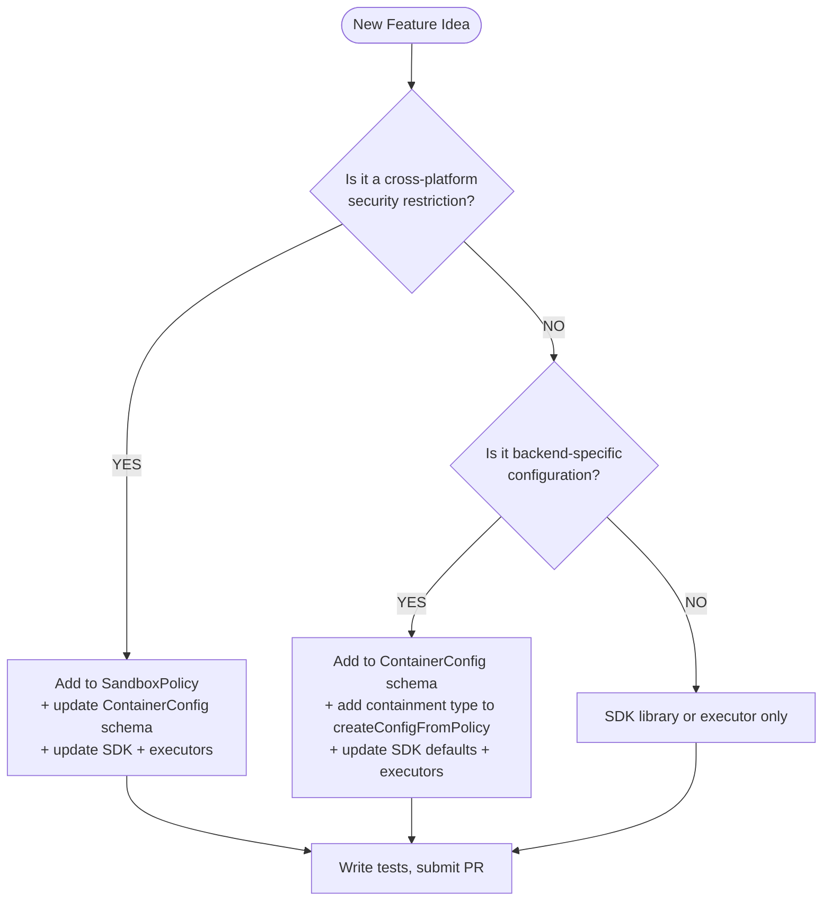

# Adding a New Feature

> **Stable schemas are immutable once shipped.** Files in
> `schemas/stable/` that are already published in a release must not be
> edited. Add experimental work to `schemas/dev/` only, then carry it
> into a *new* stable schema file at promotion time (per
> [Promoting to Stable](#promoting-to-stable) below).
>
> **Development features use permanent field locations.**
> Add an in-progress backend or feature at its intended top-level location in
> the mutable development contract. Do not place it under an
> `experimental` JSON wrapper. The `--experimental` runtime gate controls
> execution until graduation regardless of which schema validated the config.

## Prerequisites

Read these in order:

1. [Sandbox Policy spec](sandbox-policy/0.7.0/policy.md): what
Policy and ContainerConfig are, design principles.
2. [Versioning Design](versioning.md): how policy/schema/SDK
versions relate and when to bump.

## Step 0: Where does my feature go?

**Important:** Any change to the Config schema also requires
changes to the TypeScript SDK library (`@microsoft/mxc-sdk`),
because the SDK library generates the Config. There is no
"Config-only" change that doesn't touch the SDK library.

> **Terminology:** "SDK library" refers to the TypeScript npm
> package (`@microsoft/mxc-sdk`). wxc-exec and lxc-exec are the
> Rust executors that ship alongside the SDK library but are
> separate components.

Use this flowchart to determine where your feature goes:

### Decision Flowchart


```mermaid
flowchart TD
    START([New Feature Idea]) --> Q1{Is it a cross-platform<br/>security restriction?}

    Q1 -->|YES| POL["Add to SandboxPolicy<br/>+ update ContainerConfig schema<br/>+ update SDK + executors"]
    Q1 -->|NO| Q2{Is it backend-specific<br/>configuration?}

    Q2 -->|YES| CFG["Add to ContainerConfig schema<br/>+ add containment type to createConfigFromPolicy<br/>+ update SDK defaults + executors"]
    Q2 -->|NO| SDK_ONLY["SDK library or executor only"]

    POL --> TEST["Write tests, submit PR"]
    CFG --> TEST
    SDK_ONLY --> TEST
```

## Step 1: Write a Feature Spec

Write the spec before any code, including OS changes. The spec
is how the team aligns on what to build.

Create a spec document with:

1. **Problem statement**: what user problem does this solve?
2. **Policy changes**: if cross-platform security restriction,
propose additions to Policy.
3. **ContainerConfig changes**: proposed schema additions,
including which backends are affected and what SDK defaults
should be.
4. **Default values**: what happens when the field is omitted
(must be most-restrictive for policy; secure defaults for
Config).
5. **OS changes (if applicable)**: high-level design for any
new OS APIs, kernel behaviors, or system primitives needed.
Which OS repo? What does the API look like? Coordinate with
the OS engineer.
6. **Backward compatibility**: impact on existing requests
7. **Test plan**: how to test at each layer
8. **Submit a PR** for review.

## Step 2: OS changes (if applicable)

> OS work can happen in parallel with schema and executor
> changes. The SDK library should be updated last since it is
> customer-facing. We recommend submitting a feature spec to
> the MXC repo first so the team can align on how the feature
> flows through all layers.

For detailed OS contribution steps (FlatBuffer schema, processmodel,
BaseContainerRunner), see [process-container/guide.md](process-container/guide.md).

## Step 3+: Implementation

If your feature touches SandboxPolicy, update
`sdk/node/src/types.ts`:

- Field must be optional (default-deny)
- Default value must be the most restrictive option
- Include JSDoc with description and default

If your feature adds policy or config fields, you will need
to plumb them through `createConfigFromPolicy()` in
`sdk/node/src/sandbox.ts`. See the
[worked example in the Sandbox Policy spec](sandbox-policy/0.7.0/policy.md#10-worked-example-ui-policy)
for a walkthrough.

---

## Walkthrough

Adding a feature may touch these files:

| File | What to change |
|------|----------------|
| `src/core/mxc_config_contract/src/dev/` | Add the field to the authoritative closed mutable development contract |
| `src/core/wxc_common/src/config_contract_adapters/dev/` | Adapt the exact field into private `CommonRequestIR` |
| `src/core/wxc_common/src/wire.rs` | Add only reusable nested normalization DTOs needed by the adapter; never add a whole-request root |
| `src/core/mxc_engine/src/policy/exact/v0_10.rs` | If the Rust SDK exposes the field, update the production development builder |
| `schemas/dev/mxc-config.schema.0.10.0-alpha.json` | **Generated exact artifact** — do not hand-edit |
| `sdk/node/src/generated/v0_10_0_alpha/wire.ts` | **Generated exact artifact** — do not hand-edit |
| `src/core/wxc_common/src/models.rs` | Add `GpuIsolationConfig` and an optional field on `ExecutionRequest` |
| `src/core/wxc_common/src/config_parser.rs` | Map the new config-input field into `ExecutionRequest.gpu_isolation` |
| Runner (`appcontainer.rs` or `lxc_runner.rs`) | Feature logic, guarded behind `experimental_enabled` |
| `tests/configs/` | Test config exercising your feature |

## Step 1: Add the field to the development contract and config input

Add the feature to the authoritative closed request types under
`src/core/mxc_config_contract/src/dev/`, then adapt it into the shared internal
config input used by semantic normalization.
The development request and every nested object are recursively closed.

```rust
// in mxc_config_contract/src/dev/one_shot.rs
pub struct Request {
    // Existing permanent fields...
    #[serde(default)]
    pub gpu_isolation: OptionalField<GpuIsolation>,
}

/// GPU device isolation (experimental).
#[derive(Debug, serde::Deserialize)]
#[cfg_attr(feature = "schema-gen", derive(schemars::JsonSchema))]
#[serde(rename_all = "camelCase", deny_unknown_fields)]
pub struct GpuIsolation {
    /// GPU device index to assign to the container.
    pub device_index: Option<u32>,
    /// GPU memory limit in megabytes. 0 = no limit.
    pub memory_limit_mb: Option<u32>,
    /// Allow CUDA runtime access inside the container.
    pub allow_cuda: Option<bool>,
}
```

The `///` doc comments become schema `description`s and `#[schemars(...)]`
attributes become constraints. Then regenerate the committed schema:

```
cargo run --manifest-path src/Cargo.toml -p mxc_schema_gen -- schema --version 0.10.0-alpha --out schemas/dev/mxc-config.schema.0.10.0-alpha.json
cargo run --manifest-path src/Cargo.toml -p mxc_schema_gen -- types --version 0.10.0-alpha --out sdk/node/src/generated/v0_10_0_alpha/wire.ts
```

The exact codegen gate fails if either committed artifact drifts, so both
regeneration steps are mandatory.

## Step 2: Add the runtime model field

In `src/core/wxc_common/src/models.rs`, add `GpuIsolationConfig` and an optional
field directly on `ExecutionRequest`:

```rust
/// GPU isolation settings (experimental).
#[derive(Clone, Debug, Default, Serialize, Deserialize)]
pub struct GpuIsolationConfig {
    pub device_index: u32,
    pub memory_limit_mb: u32,
    pub allow_cuda: bool,
}
```

```rust
pub struct ExecutionRequest {
    // ... existing fields ...
    pub gpu_isolation: Option<GpuIsolationConfig>,
    pub experimental_enabled: bool,
}
```

## Step 3: Map the normalization field to the runtime model

Production parsing first deserializes JSON into the exact registered request
contract. The version-specific adapter converts that closed type into the
shared private `common_request_ir::CommonRequestIR` used by semantic
normalization. `CommonRequestIR` replaces the former whole-request wire model,
but its fields may still use reusable nested DTOs from `wire.rs`. Add the
adapter mapping for the contract field, then map the corresponding
normalization DTO into `models::GpuIsolationConfig` inside
`normalize_common_request_ir`:

```rust
let gpu_isolation = cfg.gpu_isolation.map(|raw| GpuIsolationConfig {
    device_index: raw.device_index.unwrap_or(0),
    memory_limit_mb: raw.memory_limit_mb.unwrap_or(0),
    allow_cuda: raw.allow_cuda.unwrap_or(false),
});
```

Prefer destructuring the exact contract struct
(`let dev::one_shot::GpuIsolation { device_index, .. } = raw`) in any
standalone adapter helper so that adding a contract field without mapping it
becomes a compile error rather than a silent runtime drop.

Add tests to verify:
- `gpuIsolation` is accepted by the exact request root and maps through its
  adapter to `ExecutionRequest.gpu_isolation`
- Missing optional fields use defaults
- Unknown fields in the exact feature object are rejected
- Version-boundary tests reject the field from contracts that predate it

## Step 4: Implement the feature in the runner

> The `--experimental` CLI flag and `experimental_enabled` field on
> `ExecutionRequest` already exist. No changes are needed in `main.rs`.

The full flow is:

```
main.rs: cli.experimental → request.experimental_enabled = true
main.rs: runner.run(&request, &mut logger)
  → runner checks request.experimental_enabled
    → reads request.gpu_isolation
      → applies the feature
```

In the appropriate runner (`appcontainer.rs`, `lxc_runner.rs`, etc.), guard
your feature behind `experimental_enabled`:

```rust
fn run(&mut self, request: &ExecutionRequest, logger: &mut Logger) -> ScriptResponse {
    // ... normal execution (filesystem, network, etc.) ...

    if request.experimental_enabled {
        if let Some(ref gpu) = request.gpu_isolation {
            self.apply_gpu_isolation(gpu, logger)?;
        }
    }

    // ... execute the script ...
}
```

**Important:** Your experimental code must not break the stable code path. When
`experimental_enabled` is false, behavior must be identical to before your
change.

**Validation:** Schema validation for your feature should happen in the feature
component (e.g., `apply_gpu_isolation()`), not in `config_parser.rs`. The parser
only deserializes the JSON into structs — the feature component owns validating
that the config values are correct, compatible, and make sense for the current
backend. This keeps `config_parser.rs` lean and lets each feature evolve its
validation independently.

## Step 5: Add a test config

Create a test config that exercises your feature:

```json
{
  "version": "0.10.0-alpha",
  "containment": "processcontainer",
  "process": {
    "commandLine": "cmd.exe /c echo gpu isolation test"
  },
  "gpuIsolation": {
    "deviceIndex": 0,
    "memoryLimitMb": 1024,
    "allowCuda": true
  }
}
```

Run it with and without the flag to verify:

```bash
# With flag — experimental feature is active
wxc-exec.exe tests/configs/experimental_gpu_isolation.json --experimental --debug

# Without flag — development feature is ignored, normal execution
wxc-exec.exe tests/configs/experimental_gpu_isolation.json --debug
```

Verify three things:
1. **With `--experimental`:** debug output shows your feature was applied
   (e.g., "Applying GPU isolation: device 0, 1024MB limit")
2. **Without `--experimental`:** no trace of your feature in the output,
   process executes normally
3. **Stable features unaffected:** filesystem, network, and other policies
   still work exactly as before in both modes

## Step 6: Update the SDK (if needed)

If your feature should be accessible from the TypeScript SDK, add
`experimental` to the `SandboxSpawnOptions` interface in `sdk/node/src/sandbox.ts`:

```typescript
export interface SandboxSpawnOptions {
  debug?: boolean;
  experimental?: boolean;
}
```

The SDK passes `--experimental` to the underlying binary when this is set.

## Promoting to Stable

When your experimental feature is ready to ship:

1. Carry the field from the mutable development contract into the next
   published contract at the same permanent location, then regenerate its
   schema and TypeScript artifacts with `mxc_schema_gen`
2. Add the published contract adapter mapping while retaining the existing
   `normalize_common_request_ir` domain normalization
3. Remove the `if request.experimental_enabled` guard
4. Bump the minor version
5. Preserve every published contract unchanged; older contracts continue to
   reject the field structurally.

## Checklist

- [ ] Development contract and adapter updated
- [ ] Generated schema and TypeScript oracle regenerated
- [ ] Model struct added to `models.rs`
- [ ] Contract adapter and runtime-model mapping added with unit tests
- [ ] `--experimental` flag wired through (if not already)
- [ ] Feature logic guarded behind `experimental_enabled` in the runner
- [ ] Test config created and verified with and without `--experimental`
- [ ] Stable code path is unaffected (all existing tests pass)
- [ ] SDK updated if feature is SDK-accessible
