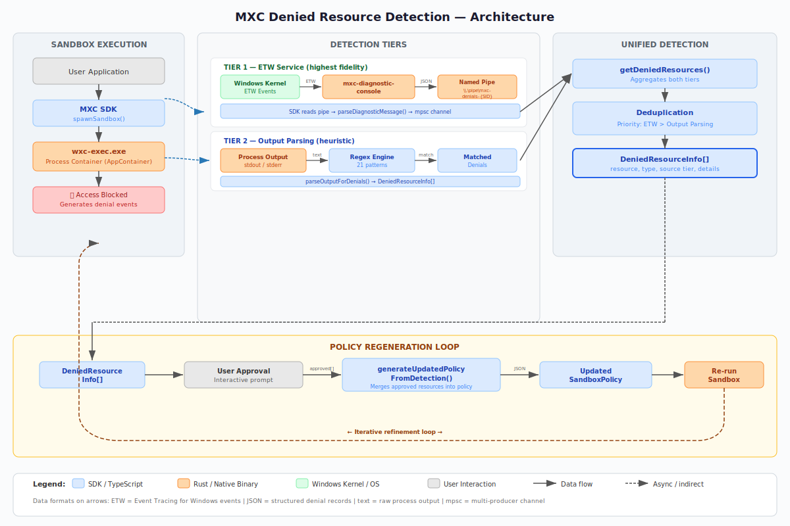
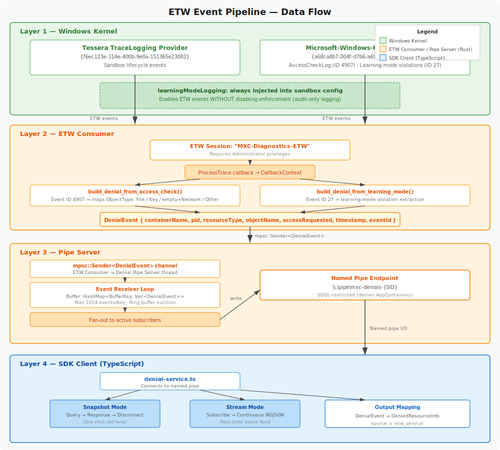
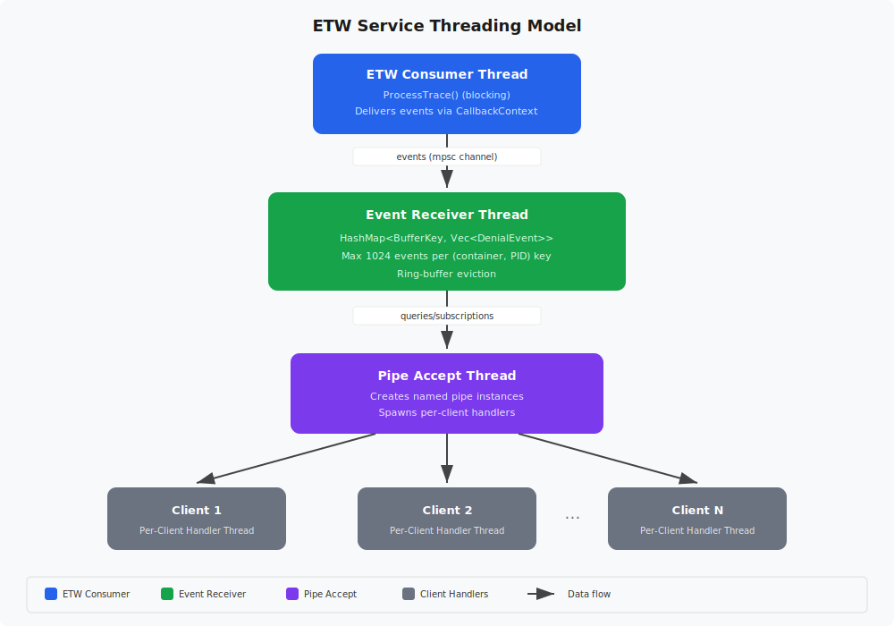
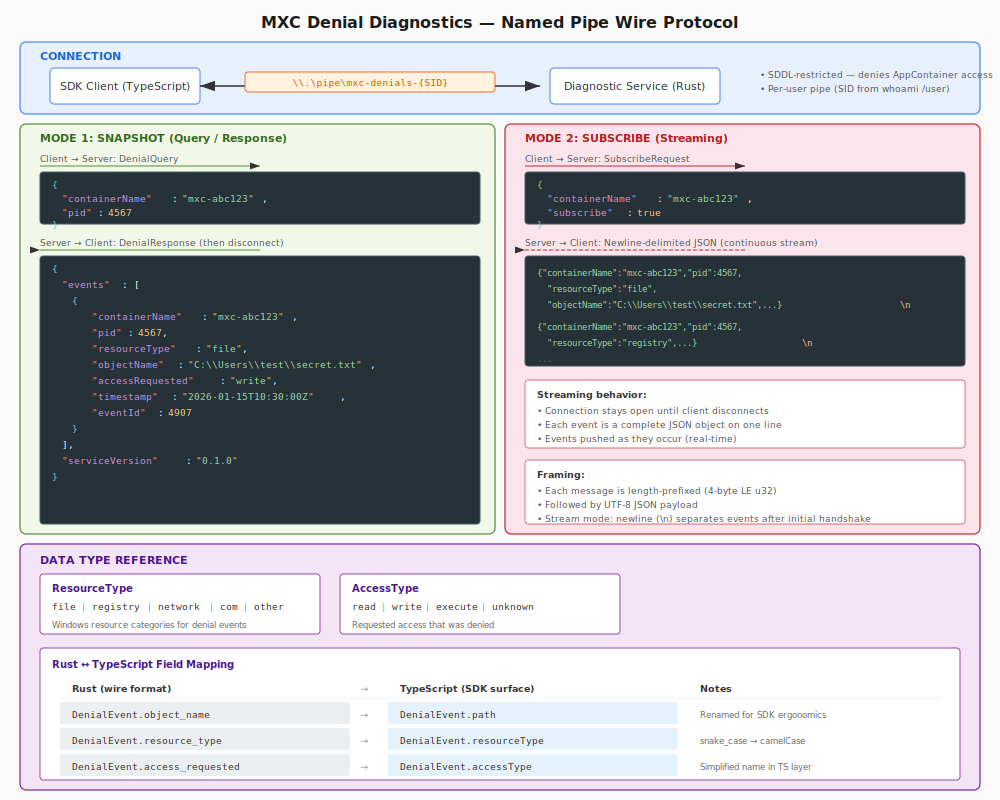
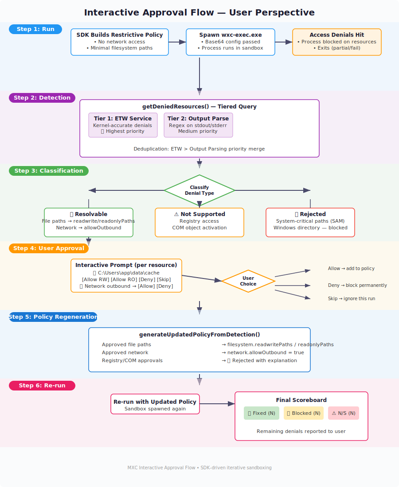
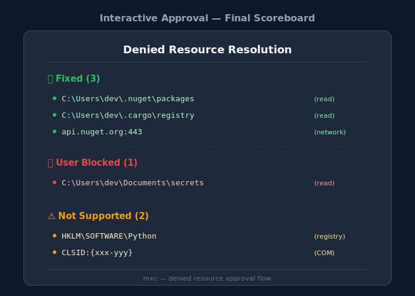

# Denied Resource Detection & Approval Architecture

## 1. Executive Summary

MXC now includes a **Denied Resource Detection & Approval** system that identifies exactly which resources a sandboxed process was denied access to, presents them to the user for interactive approval, regenerates sandbox policy with approved resources, and re-runs the workload. The system currently supports **file** and **network** resource types.

> **Not implemented (future work):** registry and COM resource types appear throughout this document as part of the original design. They are **not** detected or auto-resolved by the shipped code. The Rust `ResourceType` enum exposes only `File`, `Network`, and `Other` (`src/tools/mxc_diagnostic_console/src/denial_event.rs`), and the SDK denial types use the union `'file' | 'network'` (`sdk/src/denied-resources.ts`, `sdk/src/denial-service.ts`). Sections that reference registry/COM describe the aspirational design and are called out as future work where they appear.

Detection uses a tiered strategy with graceful fallback:

1. **ETW Diagnostic Service** — kernel-accurate, real-time event capture
2. **Output Parsing** — regex-based extraction from process stderr/stdout

This eliminates the manual trial-and-error loop that previously characterized sandbox policy authoring, enabling a "run → detect → approve → re-run" workflow that converges on a correct policy in a single iteration.



---

## 2. Problem Statement

When running code in MXC's process containers (AppContainer, BaseContainer), users do not know ahead of time which filesystem paths, network endpoints, registry keys, or COM objects their workload will require. When the sandbox denies access to a resource, the process fails — often with opaque error messages or silent misbehavior.

The user must then:

1. Interpret cryptic error output (if any) to guess which resource was denied
2. Manually edit their sandbox policy to grant access
3. Re-run and hope they found all the missing resources
4. Repeat until the workload succeeds

This trial-and-error cycle is time-consuming, error-prone, and discouraging — especially for workloads with many transitive dependencies (e.g., Python packages that load native DLLs, Node.js modules that probe the filesystem at startup).

**The Denied Resource Detection system solves this by automating the entire detect → approve → fix cycle.**

---

## 3. Architecture Overview


> **Diagram caveat:** the diagrams in this document (here and in §5–§9) depict the original, aspirational design. Where they show registry/COM resource types, learning-mode (Event ID 27) forwarding, or network denials flowing from the ETW tier, those elements are **not** present in the shipped code — see the per-section "Not implemented" callouts for the actual behavior.

The system is organized into three layers:

### Sandbox Execution Layer (Rust)

The `wxc-exec.exe` binary always injects `learningModeLogging: true` into the sandbox configuration before execution. This enables kernel-level ETW event logging for access denials without weakening sandbox enforcement. The sandbox runs at full security — denied accesses are still denied — but each denial is now observable.

### Detection Layer (Rust + TypeScript)

Two independent detection mechanisms operate in parallel, each with different accuracy, coverage, and dependency characteristics:

| Tier | Component | Language | Accuracy | Dependencies |
|------|-----------|----------|----------|--------------|
| 1 | ETW Diagnostic Service | Rust | ~100% | Service installed as LOCAL SERVICE |
| 2 | Output Parser | TypeScript | ~70% | None (always available) |

### Approval & Policy Layer (TypeScript SDK)

The SDK orchestrates the full workflow: invoking detection, classifying results, presenting an interactive approval UX, regenerating policy, and re-executing the sandbox with the updated configuration.

---

## 4. Tiered Detection Strategy

The system employs two detection tiers, each providing different trade-offs between accuracy, coverage, and deployment requirements.

### Tier 1: ETW Diagnostic Service

**Accuracy:** Kernel-accurate (captures all forwarded denials)  
**Coverage:** File only — the ETW path forwards `ObjectType="File"` denials exclusively  
**Requirements:** `MxcDiagnosticService` running as `NT AUTHORITY\LocalService`

The ETW service subscribes to kernel-level access-check events. It captures file denials — including those where the process handles the error silently without printing anything to stderr. This is the only tier that can detect denials that produce no process output.

> **Implementation note:** Although the service decodes every AccessCheckLog event, `build_denial_from_access_check` (`src/tools/mxc_diagnostic_console/src/etw.rs`) emits **only** `ResourceType::File` events to the denial pipe. Network and registry (`Key`) object types are mapped to `ResourceType::Other` and dropped, so the ETW tier does **not** surface network, registry, or COM denials. Network detection is available **only** via Tier 2 output parsing.

### Tier 2: Output Parsing

**Accuracy:** ~70% (depends on the process printing recognizable error messages)  
**Coverage:** File, network  
**Requirements:** None (always available)

The output parser applies 17 regex patterns (12 filesystem + 5 network) against process stdout/stderr, covering error messages from Python, Node.js, PowerShell, .NET, and Rust runtimes, plus generic Windows/Linux path heuristics. This tier is always available with zero dependencies but can only detect denials that result in recognizable error output.

### Deduplication

When the same resource appears from multiple detection sources, the system deduplicates by normalized path + resource type, preferring the highest-priority source:

```
ETW Service (Tier 1) > Output Parsing (Tier 2)
```

This ensures the final denial list carries the most accurate metadata (e.g., access type, timestamp) for each resource.

---

## 5. ETW Service Architecture



### 5.1 Binary

The ETW service is implemented as an extension of the existing `mxc-diagnostic-console.exe` tool. The binary supports three operational modes:

| Flag | Behavior |
|------|----------|
| `--service` | Run as a Windows service (headless) |
| `--install` | Register and configure the Windows service (requires elevation) |
| `--uninstall` | Stop and remove the Windows service (requires elevation) |
| *(none)* | Interactive console mode (existing behavior) |

### 5.2 ETW Providers

The service subscribes to two ETW providers:

| Provider | GUID | Purpose |
|----------|------|---------|
| Tessera TraceLogging | `{f6ec123e-314e-400b-9e0a-151365e23083}` | Sandbox lifecycle events (container create/destroy) |
| Microsoft-Windows-Kernel-General | `{a68ca8b7-004f-d7b6-a698-07e2de0f1f5d}` | `AccessCheckLog` (Event ID 4907). `LearningModeViolation` (Event ID 27) is decoded for the console/collect display path only and is **not** forwarded to the denial pipe. |

### 5.3 learningModeLogging

The `wxc-exec` binary **always** injects `learningModeLogging: true` into the sandbox configuration before launching the contained process. This is critical to understand:

- **`learningModeLogging`** enables kernel ETW events for access denials. The sandbox remains fully enforced — denied accesses are still blocked. The flag only enables *observability*.
- **`permissiveLearningMode`** (a separate, unrelated flag) would allow denied accesses to succeed. **This flag is never set or modified by the detection system.**

### 5.4 Event Extraction

A single extraction function maps raw ETW events to `DenialEvent` structs:

**`build_denial_from_access_check()`** (`src/tools/mxc_diagnostic_console/src/etw.rs`) — Event ID 4907 (AccessCheckLog):

Maps the `ObjectType` field to a `ResourceType` via `ResourceType::from_object_type` (`src/tools/mxc_diagnostic_console/src/denial_event.rs`):

| ObjectType Value | ResourceType | Forwarded to pipe? |
|-----------------|--------------|--------------------|
| `"File"` | `ResourceType::File` | ✅ Yes |
| `"Key"` | `ResourceType::Other` (registry not actionable via policy) | ❌ Dropped |
| `""` (empty string) | `ResourceType::Network` | ❌ Dropped |
| anything else | `ResourceType::Other` | ❌ Dropped |

Only `ResourceType::File` events are emitted; every other mapping is computed and then discarded. As a result the ETW tier yields **file denials only** — the `"Key"` → registry and empty-string → network rows above are never surfaced to SDK consumers.

> **Not implemented (future work):** there is no `build_denial_from_learning_mode()` function. LearningModeViolation events (Event ID 27) are explicitly **not** forwarded to the denial pipe — `try_send_denial_event` returns early for Event ID 27 (`src/tools/mxc_diagnostic_console/src/etw.rs`). These events are visible only on the interactive console/collect display path.

### 5.5 Threading Model

The service uses a multi-threaded architecture:



- **ETW Consumer Thread**: Calls `ProcessTrace` (blocking Win32 API), delivers raw events via `CallbackContext` to the receiver.
- **Event Receiver Thread**: Buffers events in a `HashMap<BufferKey, BufferEntry>`. The buffer key is the **PID only** (`BufferKey { pid }` in `src/tools/mxc_diagnostic_console/src/denial_pipe.rs`) — PID is the primary correlation key per the wire contract, and the container name is only a secondary label, so it is not part of the key. Each key holds at most 1024 events with ring-buffer eviction (oldest events dropped when full).
- **Pipe Accept Thread**: Listens on the named pipe, creates new instances, and spawns a dedicated handler thread for each connecting client.
- **Per-Client Handler Threads**: Serve either snapshot queries (read events, respond, disconnect) or streaming subscriptions (push events as they arrive until client disconnects).

### 5.6 Windows Service Integration

| Property | Value |
|----------|-------|
| Service name | `MxcDiagnosticService` |
| Account | `NT AUTHORITY\LocalService` |
| Start type | `AutoStart` (runs on boot) |
| Install command | `mxc-diagnostic-console --install` (requires elevation) |
| Uninstall command | `mxc-diagnostic-console --uninstall` (requires elevation) |

In service mode, the binary operates headlessly — ETW events are consumed and buffered but not printed to any terminal. The only external interface is the named pipe.

---

## 6. Wire Protocol & Payload Architecture



### 6.1 Named Pipe

**Pipe name:** `\\.\pipe\mxc-denials-{SID}`

| Property | Value | Rationale |
|----------|-------|-----------|
| Naming | Per-user (SID appended) | Multi-user isolation |
| Security | Restrictive SDDL | Denies `ALL_APPLICATION_PACKAGES` (`S-1-15-2-1`); grants the current-user SID, SYSTEM, and Administrators |
| Mode | `PIPE_TYPE_MESSAGE \| PIPE_READMODE_MESSAGE` | Framed messages, no manual delimiting |
| Buffer size | 64 KB | Sufficient for typical denial payloads |

The per-user SID suffix ensures that users on a shared machine cannot observe each other's denial events.

### 6.2 Snapshot Mode (Query/Response)

Used by the SDK's `readDeniedResources()` function to retrieve all buffered events for a given container:

**Client request:**
```json
{
  "containerName": "mxc-abc123",
  "pid": 4567
}
```

**Server response:**
```json
{
  "events": [
    {
      "containerName": "mxc-abc123",
      "pid": 4567,
      "resourceType": "file",
      "objectName": "C:\\Users\\dev\\.nuget\\packages",
      "accessRequested": "read",
      "timestamp": "2026-05-23T16:30:00Z",
      "eventId": 4907
    }
  ],
  "serviceVersion": "0.1.0"
}
```

After sending the response, the server disconnects the pipe instance.

### 6.3 Subscribe Mode (Streaming)

Used by the SDK's `subscribeToDenials()` function for real-time event streaming:

**Client request:**
```json
{
  "containerName": "mxc-abc123",
  "subscribe": true
}
```

**Server streams (newline-delimited JSON):**
```json
{"containerName":"mxc-abc123","pid":4567,"resourceType":"file","objectName":"C:\\path\\to\\file.dll","accessRequested":"read","timestamp":"2026-05-23T16:30:01Z","eventId":4907}
{"containerName":"mxc-abc123","pid":4567,"resourceType":"file","objectName":"C:\\Users\\dev\\.config\\settings.json","accessRequested":"write","timestamp":"2026-05-23T16:30:01Z","eventId":4907}
```

> **Note:** The ETW tier streams `file` denials only (see §5.4). Timestamps use the fixed-width form `YYYY-MM-DDTHH:MM:SSZ` with no fractional seconds.

The stream continues until the client disconnects.

### 6.4 DenialEvent Wire Format

The `DenialEvent` Rust struct serializes to camelCase JSON:

| Field | Type | Description |
|-------|------|-------------|
| `containerName` | `string` | Best-effort AppContainer profile name; may be empty (PID is the primary correlation key) |
| `pid` | `u32` | Process ID that triggered the denial |
| `resourceType` | `enum` | `file`, `network`, or `other`. In practice only `file` is forwarded over the pipe (see §5.4) |
| `objectName` | `string` | Full path/name of the denied resource (serialized as `path`) |
| `accessRequested` | `enum` | `read`, `write`, `execute`, `unknown` (serialized as `accessType`) |
| `timestamp` | `string` | Fixed-width ISO 8601 timestamp `YYYY-MM-DDTHH:MM:SSZ` (no fractional seconds), validated strictly |
| `eventId` | `u16` | Original ETW event ID (`4907`, AccessCheckLog) |

> **Active wire type vs. reserved model:** the live detection path uses the `DenialEvent` struct shown above (`src/tools/mxc_diagnostic_console/src/denial_event.rs`). A separate `wxc_common::models::DeniedResource` struct (fields `path`, `resource_type`, `access_denied`, `confirmed`) exists in `src/core/wxc_common/src/models.rs` but is **currently defined-but-unused / reserved** — it is not part of the active pipe protocol.

### 6.5 Rust ↔ TypeScript Field Mapping

The SDK maps wire-format fields to its internal representation:

| Rust (wire JSON) | TypeScript (SDK) | Notes |
|-----------------|------------------|-------|
| `objectName` | `path` | Semantic rename for SDK consumers |
| `resourceType` | `resourceType` | Direct mapping |
| `accessRequested` | `accessType` | Semantic rename |
| *(implicit)* | `source = 'etw_service'` | SDK tags the detection source |

---

## 7. SDK Module Architecture

### 7.1 `denied-resources.ts` — Output Parsing Engine

The output parser applies 17 regex patterns (12 filesystem + 5 network) against captured process output:

**Supported filesystem runtimes/patterns:**

| Runtime | Example Error Pattern |
|---------|----------------------|
| Python | `PermissionError: [Errno 13] Permission denied: '...'` |
| Node.js | `Error: EACCES: permission denied, open '...'` (and `EPERM`) |
| PowerShell | `Access to the path '...' is denied.` |
| .NET | `System.UnauthorizedAccessException: Access to the path '...'` / `IOException` |
| Rust | `Os { code: 5, kind: PermissionDenied, message: "Access is denied." }` |
| Windows native | `C:\path - Access is denied` (path↔message in either order) |
| Linux / generic | `permission denied: /path`, `cannot open/access/read/write '...'` |

**Supported network patterns:** Node.js `ECONNREFUSED`, Python `ConnectionRefusedError`, generic `Connection refused`, DNS `getaddrinfo ENOTFOUND` / lookup failed, and `WinHttpSendRequest` errors.

> **Not implemented (future work):** there are no patterns for Go, C/C++, Java, or Ruby runtimes, and no registry or COM patterns.

Each pattern extracts: `path`, `accessType`, and `resourceType` (`'file' | 'network'`).


### 7.2 `denial-service.ts` — ETW Service Client

Provides the TypeScript interface to the ETW diagnostic service:

```typescript
// Check service availability
isDenialServiceRunning(): boolean

// One-shot query: get all buffered denials
readDeniedResources(containerName: string, pid?: number): DenialEvent[]

// Streaming: receive denials in real-time
subscribeToDenials(containerName: string, callback: (event: DenialEvent) => void): Subscription
```

**Graceful fallback:** All functions return empty results or no-op handles when the service is unavailable. The SDK never throws due to a missing service — it simply falls through to lower tiers.

### 7.3 `tiered-detection.ts` — Unified Detection API

Orchestrates both detection tiers into a single call:

```typescript
interface DetectionOptions {
  containerName: string;
  pid?: number;
  processOutput: string;
  policy: SandboxPolicy;
}

// Main entry point
getDeniedResources(options: DetectionOptions): DeniedResource[]

// Internal helpers
deduplicateDenials(denials: DeniedResource[]): DeniedResource[]
generateUpdatedPolicyFromDetection(policy: SandboxPolicy, approved: DeniedResource[]): PolicyUpdateResult
```

**`deduplicateDenials()`** merges results by normalized path + resource type, preferring the source with highest priority (ETW > output parsing).

**`generateUpdatedPolicyFromDetection()`** wraps `policy-regen.ts` with additional logic for network handling and managed policy checks. (Registry/COM handling is future work — those types are never surfaced by the detection tiers.)

### 7.4 `policy-regen.ts` — Policy Regeneration

Transforms approved denials into policy updates:

```typescript
interface PolicyRegenOptions {
  useParentDirectories: boolean;    // Collapse paths to parent dirs
  rejectSystemCriticalPaths: boolean; // Block dangerous paths
}

interface PolicyUpdateResult {
  updatedPolicy: SandboxPolicy;
  rejectedPaths: { path: string; reason: string }[];
  addedCount: number;
}

generateUpdatedPolicy(
  policy: SandboxPolicy,
  approvedPaths: ApprovedResource[],
  options: PolicyRegenOptions
): PolicyUpdateResult
```

**Security enforcement:**

- Rejects system-critical paths: Windows directory (`C:\Windows\**`), SAM database, boot configuration, credential stores
- Rejects paths in managed policies (`policyMode: 'managed'` throws an error)
- Returns rejected paths with human-readable reasons for the approval UX to display

---

## 8. Resource Type Support Matrix

| Resource Type | Tier 1 (ETW) | Tier 2 (Output) | Auto-Resolution | Policy Field |
|--------------|:---:|:---:|:---:|---|
| File (read) | ✅ | ✅ | ✅ | `filesystem.readonlyPaths` |
| File (write) | ✅ | ✅ | ✅ | `filesystem.readwritePaths` |
| Network | ❌ | ✅ | ✅ | `network.allowedHosts[]` |
| Registry | ❌ | ❌ | ❌ Not implemented | Not in schema |
| COM | ❌ | ❌ | ❌ Not implemented | Not in schema |

**Legend:**
- ✅ = Supported
- ❌ = Not supported by this tier
- ❌ Not implemented = Not detected or auto-resolved by the shipped code (future work)

> **Network detection caveat:** the ETW tier does **not** emit network denials (it forwards `file` only — see §5.4). Network denials are detected exclusively by Tier 2 output parsing. Registry and COM are not detected by either tier; the rows above record the original design intent.

### Network Access — Per-Host Approval

Network access in MXC is enforced at **two layers**, both of which must allow traffic:

1. **AppContainer capabilities** — the `internetClient` SID grants the container the *ability* to make outbound connections
2. **Windows Firewall (WFP)** — per-AppContainer SID rules control *which* hosts are reachable

The denied resource system leverages this by adding only approved hosts to the firewall allowlist:

**Initial restrictive policy** (no network access):
```json
{
  "network": {
    "allowOutbound": false
  }
}
```

**After user approves `api.nuget.org:443` and `pypi.org:443`** (but denies `telemetry.example.com`):
```json
{
  "network": {
    "allowOutbound": true,
    "allowedHosts": ["api.nuget.org", "pypi.org"]
  }
}
```

**How it works at runtime:**
- `allowOutbound: true` → adds `internetClient` capability to the AppContainer token (allows socket creation)
- `allowedHosts: [...]` → `NetworkManager` creates WFP firewall rules that **only allow** traffic to these specific hosts. All other outbound traffic is blocked by a catch-all deny rule.

**Enforcement modes** (configured via `network.enforcementMode`):

| Mode | Capabilities | Firewall Rules | Per-Host Control |
|------|:---:|:---:|:---:|
| `capabilities` (default) | ✅ | — | ❌ (all-or-nothing) |
| `firewall` | — | ✅ | ✅ |
| `both` | ✅ | ✅ | ✅ |

> **Note:** Per-host `allowedHosts` only works with `firewall` or `both` enforcement modes. In `capabilities`-only mode, network is all-or-nothing.

**HTTPS limitation:** TLS handshakes require access to the Windows certificate store (`HKLM\SOFTWARE\Microsoft\SystemCertificates`), which is in the registry. Since registry access is not yet in the policy schema, HTTPS connections may fail even when the host is in `allowedHosts`. Plain HTTP works without issue.

**Example detection output for network denials** (all network denials come from Tier 2 output parsing — the ETW tier never emits network events):
```
Detected denied resources:
  [network] api.nuget.org
    Source: output_parsing
    Pattern: dns_resolution_failed
    Raw: getaddrinfo ENOTFOUND api.nuget.org

  [network] telemetry.example.com:443
    Source: output_parsing
    Pattern: generic_connection_refused
    Raw: Connection refused: telemetry.example.com:443
```

---

## 9. Interactive Approval Flow



The interactive approval flow walks the user through a six-step process:

### Step 1: Initial Sandbox Run

The SDK executes the user's workload with their current (often restrictive) sandbox policy. `learningModeLogging` is always enabled, so denials are observable regardless of whether the process prints error output.

### Step 2: Tiered Detection

After the sandbox exits, the SDK invokes `getDeniedResources()` which:
1. Queries the ETW service (if running) for kernel-level denials
2. Parses process stdout/stderr for recognizable error patterns

### Step 3: Classification

Each detected denial is classified into one of three categories:

| Category | Criteria | User Action |
|----------|----------|-------------|
| **Resolvable** | Resource type has a policy field (file, network) | User can approve/deny |
| **Rejected** | System-critical path or managed policy | Cannot be approved |

> **Not implemented (future work):** the original design also defined an **Inform-only** category for resource types with no policy field (registry, COM). Because registry/COM denials are never surfaced by the detection tiers in the shipped code, this category is not produced today.

### Step 4: User Approval Prompt

For each resolvable denial, the user is prompted:

```
⚠️  Denied: C:\Users\dev\.nuget\packages (read)
    Detected by: ETW Service
    Allow this path? [Y/n/skip]
```

The user can approve (add to policy), deny (keep blocked), or skip (decide later).

### Step 5: Policy Regeneration

Approved resources are passed to `generateUpdatedPolicy()` which:
- Adds file paths to `readonlyPaths` or `readwritePaths` based on access type
- Adds each approved network endpoint to `network.allowedHosts[]` individually (with `allowOutbound = true` as a prerequisite for `allowedHosts` to function)
- Applies security filters (system-critical rejection, parent directory collapsing)

### Step 6: Re-run with Final Scoreboard

The sandbox re-runs with the updated policy. A final report summarizes outcomes:



---

## 10. Deployment & Installation

### Without Service (Tier 2 Only)

**Zero installation required.** Output parsing requires no external dependencies. This configuration provides:

- Output parsing (~70% detection accuracy)
- No real-time streaming
- Cannot detect silent denials (no error output)

### With Service (Both Tiers)

Full detection capability requires installing the ETW diagnostic service:

```powershell
# Install the service (requires elevated PowerShell)
mxc-diagnostic-console --install

# Start the service
sc start MxcDiagnosticService

# Verify the service is running
sc query MxcDiagnosticService
#   STATE: RUNNING

# Check the pipe exists (from non-elevated PowerShell)
Test-Path "\\.\pipe\mxc-denials-*"

# Uninstall (requires elevated PowerShell)
sc stop MxcDiagnosticService
mxc-diagnostic-console --uninstall
```

**Service lifecycle:**

| Event | Behavior |
|-------|----------|
| System boot | Service starts automatically (AutoStart) |
| No MXC activity | Service idles with minimal resource usage |
| Sandbox launches | ETW events begin flowing; buffered per-container |
| Service stopped | SDK gracefully falls back to Tier 2 |

---

## 11. Security Considerations

### learningModeLogging is Safe

The `learningModeLogging` flag enables kernel-level ETW event emission for sandbox access denials. **It does not weaken the sandbox.** All denied accesses remain denied — the flag only makes denials *observable* via ETW.

This is distinct from `permissiveLearningMode`, which would allow denied accesses to succeed. **The detection system never sets or modifies `permissiveLearningMode`.**

### Named Pipe Security

The service pipe uses a restrictive SDDL security descriptor, built by `build_pipe_sddl()` in `src/tools/mxc_diagnostic_console/src/pipe_utils.rs`:

```
D:(D;;GA;;;S-1-15-2-1)(A;;GRGW;;;<current-user-SID>)(A;;GA;;;SY)(A;;GA;;;BA)
```

- **Denies** all access (`GA`) to `ALL_APPLICATION_PACKAGES` (`S-1-15-2-1`) — prevents sandboxed AppContainer processes from connecting
- **Grants** Generic Read + Write (`GRGW`) to the **current user's SID** — the non-elevated SDK running as that user can connect
- **Grants** full access (`GA`) to SYSTEM (`SY`) and Administrators (`BA`)

This ensures the sandboxed (untrusted) process cannot inject fake denial events or read other containers' denial data.

The security boundary is maintained because:
- The pipe uses a restrictive SDDL that blocks AppContainer tokens from connecting
- The pipe only exposes denial events (read-only data) — not a control channel
- Per-user SID isolation prevents cross-user event leakage

### System-Critical Path Rejection

Even if a user explicitly approves a resource, the policy regeneration engine rejects paths that would compromise system integrity:

| Rejected Path Pattern | Reason |
|----------------------|--------|
| `C:\Windows\**` | OS files — corruption risk |
| `C:\Windows\System32\config\SAM` | Credential database |
| `C:\Boot\**`, `C:\EFI\**` | Boot configuration |
| `%SYSTEMROOT%\System32\lsass.exe` | Credential process |
| Registry: `HKLM\SAM`, `HKLM\SECURITY` | Security-sensitive hives |

### Managed Policy Protection

Policies with `policyMode: 'managed'` are controlled by an external system (e.g., an enterprise policy server). The detection system:
- **Detects** denials normally (both tiers operate)
- **Reports** denials to the user
- **Refuses** to modify the policy (throws `MxcError` with code `policy_managed`)

### Per-User Pipe Isolation

Each user's pipe is named with their Windows SID:

```
\\.\pipe\mxc-denials-S-1-5-21-XXXXXXXXXX-XXXXXXXXXX-XXXXXXXXXX-XXXX
```

This ensures:
- User A cannot subscribe to User B's denial events
- Multi-user Terminal Server scenarios are fully isolated
- Service-to-user event routing is unambiguous

---

## 12. Future Work

| Area | Description | Impact |
|------|-------------|--------|
| **Registry policy support** | Add `registry.allowedKeys` to the schema | Enables auto-resolution for registry denials |
| **COM capability grants** | Add `com.allowedClasses` to the schema | Enables auto-resolution for COM denials |
| **Persistent denial history** | Log denials to file/Windows Event Log from service | Post-hoc analysis, trend detection |
| **GUI approval interface** | Visual approval UX (VS Code extension or standalone) | Better DX for complex denial sets |
| **ML-based policy suggestions** | Learn from historical patterns across runs | Proactive policy recommendations |
| **CI/CD integration** | Automatic policy generation during test runs | Zero-touch policy authoring in pipelines |

---

*Last updated: 2026-05-23*
