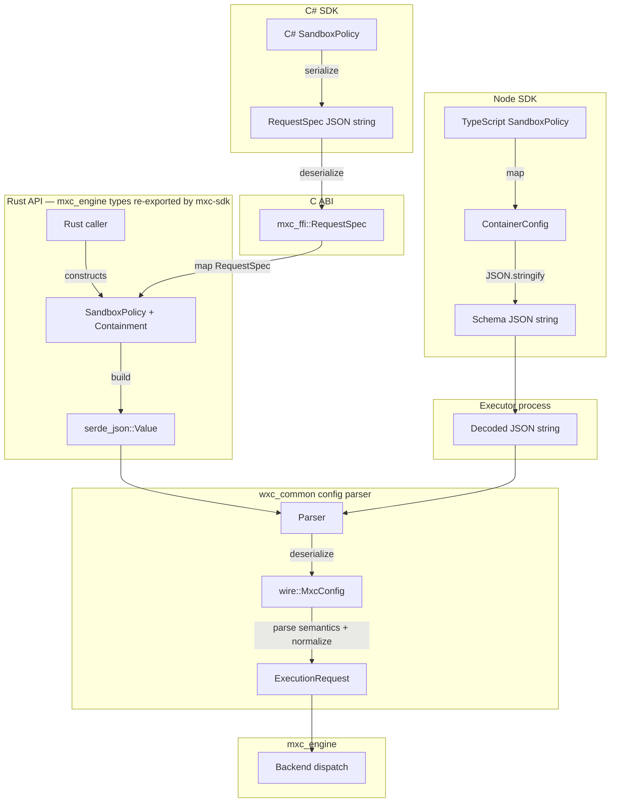
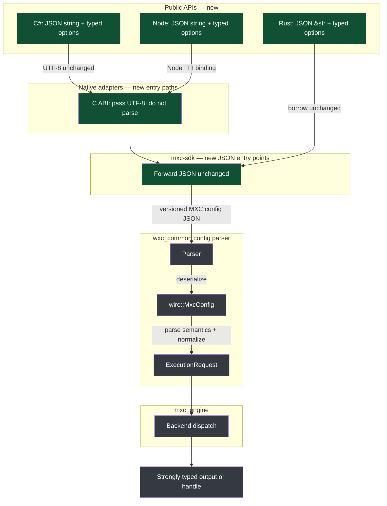

# JSON-first one-shot sandbox APIs

> **Status:** Proposal

This proposal updates only the dataflow for one-shot sandbox run and spawn.

## Decision

- Make the versioned MXC config JSON the configuration currency.
- Add one-shot run and spawn JSON entry points to `mxc-sdk` and `mxc_ffi`.
- Make C# and Node thin wrappers over the C ABI.
- Keep the parser, engine, backends, and existing APIs.

## Problem

Today MXC maintains multiple representations of the same request.



- C# converts `SandboxPolicy` through the binding-only `RequestSpec`.
- Rust builds JSON values only to parse them back in the same process.
- Node converts `SandboxPolicy` to `ContainerConfig` and starts an executor.
- These parallel models and mappings can drift as the schema changes.

## Proposed flow


The existing parser remains: version-specific `mxc_config_contract` types and
adapters produce `wire::MxcConfig`, then semantic parsing produces
`ExecutionRequest`. This proposal does not change that pipeline.

## Proposed API

The JSON contains the complete versioned one-shot request. `RunOptions` holds
`experimental` and `dryRun`; `SpawnOptions` holds only `experimental`.
Options are reserved for host-controlled execution flags and must not duplicate
versioned config fields. C option structs include `size` for future extension.

**Rust (`mxc-sdk`)**

```rust
pub fn run_config(json: &str, options: RunOptions) -> Result<Output, Error>;
pub fn spawn_config(json: &str, options: SpawnOptions) -> Result<Sandbox, Error>;
```

**C ABI (`mxc_ffi`)**

```c
int32_t mxc_run_config(const char* json, const MxcRunOptions*, MxcRunResult*);
int32_t mxc_spawn_config(const char* json, const MxcSpawnOptions*, MxcSandbox**, MxcErrorDetail*);
```

**C# (`Microsoft.Mxc.Sdk`)**

```csharp
RunResult RunConfig(string json, RunOptions? options = null);
Task<RunResult> RunConfigAsync(string json, RunOptions? options = null);
MxcSandboxProcess SpawnConfig(string json, SpawnOptions? options = null);
```

**TypeScript (`@microsoft/mxc-sdk`)**

```typescript
runConfigAsync(json: string, options?: RunOptions): Promise<RunResult>;
spawnConfig(json: string, options?: SpawnOptions): SandboxProcess;
```

## Scope

| Scope | Decision |
| --- | --- |
| Add | One-shot run and spawn JSON APIs, plus C# and Node wrappers. |
| Keep | Published schemas, version adapters, `wire::MxcConfig`, the parser, `ExecutionRequest`, engine validation, backends, and existing typed APIs. |
| Avoid on the new path | `RequestSpec`, binding-only JSON, policy-builder round trips, and the Node executor process. |
| Follow-up (separate proposals) | Redesign state-aware lifecycle APIs; define API-shape guidelines for discovery, policy helpers, telemetry, and future SDK APIs. |

## Migration

1. Add JSON-first run and spawn entry points to `mxc-sdk` and `mxc_ffi`.
2. Bind C# and Node to the `mxc_ffi` C ABI.
3. Keep existing paths through parity. Deprecation comes later.

## Success criteria

- The same config behaves the same through CLI, Rust, C#, and Node.
- New paths require no binding-specific config model or extra JSON round trip.
- Validation errors retain the same category and path in every language.
- Existing callers continue to work during migration.
