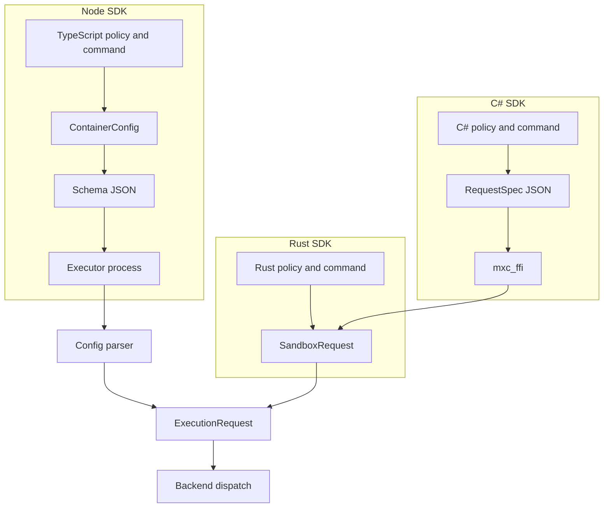
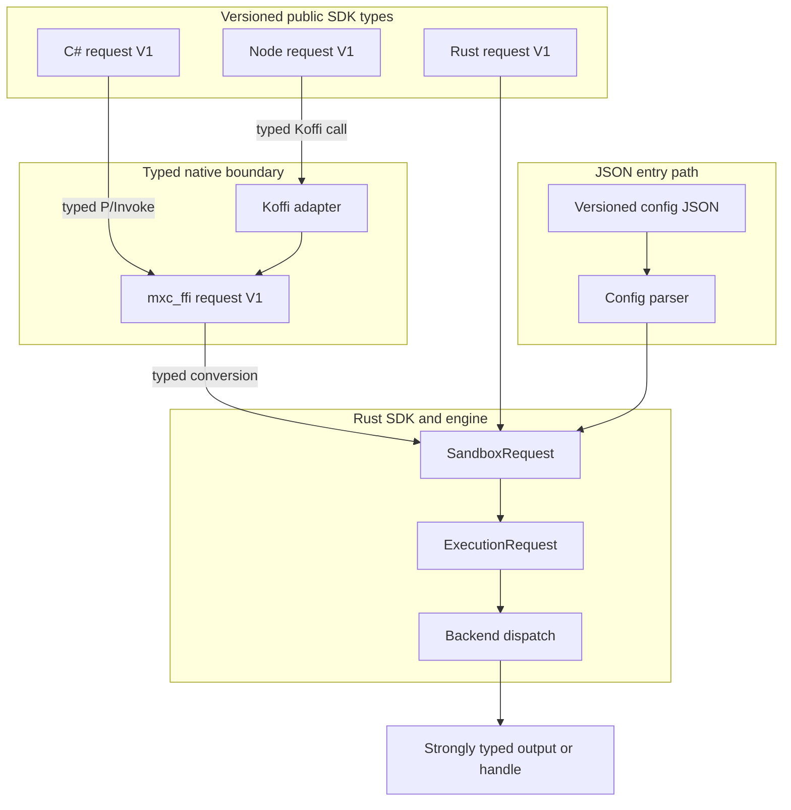

# Strongly typed one-shot sandbox APIs

This proposal updates the one-shot run and spawn dataflow across the Rust, C#,
and Node SDKs.

## Proposal

- Make versioned, strongly typed requests the primary SDK contract.
- Carry typed request data through `mxc_ffi`; do not serialize SDK requests to
  JSON at the FFI boundary.
- Move the Node SDK in-process by calling `mxc_ffi` through Koffi.
- Normalize each typed request once into the existing `SandboxRequest` /
  `ExecutionRequest` pipeline.
- Keep JSON as a supported configuration representation for the executor and
  optional conversion helpers, not as the canonical in-process representation.

## Problem

The SDKs currently take different paths to the engine:



- C# creates binding-specific JSON that `mxc_ffi` parses and maps back into
  Rust SDK types.
- Node converts its public types to config JSON and starts an executor process.
- Equivalent policy shapes and mappings can drift across Rust, C#, and Node.
- JSON serialization obscures compile-time type checking and introduces an
  unnecessary serialize/parse cycle for in-process callers.

## Proposed flow



The normal SDK path is linear and typed. Each language supplies its idiomatic
versioned request type; `mxc_ffi` converts the C representation directly into
the corresponding Rust representation and then into `SandboxRequest`. It does
not serialize to JSON and call back through the JSON parser.

JSON remains useful for config files, the executor, and callers that begin with
JSON. That path parses JSON once into the versioned typed representation before
joining the same SDK/engine path.

## Versioned request types

Rust, C#, and Node expose equivalent, idiomatic request and policy types for a
contract generation, such as `SandboxRequestV1` and `SandboxPolicyV1`.

- Compatible changes append optional fields to V1.
- Removing a field or changing its meaning requires a new V2 type.
- Presence is preserved where omission differs from an explicit default.
  Optional booleans and similar values must represent unset, true, and false.
- Host-controlled execution options remain outside the sandbox policy.
- Testing-only CLI authorization, including `--allow-testing-features`, remains
  unavailable through the in-process SDKs.

For the first implementation, update the Rust, C#, and Node types together and
gate their parity in CI. Generating the language projections from one source of
truth is a follow-up; V1 does not add another interface-definition language.

## Proposed API shape

Names are illustrative; each SDK should follow its language conventions while
exposing the same semantics.

**Rust (`mxc-sdk`)**

```rust
pub fn run(request: SandboxRequestV1, options: RunOptions) -> Result<Output, Error>;
pub fn spawn(request: SandboxRequestV1, options: SpawnOptions) -> Result<Sandbox, Error>;
```

**C ABI (`mxc_ffi`)**

```c
int32_t mxc_run_v1(
    const MxcSandboxRequestV1* request,
    const MxcRunOptions* options,
    MxcRunResult* result);

int32_t mxc_spawn_v1(
    const MxcSandboxRequestV1* request,
    const MxcSpawnOptions* options,
    MxcSandbox** sandbox,
    MxcErrorDetail* error);
```

The C request is a typed, borrowed view valid for the duration of the call.
Nested strings and arrays use explicit pointers and lengths. Nullable pointers
or explicit presence fields preserve optional and tri-state semantics. The Rust
adapter validates the C representation and constructs the Rust V1 request
without an intermediate JSON string.

**C# (`Microsoft.Mxc.Sdk`)**

```csharp
RunResult Run(SandboxRequestV1 request, RunOptions? options = null);
Task<RunResult> RunAsync(SandboxRequestV1 request, RunOptions? options = null);
MxcSandboxProcess Spawn(SandboxRequestV1 request, SpawnOptions? options = null);
```

**TypeScript (`@microsoft/mxc-sdk`)**

```typescript
runSandbox(request: SandboxRequestV1, options?: RunOptions): Promise<RunResult>;
spawnSandbox(request: SandboxRequestV1, options?: SpawnOptions): Promise<SandboxProcess>;
```

## Node Koffi adapter

Node uses Koffi as a thin adapter over the typed `mxc_ffi` C ABI. Koffi declares
the C functions, structs, arrays, and opaque handles and runs blocking calls
off the JavaScript event-loop thread. TypeScript marshals its V1 request into
the matching C representation and adapts results and handles to promises and
Node streams.

The adapter must preserve the C ABI's ownership and concurrency rules: calls
on a sandbox handle are serialized, separate stdin/stdout/stderr handles may
operate concurrently, and no handle is freed while an asynchronous call is
active.

Before migration, validate run, streaming, cancellation, cleanup, and worker
capacity on Windows, Linux, and macOS. The built-in `node:ffi` module was
introduced in Node.js 26 and remains experimental; it may replace Koffi later
without changing the public TypeScript API or typed C ABI.

## JSON support

JSON is not removed. The existing versioned schema and parser remain the
configuration-file contract for `wxc-exec`, `lxc-exec`, and `mxc-exec-mac`.
SDKs may expose explicit helpers that parse versioned config JSON into the
corresponding strong request type.

Those helpers are separate from run and spawn. Once JSON has been parsed, the
request follows the typed path; SDKs and `mxc_ffi` do not serialize a typed
request back to JSON internally.

## Scope

| Scope | Decision |
| --- | --- |
| Add | Equivalent versioned request types in Rust, C#, Node, and `mxc_ffi`; a Koffi-based Node adapter. |
| Change | C# and Node one-shot run/spawn use the typed `mxc_ffi` request boundary. |
| Keep | Existing parser, schemas, `SandboxRequest`, `ExecutionRequest`, engine validation, backends, outputs, and streaming handles. |
| Avoid | JSON as the primary SDK or FFI input; binding-only `RequestSpec` JSON; a second Node-native implementation beside `mxc_ffi`. |
| Follow-up | Generate language projections from one authority; redesign state-aware lifecycle APIs; consider optional JSON conversion helpers. |

## Migration

1. Define the V1 Rust request/policy contract and its normalization into
   `SandboxRequest`.
2. Add the equivalent typed V1 C representation and direct conversion in
   `mxc_ffi`.
3. Update C# to expose its idiomatic V1 types over the typed C ABI.
4. Update Node to expose equivalent TypeScript types and call `mxc_ffi` through
   Koffi.
5. Validate run-to-completion, streaming, cancellation, error parity, optional
   field presence, and cleanup across all three SDKs.
6. Retire the binding-only `RequestSpec` JSON path after compatibility coverage
   is complete.

Existing public APIs remain available during migration. Deprecation is a
separate decision.

## Success criteria

- Rust, C#, and Node expose equivalent, idiomatic, strongly typed V1 requests.
- Normal SDK run and spawn calls do not serialize or parse request JSON.
- `mxc_ffi` converts typed C data directly into the Rust request path.
- Node runs in-process through Koffi and the shared `mxc_ffi` implementation.
- Optional and tri-state fields retain the same semantics in every language.
- The same supported production request behaves consistently across SDKs and
  the equivalent executor JSON configuration.
- Existing callers continue to work during migration.
