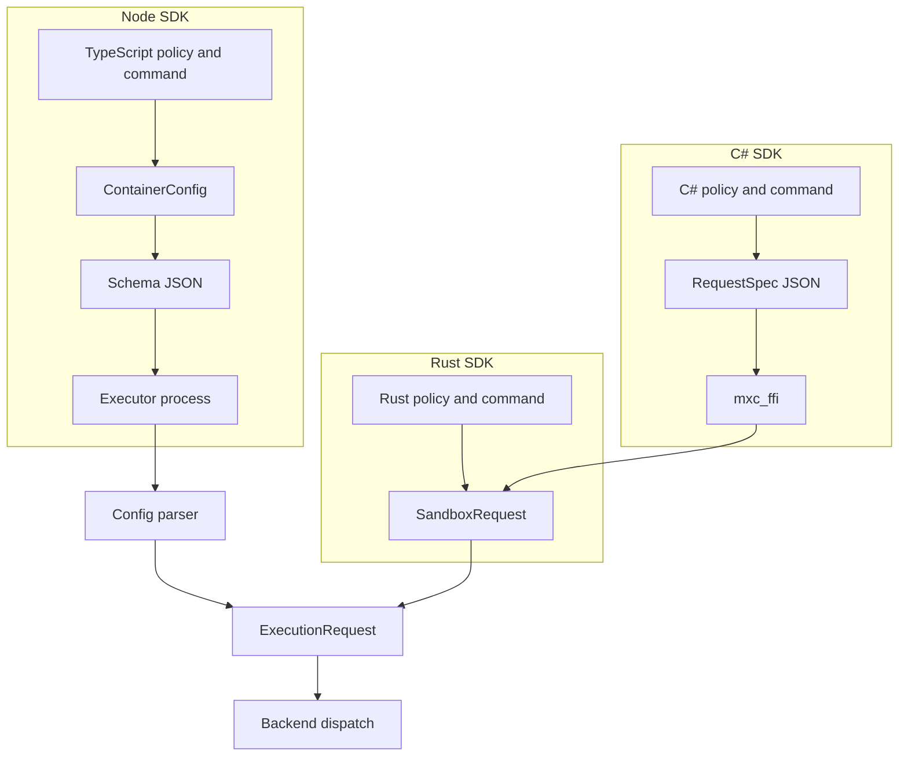
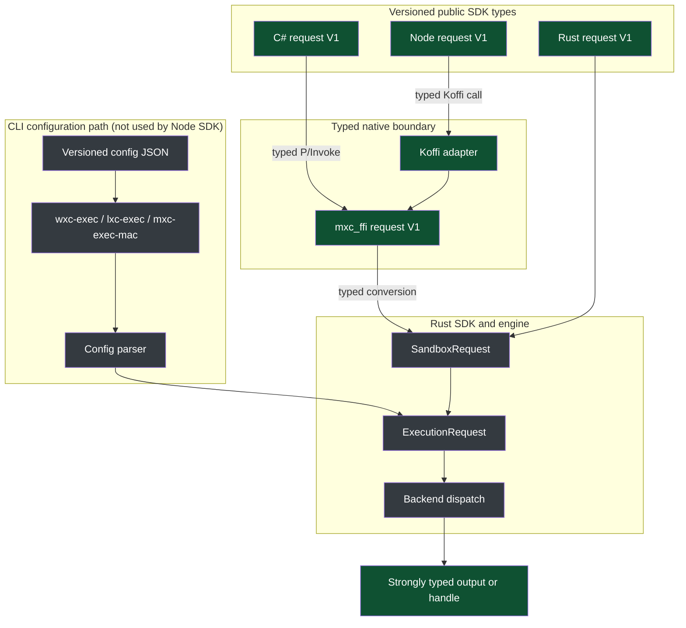

# Strongly typed one-shot sandbox APIs

This proposal updates the one-shot run and spawn dataflow across the Rust, C#,
and Node SDKs.

## Proposal

- Make versioned, strongly typed requests the primary SDK contract.
- Carry typed request data through `mxc_ffi`; do not serialize SDK requests to
  JSON at the FFI boundary.
- Move the Node SDK in-process by calling `mxc_ffi` through Koffi.
- Remove the Node SDK's executor-backed implementation rather than retaining it
  as a fallback beside the in-process path.
- Normalize each typed request once into the existing `SandboxRequest` /
  `ExecutionRequest` pipeline.
- Keep JSON as a supported configuration representation for the executor and
  optional conversion helpers, not as the canonical in-process representation.

## Problem

The SDKs currently take different paths to the engine:



- C# creates binding-specific JSON that `mxc_ffi` parses and maps back into
  Rust SDK types.
- Node converts its public types to config JSON and starts an executor process.
- Equivalent policy shapes and mappings can drift across Rust, C#, and Node.
- JSON serialization obscures compile-time type checking and introduces an
  unnecessary serialize/parse cycle for in-process callers.

## Proposed flow



The normal SDK path is linear and typed. Each language supplies its idiomatic
versioned request type; `mxc_ffi` converts the C representation directly into
the corresponding Rust representation and then into `SandboxRequest`. It does
not serialize to JSON and call back through the JSON parser.

JSON remains the configuration contract for the existing executor binaries.
That separate CLI path parses config JSON into `ExecutionRequest` and joins the
typed SDK path at backend dispatch; the Node SDK does not invoke or fall back to
it.

### v0.9 release boundary

For v0.9, Node run-to-completion moves fully in-process through Koffi and
`mxc_ffi`. The temporary binding may serialize its private request projection
for the existing `mxc_run_request` entry point, but it must not retain a second
executor-backed run path or select between in-process and executor execution.
The V1 typed C boundary replaces that private serialization in the following
release without changing which execution path Node uses.

## Versioned input types

Rust, C#, and Node expose equivalent, idiomatic `SandboxRequestV1`,
`RunOptionsV1`, and `SpawnOptionsV1` contracts. The version is encoded in each
type's name; none of these types contains a runtime `version` field.

- Compatible changes append optional fields to the V1 types.
- Removing a field or changing its meaning requires a new V2 type.
- Presence is preserved where omission differs from an explicit default.
  Optional booleans and similar values must represent unset, true, and false.
- Execution and host-controlled invocation fields remain outside
  `SandboxRequestV1`.
- Testing-only CLI authorization, including `--allow-testing-features`, remains
  unavailable through the in-process SDKs.

For the first implementation, update the Rust, C#, and Node types together and
gate their parity in CI. The C ABI entry point also names the version, so
`mxc_run_v1` accepts only V1 structures. Generating the language projections
from one source of truth is a follow-up; V1 does not add another
interface-definition language.

Versioned config JSON still carries its schema version because JSON has no
named compile-time type. That does not imply a `version` member on the SDK
structures.

### Presence semantics

Any field for which omission means "no opinion" must preserve that state
separately from an explicit value. In particular, optional booleans are
tri-state: unset, `false`, or `true`. Treating unset as `false` would discard
caller intent and could change behavior when defaults evolve.

Each SDK expresses the same semantics idiomatically:

- Rust uses `Option<bool>`.
- C# uses `bool?`.
- TypeScript uses an optional `boolean` property and distinguishes property
  absence from an explicit `false`.
- The C ABI uses an explicit presence field plus the Boolean value; it must not
  reserve a Boolean value as an unset sentinel.

The same rule applies to optional numbers, enums, strings, and collections
whenever absence is semantically different from an explicit zero, empty value,
or empty collection.

### Request shape

`SandboxRequestV1` is an SDK request, not a copy of the executor's
`ContainerConfig`. Its shape is deliberately easy to represent as Rust structs
and enums, C# records, TypeScript interfaces and discriminated unions, and a
tagged C ABI representation.

```typescript
interface SandboxRequestV1 {
  filesystem?: FilesystemV1;
  network?: NetworkV1;
  ui?: UiV1;
  containment?: ContainmentV1;
}

interface ExecutionOptionsV1 {
  command: string;
  workingDirectory?: string;
  environment?: Record<string, string>;
  timeoutMs?: number;
  containerName?: string;
  experimental?: boolean;
  telemetry?: TelemetryV1;
}

type RunOptionsV1 = ExecutionOptionsV1;
type SpawnOptionsV1 = ExecutionOptionsV1;

type ContainmentV1 =
  // Portable intents resolved by the engine.
  | { type: "process" }
  | { type: "vm" }
  | { type: "microvm" }

  // Concrete backend overrides. Their config contains only settings unique to
  // that backend; shared filesystem, network, and UI policy stays top-level.
  | { type: "processContainer"; config?: ProcessContainerOptionsV1 }
  | { type: "windowsSandbox"; config?: WindowsSandboxOptionsV1 }
  | { type: "bubblewrap" }
  | { type: "lxc"; config?: LxcOptionsV1 }
  | { type: "seatbelt"; config?: SeatbeltOptionsV1 }
  | { type: "wslc"; config?: WslcOptionsV1 }
  | { type: "hyperlight"; config?: HyperlightOptionsV1 }
  | { type: "isolationSession"; config?: IsolationSessionOptionsV1 };
```

The default containment is `{ type: "process" }`. It preserves the current
portable Node behavior: callers ask for process isolation and the engine
resolves it to ProcessContainer on Windows, Bubblewrap on Linux, and Seatbelt
on macOS. The `vm` and `microvm` variants likewise express portable intent
without selecting an implementation. A caller may instead choose a concrete
backend when it needs that implementation or one of its unique settings.

Shared sandbox intent does not move into backend configuration. Filesystem,
network, and UI restrictions stay on `SandboxRequestV1`. Command, working
directory, environment, timeout, and per-invocation telemetry stay on the
versioned run or spawn options. Backend-specific configuration contains only
capabilities that cannot be expressed portably, such as ProcessContainer
capabilities or a WSLC image. Backend validation must reject a shared field it
cannot honor rather than ignore it.

`RunOptionsV1` and `SpawnOptionsV1` may share the same execution fields
initially but remain distinct named contracts so they can evolve independently.
The public run and spawn functions and their `SandboxRequestV1`,
`RunOptionsV1`, and `SpawnOptionsV1` types must remain in lockstep across the
Rust, C#, and Node SDKs. Any compatible addition updates all three SDK
projections and the C ABI together, with CI parity checks preventing one
surface from drifting out of sync.

Using a tagged containment union also prevents disconnected combinations that
a giant config permits. For example, a WSLC image can appear only on the
`wslc` variant, not beside `{ type: "process" }`, while the common network
section remains reusable for either choice.

## Proposed API shape

Names are illustrative; each SDK should follow its language conventions while
exposing the same semantics.

**Rust (`mxc-sdk`)**

```rust
pub fn run(request: SandboxRequestV1, options: RunOptionsV1) -> Result<Output, Error>;
pub fn spawn(request: SandboxRequestV1, options: SpawnOptionsV1) -> Result<Sandbox, Error>;
```

**C ABI (`mxc_ffi`)**

```c
int32_t mxc_run_v1(
    const MxcSandboxRequestV1* request,
    const MxcRunOptionsV1* options,
    MxcRunResult* result);

int32_t mxc_spawn_v1(
    const MxcSandboxRequestV1* request,
    const MxcSpawnOptionsV1* options,
    MxcSandbox** sandbox,
    MxcErrorDetail* error);
```

The C request and options are typed, borrowed views valid for the duration of
the call. Nested strings and arrays use explicit pointers and lengths. Nullable
pointers or explicit presence fields preserve optional and tri-state semantics.
The Rust adapter validates both representations and constructs the Rust request
without an intermediate JSON string.

**C# (`Microsoft.Mxc.Sdk`)**

```csharp
RunResult Run(SandboxRequestV1 request, RunOptionsV1 options);
Task<RunResult> RunAsync(SandboxRequestV1 request, RunOptionsV1 options);
MxcSandboxProcess Spawn(SandboxRequestV1 request, SpawnOptionsV1 options);
```

**TypeScript (`@microsoft/mxc-sdk`)**

```typescript
runSandbox(request: SandboxRequestV1, options: RunOptionsV1): Promise<RunResult>;
spawnSandbox(request: SandboxRequestV1, options: SpawnOptionsV1): Promise<SandboxProcess>;
```

## Node Koffi adapter

Node uses Koffi as a thin adapter over the typed `mxc_ffi` C ABI. Koffi declares
the C functions, structs, arrays, and opaque handles and runs blocking calls
off the JavaScript event-loop thread. TypeScript marshals its V1 request into
the matching C request and option representations and adapts results and
handles to promises and Node streams.

The adapter must preserve the C ABI's ownership and concurrency rules: calls
on a sandbox handle are serialized, separate stdin/stdout/stderr handles may
operate concurrently, and no handle is freed while an asynchronous call is
active.

Before migration, validate run, streaming, cancellation, cleanup, and worker
capacity on Windows, Linux, and macOS. The built-in `node:ffi` module was
introduced in Node.js 26 and remains experimental; it may replace Koffi later
without changing the public TypeScript API or typed C ABI.

## JSON support

JSON is not removed. The existing versioned schema and parser remain the
configuration-file contract for `wxc-exec`, `lxc-exec`, and `mxc-exec-mac`.
SDKs may expose explicit helpers that parse versioned config JSON into the
corresponding strong request type.

Those helpers are separate from run and spawn. Once JSON has been parsed, the
request follows the typed path; SDKs and `mxc_ffi` do not serialize a typed
request back to JSON internally.

## Scope

| Scope | Decision |
| --- | --- |
| Add | Equivalent `SandboxRequestV1`, `RunOptionsV1`, and `SpawnOptionsV1` types in Rust, C#, Node, and `mxc_ffi`; a Koffi-based Node adapter. |
| Change | C# and Node one-shot run/spawn use the typed `mxc_ffi` request boundary; Node no longer launches executor binaries. |
| Keep | Existing parser and schemas for the separate CLI path, plus `SandboxRequest`, `ExecutionRequest`, engine validation, backends, outputs, and streaming handles. |
| Avoid | JSON as the primary SDK or FFI input; binding-only `RequestSpec` JSON; parallel in-process and executor-backed Node implementations. |
| Follow-up | Generate language projections from one authority; redesign state-aware lifecycle APIs; consider optional JSON conversion helpers. |

## Migration

1. Define the Rust `SandboxRequestV1`, `RunOptionsV1`, and `SpawnOptionsV1`
   contracts and their normalization into `SandboxRequest`.
2. Add the equivalent typed V1 C request and option representations and direct
   conversion in `mxc_ffi`.
3. Update C# to expose its idiomatic V1 types over the typed C ABI.
4. Update Node to expose equivalent TypeScript types and call `mxc_ffi` through
   Koffi.
5. Validate run-to-completion, streaming, cancellation, error parity, optional
   field presence, and cleanup across all three SDKs.
6. Remove the Node executor path; unsupported in-process requests fail
   explicitly rather than falling back to an executor.
7. Retire the binding-only `RequestSpec` JSON path after compatibility coverage
   is complete.

Existing public APIs remain available during migration. Deprecation is a
separate decision.

## Success criteria

- Rust, C#, and Node expose equivalent, idiomatic, strongly typed V1 request
  and operation-option contracts without embedded version fields.
- Normal SDK run and spawn calls do not serialize or parse request JSON.
- `mxc_ffi` converts typed C data directly into the Rust request path.
- Node runs in-process through Koffi and the shared `mxc_ffi` implementation.
- Node does not launch or fall back to an executor binary.
- Optional and tri-state fields retain the same semantics in every language.
- The same supported production request behaves consistently across SDKs and
  the equivalent executor JSON configuration.
- Existing callers continue to work during migration.
