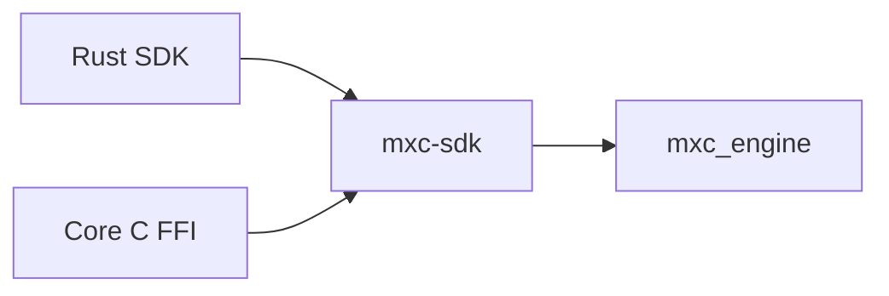
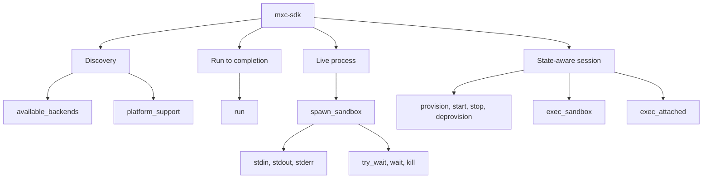
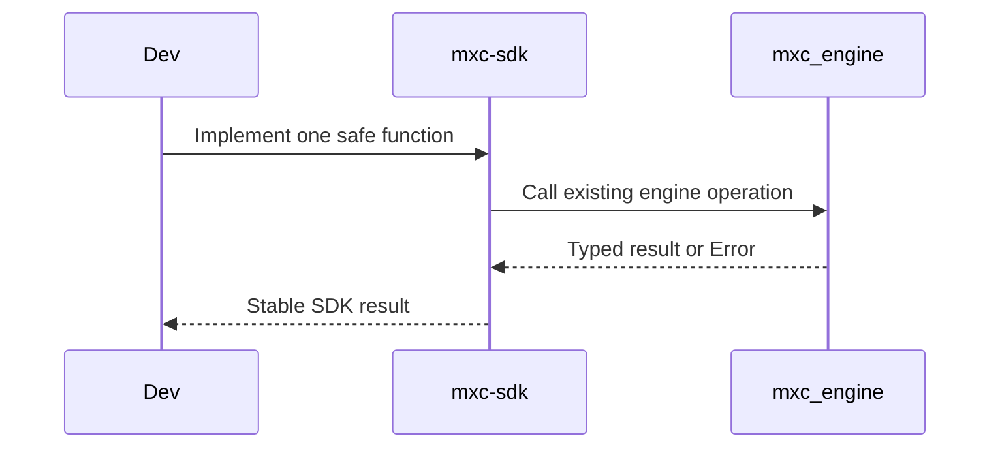

# Layer 1: shared Rust API

## Decision

Keep [`mxc-sdk`](../../../src/core/mxc-sdk/src/lib.rs) as the only safe callable layer above
[`mxc_engine`](../../../src/core/mxc_engine/src/lib.rs).



Do not add another dispatcher crate. Do not route Rust through C.

## Responsibilities

| Shared Rust API owns | `mxc_engine` owns |
|---|---|
| Public operation behavior | Backend selection |
| Safe request and result types | Backend construction |
| `Sandbox`, output, wait, and kill behavior | Platform execution |
| Stable SDK errors | Backend-specific errors and probes |
| Functions called by Rust and FFI | Containment implementation |

## Existing operation families



## Terms

| Term | Meaning |
|---|---|
| Run to completion | Wait internally and return exit status plus buffered stdout and stderr |
| Live process | Return `Sandbox`; the caller drives stdio, wait, and kill |
| State-aware session | Preserve a sandbox across provision, start, exec, stop, and deprovision |
| Attached exec | Connect the command to the calling terminal instead of returning pipes |

## Per-operation work



The safe function is handwritten product code. It contains the operation's behavior.

## Cleanup before generation

1. Inventory every Rust, FFI, Node, and .NET operation.
2. Add behavior tests at the `mxc-sdk` boundary.
3. Move request construction out of FFI functions when an equivalent safe helper is missing.
4. Move result normalization out of foreign SDKs when it represents MXC behavior.
5. Leave pointer checks, allocation, panic handling, and status conversion in `mxc_ffi`.

## Export declaration

Diplomat reads tagged bridge modules, not arbitrary crate APIs. Start with a separate bridge that delegates:

```rust
#[diplomat::bridge]
mod ffi_api {
    pub fn platform_support_json(write: &mut DiplomatWrite) {
        write.write_str(&mxc_sdk::platform_support_json());
    }
}
```

The body may perform only representation conversion and delegation. It must not select a backend or
reimplement an SDK operation.

## Handwritten versus generated

| Handwritten | Generated |
|---|---|
| Safe `mxc-sdk` implementation | Nothing inside this layer |
| Thin Diplomat bridge declaration | C ABI and foreign SDK output in later layers |
| Rust behavior tests | Foreign conformance test scaffolding |

Generating the bridge from annotated Rust functions can be considered after the initial API pattern is stable.

## Exit criteria

- Every FFI operation immediately delegates to a safe `mxc-sdk` operation.
- No FFI function contains backend selection or product policy decisions.
- Existing Rust callers keep their direct, typed API.
- Rust behavior tests define the expected result before a foreign binding is switched.
