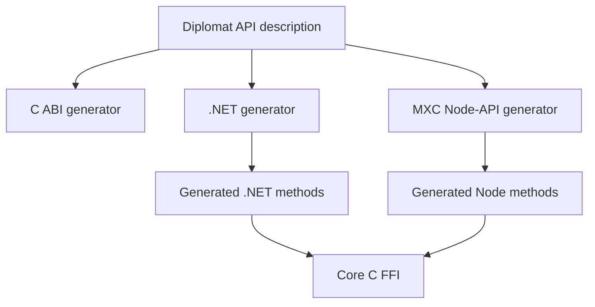
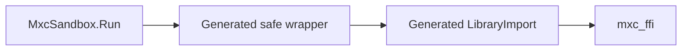
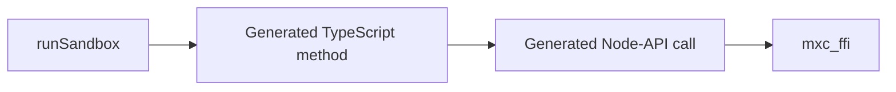
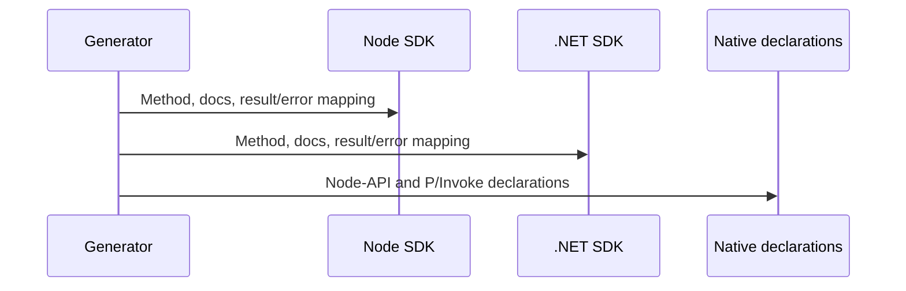
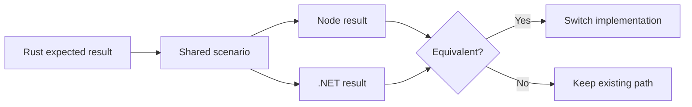

# Layer 3: generated Node and .NET SDKs

## Decision

Generate public foreign SDK functions from the same Diplomat API description that generates the C ABI.



Existing request classes and JSON serialization stay in place. This phase generates callable functions.

## .NET output

Diplomat's .NET backend generates a raw `[LibraryImport]` layer and safe managed classes.



Keep the existing public class names as compatibility facades while switching their internals one family at a time.

## Node output

Diplomat's JavaScript backend targets WebAssembly, so MXC needs a native
[Node-API](https://nodejs.org/api/n-api.html) generator.



Build the Node generator as a [Diplomat backend](https://rust-diplomat.github.io/diplomat/developer.html).
It consumes the same API description as the C and .NET backends.

## Exact ownership

| Generated per operation | Handwritten once per SDK |
|---|---|
| Public method name and parameters | Native library discovery and loading |
| Return and error conversion | Worker scheduling for blocking native calls |
| Documentation | `AbortSignal` or `CancellationToken` coordination |
| C symbol selection | Node `Readable`/`Writable` over native byte calls |
| P/Invoke or Node-API declaration | .NET `Stream` over native byte calls |
| Synchronous and asynchronous method shells | Attached-terminal input, output, resize, and signals |

The handwritten support library cannot contain an operation list or operation-specific parameter mapping.

## What the operation generator emits



For `run(request)`, the output is:

```text
Rust:  run(request) -> Result<Output, Error>
Node:  runSandbox(request) -> Promise<RunResult>
.NET:  RunAsync(request) -> Task<RunResult>
```

The current request objects serialize before the native call. Type/schema generation is outside this design.

## Concrete migration slices

1. `NativeVersion`, available backends, and platform support.
2. Run one command and return buffered stdout, stderr, exit code, timeout, warnings, and metadata.
3. Spawn a live process without attaching it to a terminal.
4. Read stdout/stderr, write stdin, poll, wait, kill, close, and dispose.
5. Provision, start, stop, and deprovision a state-aware sandbox.
6. Execute in that sandbox and return a live process.
7. Execute attached to a terminal with input, output, resize, signals, and cancellation.

## Required tests for each slice



## Exit criteria

- Node and .NET expose the same operation inventory.
- Regeneration adds each value-returning operation to both SDKs.
- No generated file is manually edited.
- Operation-specific serialization and error mapping are not duplicated in handwritten code.
- The executable and `node-pty` path remains until attached-terminal parity is demonstrated.
