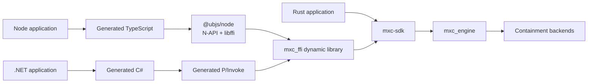
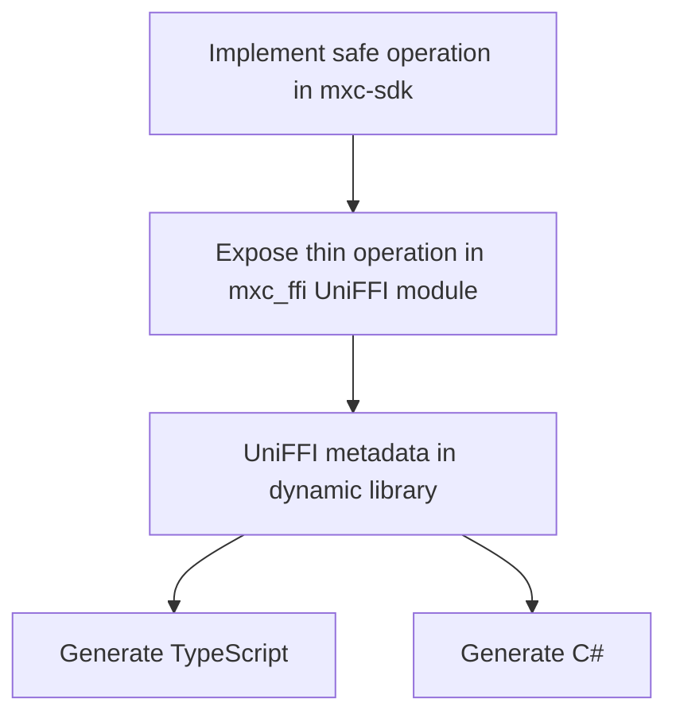

# MXC SDK unification

## Decision

Keep MXC behavior in Rust and use [UniFFI 0.31](https://github.com/mozilla/uniffi-rs) as the single projection
system for native Node and .NET SDKs.

Both foreign SDKs load the same host-compiled Rust dynamic library in-process. Node does not use WebAssembly,
a child process, a daemon, or MXC-specific C++.

## Scope

This design unifies callable operations, results, errors, async behavior, and owned handles. UniFFI replaces the
handwritten flat C projection inside `mxc_ffi`; it does not introduce a second Rust dynamic library.

It does not yet replace:

- JSON request types and schema generation
- request parsing or policy validation
- `mxc_engine`
- containment backends

Legacy C exports remain in `mxc_ffi` only while the shipping C# SDK migrates, then are removed.

## Ownership

| Layer | Owns | Must not own |
|---|---|---|
| `mxc-sdk` | Safe Rust API and behavior | Language projection |
| `mxc_ffi` UniFFI module | Records, objects, conversion, panic boundary | Backend selection |
| Generated TypeScript and C# | Calls, records, object lifetimes, future plumbing | MXC behavior |
| `@ubjs/node` | Generic native loading and UniFFI invocation | MXC-specific glue |
| `mxc_engine` | Backend dispatch and execution | SDK-specific behavior |

## One operation

The thin projection remains handwritten because UniFFI intentionally exports an interop-safe object model rather than
arbitrary Rust types. It only converts values, synchronizes handles, catches panics, and delegates to `mxc-sdk`.

## API naming

Align operation semantics while following each language's naming conventions:

| Behavior | Rust | Node | .NET |
|---|---|---|---|
| Run to completion | `run` / `run_async` | `runSync` / `run` | `Run` / `RunAsync` |
| Spawn live process | `spawn` / `spawn_async` | `spawnSync` / `spawn` | `Spawn` / `SpawnAsync` |
| Wait | `wait` / `wait_async` | `waitSync` / `wait` | `Wait` / `WaitAsync` |
| Kill | `kill` / `kill_async` | `killSync` / `kill` | `Kill` / `KillAsync` |

Node follows its ecosystem convention by reserving the `Sync` suffix for event-loop-blocking calls. The .NET facade
uses the established synchronous name plus `Async` suffix. Public facades are required and delegate without changing
semantics.

## Documents

1. [Rust SDK architecture](rust-sdk-architecture.md)
2. [UniFFI binding generation](uniffi-binding-generation.md)
3. [Node and .NET SDK generation](node-dotnet-sdk-generation.md)

## Prototype

The prototype is intentionally production-shaped:

- `src/ffi/mxc_ffi` exports UniFFI discovery, run, live process, streams, and state-aware operations.
- The same library retains legacy C exports only for compatibility migration.
- `scripts/generate-uniffi-bindings.ps1` pins both generators and regenerates both SDKs.
- `sdk/node/prototype` tests the generated TypeScript against the real Rust library.
- `sdk/dotnet/Microsoft.Mxc.Uniffi.*` tests generated C# against that same library.

Promotion requires cross-platform tests, API snapshot checks, ownership stress tests, and an upstream-risk review.
