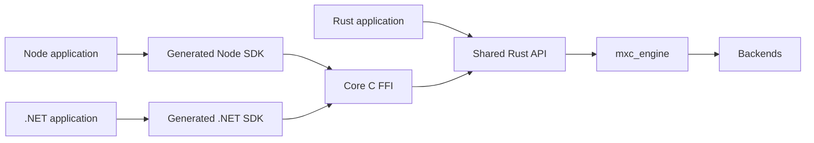
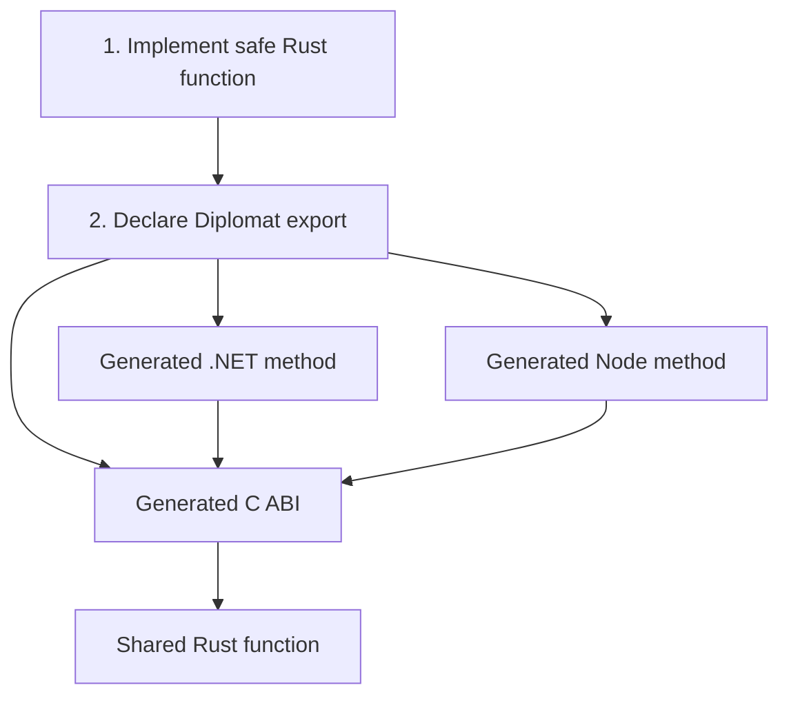
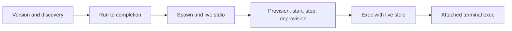

# MXC SDK unification

## Scope

Unify callable Rust, Node, and .NET SDK functions without changing:

- JSON request types or schemas
- request parsing or policy validation
- `mxc_engine`
- containment backends

## Target

Rust calls the shared Rust API directly. Node and .NET call the same API through one C FFI.

## One operation

Initially, steps 1 and 2 are handwritten. The generated outputs must never be edited.

## Boundary

| Layer | Owns | Must not own |
|---|---|---|
| Shared Rust API | MXC behavior, results, errors, process objects | C pointers, P/Invoke, Node APIs |
| Core C FFI | ABI, panic containment, allocation, opaque handles | Backend selection or SDK behavior |
| Generated SDKs | Public functions, native calls, result/error conversion | A second MXC implementation |
| SDK runtime support | `Task`, `Promise`, streams, cancellation, loading | Operation names or parameters |
| `mxc_engine` | Backend dispatch and execution | Language-specific behavior |

## Migration order

Each step is switched independently. Existing entry points remain until parity tests pass.

## Documents

1. [Shared Rust API](01-shared-rust-api.md)
2. [Core C FFI](02-core-ffi.md)
3. [Generated Node and .NET SDKs](03-generated-sdks.md)

## Selected tooling

- [Diplomat](https://github.com/rust-diplomat/diplomat) generates the C ABI and .NET bindings.
- [Diplomat design](https://github.com/rust-diplomat/diplomat/blob/main/docs/design_doc.md) defines its C-first model.
- [Node-API](https://nodejs.org/api/n-api.html) is the stable native boundary for Node.

Diplomat's JavaScript backend uses WebAssembly. MXC needs a native Node-API backend or generator.
