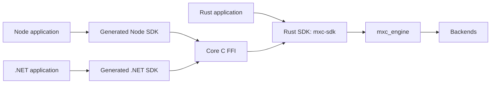
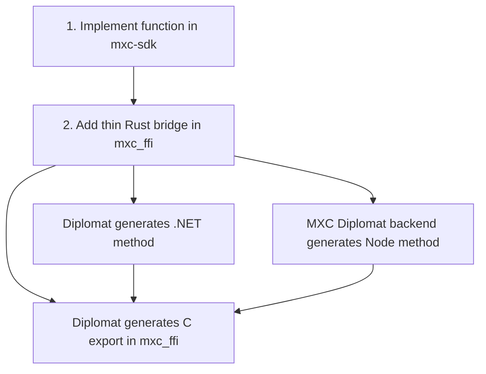
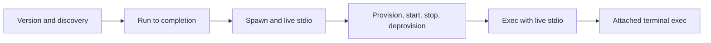

# MXC SDK unification

## Scope

Unify callable Rust, Node, and .NET SDK functions without changing:

- JSON request types or schemas
- request parsing or policy validation
- `mxc_engine`
- containment backends

## Target

Rust applications call `mxc-sdk` directly. Node and .NET reach the same `mxc-sdk` functions through `mxc_ffi`.

## One operation

Initially, steps 1 and 2 are handwritten. The generated outputs must never be edited.

## Boundary

| Layer | Owns | Must not own |
|---|---|---|
| Rust SDK: `mxc-sdk` | Public Rust operations, results, errors, live process object | C pointers, P/Invoke, Node APIs |
| Core C FFI | ABI, panic containment, allocation, opaque handles | Backend selection or SDK behavior |
| Generated SDKs | Canonical names, sync/async functions, native calls, conversion | A second MXC implementation |
| SDK runtime support | Scheduling, streams, cancellation, loading | Operation names or parameters |
| `mxc_engine` | Backend dispatch and execution | Language-specific behavior |

The C ABI is synchronous. Generated Node and .NET async methods schedule the same synchronous operation; they do not
call a second native implementation.

## Migration order

Each step is switched independently. Existing entry points remain until parity tests pass.

## Documents

1. [Rust SDK (`mxc-sdk`) architecture](rust-sdk-architecture.md)
2. [Diplomat and C FFI generation](diplomat-ffi-generation.md)
3. [Node and .NET SDK generation](node-dotnet-sdk-generation.md)

## Selected tooling

- [Diplomat](https://github.com/rust-diplomat/diplomat) generates the C ABI and .NET bindings.
- [Diplomat design](https://github.com/rust-diplomat/diplomat/blob/main/docs/design_doc.md) defines its C-first model.
- [Node-API](https://nodejs.org/api/n-api.html) is the stable native boundary for Node.

Diplomat's JavaScript backend uses WebAssembly. MXC needs a native Node-API backend or generator.
