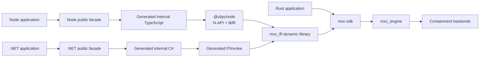
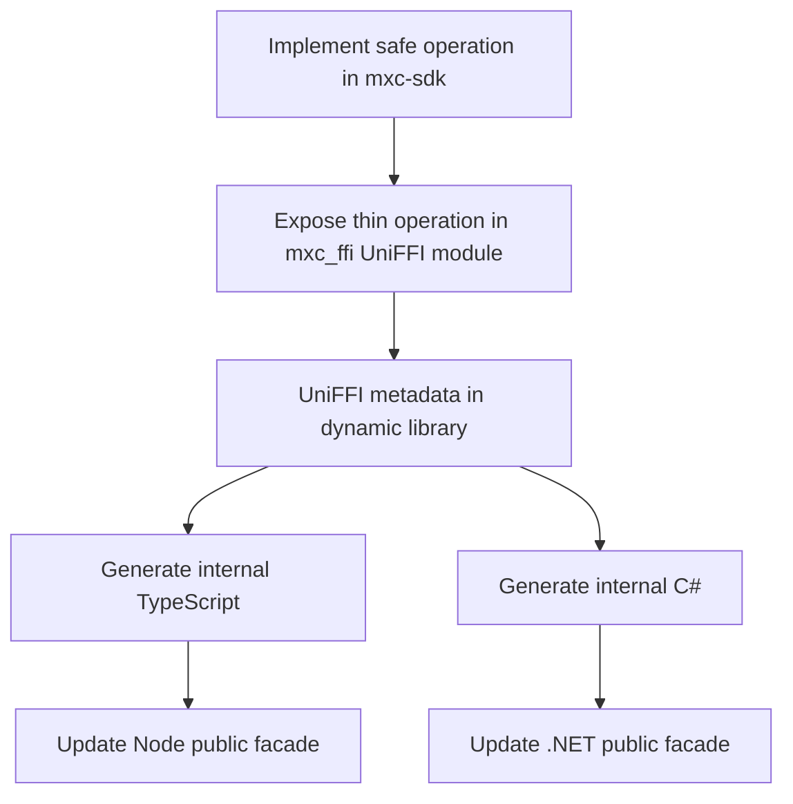

# MXC SDK unification

## Decision

Keep MXC behavior in Rust and use [UniFFI 0.31](https://github.com/mozilla/uniffi-rs) to generate the internal native
binding layers for Node and .NET. Keep small handwritten public facades for package naming and language-specific
adaptation.

Both foreign SDKs load the same host-compiled Rust dynamic library in-process. Node does not use WebAssembly,
a child process, a daemon, or MXC-specific C++.

## Scope

This design unifies callable operations, results, errors, async behavior, and owned handles. UniFFI generates
TypeScript and C# that call native entry points exported by the Rust-built `mxc_ffi` library. It does not generate C
source, a C SDK, the complete public SDK facades, or a second dynamic library.

It does not yet replace:

- JSON request types and schema generation
- request parsing or policy validation
- `mxc_engine`
- containment backends

The .NET SDK has not shipped, so its existing interop layer can be replaced without a compatibility period.

## Ownership

| Layer | Owns | Must not own |
|---|---|---|
| `mxc-sdk` | Safe Rust API and behavior | Language projection |
| `mxc_ffi` UniFFI module | Records, objects, conversion, panic boundary | Backend selection |
| Generated internal TypeScript and C# | Calls, records, object lifetimes, future plumbing | Public package design |
| Node and .NET public facades | Public names, re-exports, and language adapters | MXC behavior |
| `@ubjs/node` | Generic native loading and UniFFI invocation | MXC-specific glue |
| `mxc_engine` | Backend dispatch and execution | SDK-specific behavior |

## One operation

The thin projection remains handwritten because UniFFI intentionally exports an interop-safe object model rather than
arbitrary Rust types. It only converts values, synchronizes handles, catches panics, and delegates to `mxc-sdk`.

## API naming

Use the base operation name for synchronous functions and an `Async` suffix for asynchronous functions:

| Behavior | Rust | Node | .NET |
|---|---|---|---|
| Run to completion | `run` / `run_async` | `run` / `runAsync` | `Run` / `RunAsync` |
| Spawn live process | `spawn` / `spawn_async` | `spawn` / `spawnAsync` | `Spawn` / `SpawnAsync` |
| Wait | `wait` / `wait_async` | `wait` / `waitAsync` | `Wait` / `WaitAsync` |
| Terminate process | `kill` / `kill_async` | `kill` / `killAsync` | `Kill` / `KillAsync` |

Public facades preserve these names and delegate without changing semantics.

## Authoring impact

| Change | Handwritten locations after adoption |
|---|---|
| Backend behavior | Backend plus `mxc_engine` integration |
| Callable SDK operation | `mxc-sdk`, one UniFFI export, and thin Node/.NET public facade methods |
| Result or error field | Rust projection record plus any public facade mapping; regenerate Node and C# |
| Policy or schema field | Rust wire/parser/domain; regenerate schema-derived Node and C# models |

Schema-derived public model generation is a follow-up decision. Until it is implemented, policy changes still require
manual Node and C# model updates and the repository has not reached the intended maintenance state.

## Versioning and changelogs

All three SDK versions remain synchronized. Each published SDK keeps its own ecosystem-facing changelog so Rust, Node,
and .NET consumers can see the changes relevant to their package. A shared behavior change uses the same release
summary in each affected changelog; facade or packaging changes appear only in the affected SDK's changelog. Detailed
release mechanics belong in [`docs/versioning.md`](../../versioning.md), not in this architecture proposal.

## Expected maintenance effect

These are planning estimates, not measured delivery-time guarantees:

| Adoption stage | Estimated recurring cross-SDK maintenance reduction | What is eliminated |
|---|---:|---|
| UniFFI projection only | 40-60% | Handwritten native exports, P/Invoke, N-API glue, async bridge, and foreign object plumbing |
| UniFFI plus schema-derived public models | 60-75% | Most repeated Node and C# policy/request model edits |

The remaining work is the work that should stay explicit: implementing behavior once in Rust, designing the safe
interop shape, preserving language-native facade semantics, and testing each supported runtime. A time study over
several representative feature changes should replace these estimates before using them for staffing commitments.

## Remaining work before switching

The implementation demonstrates that one native Rust library can generate and serve both language bindings. Before
replacing the current bindings, MXC still needs bounded async scheduling, interruptible streams, independent
termination while an async wait is pending, typed state-aware APIs, packages for every supported platform, generated
public-model evaluation, and CI checks that identify accidental public API changes.

## Documents

1. [Rust SDK architecture](rust-sdk-architecture.md)
2. [UniFFI binding generation](uniffi-binding-generation.md)
3. [Node and .NET SDK generation](node-dotnet-sdk-generation.md)

## Prototype

The prototype is intentionally production-shaped:

- `src/ffi/mxc_ffi` exports UniFFI discovery, run, live process, streams, and state-aware operations.
- `scripts/generate-uniffi-bindings.ps1` pins both generators and regenerates both SDKs.
- `sdk/node/prototype` tests the generated TypeScript against the real Rust library.
- `sdk/dotnet/Microsoft.Mxc.Uniffi.*` tests generated C# against that same library.

The current bindings should be replaced only after cross-platform tests, public API checks, and ownership stress tests
pass.
