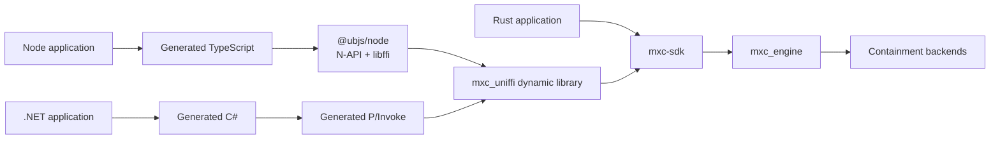
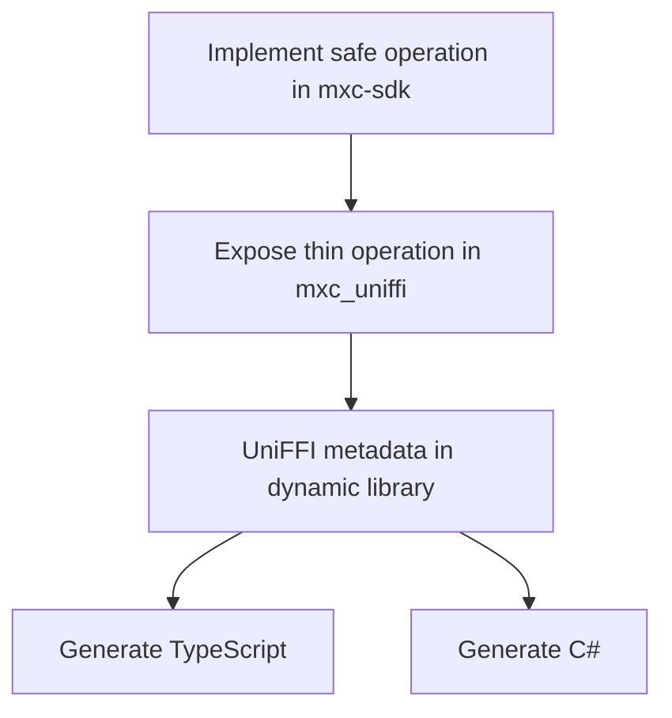

# MXC SDK unification

## Decision

Keep MXC behavior in Rust and use [UniFFI 0.31](https://github.com/mozilla/uniffi-rs) as the single projection
system for native Node and .NET SDKs.

Both foreign SDKs load the same host-compiled Rust dynamic library in-process. Node does not use WebAssembly,
a child process, a daemon, or MXC-specific C++.

## Scope

This design unifies callable operations, results, errors, async behavior, and owned handles. It does not yet replace:

- JSON request types and schema generation
- request parsing or policy validation
- `mxc_engine`
- containment backends
- the existing `mxc_ffi` ABI used by the shipping C# SDK

## Ownership

| Layer | Owns | Must not own |
|---|---|---|
| `mxc-sdk` | Safe Rust API and behavior | Language projection |
| `mxc_uniffi` | UniFFI records, objects, conversion, panic boundary | Backend selection |
| Generated TypeScript and C# | Calls, records, object lifetimes, future plumbing | MXC behavior |
| `@ubjs/node` | Generic native loading and UniFFI invocation | MXC-specific glue |
| `mxc_engine` | Backend dispatch and execution | SDK-specific behavior |

## One operation

The thin projection remains handwritten because UniFFI intentionally exports an interop-safe object model rather than
arbitrary Rust types. It only converts values, synchronizes handles, catches panics, and delegates to `mxc-sdk`.

## API naming

Use the same verbs across generated SDKs:

| Behavior | Synchronous | Asynchronous |
|---|---|---|
| Run to completion | `runSync` / `RunSync` | `run` / `Run` |
| Spawn live process | `spawnSync` / `SpawnSync` | `spawn` / `Spawn` |
| Wait | `waitSync` / `WaitSync` | `wait` / `Wait` |
| Kill | `killSync` / `KillSync` | `kill` / `Kill` |

Shipping facades may retain established names such as `Run` and `RunAsync`, but they must delegate without changing
semantics.

## Documents

1. [Rust SDK architecture](rust-sdk-architecture.md)
2. [UniFFI binding generation](uniffi-binding-generation.md)
3. [Node and .NET SDK generation](node-dotnet-sdk-generation.md)

## Prototype

The prototype is intentionally production-shaped:

- `src/ffi/mxc_uniffi` exports discovery, run, live process, streams, and state-aware operations.
- `scripts/generate-uniffi-bindings.ps1` pins both generators and regenerates both SDKs.
- `sdk/node/prototype` tests the generated TypeScript against the real Rust library.
- `sdk/dotnet/Microsoft.Mxc.Uniffi.*` tests generated C# against that same library.

Promotion requires cross-platform tests, API snapshot checks, ownership stress tests, and an upstream-risk review.
