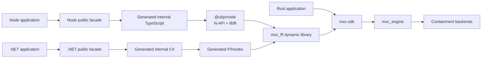
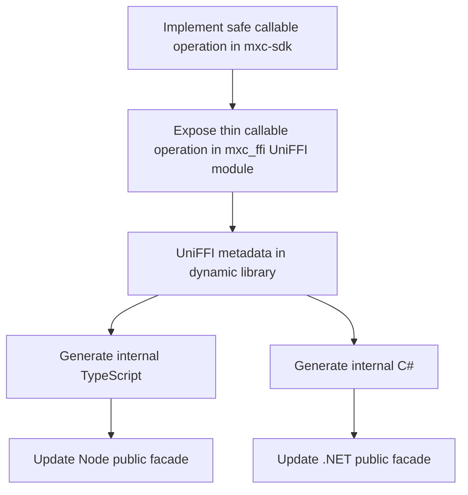

# MXC SDK unification proposal

## Proposal

Keep MXC behavior in Rust and use [UniFFI 0.31](https://github.com/mozilla/uniffi-rs) to generate the internal native
binding layers for Node and .NET. Keep small handwritten public facades for package naming and language-specific
adaptation.

Both foreign SDKs load the same host-compiled Rust dynamic library in-process.

## Scope

This proposal covers callable operations, results, errors, async behavior, and owned handles. UniFFI generates
TypeScript and C# that call native entry points exported by the Rust-built `mxc_ffi` library. It does not generate C
source, a C SDK, the complete public SDK facades, or a second dynamic library.

This proposal does not change:

- JSON request types and schema generation
- request parsing or policy validation
- `mxc-sdk`
- `mxc_engine`
- containment backends

`mxc-sdk` and `mxc_engine` already exist and remain the behavioral implementation. During implementation, current Node
SDK behavior and the existing .NET binding tests provide a comparison point for results, errors, ownership, and
lifecycle semantics. After the generated bindings match that behavior, the old Node execution path and .NET interop
implementation are removed while the public behavior remains.

## Ownership

| Layer | Responsibility | Maintained by |
|---|---|---|
| `mxc-sdk` | Existing safe Rust API and behavior | MXC |
| `mxc_ffi` UniFFI module | UniFFI-safe records/objects, conversion from `mxc-sdk` values, and panic containment | MXC |
| Generated internal TypeScript and C# | Calls, value marshalling, object lifetimes, and future plumbing | UniFFI generators |
| Node and .NET public facades | Public names, re-exports, and language adapters | MXC |
| `@ubjs/node` | Generic N-API and libffi runtime | Third-party package; no MXC addon code |
| `mxc_engine` | Existing backend dispatch and execution | MXC |

Conversion in `mxc_ffi` is mechanical mapping from `mxc-sdk` values to UniFFI-safe records and objects. It does not
parse policy or reinterpret results.

The public facades do not wrap every generated type. Stable public values keep product-owned names; Node may reuse
identical generated records structurally, .NET maps records to keep generated namespaces internal, and owned
sandbox/stream objects use wrappers. Policy and config stay typed in the public SDKs and serialize to JSON at the
binding boundary, with a raw config/JSON overload for newer schema fields. See
[Public type policy](node-dotnet-sdk-generation.md#public-type-policy).

## One callable operation

The thin projection remains handwritten because UniFFI intentionally exports an interop-safe object model rather than
arbitrary Rust types. It only converts values, synchronizes handles, catches panics, and delegates to `mxc-sdk`.

## API naming

Use the base callable operation name for synchronous functions and an `Async` suffix for asynchronous functions:

| Behavior | Rust | Node | .NET |
|---|---|---|---|
| Run to completion | `run` / `run_async` | `run` / `runAsync` | `Run` / `RunAsync` |
| Spawn live process | `spawn` / `spawn_async` | `spawn` / `spawnAsync` | `Spawn` / `SpawnAsync` |
| Wait | `wait` / `wait_async` | `wait` / `waitAsync` | `Wait` / `WaitAsync` |
| Terminate process | `terminate` / `terminate_async` | `terminate` / `terminateAsync` | `Terminate` / `TerminateAsync` |

Public facades preserve these names and delegate without changing semantics.

## Authoring impact

| Change | Handwritten locations after adoption |
|---|---|
| Backend behavior | Backend plus `mxc_engine` integration |
| Callable SDK operation | `mxc-sdk`, one UniFFI export, and thin Node/.NET public facade methods |
| Result or error field | Rust projection record plus any public facade mapping; regenerate Node and C# |
| Policy or schema field | Existing typed public models and JSON serialization; unchanged by this proposal |

## Versioning and changelogs

All three SDK versions remain synchronized. Each published SDK keeps its own ecosystem-facing changelog so Rust, Node,
and .NET consumers can see the changes relevant to their package. A shared behavior change uses the same release
summary in each affected changelog; facade or packaging changes appear only in the affected SDK's changelog.

## Implementation and replacement requirements

Implementation can proceed while these items are addressed. A blocker applies only to the capability or target named
in the table.

| Work item | Classification | Effect |
|---|---|---|
| Bounded async scheduling | Blocker for production async APIs | The prototype creates one Rust thread per async call; use a bounded worker pool |
| Interruptible stream reads and disposal | Blocker for live streaming | A blocked read must not prevent shutdown |
| Process termination during a pending wait | Blocker for live process control | `terminate` must work while `waitAsync` is pending |
| Package and test each platform's native library | Required before that platform ships | Do not ship an untested native package |
| Public API and generated-contract checks in CI | Release safeguard | Does not block implementation; add before removing the old path |
| Typed state-aware facade methods | Follow-up | The JSON state-aware path remains usable |
| Schema-derived Node/.NET policy models | Out of scope | Existing manual model maintenance is unchanged |

## Documents

1. [Rust SDK architecture](rust-sdk-architecture.md)
2. [UniFFI binding generation](uniffi-binding-generation.md)
3. [Node and .NET SDK generation](node-dotnet-sdk-generation.md)

## Prototype

The prototype is intentionally production-shaped:

- `src/ffi/mxc_ffi` exports UniFFI discovery, run, live process, stream, and state-aware callable operations.
- `scripts/generate-uniffi-bindings.ps1` pins both generators and regenerates both SDKs.
- `sdk/node/prototype` tests the generated TypeScript against the real Rust library.
- `sdk/dotnet/Microsoft.Mxc.Uniffi.*` tests generated C# against that same library.
