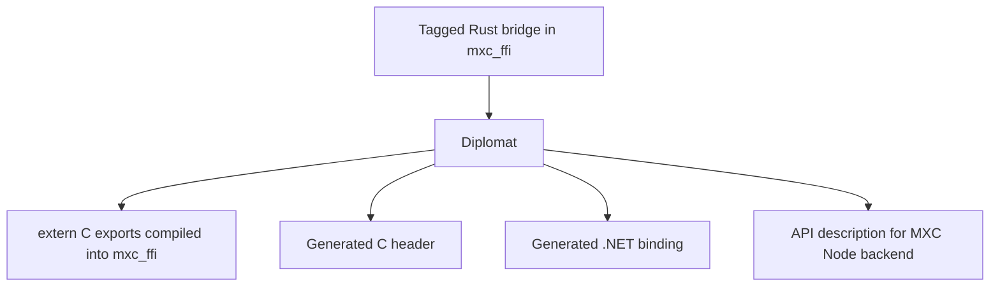
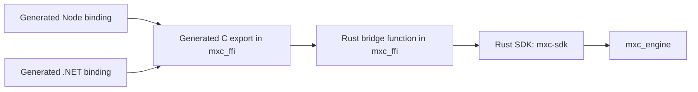
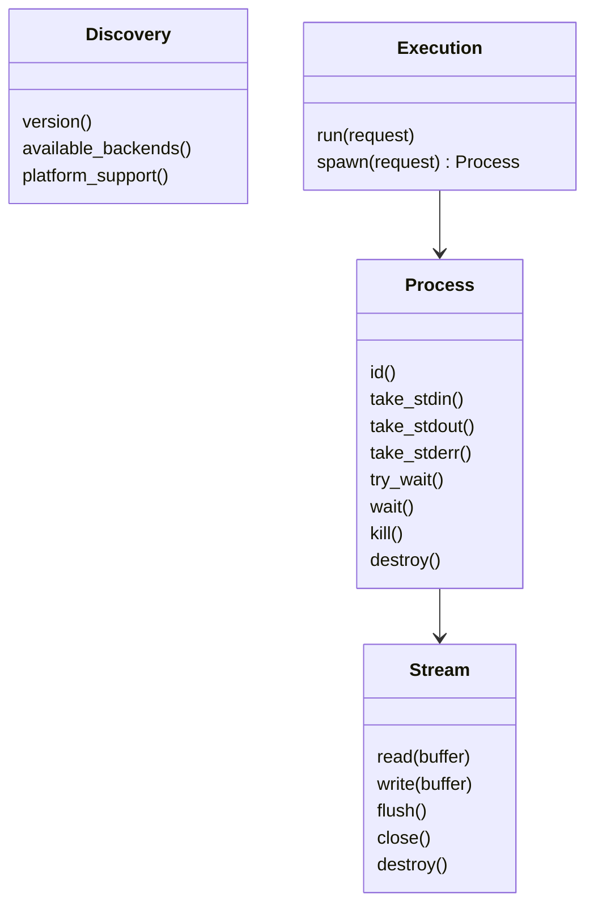
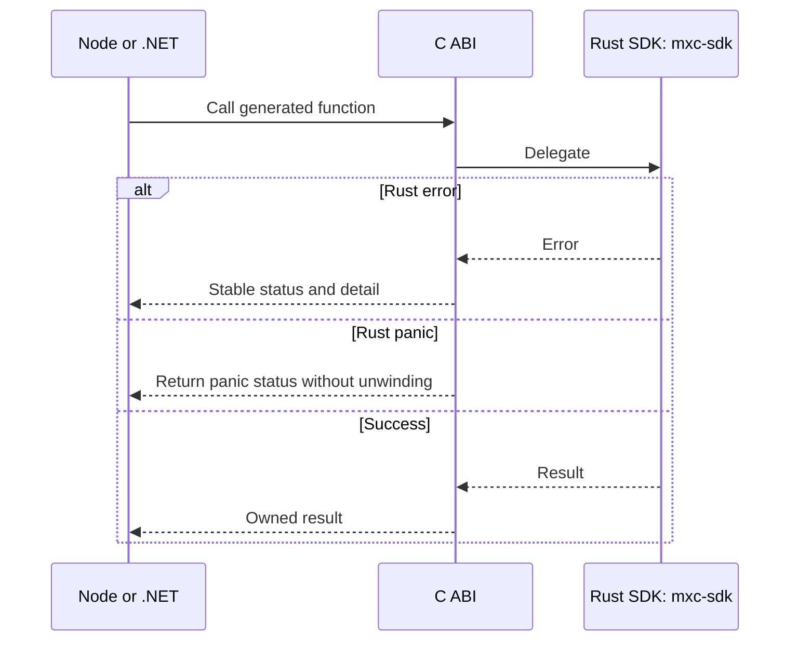

# Diplomat and C FFI generation

## Decision

Use [Diplomat](https://github.com/rust-diplomat/diplomat) to generate the C ABI inside `mxc_ffi`.

### Generation time

### Runtime

The Rust bridge and generated C exports live in `mxc_ffi`. There is no separately maintained C library.

## What Diplomat generates

| Input | Generated output |
|---|---|
| Rust function | `extern "C"` trampoline |
| Rust struct or enum | C-compatible representation |
| `Result<T, E>` | FFI result representation |
| Opaque Rust object | Pointer handle and destructor |
| Method on an opaque object | C function taking its handle |
| Rust documentation | Binding documentation |

Diplomat also generates .NET bindings. See its
[.NET backend](https://rust-diplomat.github.io/diplomat/backends/dotnet.html).

## ABI surface

State-aware calls are a second group: provision, start, exec, stop, deprovision, or exec on the caller's terminal.

## Generated versus handwritten

| Generated by Diplomat | Handwritten in `mxc_ffi` only if generation cannot express it |
|---|---|
| C entry points and headers | Compatibility checks between native and SDK package versions |
| Opaque handles and destructors | Locking required for concurrent wait, kill, and destroy |
| Basic argument/result conversion | Buffer loop used by stream read and write |
| C# raw declarations and safe wrappers | Read interruption through `StreamCloser` |
| Stable names and ABI rename rules | Attached-terminal operation |

The handwritten column is a fixed primitive set. Adding `platform_support`-style operations cannot add to it.

## Panic and error path

## Migration

1. Add a namespaced generated ABI beside the current ABI.
2. Pilot `version`, `available_backends`, and `platform_support`.
3. Compare symbols, results, errors, allocations, and panic behavior.
4. Switch `run` after discovery passes on Windows, Linux, and macOS.
5. Switch `Process` and `Stream` only after concurrency and cancellation tests pass.
6. Switch provision, start, exec, stop, deprovision, and terminal-attached exec last.
7. Remove old exports only after no SDK references them.

Use [ABI rename](https://rust-diplomat.github.io/diplomat/abi.html) when a new signature must coexist with an old one.

## Exit criteria

- Node and .NET load the same `mxc_ffi` native library.
- New value-returning calls need no handwritten C export or P/Invoke declaration.
- Every generated export delegates to `mxc-sdk`.
- Exported symbols are recorded and diffed in CI.
- Existing handle behavior remains until the generated replacement passes race and cancellation tests.
