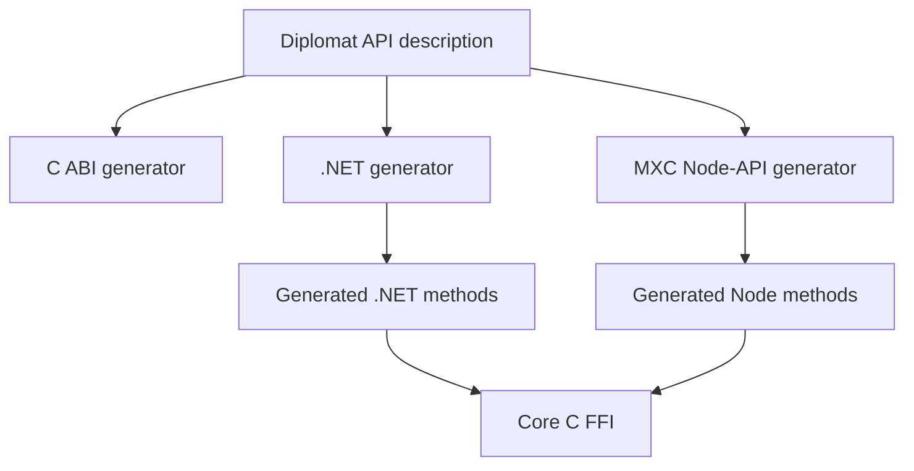
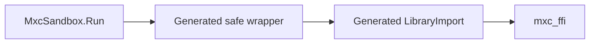
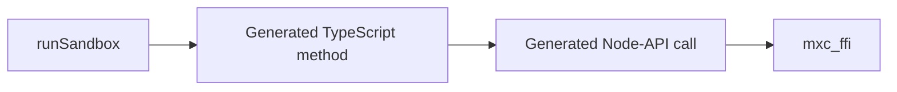
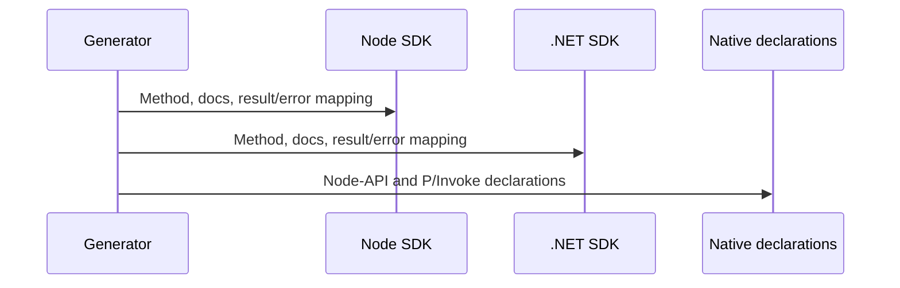
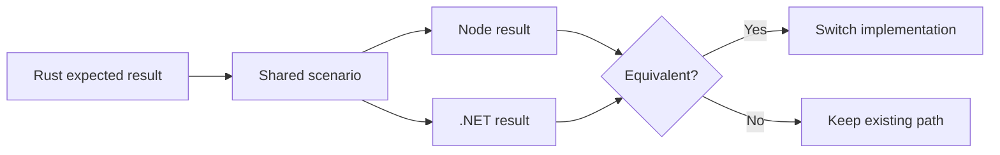

# Node and .NET SDK generation

## Decision

Generate public foreign SDK functions from the same Diplomat API description that generates the C ABI.
Each operation has a synchronous native call. Node and .NET add asynchronous wrappers that schedule that call off the
caller thread.



Existing request classes and JSON serialization stay in place. This phase generates callable functions.
## .NET output

Diplomat's .NET backend generates a raw `[LibraryImport]` layer and safe managed classes.



Keep the existing public class names as compatibility facades while switching their internals one family at a time.
## Node output

Diplomat's JavaScript backend targets WebAssembly, so MXC needs a native
[Node-API](https://nodejs.org/api/n-api.html) generator.



The production design is a [Diplomat backend](https://rust-diplomat.github.io/diplomat/developer.html)
or a Rust-emitted manifest consumed by both Node and .NET. The current Node
prototype is a temporary header-driven generator: it validates the generated C
headers but still carries Node-specific public-name and argument/result mapping
inside the generator. It is not yet the shared source of truth.
## Exact ownership

| Generated per operation | Handwritten once per SDK |
|---|---|
| Public sync and async names and parameters | Native library discovery and loading |
| Return and error conversion | Worker scheduling for blocking native calls |
| Documentation | `AbortSignal` or `CancellationToken` coordination |
| C symbol selection | Node `Readable`/`Writable` over native byte calls |
| P/Invoke or Node-API declaration | .NET `Stream` over native byte calls |
| Async method shell | Attached-terminal input, output, resize, and signals |

The handwritten support library cannot contain an operation list or operation-specific parameter mapping.
## API names

Maintain one manifest emitted from the Diplomat API description. A name may
differ only for the target language's casing and async convention. A
header-driven prototype must not be treated as that manifest, even if it
validates generated C symbols.

| Operation | Rust SDK | Node generated API | .NET generated API |
|---|---|---|---|
| Run to completion | `run` | `runSandboxSync`, `runSandbox` | `Run`, `RunAsync` |
| Spawn live process | `spawn_sandbox` | `spawnSandbox` | `Spawn` |
| Wait for process | `Sandbox::wait` | `waitSync`, `wait` | `Wait`, `WaitAsync` |
| Kill process | `Sandbox::kill` | `kill` | `Kill` |

Only operations that can materially block receive an async pair. The synchronous method calls the C ABI directly. The
async method schedules that same call; it does not call a separate native function.

The Node prototype currently implements this scheduling with
`napi_async_work`, which uses libuv's shared worker pool. That is sufficient
for API-shape validation but is not a production execution scheduler:
long-running MXC calls can starve unrelated libuv native work. Production must
provide dedicated execution scheduling.

Current Node `spawnSandboxAsync` means run to completion, while `spawnSandbox` returns a live process. Keep
`spawnSandboxAsync` as a deprecated compatibility facade over `runSandbox`. Do not carry that semantic mismatch into
the generated API.

Rust remains synchronous and runtime-neutral. A Rust async adapter belongs in a separate runtime integration because
the core SDK cannot choose Tokio, async-std, or another executor for its callers.

## What the operation generator emits



For the canonical `run` operation, the output is:

```text
Rust:  run(request) -> Result<Output, Error>
C ABI: mxc_run(request) -> status + output handle
Node:  runSandboxSync(request) -> RunResult
       runSandbox(request) -> Promise<RunResult>
.NET:  Run(request) -> RunResult
       RunAsync(request) -> Task<RunResult>
```

The current request objects serialize before the native call. Type/schema generation is outside this design.
## Concrete migration slices

1. `NativeVersion`, available backends, and platform support.
2. Run one command and return buffered stdout, stderr, exit code, timeout, warnings, and metadata.
3. Spawn a live process without attaching it to a terminal.
4. Read stdout/stderr, write stdin, poll, wait, kill, close, and dispose.
5. Provision, start, stop, and deprovision the same state-aware sandbox across calls.
6. Execute in that sandbox and return a live process.
7. Execute attached to a terminal with input, output, resize, signals, and cancellation.

## Required tests for each slice



## Exit criteria

- Node and .NET expose the same operation inventory.
- Every blocking operation has a sync API and an async wrapper where the language supports one.
- API names are emitted from the canonical operation catalog.
- Regeneration adds each value-returning operation to both SDKs.
- No generated file is manually edited.
- Operation-specific serialization and error mapping are not duplicated in handwritten code.
- The executable and `node-pty` path remains until attached-terminal parity is demonstrated.
