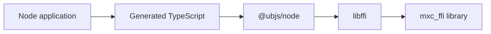
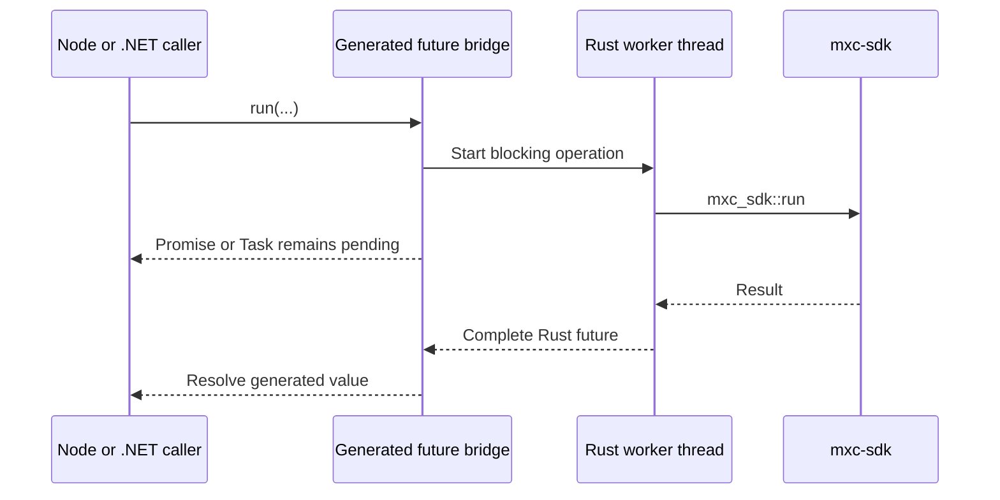

# Node and .NET SDK generation

## Decision

Generate both foreign binding layers from the UniFFI metadata in `mxc_ffi`. Keep thin public facades for stable,
idiomatic APIs; the generated surface remains internal.

## Node

[`uniffi-bindgen-react-native` Node support][node] generates TypeScript that describes the UniFFI symbols and value
conversions. The generic `@ubjs/node` N-API addon opens `mxc_ffi` and calls it through libffi.

There is no MXC-specific addon, C++, subprocess, daemon, RPC path, or WebAssembly module.

[node]: https://jhugman.github.io/uniffi-bindgen-react-native/reference/nodejs.html

The prototype bundles generated TypeScript because upstream currently emits extensionless internal imports while MXC
targets ESM. This is packaging, not an operation-specific adapter.

## .NET

[`uniffi-bindgen-cs`](https://github.com/NordSecurity/uniffi-bindgen-cs) generates records, owned objects, async Task
plumbing, disposal, checksums, and P/Invoke from the same library metadata.

The public facade exposes the established `Run` and `RunAsync` names over internal generated `RunSync` and `Run`.

## API alignment

| Concept | Node public | .NET public | Rust canonical |
|---|---|---|---|
| Version | `version()` | `Version()` | package version |
| Discovery | `discover()` | `Discover()` | discovery functions |
| Run sync | `runSync()` | `Run()` | `run()` |
| Run async | `run()` | `RunAsync()` | worker calling `run()` |
| Spawn sync | `spawnSync()` | `Spawn()` | `spawn_sandbox()` |
| Spawn async | `spawn()` | `SpawnAsync()` | worker calling `spawn_sandbox()` |
| Poll | `tryWait()` | `TryWait()` | `Sandbox::try_wait()` |
| Wait sync | `waitSync()` | `Wait()` | `Sandbox::wait()` |
| Wait async | `wait()` | `WaitAsync()` | worker calling `Sandbox::wait()` |
| Kill sync | `killSync()` | `Kill()` | `Sandbox::kill()` |
| Kill async | `kill()` | `KillAsync()` | worker calling `Sandbox::kill()` |

Generated names are internal implementation details. Node marks blocking operations with `Sync`; .NET marks asynchronous
operations with `Async`. State-aware envelope execution, streaming exec, and attached exec follow the same convention.

## True async behavior

UniFFI's TypeScript `forceAsync` option is not used. It changes a signature but does not make blocking Rust work async.

## Ownership

| Value | Ownership rule |
|---|---|
| Sandbox | Generated object owns an `Arc` to a synchronized Rust `Sandbox` |
| stdin | May be taken once; dropping or disposing closes the writer |
| stdout/stderr | Each may be taken once; reads return owned byte buffers |
| Error | Generated thrown object owns an `Arc<BindingError>` |
| Result records | Copied into language-native values |

Generated finalizers prevent leaks after abandoned objects. Callers should still dispose objects deterministically.

## Cancellation

Generated async calls can cancel future polling, but cancellation cannot safely imply process termination. MXC should
only advertise kill-on-cancel after `mxc-sdk` provides cancellation independent of the lock held by `wait`.

## Conformance scenarios

Both prototypes run against the real library and verify:

1. version and host discovery
2. structured malformed-request errors
3. synchronous and asynchronous run-to-completion
4. state-aware and attached-exec error paths
5. live process ownership
6. take-once stdin, stdout, and stderr
7. stream read, write, and flush
8. prompt busy errors during concurrent handle use

## Promotion gates

- Run generated SDK scenarios on Windows, Linux, and macOS where supported.
- Stress futures, finalizers, worker threads, streams, and process teardown.
- Snapshot generated public APIs and exported ABI symbols.
- Package one native library per target without changing generated operation code.
- Remove the legacy C exports after the generated .NET facade reaches parity.
- Keep the current SDK paths until behavioral and performance parity is proven.
