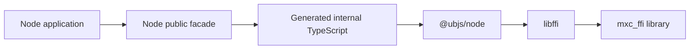
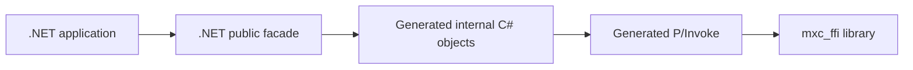
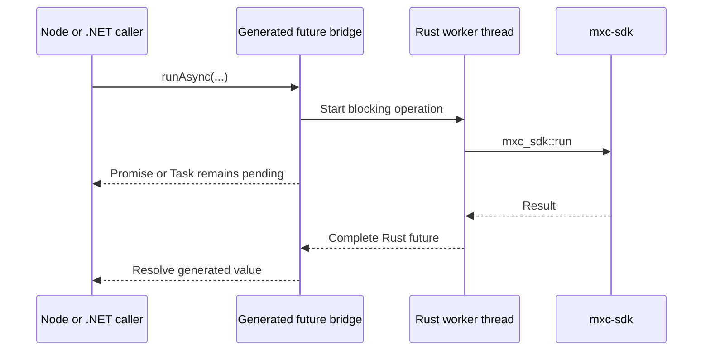

# Node and .NET SDK generation

## Decision

Generate both foreign binding layers from the UniFFI metadata in `mxc_ffi`. Keep thin public facades for stable,
idiomatic APIs; the generated surface remains internal.

## Generated and handwritten surfaces

| Surface | Generated | Handwritten |
|---|---:|---|
| Rust public SDK | No | `mxc-sdk` behavior and safe API |
| Rust projection | No | Thin UniFFI exports and safe value conversion in `mxc_ffi` |
| Node internal binding | Yes | None per generated operation |
| .NET internal binding | Yes | None per generated operation |
| Node public SDK | No | Names, re-exports, and stream adapters |
| .NET public SDK | No | Names, re-exports, and .NET-specific adapters |
| Node/.NET policy models | Not yet | Handwritten until schema-derived generation is implemented |

Adding a public operation therefore changes Rust behavior, one Rust UniFFI export, and normally one forwarding method
in each public foreign facade. UniFFI generates the foreign calls, records, object plumbing, and async bridge.

## Node

[`uniffi-bindgen-react-native` Node support][node] generates TypeScript that describes the UniFFI symbols and value
conversions. The generic `@ubjs/node` N-API addon opens `mxc_ffi` and calls it through libffi.

There is no MXC-specific addon, C++, subprocess, daemon, RPC path, or WebAssembly module.

[node]: https://jhugman.github.io/uniffi-bindgen-react-native/reference/nodejs.html

The generated TypeScript is bundled because upstream currently emits extensionless internal imports while MXC targets
ESM. This is packaging, not an operation-specific adapter.

## .NET

[`uniffi-bindgen-cs`](https://github.com/NordSecurity/uniffi-bindgen-cs) generates records, owned objects, async Task
plumbing, disposal, checksums, and P/Invoke from the same library metadata.

The public facade exposes `Run` and `RunAsync`, matching the generated operation names.

## Projected surface

| Family | Generated internal surface |
|---|---|
| Discovery | Version and platform-support functions and records |
| Run to completion | Sync/async operations, result record, and structured error |
| Live process | Sandbox object, take-once streams, poll, wait, and process termination |
| State-aware lifecycle | Provision, start, exec, stop, and deprovision operations |

The public Node and .NET facades rename these internal generated types where needed but do not reimplement their
behavior.

## API alignment

| Concept | Node public | .NET public | Rust API |
|---|---|---|---|
| Version | `version()` | `Version()` | package version |
| Discovery | `discover()` | `Discover()` | discovery functions |
| Run sync | `run()` | `Run()` | `run()` |
| Run async | `runAsync()` | `RunAsync()` | worker calling `run()` |
| Spawn sync | `spawn()` | `Spawn()` | `spawn_sandbox()` |
| Spawn async | `spawnAsync()` | `SpawnAsync()` | worker calling `spawn_sandbox()` |
| Poll | `tryWait()` | `TryWait()` | `Sandbox::try_wait()` |
| Wait sync | `wait()` | `Wait()` | `Sandbox::wait()` |
| Wait async | `waitAsync()` | `WaitAsync()` | worker calling `Sandbox::wait()` |
| Terminate sync | `kill()` | `Kill()` | `Sandbox::kill()` |
| Terminate async | `killAsync()` | `KillAsync()` | worker calling `Sandbox::kill()` |

State-aware envelope execution, streaming exec, and attached exec follow the same base-name/`Async` convention.

## Namespaces

| Surface | Public namespace | Internal generated code |
|---|---|---|
| Rust | `mxc_sdk` | `mxc_ffi` is not a Rust consumer API |
| Node | `@microsoft/mxc-sdk` | Package-private `internal/generated` modules |
| .NET | `Microsoft.Mxc.Sdk` | `Microsoft.Mxc.Sdk.Interop`, not publicly documented |

UniFFI and generator names such as `BindingSandbox`, `MxcNative`, and `uniffiDestroy` must not appear in the public
SDK. Public types use product terms such as `MxcSandbox`, `SandboxProcess`, `RunResult`, and `MxcError`.

## API compatibility

The generated projection is internal and ships with the matching `mxc_ffi` library. Mixing generated bindings and a
native library from different package versions is unsupported; UniFFI contract checks must reject a mismatch.

A generated-code change is not a public breaking change when the public facade preserves its existing names, types,
and behavior. Regeneration and any required facade adaptation happen in the same change. If the public facade must
break, prefer a compatibility overload or deprecation period. An unavoidable break requires:

1. the next synchronized SemVer breaking release in Rust, Node, and .NET (minor while 0.x, major after 1.0)
2. matching entries in each affected SDK changelog
3. migration instructions and updated public API snapshots
4. one coordinated release so all SDKs describe the same Rust behavior

CI snapshots the public facades separately from the internal generated/native contract. Generated diffs remain
reviewable, but internal generator names are not treated as supported public API.

## Node runtime ownership

| Component | Produced by | MXC-specific handwritten code |
|---|---|---:|
| Function/type converters and symbol metadata | UniFFI Node generator | None |
| N-API addon and libffi dispatch | Third-party `@ubjs/node` package | None |
| Native library staging and package wiring | MXC | Generation script and Node package manifest |
| Public facade and Node stream adapters | MXC | TypeScript facade and stream adapters |

## True async behavior

## Ownership

| Value | Ownership rule |
|---|---|
| Sandbox | Generated object owns an `Arc` to a synchronized Rust `Sandbox` |
| stdin | May be taken once; dropping or disposing closes the writer |
| stdout/stderr | Each may be taken once; reads return owned byte buffers |
| Error | Generated thrown object owns an `Arc<BindingError>` |
| Result records | Copied into language-native values |

Generated finalizers prevent leaks after abandoned objects. Callers should still dispose objects deterministically.

## Behavior covered by tests

Node and .NET tests run against the real library and verify:

1. version and host discovery
2. structured malformed-request errors
3. synchronous and asynchronous run-to-completion
4. state-aware and attached-exec error paths
5. live process ownership
6. take-once stdin, stdout, and stderr
7. stream read, write, and flush
8. `kill` terminates the process while `waitAsync` is pending, plus defined behavior for conflicting stream operations

## Before switching Node and .NET to the generated bindings

- Run generated SDK scenarios on Windows, Linux, and macOS where supported.
- Repeatedly create, use, cancel, and dispose async calls, streams, and processes without leaks or deadlocks.
- Make CI identify changes to public facades and the generated/native contract.
- Package one native library per target without changing generated operation code.
- Confirm generated calls return the same results, errors, streams, and process behavior as the Rust SDK.
- Remove the previous interop generation path.
