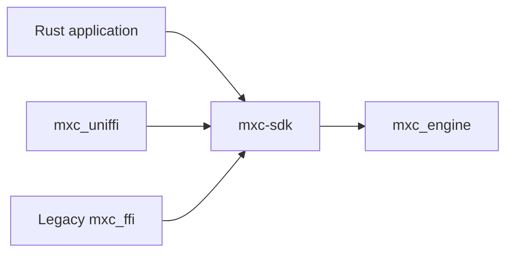
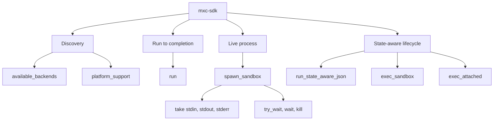
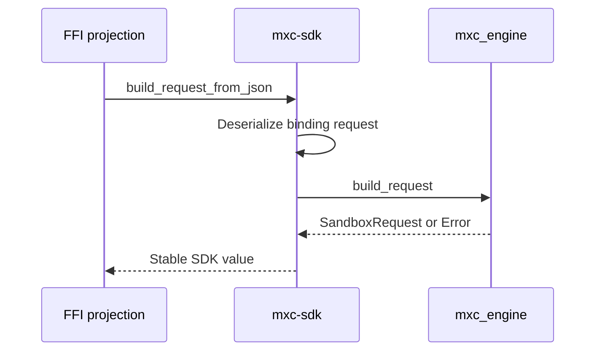

# Rust SDK architecture

## Decision

Keep [`mxc-sdk`](../../../src/core/mxc-sdk/src/lib.rs) as the only safe callable layer above
[`mxc_engine`](../../../src/core/mxc_engine/src/lib.rs).



Rust callers never route through an FFI layer. Foreign projection crates translate and immediately delegate to
`mxc-sdk`.

## Responsibilities

| `mxc-sdk` owns | `mxc_engine` owns |
|---|---|
| Public run, spawn, and state-aware functions | Backend selection |
| Safe request, result, and error types | Backend construction |
| `Sandbox`, live streams, wait, poll, and kill | Platform execution |
| Stable SDK errors | Backend-specific errors and probes |
| Request JSON conversion shared by FFI projections | Containment implementation |

## Operation families



## Request parsing

The co-versioned binding request parser lives in `mxc-sdk`, not in either FFI crate:



This removes parser duplication between `mxc_ffi` and `mxc_uniffi`. It does not redesign the public schema.

## Projection rule

`mxc_uniffi` may:

- map safe SDK values to UniFFI records and objects
- retain `Sandbox` and stream ownership behind synchronized objects
- move blocking SDK calls to dedicated worker threads for exported async functions
- convert `mxc_sdk::Error` to a structured projected error
- contain panics before they cross the generated ABI

It may not validate policy, select a backend, reinterpret results, or maintain another operation implementation.

## Synchronous and asynchronous behavior

`mxc-sdk` remains synchronous where the engine is synchronous. `mxc_uniffi` exports:

```text
run_sync(request) -> RunResult
async run(request) -> RunResult
```

The async function starts work on a dedicated Rust thread and resolves a Rust future. It does not merely relabel a
blocking call as async, and it does not depend on the embedding runtime's thread pool.

## Live object behavior

- A `Sandbox` owns one native process handle.
- stdin, stdout, and stderr are take-once owned objects.
- operations use `try_lock`, so concurrent access returns a typed busy error instead of blocking a runtime thread.
- `kill` cannot interrupt a concurrent `wait` until `mxc-sdk` exposes independent cancellation.
- generated object finalizers are a safety net; deterministic disposal remains recommended.

## Exit criteria

- Every projected operation immediately delegates to `mxc-sdk`.
- Rust behavior tests define the canonical result.
- The old and new FFI crates share request conversion rather than copying it.
- Rust callers retain direct typed APIs.
- No backend dependency is introduced into `mxc_uniffi`.
