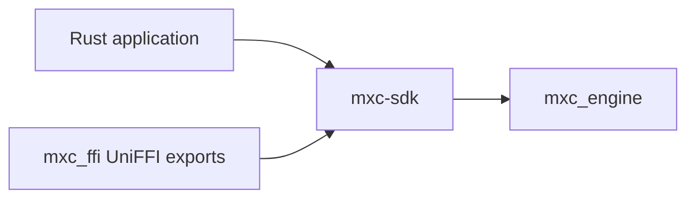
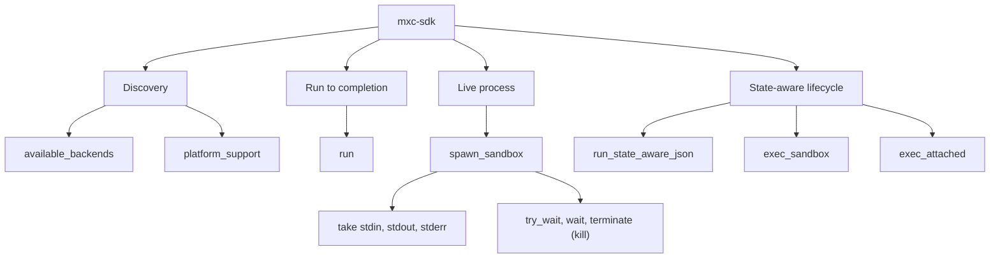
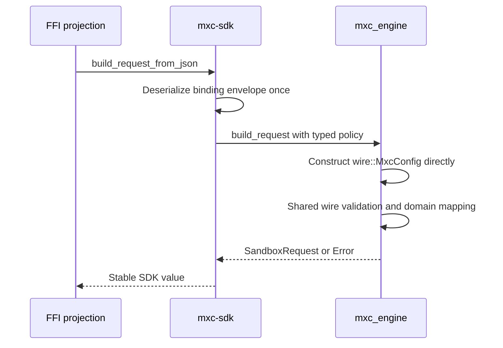

# Rust SDK architecture

## Proposal

Keep the existing [`mxc-sdk`](../../../src/core/mxc-sdk/src/lib.rs) as the only safe callable layer above the existing
[`mxc_engine`](../../../src/core/mxc_engine/src/lib.rs).



Rust callers never route through an FFI layer. Foreign bindings immediately delegate to `mxc-sdk`.

## Responsibilities

| `mxc-sdk` owns | `mxc_engine` owns |
|---|---|
| Public run, spawn, and state-aware functions | Backend selection |
| Safe request, result, and error types | Backend construction |
| `Sandbox`, live streams, wait, poll, and process termination | Platform execution |
| Stable SDK errors | Backend-specific errors and probes |
| Binding request-envelope parsing | Typed policy-to-wire construction |
| Foreign-facing request conversion | Wire validation, domain mapping, and containment implementation |

## Rust workspace consolidation

Keep a crate when one of the rules below applies. Otherwise, prefer a private module in its only consumer.

| Boundary | Direction |
|---|---|
| `mxc-sdk` | Keep as the small public Rust facade |
| `mxc_ffi` | Keep as the generated dynamic-library boundary |
| `wxc_common` (rename to `mxc_common`) | Keep as the backend-independent foundation that backend code may depend on |
| `mxc_engine` | Keep as the dispatch layer that depends on backend implementations |
| Binaries, daemons, guests, and host tools | Keep as crates because Cargo builds them as separate artifacts |
| Shared protocols and code-generation contracts | Keep when multiple artifacts consume them or they require isolated generation |
| One-consumer backend adapters and helpers | Prefer private modules in their consumer |

Do not merge boundaries when that would create a dependency cycle or make backend-independent code depend on a
backend. Preserve platform feature gating and test selection; package count alone is not a success metric.

## Operation families



## Request parsing

The co-versioned binding request parser lives in `mxc-sdk`, not in either FFI crate:



This keeps request construction in Rust rather than the projection. The SDK-to-engine handoff never serializes policy
to JSON and reparses it. JSON remains only at actual external configuration and foreign-language boundaries, where
path-aware deserialization is required. Both paths converge on the same typed wire validation and domain mapping.

## Projection rule

The UniFFI module in `mxc_ffi` may:

- map safe SDK values to UniFFI records and objects
- retain `Sandbox` and stream ownership behind synchronized objects
- move blocking SDK calls to dedicated worker threads for exported async functions
- convert `mxc_sdk::Error` to a structured projected error
- contain panics before they cross the generated ABI

It may not validate policy, select a backend, reinterpret results, or maintain another operation implementation.

## Synchronous and asynchronous behavior

`mxc-sdk` remains synchronous where the engine is synchronous. `mxc_ffi` exports an internal UniFFI pair:

```text
run(request) -> RunResult
async run_async(request) -> RunResult
```

The async function starts work on a dedicated Rust thread and resolves a Rust future. It does not merely relabel a
blocking call as async, and it does not depend on the embedding runtime's thread pool.

## Live object behavior

- A `Sandbox` owns one native process handle.
- stdin, stdout, and stderr are take-once owned objects.
- generated object finalizers are a safety net; deterministic disposal remains recommended.

### Concurrency limitation to resolve

The initial `mxc_ffi` wrapper places each sandbox and stream behind a Rust `Mutex`. MXC's `lock_handle` helper uses
`try_lock`; UniFFI, Node, .NET, and `mxc-sdk` do not provide this behavior. A conflicting operation therefore returns a
typed busy error instead of blocking the foreign runtime thread.

This is a current limitation, not the intended public contract. `wait` holds the sandbox mutex until the process exits,
so `kill` cannot acquire it to terminate the process. Before adoption, `mxc-sdk` must expose independently synchronized
wait and termination operations, and Node/.NET tests must prove that `kill` works while `waitAsync` is pending.

## Rules the implementation must preserve

- Every projected operation immediately delegates to `mxc-sdk`.
- Rust behavior tests define the expected result.
- Rust callers retain direct typed APIs.
- No backend dependency is introduced into `mxc_ffi`.
