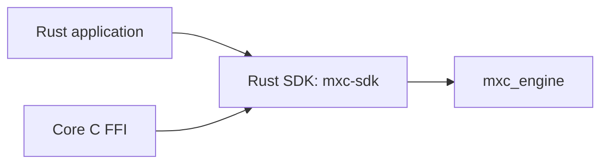
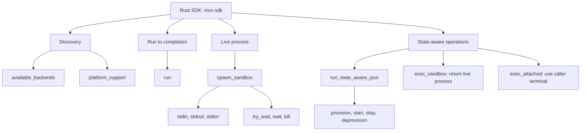
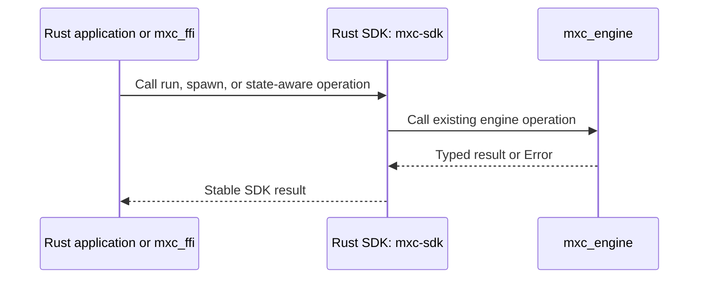

# Rust SDK (`mxc-sdk`) architecture

## Decision

Keep the [`mxc-sdk`](../../../src/core/mxc-sdk/src/lib.rs) crate as the only safe callable layer above
[`mxc_engine`](../../../src/core/mxc_engine/src/lib.rs).



Do not add another dispatcher crate. Do not route Rust through C.

## Responsibilities

| Rust SDK (`mxc-sdk`) owns | `mxc_engine` owns |
|---|---|
| Public `run`, `spawn_sandbox`, and state-aware functions | Backend selection |
| Safe request, result, and error types | Backend construction |
| `Sandbox`: the live process object returned by `spawn_sandbox` | Platform execution |
| Taking stdin/stdout/stderr and calling try-wait, wait, or kill | Process implementation |
| Stable SDK errors | Backend-specific errors and probes |
| Safe functions called by Rust applications and `mxc_ffi` | Containment implementation |

## Existing operation families



## Terms

| Term | Meaning |
|---|---|
| `Sandbox` | Rust live process object returned by `spawn_sandbox` or `exec_sandbox` |
| `Output` | Result from `run`: exit outcome, buffered stdout/stderr, warnings, and metadata |
| Run to completion | Wait internally and return exit status plus buffered stdout and stderr |
| Try-wait | Check whether the process exited without blocking |
| Wait | Block until the process exits or reaches its configured timeout |
| Kill | Request termination of the running process |
| State-aware | Provision, start, exec, stop, and deprovision the same sandbox across calls |
| `exec_attached` | Run state-aware `exec` on the caller's terminal and return its exit outcome |

## Runtime call path



## Per-operation handwritten work

An MXC API developer implements one safe Rust function in `mxc-sdk`. That function contains the product behavior.

## Work required before foreign SDK generation

1. Inventory every Rust, FFI, Node, and .NET operation.
2. Add behavior tests at the `mxc-sdk` boundary.
3. Move request construction out of FFI functions when an equivalent safe helper is missing.
4. Move result normalization out of foreign SDKs when it represents MXC behavior.
5. Leave pointer checks, allocation, panic handling, and status conversion in `mxc_ffi`.

## Export declaration

Diplomat reads tagged bridge modules, not arbitrary crate APIs. Add a separate bridge in `mxc_ffi` that delegates:

```rust
#[diplomat::bridge]
mod ffi_api {
    pub fn run(request: FfiRequest) -> Result<Box<FfiOutput>, FfiError> {
        convert(mxc_sdk::run(convert(request)?))
    }
}
```

This is illustrative. The body may only convert FFI representations and delegate to `mxc-sdk`.
It must not select a backend or reimplement an SDK operation.

## Handwritten versus generated

| Handwritten | Generated |
|---|---|
| Safe `mxc-sdk` implementation | Nothing inside this layer |
| Thin Diplomat bridge declaration | C ABI and foreign SDK output in later layers |
| Rust behavior tests | Foreign conformance test scaffolding |

Generating the bridge from annotated Rust functions can be considered after the initial API pattern is stable.

## Exit criteria

- Every FFI operation immediately delegates to a safe `mxc-sdk` operation.
- No FFI function contains backend selection or product policy decisions.
- Existing Rust callers keep their direct, typed API.
- Rust behavior tests define the expected result before a foreign binding is switched.
