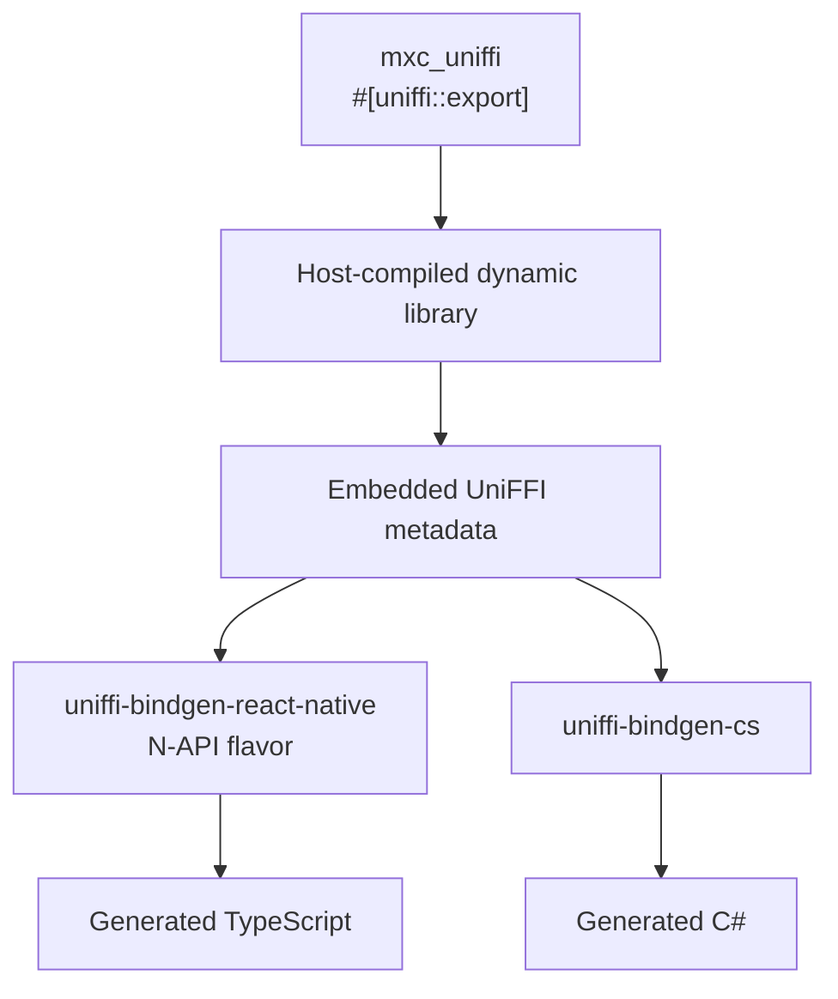
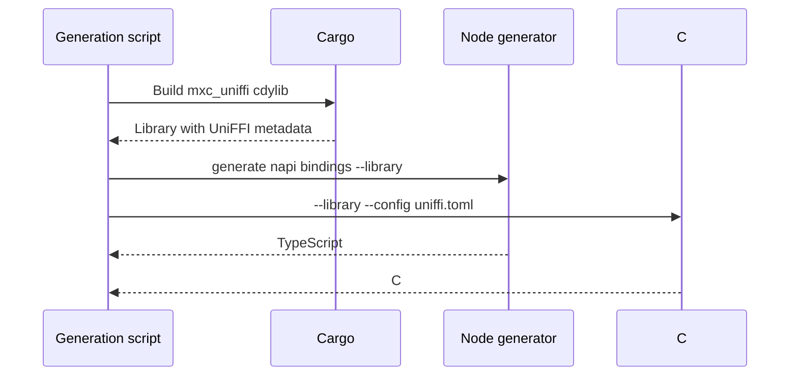
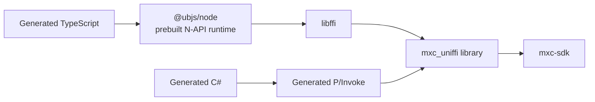

# UniFFI binding generation

## Decision

Use one [UniFFI](https://github.com/mozilla/uniffi-rs) object model to generate native Node and .NET bindings.



The generated ABI is compiled into `mxc_uniffi`. It is not a separately maintained C library and does not wrap the
legacy flat `mxc_ffi` ABI.

## Pinned toolchain

| Component | Prototype version | Purpose |
|---|---:|---|
| `uniffi` | 0.31.0 | Rust exports, metadata, scaffolding |
| `uniffi-bindgen-react-native` | 0.31.0-5 | TypeScript for native Node N-API |
| `@ubjs/node` and `@ubjs/core` | 0.31.0-5 | Generic Node native runtime |
| `uniffi-bindgen-cs` | 0.11.0 + UniFFI 0.31.0 | Generated C# and P/Invoke |

The generation script installs pinned generators under `src/target/uniffi-tools`; no global install is required.

## Generation

```powershell
scripts\generate-uniffi-bindings.ps1
```



Generated files must not be manually edited.

## Export model

| Rust projection | Generated shape |
|---|---|
| `#[derive(uniffi::Record)]` | TypeScript type and C# record |
| `#[derive(uniffi::Object)]` | Reference-counted foreign object |
| `Result<T, Arc<BindingError>>` | Thrown structured object |
| `async fn` | Promise or Task backed by a Rust future |
| `Vec<u8>` | ArrayBuffer or byte array |
| `Option<T>` | Optional or nullable value |

The object model covers discovery, run results, live sandboxes, owned streams, wait results, and state-aware calls.

## Runtime call paths



Node is native and in-process. WebAssembly is not involved.

## What remains handwritten

| Once per projection crate | Generated per operation |
|---|---|
| Safe value conversion | ABI symbol and checksum |
| Panic containment | TypeScript and C# function |
| Worker-thread adapter for blocking SDK calls | Future polling and completion |
| Handle synchronization | Record and object conversion |
| Stream chunking | Object clone and destructor plumbing |

No C, C++, Node-API addon, P/Invoke declaration, or operation registry is handwritten by MXC.

## Error boundary

`BindingError` is a UniFFI object with stable getters for code, message, operation, native code, and remediation.
Both generators throw the same object model. This avoids duplicating the closed MXC error-code enum in each projection.

Panics are caught before returning to UniFFI. A panic becomes a structured `panic` failure; it never unwinds into Node
or the CLR.

## Known generator risks

- Native Node support is new and has no end-to-end build command.
- `@ubjs/node` 0.31.0-5 omits `FfiType` and `resolveLibPath` from its declarations although JavaScript exports them.
- The prototype carries a temporary ambient type shim; remove it when upstream publishes complete declarations.
- Node library mode currently rejects `--config`, so Node naming customization is limited.
- Generator and runtime versions must move together and require ownership, worker, and leak stress tests.

## Exit criteria

- One Rust export model generates both foreign SDKs.
- Both SDKs load the same library and pass the same real-library scenarios.
- Regeneration is deterministic and checked in CI.
- ABI metadata and generated API snapshots are reviewed on every surface change.
