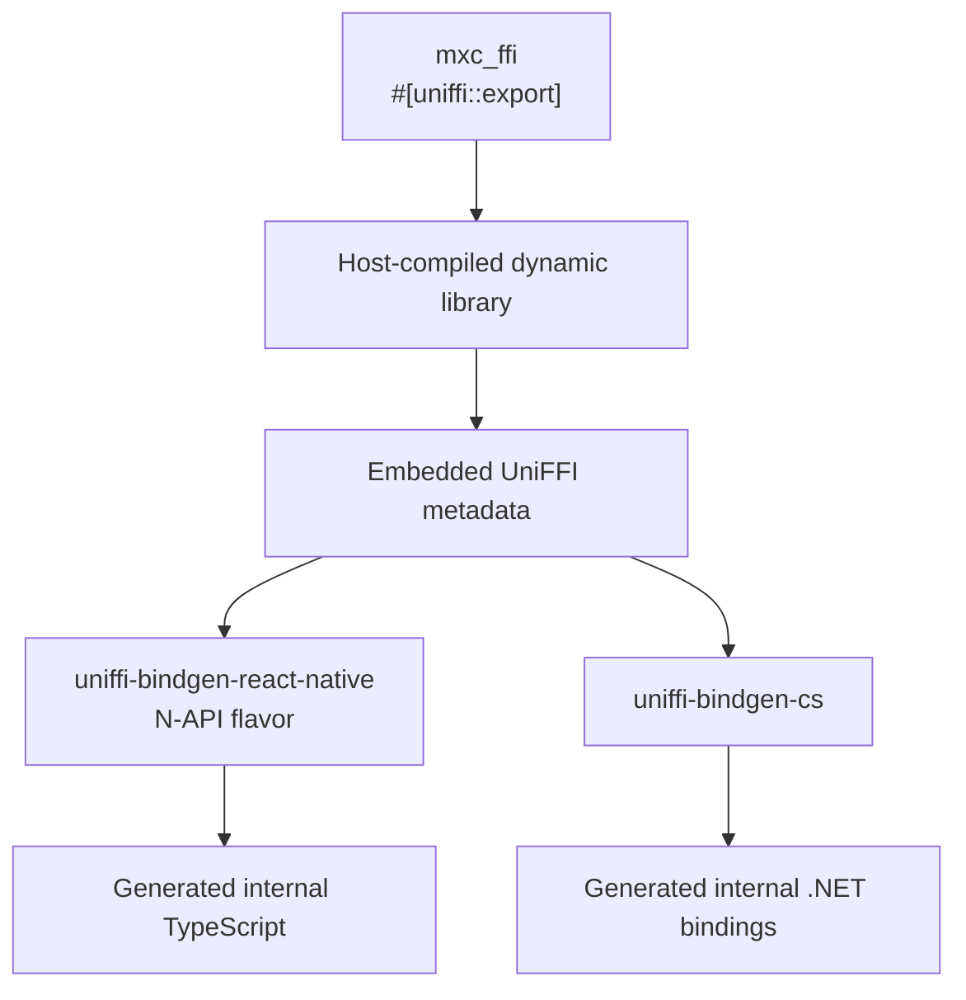
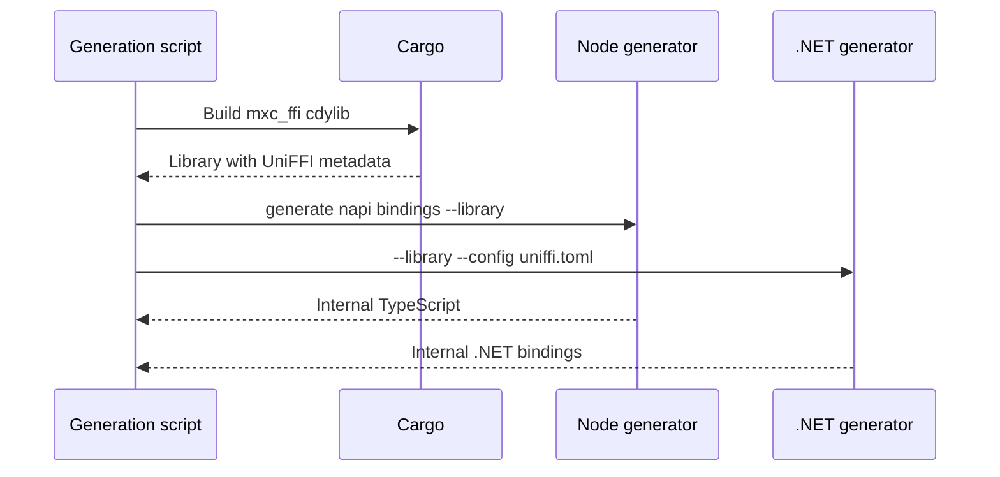
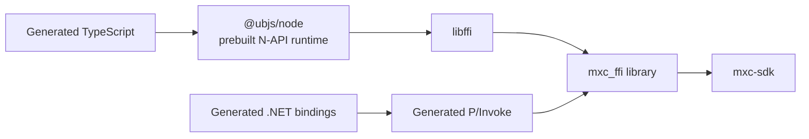

# UniFFI binding generation

## Proposal

Use one [UniFFI](https://github.com/mozilla/uniffi-rs) object model to generate the internal native Node and .NET
binding layers.



UniFFI generates TypeScript and C# callers from metadata in `mxc_ffi`. The library remains a Rust-built dynamic library
that exports native entry points. No C source or C SDK is generated.

## Pinned toolchain

| Component | Pinned version | Purpose |
|---|---:|---|
| `uniffi` | 0.31.0 | Rust exports, metadata, scaffolding |
| `uniffi-bindgen-react-native` | 0.31.0-5 | TypeScript for native Node N-API |
| `@ubjs/node` and `@ubjs/core` | 0.31.0-5 | Generic Node native runtime |
| `uniffi-bindgen-cs` | 0.11.0 + UniFFI 0.31.0 | Generated C# and P/Invoke |

The generation script will install pinned generators under `src/target/uniffi-tools`; no global install will be
required.

## Planned generation command

```powershell
scripts\generate-uniffi-bindings.ps1
```

This script will be added with the binding implementation. It is not part of the repository yet.



Generated files must not be manually edited.

## Export model

| Rust projection | Generated shape |
|---|---|
| `#[derive(uniffi::Record)]` | TypeScript and C# value type |
| `#[derive(uniffi::Object)]` | Reference-counted foreign object |
| `Result<T, Arc<BindingError>>` | Thrown structured object |
| `async fn` | Promise or Task backed by a Rust future |
| `Vec<u8>` | ArrayBuffer or byte array |
| `Option<T>` | Optional or nullable value |

The concrete callable operations, results, and owned objects are listed in
[Projected surface](node-dotnet-sdk-generation.md#projected-surface).

## Runtime call paths



Node is native and in-process.

## What contributors change

| Change | MXC engineer edits | Generated by the script |
|---|---|---|
| Existing callable operation behavior | Rust implementation and tests | Nothing |
| New callable operation | Rust behavior, UniFFI export, value conversion, and public facade methods | Internal TypeScript/C# calls and interop |
| New result or error field | Rust value conversion plus any public facade mapping | Internal TypeScript/C# fields and converters |
| New owned handle or stream behavior | Rust ownership rules and public stream adapters | Foreign reference counting, destruction, and calls |
| New target package | Native-library staging and package metadata | Callable operation bindings remain unchanged |

For a normal behavior fix, no binding code changes. For a new projected callable operation, the operation-specific
native interop code is in Rust and the public facades add only forwarding or adaptation. MXC does not write:

- C or C++ source
- a Node-API addon
- P/Invoke declarations
- native symbol registration
- foreign future polling
- foreign object lifetime plumbing

## Error boundary

`BindingError` is a UniFFI object with stable getters for code, message, operation, native code, and remediation.
Both generators throw the same object model. This avoids duplicating the closed MXC error-code enum in each projection.

Panics are caught before returning to UniFFI. A panic becomes a structured `panic` failure; it never unwinds into Node
or the CLR.

## Third-party dependency policy

`scripts\generate-uniffi-bindings.ps1` will be MXC's complete generation command; contributors will not invoke the
individual generators. Generator and runtime versions are pinned and upgraded together. An upgrade is accepted only
when the generated diff is reviewed and the same ownership, async, stream, error, and process-lifecycle tests pass.

The Node and C# generators are third-party dependencies. MXC must track their maintenance status and keep the option to
pin, fork, or replace a generator if its upstream project stops supporting the required UniFFI version. Generated code
stays internal so changing a generator does not require changing the public SDK API.

## Ready to replace the current bindings when

- Running the generation script twice produces no second diff.
- Generated Node and .NET tests call the real `mxc_ffi` library on each supported operating system.
- Async calls, cancellation, process termination, streams, errors, and object disposal match the Rust SDK behavior.
- Packages contain the correct native library for every supported target.
- CI reports unexpected public API or native entry-point changes.
- The previous interop generation path is removed, leaving one binding system.
