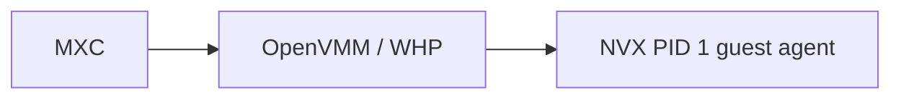

# NVX Backend: MXC policy testing with a prototype

## Status and scope

The NVX prototype accepted a real MXC `0.9.0-dev` JSON, validated it against the
schema, and adapted supported fields into typed NVX launch plans.
The prototype then exercised those plans on Windows through OpenVMM
and WHP.

## Current architecture

The intended MXC integration uses a direct ownership boundary:

MXC owns the OpenVMM process and the host side of the versioned guest-agent
control channel; no additional host service sits between them. In the current
prototype, an NVX-side policy harness stands in for the future MXC adapter and
proves this boundary end to end.

## MXC policies that worked

| MXC policy or control | Validated behavior |
|---|---|
| `filesystem.readonlyPaths` | Host paths were exposed to the guest as read-only mappings. Guest writes were denied. |
| `filesystem.readwritePaths` | Host paths were exposed as writable mappings and guest writes were reflected on the host. |
| Mapping validation | Duplicate, overlapping, escaping, symlink, reparse-point, and containment-invalid mappings were rejected before launch. |
| Undeclared-path isolation | The guest could not access undeclared host paths or bypass policy through raw virtio-fs exports. |
| `network.defaultPolicy: allow` | The guest received the supported unrestricted network posture. |
| `network.defaultPolicy: block` | Guest network access was blocked. |
| `process.commandLine` | The command was lowered exactly to `["/bin/sh", "-c", commandLine]`. |
| `process.cwd` | The requested guest working directory was preserved. |
| `process.env` | Non-reserved environment variables were preserved exactly. |
| `process.timeout` | The timeout flowed from real MXC JSON into the OpenVMM process execution plan. |
| Exec-time `runtimeConfig.networkProxy` | The sole supported proxy form was normalized and injected as controlled proxy environment variables during exec. |
| Version, containment, phase, and IDs | Exact schema version, temporary `containment: "vm"`, lifecycle phase, `sandboxId`, and `containerId` constraints were enforced. |

## Accepted inert metadata

| Field | Behavior |
|---|---|
| `$schema` | Accepted for schema tooling; it does not change the launch plan. |
| `_comment` | Accepted as descriptive metadata; it does not change runtime behavior. |
| Omitted optional parent sections | Accepted; their absence does not create unsupported policy or change the supported defaults. |

## MXC policies that did not work

| MXC policy or control | What the MXC control does | NVX gap |
|---|---|---|
| `filesystem.deniedPaths` | Explicitly hides or denies access to selected filesystem paths. | NVX has no independently enforced deny mapping primitive. |
| `network.allowedHosts` and `network.blockedHosts` | Allows or blocks network traffic by destination host. | Per-host filtering is not implemented. |
| `network.egress` and `network.ingress` | Controls outbound and inbound network traffic independently. | Directional network policy is not implemented. |
| Host-loopback and unsupported enforcement controls | Controls guest access to services on the host and selects how network restrictions are enforced. | The available network modes cannot truthfully enforce these controls. |
| Legacy `network.proxy`, including `network.proxy.url` | Routes sandbox network traffic through a configured proxy. | Only exec-time `runtimeConfig.networkProxy` is supported. |
| Caller-provided proxy environment variables | Lets process environment variables influence proxy routing. | `HTTP_PROXY`, `HTTPS_PROXY`, lowercase variants, `NO_PROXY`, and mixed-case equivalents are reserved and rejected to prevent policy bypass or ambiguity. |
| `ui` | Limits access to desktop, clipboard, window, and other UI capabilities. | NVX does not currently enforce the MXC UI policy. |
| `telemetry` | Controls diagnostic and usage-data collection. | No NVX mapping is defined for this policy section. |
| `lifecycle` policy | Controls sandbox persistence and cleanup behavior. | The tested lifecycle contract uses explicit state-aware phases rather than these policy knobs. |
| `fallback` | Permits selection of another containment backend if the requested backend cannot run. | NVX does not silently fall back to a weaker containment backend. |
| Foreign backend sections | Configure another containment implementation, such as ProcessContainer, LXC, or Seatbelt. | These backend-specific and experimental sections do not apply to NVX. |
| Policy mutation in the wrong phase | Restricts policy fields to the lifecycle phase where they can be safely applied. | Provision-only and exec-only fields are rejected outside their valid lifecycle phase. |
| Wrong version, non-VM containment, or invalid lifecycle IDs | Selects the contract and backend and identifies the state-aware sandbox instance. | Invalid control-plane inputs are rejected before effects. |

## Remaining MXC integration work

| Workstream | Estimate |
|---|---:|
| Add `nvx` containment, schema, wire, and policy/model types | 2-3 engineer-days |
| Implement state-aware and one-shot engine dispatch that owns OpenVMM | 7-10 engineer-days |
| Adapt guest streams, terminal outcomes, cancellation, and typed errors | 3-5 engineer-days |
| Expose NVX through applicable Rust, TypeScript, C#, and FFI surfaces | 4-6 engineer-days |
| Add runtime packaging/discovery and capability probing | 3-5 engineer-days |
| Add MXC-native E2E automation and CI coverage | 5-8 engineer-days |
| **Total** | **24-37 engineer-days** |

### E2E testing plan

- Verify one-shot launch, command execution, output, exit status, and teardown.
- Verify provision, start, repeated exec, stop, and deprovision, including
  invalid lifecycle IDs and phase transitions.
- Run positive and negative checks for every supported filesystem, network, and
  process policy.
- Prove every unsupported policy is rejected before VM or host effects.
- Exercise timeout, cancellation, guest/OpenVMM failure, reconnect, stream, and
  cleanup behavior.
- Run applicable Rust, TypeScript, C#, and FFI paths on Windows x64 and ARM64 CI
  hosts.