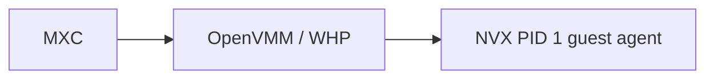

# NVX Backend: MXC policy compatibility and remaining gaps

## Status and scope

The original NVX prototype accepted a real MXC `0.9.0-dev` JSON, validated it
against the schema, and adapted supported fields into typed NVX launch plans.
The prototype first exercised those plans on Windows through OpenVMM and WHP.

## Current architecture

The intended MXC integration uses a direct ownership boundary:



MXC owns the OpenVMM process and the host side of the versioned guest-agent
control channel; no additional host service sits between them. The NVX policy
harness stands in for the future MXC adapter and proves this boundary end to
end.

## Implemented and validated capabilities

| MXC policy or control | Validated behavior |
| --- | --- |
| `filesystem.readonlyPaths` | Host paths were exposed to the guest as read-only mappings. Guest writes were denied. |
| `filesystem.readwritePaths` | Host paths were exposed as writable mappings and guest writes were reflected on the host. |
| `filesystem.deniedPaths` | Denied subtrees are hidden by the host filesystem provider, including direct, parent-relative, symlink/junction alias, and second-mount access. Unsafe policies are rejected before boot. |
| Mapping validation | Duplicate, overlapping, escaping, symlink, reparse-point, and containment-invalid mappings were rejected before launch. |
| Undeclared-path isolation | The guest could not access undeclared host paths or bypass policy through raw virtio-fs exports. |
| `process.commandLine` | The command was lowered exactly to `["/bin/sh", "-c", commandLine]`. |
| `process.cwd` | The requested guest working directory was preserved. |
| `process.env` | Non-reserved environment variables were preserved exactly. |
| `process.timeout` | The timeout flowed from real MXC JSON into the OpenVMM process execution plan. |
| Exec-time `runtimeConfig.networkProxy` | The sole supported proxy form was normalized and injected as controlled proxy environment variables during exec. |
| `network.egress.default` | Both `allow` and `deny` are enforced by the portable network profile. |
| `network.ingress.default: deny` | New inbound connections are denied while replies to guest-initiated traffic remain available. Unsupported unrestricted ingress is rejected before launch. |
| `network.egress.allow` and `network.egress.deny` | IPv4/CIDR TCP and UDP destination rules are enforced, with deny precedence and default-deny behavior. |
| `network.ingress.hostLoopback: deny` | General guest-to-host loopback and host-to-guest forwards are denied while the exact TCP runtime-proxy endpoint remains reachable. UDP on the proxy port remains denied. |
| Explicit host-to-guest forwarding | Selected TCP or UDP localhost ports can be deliberately published with NVX-specific forward options. |
| Fixed workload identity | Managed workloads run as the selected fixed non-root UID/GID with capabilities removed and `no_new_privs`. |
| State-aware lifecycle | Provision, start, repeated exec, stop, and deprovision preserve warm guest state and reject invalid transitions. |
| Bounded outcomes | Execution and VM-level reports expose bounded result categories, numeric status, operation IDs, and teardown outcomes without including command arguments, environment values, or credentials. |
| Version, containment, phase, and IDs | Exact schema version, temporary `containment: "vm"`, lifecycle phase, `sandboxId`, and `containerId` constraints were enforced. |

## Remaining NVX policy gaps

| MXC policy or control | Current NVX behavior | Remaining decision or implementation |
| --- | --- | --- |
| `network.ingress.hostLoopback: allow` | The portable socket-NAT profile requires explicit per-port forwarding. Generic `allow` without forwards is rejected before VM resources are opened. | Implement true bidirectional host-loopback connectivity without an NVX-specific port list, or retain the fail-closed rejection as a documented backend limitation. |
| Full schema 0.9 egress-rule vocabulary | NVX supports IPv4/CIDR rules with one TCP or UDP destination port. | Decide whether to implement IPv6, CIDR `except`, port ranges, ICMP, protocol `any`, and omitted destination/port selectors. Every unsupported form must be rejected before launch. |
| `network.ingress.default: allow` | NVX implements fixed ingress denial and rejects unrestricted ingress. | Implement unrestricted inbound support only if it is required for the NVX backend; otherwise preserve and document the rejection. |
| Caller-provided proxy environment variables | NVX rejects `HTTP_PROXY`, `HTTPS_PROXY`, lowercase variants, `NO_PROXY`, and mixed-case equivalents so `runtimeConfig.networkProxy` remains authoritative. | Decide whether this remains a permanent proxy-hygiene invariant or whether caller-provided values should be supported with explicit precedence and enforcement semantics. |
| Detailed telemetry | NVX returns bounded execution and teardown outcomes. | Decide whether MXC needs additional structured lifecycle, startup, performance, and failure facts from NVX. MXC remains responsible for consent, administrative policy, per-request gating, and event emission. |

## Intentionally unsupported policy

These fields are not missing NVX mechanisms. The MXC adapter should reject
them for this backend:

| Policy | Required behavior |
| --- | --- |
| `lifecycle` on the one-shot surface | One-shot execution destroys the VM. Persistence and reuse belong to the explicit state-aware lifecycle. Requests for retained one-shot state must be rejected. |
| Policy mutation in the wrong phase | Provision-only and exec-only fields are rejected outside their valid lifecycle phase. |
| Wrong version, non-VM containment, or invalid lifecycle IDs | Invalid control-plane inputs are rejected before effects. |
| `ui` | A Linux microVM has no equivalent MXC desktop-policy surface. |
| `fallback` | NVX does not silently select a weaker containment backend. |

## Accepted inert metadata

| Field | Behavior |
| --- | --- |
| `$schema` | Accepted for schema tooling; it does not change the launch plan. |
| `_comment` | Accepted as descriptive metadata; it does not change runtime behavior. |
| Omitted optional parent sections | Accepted; their absence does not create unsupported policy or change the supported defaults. |

## Schema changes

The only required new public identifier is `containment: "nvx"`. The
`experimental.nvx.provision` section is necessary only if images remain caller-configurable.

Example state-aware provision request:

```json
{
  "$schema": "https://aka.ms/mxc/schemas/0.9.0-alpha.json",
  "version": "0.9.0-alpha",
  "phase": "provision",
  "containment": "nvx",
  "filesystem": {
    "readonlyPaths": [
      "C:\\workspace\\source"
    ],
    "readwritePaths": [
      "C:\\workspace\\output"
    ],
    "deniedPaths": []
  },
  "network": {
    "egress": {
      "default": "deny"
    },
    "ingress": {
      "default": "deny",
      "hostLoopback": "deny"
    }
  },
  "experimental": {
    "nvx": {
      "provision": {
        "layers": [
          {
            "role": "distro",
            "path": "C:\\nvx\\images\\distro.erofs",
            "uuid": "11111111-1111-1111-1111-111111111111"
          },
          {
            "role": "runtime",
            "path": "C:\\nvx\\images\\runtime.erofs",
            "uuid": "22222222-2222-2222-2222-222222222222"
          }
        ],
        "scratchPath": "C:\\nvx\\images\\scratch.ext4"
      }
    }
  }
}
```

- `distro` is the read-only base operating-system and userspace layer.
- `runtime` is an optional read-only layer containing the workload runtime and
  supporting files.
- `scratchPath` is the writable ext4 image used for changes made while the
  sandbox is running.

## Binary acquisition and packaging

NVX replaces the existing NanVix microVM runtime and its `--with-microvm`
packaging path. A new `--with-nvx` build option should reuse the existing
NanVix artifact-acquisition implementation rather than introduce a second
download system:

- pin an exact `microsoft/nvx` release tag, platform asset name, and SHA-256
  checksums in the repository;
- download and verify the release during the build, never when a sandbox is
  launched;
- cache verified artifacts under Cargo's build output and avoid downloading
  them again when the pinned files are already present;
- support `NVX_BIN` as an offline override containing a pre-fetched and
  checksum-verifiable NVX bundle;
- stage `openvmm`, the guest kernel, and the guest initramfs beside the MXC
  executor and copy them into the matching Node and .NET SDK runtime package;
- fail the NVX-enabled build if an expected artifact is absent, corrupt, or
  does not match the selected platform.

The existing `nanvix_binaries` and `nanvix_build_common` mechanisms should be
renamed and adapted for NVX, preserving their pinned-version manifest,
checksum verification, offline-prefetch, cache, and SDK-staging behavior.
The obsolete NanVix release definitions and binaries should be removed rather
than retained alongside NVX.

`--with-nvx` selects the WHP bundle on Windows and the KVM bundle by default on
Linux. Linux MSHV packaging requires an additional explicit build selection;
the build must not infer the desired release bundle from the capabilities of
the machine performing the build.

The current `microsoft/nvx` prerelease
`v0.1.0-dev.142587bbceae` has the following package sizes:

| Release bundle | Compressed download | Expanded runtime |
| --- | ---: | ---: |
| Windows WHP | 22.73 MiB | 51.41 MiB |
| Linux KVM | 130.95 MiB | 486.69 MiB |
| Linux MSHV | 125.35 MiB | 489.11 MiB |

The expanded Windows runtime consists primarily of `openvmm.exe` (22.05 MiB),
`vmlinux` (21.84 MiB), and `initramfs.cpio.gz` (7.42 MiB). The Linux bundles
use the same kernel and initramfs, but their OpenVMM executables are currently
approximately 457-460 MiB before archive compression.

## Remaining MXC integration work

The following work belongs primarily in the MXC repository. It is separate
from the remaining NVX runtime policy gaps above.

| Workstream | Estimate |
| --- | ---: |
| Add `nvx` containment, schema, wire, and policy/model types | 2-3 engineer-days |
| Implement state-aware and one-shot engine dispatch that owns OpenVMM | 7-10 engineer-days |
| Adapt guest streams, terminal outcomes, cancellation, and typed errors | 3-5 engineer-days |
| Expose NVX through applicable Rust, TypeScript, C#, and FFI surfaces | 4-6 engineer-days |
| Replace the NanVix artifact pipeline with pinned NVX acquisition, packaging, discovery, and capability probing | 3-5 engineer-days |
| Add MXC-native E2E automation and CI coverage | 5-8 engineer-days |
| **Total** | **24-37 engineer-days** |


### E2E testing plan

- Verify one-shot launch, command execution, output, exit status, and teardown.
- Verify provision, start, repeated exec, stop, and deprovision, including
  invalid lifecycle IDs and phase transitions.
- Run positive and negative checks for every supported filesystem, network, and
  process policy.
- Prove every unsupported policy is rejected before VM or host effects.
- Exercise timeout, cancellation, guest/OpenVMM failure, reconnect, stream, and
  cleanup behavior.
- Run applicable Rust, TypeScript, C#, and FFI paths on Windows x64 and ARM64 CI
  hosts.

## Appendix A: Current OpenVMM and NVX baseline

This is the current direct OpenVMM/NVX capability baseline after the merged
policy work. An MXC backend adapter still needs to select these controls from
the exact schema 0.9 request and expose their outcomes through MXC APIs.

| Area | Supported today | Limitation for MXC |
| --- | --- | --- |
| Filesystem | Virtio-fs mappings support `ro`/`rw`, safe common-root planning, undeclared-path isolation, and explicit denied subtrees. | Policies that cannot be represented safely are rejected before boot. |
| Sandbox filesystem | The sandbox workload uses read-only EROFS layers, a writable ext4 scratch layer, private mount/PID/UTS namespaces, a private `/dev`, a fixed unprivileged identity, no Linux capabilities, and `no_new_privs`. | The MXC adapter must package and select the appropriate image and working layers. |
| Lifecycle | The host and guest protocols support provision, start, repeated exec, stop, deprovision, reconnect, operation cancellation, and bounded outcomes. | MXC still needs to register and dispatch NVX on its one-shot and state-aware surfaces. |
| Networking | The portable network profile works across WHP, KVM, and MSHV and enforces egress defaults, IPv4/CIDR TCP/UDP rules, deny ingress, host-loopback denial, exact proxy reachability, and explicit host-to-guest forwards. | Generic host-loopback allow, unrestricted ingress, and the broader schema 0.9 rule vocabulary remain unsupported. |
| HTTP/HTTPS proxy | An exec-time `runtimeConfig.networkProxy` endpoint is injected as controlled proxy environment variables and allowed as one exact TCP endpoint under host-loopback denial. | Caller-provided proxy variables remain rejected; UDP to the same endpoint is not allowed. |
| Outcomes and telemetry | Execution, lifecycle, and teardown return bounded status and failure categories without workload secrets. | Richer MXC telemetry facts are optional future work; MXC owns telemetry policy and emission. |

See the NVX [run guide](https://github.com/microsoft/nvx/blob/main/doc/run.md)
and [command-line reference](https://github.com/microsoft/nvx/blob/main/doc/usage.md)
for the current direct runtime options.

## Appendix B: NVX issue tracking

The historical issues captured the original prototype gaps. Repository
migration means some issue links may no longer resolve; the merged PRs above
are the durable implementation references.

| Historical issue | Current outcome |
| --- | --- |
| #37 - read-only/read-write mappings and mount isolation | Closed after prototype validation. |
| #38 - directional ingress and egress defaults | Implemented by microsoft/nvx#51 and nanvix/openvmm#71. NVX supports both egress defaults and a deny ingress posture; unrestricted ingress remains rejected. |
| #39 - fixed unprivileged workload identity | Implemented by microsoft/nvx#58 and nanvix/openvmm#75. |
| #40 - sandbox lifecycle | Implemented by microsoft/nvx#58 and nanvix/openvmm#75. |
| #41 - L3/L4 egress-rule filtering | Implemented for IPv4/CIDR TCP and UDP by microsoft/nvx#58 and nanvix/openvmm#75. The broader schema 0.9 vocabulary remains a compatibility decision. |
| #42 - host-loopback network policy | Partially resolved by microsoft/nvx#61 and nanvix/openvmm#76. Deny is enforced, the exact TCP runtime proxy is preserved, UDP leakage is closed, and explicit forwards remain available. Generic `hostLoopback: allow` without forwards remains unsupported. |
| #43 - denied filesystem paths | Implemented by microsoft/nvx#58 and nanvix/openvmm#75. |
| #44 - exec-time proxy configuration | Closed after prototype validation; subsequent work preserved an exact TCP-only proxy exception under host-loopback denial. |
| #45 - fail-closed backend selection and policy admission | Implemented across the policy and lifecycle changes; unsupported policy is rejected rather than weakened. |
| #46 - typed execution/lifecycle outcomes | Implemented as bounded execution, operation, VM-exit, and teardown reports. |
| #47 - detailed telemetry | Bounded outcomes are implemented. Richer telemetry facts remain optional follow-up work rather than a schema 0.9 blocker. |

## Appendix C: GitHub Copilot CLI schema migration

The current GitHub Copilot CLI builds MXC policy version `0.7.0-alpha` and
emits the legacy `allowOutbound`, `allowLocalNetwork`, and `network.proxy`
fields. It no longer provides a raw `sandbox.config` passthrough.

Before the CLI can use the NVX backend, it must migrate its generated policy
to schema 0.8+:

- map outbound allow/block to `network.egress.default`;
- map local-network intent to `network.ingress.default` and
  `network.ingress.hostLoopback`;
- express direct egress exceptions through `network.egress.allow` and
  `network.egress.deny`;
- move the supported loopback HTTP/HTTPS proxy endpoint to
  `runtimeConfig.networkProxy`;
- update its sandbox settings, policy checks, telemetry, UI, and tests to use
  the new directional model.

This migration belongs to the GitHub Copilot CLI and is a prerequisite for NVX
integration; NVX does not need to implement the legacy network contract.
