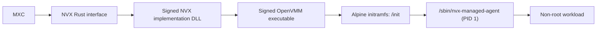
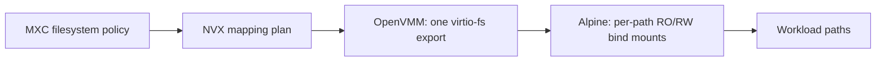

# NVX integration in MXC

**Status:** Integration proposal.

Future
tense describes work proposed for the MXC integration.

## 1. Introduction

[NVX][nvx-readme] is an ultra-light microVM sandbox for running untrusted
workloads with hardware-enforced isolation. It is built on OpenVMM and runs
Linux as its guest. It is a cross-platform microVM sandbox for agentic workloads.

Customers will use NVX through the MXC APIs and will not need to understand
OpenVMM, the guest agent, or image conversion.
The implementation will initially remain experimental or preview while the
integration is validated end to end.

NVX offers hardware-enforced isolation, warm
repeated execution, and direct Rust integration, with rich filesystem and
network controls compared to the existing Nanvix implementation. It will replace
Nanvix as the backend for the `microvm` option.

## 2. NVX distribution and MXC consumption

### 2.1 NVX shipping

NVX will ship a Rust crate containing:

- the Rust host API;
- the signed NVX implementation DLL;
- the signed OpenVMM executable;
- the signed image download and conversion tool;
- the Linux kernel and initramfs with the NVX init agent; and
- manifests, checksums, provenance, licences, and package inventories.

Because the crate distributes `vmlinux` and an Alpine initramfs, the NVX team
will publish the exact corresponding Linux and Alpine source artifacts for
every runtime version. The crate will include `SOURCE-MANIFEST.json`, the
Alpine package inventory, licences, and third-party notices. The source
manifest will identify the NVX project source, kernel version and
configuration, patches, Alpine package sources, published source artifacts,
and hashes. The source archives may be published separately rather than
embedded in every SDK package.

### 2.2 How MXC will consume NVX

MXC will use a pinned NVX crate version. The crate will expose the Rust
interface and stage its matching signed runtime assets during the Cargo build.
MXC will use the interface and signed DLL implementation from the same crate,
so the API and runtime files remain versioned together.

MXC will be implementing:

- build-time staging of the runtime assets from the NVX crate;
- checksum and signature verification;
- offline builds using a pre-fetched crate and dependencies; and
- packaging for the executor, Node SDK, and .NET SDK.

Before packaging the NVX runtime, MXC will validate `SOURCE-MANIFEST.json` and
verify that it references the matching Linux and Alpine source artifacts
published by the NVX team. MXC will copy the source manifest, Alpine package
inventory, licences, and notices into the npm and NuGet runtime packages. MXC
will not generate the source archives. Packaging will fail when required
metadata, source references, or hashes are missing or do not match the runtime
version.

### 2.3 Key NVX files that MXC will use

| File | Approximate size | Contents |
| --- | ---: | --- |
| NVX implementation DLL | Not yet published | Will provide the signed implementation of the Rust crate interface |
| `openvmm.exe` | 22 MB | Windows OpenVMM executable |
| Image download and conversion tool | Not yet published | Will download and convert standard OCI images |
| `vmlinux` | 24 MB | NVX Linux kernel |
| `initramfs.cpio.gz` | 7.4 MB | Alpine userspace and NVX guest agent |

The release also includes the supporting checksum, manifest, provenance,
licence, and package-inventory files.
These are the current development-bundle sizes and can change. The final Rust
crate size will also include the implementation DLL and image tool.

The current NVX binaries are not signed yet. The production Rust crate will
contain the signed implementation DLL, OpenVMM executable, and image tool.
MXC will validate their signatures and the published checksums before staging
or using the files.

### 2.4 Developer packaging and usage

The NVX runtime will be distributed with the SDK for each ecosystem.
Developers will not separately install or invoke OpenVMM.

| Ecosystem | Developer dependency | Packaging behaviour |
| --- | --- | --- |
| Rust | `mxc-sdk` with the `microvm` feature | The feature will include the NVX crate and stage its signed runtime assets |
| Node | `@microsoft/mxc-sdk` and `@microsoft/mxc-nvx-runtime` | The runtime package will contain a matched `mxc_ffi.dll` and co-located NVX crate assets |
| .NET | `Microsoft.Mxc.Sdk` and `Microsoft.Mxc.Sdk.Nvx.Runtime` | The MXC build will package the RID-specific NVX crate assets beside `mxc_ffi.dll` |

#### Rust

```toml
mxc-sdk = { version = "...", features = ["microvm"] }
```

#### Node

```bash
npm install @microsoft/mxc-sdk @microsoft/mxc-nvx-runtime
```

#### .NET

```xml
<PackageReference Include="Microsoft.Mxc.Sdk" Version="..." />
<PackageReference Include="Microsoft.Mxc.Sdk.Nvx.Runtime" Version="..." />
```

The developer experience will be the same in all three ecosystems:

1. Developers will add the MXC SDK and its NVX runtime dependency.
2. They will select `microvm` in the MXC request.
3. The SDK will locate the packaged NVX runtime for the current platform.
4. MXC will validate the signatures and checksums, then launch OpenVMM through
   the NVX Rust integration.

Developers will not provide paths to `openvmm.exe`, `vmlinux`, or
`initramfs.cpio.gz`, and will not communicate with OpenVMM directly.

The Node runtime package will use this layout:

```text
@microsoft/mxc-nvx-runtime\
  bin\win-x64\
    mxc_ffi.dll
    nvx\
      <NVX implementation>.dll
      openvmm.exe
      vmlinux
      initramfs.cpio.gz
      <image tool>
      <manifests and checksums>
```

The Node SDK native-library resolver will check whether
`@microsoft/mxc-nvx-runtime` is installed. When present, it will load the
matched `mxc_ffi.dll` from that package, where the NVX runtime is already
co-located. Without the runtime package, Node will continue to load the normal
MXC native library and will report `microvm` as unavailable.

For .NET, NuGet will copy the RID-specific `mxc_ffi.dll` and `nvx` directory
into the application output. The native MXC layer will resolve the `nvx`
directory relative to the loaded `mxc_ffi.dll`.

The MXC SDK, `mxc_ffi.dll`, and NVX runtime package versions must match.
Before launch, MXC will verify the required files, Windows architecture,
signatures, checksums, and runtime manifest compatibility. A missing or
incompatible runtime will return an actionable load or `backend_unavailable`
error identifying the required runtime package or version.

The co-located checksum manifest will not be trusted by itself. The pinned NVX
crate will provide the expected runtime-manifest identity, and the compiled
native integration will authenticate that manifest before using its file
hashes. MXC will then:

1. validate the Authenticode certificate chain and expected Microsoft signer
   for the NVX implementation DLL, `openvmm.exe`, and image tool;
2. verify `vmlinux`, the initramfs, and all other runtime files against the
   authenticated manifest; and
3. reject a missing signature, invalid certificate chain, unexpected signer,
   manifest mismatch, checksum mismatch, or runtime directory that is writable
   by an untrusted user.

The integration will add a new typed MicroVM configuration to each SDK. This
configuration describes which backend and OCI image to use. Developers will
pass that configuration to the existing run, spawn, and lifecycle operations;
the integration will not introduce separate NVX-specific execution methods.

| SDK | One-shot configuration | State-aware provision addition | Existing operations that will use it |
| --- | --- | --- | --- |
| Rust | `MicrovmConfig { image: String, memory_mb: Option<u64> }` and `Containment::Microvm(MicrovmConfig)` | Add `ProvisionRequest::microvm(image: String, memory_mb: Option<u64>)` | `v1::run`, `v1::spawn`, and `v1::container::*` |
| Node | `{ type: 'microvm', config: { image: string; memoryMb?: number } }` | Add `MicrovmProvisionConfig { image: string; memoryMb?: number; filesystem?; network? }` to `LifecycleConfigRegistry`, and include `'microvm'` in `LifecycleContainmentKind` | `run`, `spawn`, `provisionContainer`, and the existing lifecycle functions |
| .NET | `Microvm : Containment` with required `Image` and optional `MemoryMb` | Add `MicrovmProvisionRequest : ProvisionRequest` with required `Image`, optional `MemoryMb`, `Filesystem`, and `Network`; register its JSON discriminator as `microvm` | `MxcContainer.Run`, `MxcContainer.Spawn`, and the existing `MxcLifecycle` methods |

The wire and SDK changes will be delivered in this order:

1. Add `microvm.image`, `microvm.memoryMb`, state-aware MicroVM provision,
   engine binding, and runtime tests to the development `1.1.0-alpha`
   contract.
2. Keep the wire work development-only while that contract remains mutable.
3. Publish the fields in stable `1.1.0` when the contract is ready.
4. Advance `schemas/schema-version.json` `sdkMajorTargets["1"]` from `1.0.0`
   to `1.1.0`.
5. Publish the new Rust, Node, and .NET V1 MicroVM types and update their
   versioned references.

Schema publication and runtime authorisation are independent. Even after
stable `1.1.0` becomes the V1 SDK target, `microvm` may continue to require
the experimental option until the backend meets its promotion bar.

The existing lifecycle operation methods will remain unchanged; only the
backend-specific request types they accept will expand.

## 3. Architecture

### 3.1 NVX, OpenVMM, and Alpine Linux

MXC will use the NVX Rust interface and its signed DLL implementation. The DLL
will launch OpenVMM, which will boot the NVX kernel and unpack the Alpine
initramfs into the VM's in-memory root filesystem.

The initramfs contains two relevant agent components:

| Guest path | Role |
| --- | --- |
| `/init` | Runs first, mounts the guest pseudo-filesystems, reads the kernel command line, prepares networking and host filesystem mappings, and resolves the workload identity |
| `/sbin/nvx-managed-agent` | Replaces `/init` for the managed lifecycle and remains running as PID 1 while workloads execute |

The managed agent stays in the initramfs root filesystem and is not exposed
inside the workload's execution context.



The NVX Rust interface exposes the following operations:

| Operation | NVX Rust API |
| --- | --- |
| Validate provision | `validate_provision` |
| Validate execution | `validate_exec` |
| Check runtime availability | `probe` |
| Provision VM | `provision` |
| Start VM | `start` |
| Execute workload | `exec` |
| Stop VM | `stop` |
| Remove provisioned state | `deprovision` |
| Wait for execution outcome | `Execution::wait` |
| Cancel execution | `Execution::canceller` |

### 3.2 MXC integration

The integration will keep `containment: "microvm"` and will route it to NVX
through `mxc_engine`.

`mxc_engine` will also integrate the existing NVX `probe()` operation into
platform discovery. The NVX probe checks that the host platform, OpenVMM,
kernel, initramfs, and configured hypervisor are available. MXC will wrap that
probe with its production-package checks for the matched runtime manifest,
required files, architecture, signatures, checksums, image tool, and
guest/runtime compatibility. This discovery path will be read-only and will
not start a VM.

| Surface | New NVX integration work |
| --- | --- |
| Rust SDK | Will enable the NVX backend in the SDK and engine build |
| .NET SDK | Will add the `microvm` choice through the existing `mxc_ffi` boundary and package the NVX-enabled native runtime |
| Node SDK | Will add the `microvm` choice to typed configuration and package the NVX-enabled native runtime |

Node and .NET will continue to use the existing `mxc_ffi` boundary. NVX will
be linked on the Rust side; no separate NVX FFI library will be required.

## 4. Filesystem, lifecycle, and network support

The integration will target the MXC `1.1.0-alpha` development schema.

### 4.1 Schema example

```json
{
  "version": "1.1.0-alpha",
  "containment": "microvm",
  "microvm": {
    "image": "python:3.12-alpine",
    "memoryMb": 256
  },
  "process": {
    "commandLine": "cat /mnt/c/nvx-work/input/message.txt > /mnt/c/nvx-work/output/result.txt",
    "cwd": "/",
    "timeout": 30000
  },
  "filesystem": {
    "readonlyPaths": ["C:\\nvx-work\\input"],
    "readwritePaths": ["C:\\nvx-work\\output"],
    "deniedPaths": ["C:\\nvx-work\\input\\private"]
  },
  "network": {
    "egress": {
      "default": "deny",
      "allow": [{
        "to": [{ "cidr": "203.0.113.0/24" }],
        "ports": [{ "protocol": "tcp", "port": 443 }]
      }]
    },
    "ingress": {
      "default": "deny",
      "hostLoopback": "deny"
    }
  }
}
```

### 4.2 Filesystem

MXC will pass the configured host paths to NVX. NVX currently asks OpenVMM for
one virtio-fs export rooted at the common host directory. The Alpine guest
agent then bind-mounts each requested path separately as read-only or
read-write:



Read-write mappings are
live: a guest write changes the mapped host file immediately. Denied entries
are hidden by OpenVMM within the exported host tree.

All mapped paths must exist, be on the same Windows volume, and share a common
directory below the volume root. MXC will translate Windows paths into guest
paths: for example, `C:\nvx-work\input` will be available as
`/mnt/c/nvx-work/input`. Exporting an entire volume such as `C:\` will be
rejected.

| MXC Schema field | Works today |
| --- | --- |
| `filesystem.readonlyPaths` | Yes |
| `filesystem.readwritePaths` | Yes |
| `filesystem.deniedPaths` | Yes |

### 4.3 Network

MXC will pass the directional network policy to NVX. NVX currently converts
the supported rules into OpenVMM network options. OpenVMM attaches a virtual
network device to the guest and uses its portable profile as the host-side,
in-process NAT and filtering data plane.


| MXC Schema field or rule | Works today |
| --- | --- |
| `network.egress.default: allow` | Yes |
| `network.egress.default: deny` | Yes |
| IPv4/CIDR allow and deny rules | Yes |
| TCP and UDP ports and ranges | Yes |
| CIDR `except` entries | Yes |
| `protocol: any` with ports | Yes |
| `network.ingress.default: deny` | Yes |
| `network.ingress.hostLoopback: deny` | Yes |
| IPv6 rules | No |
| ICMP-only rules | No |
| `network.ingress.default: allow` | No |
| `network.ingress.hostLoopback: allow` | No |
| `runtimeConfig.networkProxy` | No |

Unsupported network forms are rejected before the VM starts.

| Network rule behaviour | Current NVX limit |
| --- | --- |
| Deny precedence | A matching deny rule overrides an allow rule |
| Expanded rules | Maximum 256 final allow rules and 256 final deny rules |
| Port ranges | Expanded to individual ports; a range may contain at most 256 ports |
| `protocol: any` with a port | Expands to one TCP and one UDP rule per port |
| TCP/UDP without a port | Rejected |
| Fully denied or omitted network | No virtual network device is attached |

### 4.4 Lifecycle

State-aware MicroVM provision types are not currently registered in the MXC
`1.1.0-alpha` contract. The integration will add them before publishing the
NVX lifecycle through the SDKs.

The proposed provision request will use the same `version`, `containment`,
`filesystem`, and `network` fields as the one-shot example in section 4.1.
The following shows only the state-aware difference:

```json
{
  "phase": "provision",
  "microvm": {
    "provision": {
      "memoryMb": 256,
      "image": "python:3.12-alpine"
    }
  }
}
```

The `process` section from the one-shot example will be omitted during
provision. The new `microvm.provision` schema will be a separate MicroVM
provision type with required `image` and optional `memoryMb`. A later `exec`
request will supply the process configuration.

| MXC phase | How NVX handles it |
| --- | --- |
| `provision` | Stores the configuration and returns an NVX sandbox ID |
| `start` | Launches OpenVMM and waits for the guest agent |
| `exec` | Runs a workload in the running VM |
| `stop` | Stops the VM while retaining provisioned state |
| `deprovision` | Removes the provisioned state |
| One-shot | MXC will compose provision, start, exec, stop, and deprovision |

MXC will preserve the NVX sandbox ID unchanged. NVX provision returns IDs in
the following form:

```text
aci-edge-sandboxes:<32 lowercase hexadecimal characters>
```

MXC will register the `aci-edge-sandboxes:` prefix in native lifecycle
dispatch so `start`, `exec`, `stop`, and `deprovision` route back to the
MicroVM/NVX backend.

| Surface | Required prefix work |
| --- | --- |
| Native engine | Map `aci-edge-sandboxes:` to the `microvm` backend in `backend_from_prefix` and state-aware dispatch |
| Rust SDK | Accept and preserve the opaque ID through `ContainerId` |
| Node SDK | Brand returned IDs as `ContainerId<'microvm'>` and include the prefix in lifecycle routing and validation maps |
| .NET SDK | Map the prefix to `ContainmentBackend.Microvm` and preserve it in `ContainerId` |

| Action | Workload effect | VM or state effect |
| --- | --- | --- |
| One-shot completion | Returns the workload outcome | MXC stops and deprovisions the VM |
| One-shot failure during provision, start, or exec | The workload may not start or will be terminated | MXC performs bounded stop and deprovision cleanup while preserving the original error |
| `process.timeout` | NVX terminates the workload and its descendants | A state-aware VM remains running; a one-shot VM is cleaned up |
| Cancel or kill an execution handle | Cancels the current workload and its descendants | Does not deprovision a state-aware VM |
| State-aware exec caller exits or loses its control session | The guest agent terminates the active workload | The running VM remains available for a later lifecycle call |
| `stop` during an exec | Waits for the active exec up to the stop timeout, then terminates the VM if required | The VM returns to provisioned state and the active exec fails |
| `deprovision` | Requires the VM to be stopped | Removes the provisioned state |

The same running VM can serve repeated `exec` calls. Only one workload runs at
a time; another `exec` waits up to the configured control timeout. Guest-memory
state does not survive `stop`, while changes to mapped host files do.

- NVX runs one workload at a time. A second `exec` waits for up to 60 seconds
  by default.
- `stop` waits for up to 30 seconds before forcing the VM to shut down.
- Cancelling an SDK operation must cancel the NVX workload, not only stop the
  SDK from waiting.

## 5. UI and other support

| Schema field or capability | Works today | Notes |
| --- | --- | --- |
| `ui` | No | Not supported by design, reject when supplied |
| `process.commandLine` | Yes | Runs as a Linux shell command |
| `process.cwd` | Yes | Must be an absolute guest path |
| `process.env` / `inheritDefaultEnv` | Yes |  |
| `process.timeout` | Yes | Maximum one hour; omitted or `0` means no execution deadline |
| Separate stdout and stderr | Yes | Combined output is limited to 1 MB |
| Live stdin | No | Future work if needed. Workload receives EOF |
| PTY | No | Future work if needed |
| Guest memory override | Yes | One-shot uses `microvm.memoryMb`; state-aware provision uses `microvm.provision.memoryMb`; default is 256 MB |
| `fallback` | No | Not supported by design, NVX does not select another backend |

| Process behaviour | Developer-visible result |
| --- | --- |
| Command execution | `process.commandLine` runs through BusyBox `/bin/sh -c` |
| Environment | Omitted environment uses guest defaults; an explicit list replaces or layers over those defaults; the shell may set `PWD` and `SHLVL` |
| Output limit | Combined stdout and stderr are limited to 1 MB; exceeding the limit terminates the workload rather than truncating output |
| Nonzero exit | Returned as a workload result, not an SDK or FFI failure |
| Invalid request or unavailable backend | Returned as an MXC error rather than a workload exit code |

NVX lifecycle errors align with the existing
[MXC SDK error classifications](reference/rust/v1/types.md). The integration
will map the additional NVX execution outcomes as described in
[Appendix B](#appendix-b-nvx-execution-outcome-mapping).

## 6. Image support

The implementation will support a standard OCI image reference. The NVX image
tool will convert that image into the internal filesystem artifact consumed by
NVX.

### 6.1 Standard OCI image and workload

The developer will provide a standard OCI image reference through `image`.
The signed NVX image tool will download the image and convert it into the
filesystem format consumed by NVX.

OCI-image-backed execution is a prerequisite for the MXC integration. The
selected NVX Rust API does not currently accept an image or attach a converted
workload filesystem. The NVX team will provide the signed conversion tool and
extend the runtime contract so the converted image can be attached and used as
the workload root while the init agent remains in the initramfs. The required
conversion and runtime contract is listed in
[Appendix C](#appendix-c-oci-image-conversion-contract).

```json
{
  "microvm": {
    "image": "python:3.12-alpine",
    "memoryMb": 256
  }
}
```

The complete request in section 4.1 is an example of this model:

- `microvm.image` identifies the standard OCI image.
- `process.commandLine` defines the workload to execute.
- The filesystem policy makes the workload's input available read-only and
  its output location available read-write.
- The network policy limits the workload to the requested destination and
  port.

The integration will reuse the existing WSLC cache and registry pattern:

1. Use the image from the local cache when it is already available.
2. Otherwise, resolve the registry host and check a shared backend-neutral MXC
   administrative registry policy.
3. When the registry is permitted, invoke the signed NVX image tool to pull
   the image and resolve its immutable digest.
4. Convert and cache the NVX-compatible artifact.

Image references without an explicit registry will resolve against Docker Hub.
Explicit registry references will be permitted only when the registry is
allowed by the machine policy.

The policy will be stored under
`HKEY_LOCAL_MACHINE\SOFTWARE\Policies\Mxc` and will use the existing WSLC
policy behaviour:

| Policy state | Behaviour |
| --- | --- |
| Value absent | Unmanaged; any registry host may be contacted |
| One or more hosts | Only those registry hosts may be contacted |
| Present but empty | No registry may be contacted |
| Present but unreadable | No registry may be contacted |

MXC will own registry authorisation and will validate the registry host before
invoking the image tool. The signed NVX image tool will own DNS resolution,
TLS, registry protocol, redirects, download, digest resolution, and
conversion while enforcing the policy supplied by MXC.

`microvm.image` will accept an OCI image reference rather than an arbitrary
URL. Redirects to another registry host will require that host to be permitted
by the same policy. Private-registry credentials will not be part of the
initial contract and will require a separate approved host
credential-provider design.

### 6.2 Schema additions

The `1.1.0-alpha` development contract will add a `microvm` image
configuration for both one-shot and state-aware provision requests.

| Contract surface | Schema addition |
| --- | --- |
| One-shot | Add `microvm.image` and `microvm.memoryMb` |
| State-aware provision | Register `containment: "microvm"` and add `microvm.provision.image` and `microvm.provision.memoryMb` |
| Start, exec, stop, and deprovision | No image fields; these requests use the `sandboxId` created during provision |

`image` will be required and must contain a non-empty OCI image reference.
Omitting it will fail schema or request validation.

One-shot standard-image addition:

```json
{
  "microvm": {
    "image": "python:3.12-alpine",
    "memoryMb": 256
  }
}
```

State-aware provision will use the same fields under `microvm.provision`:

```json
{
  "phase": "provision",
  "containment": "microvm",
  "microvm": {
    "provision": {
      "image": "python:3.12-alpine",
      "memoryMb": 256
    }
  }
}
```

The contract changes will also require regenerated development schema and
wire types, plus matching versioned Rust, Node, and .NET SDK types.

## 7. Windows requirement

The initial implementation will support Windows x64. Windows ARM is planned
but will not be initially available.

| Requirement | Developer action |
| --- | --- |
| Hardware virtualisation | Enable Intel VT-x or AMD-V in firmware |
| Windows Hypervisor Platform | Enable the `HypervisorPlatform` Windows optional feature from an elevated shell and reboot |
| Running Windows hypervisor | Ensure hypervisor launch has not been disabled |
| NVX runtime | Install the matching x64 SDK runtime package; MXC will validate the architecture, required files, signatures, checksums, and manifest compatibility |

Developers should check platform support before launch using Rust
`platform_support()`, Node `getPlatformSupport()`, or .NET
`MxcPlatform.GetPlatformSupport()`. These existing APIs will call the native
MXC discovery path; no separate public NVX probe API will be added.

The discovery result will include `microvm` in `availableMethods` only when the
NVX probe and MXC package-integrity checks succeed. An unavailable MicroVM
backend will include a backend-specific reason in the SDK's platform-support
result, with remediation such as installing the matching runtime package,
enabling WHP, or repairing corrupt assets.

Execution will repeat the authoritative preflight before launch. A cached or
stale discovery result will not bypass runtime validation.

Missing WHP, disabled hardware virtualisation, absent runtime files,
incompatible guest/runtime versions, and unsupported architectures will return
`backend_unavailable` with remediation. OpenVMM startup failures should
identify the associated log path.

## 8. Requirements and end-to-end tests

The NVX backend will be complete when the following areas pass through the
packaged MXC executor and all three SDKs on Windows x64 with WHP.

| Area | Required coverage |
| --- | --- |
| Integration | `microvm` routes to NVX for one-shot and state-aware execution |
| Discovery | Rust, Node, and .NET platform-support APIs include `microvm` only after the native NVX probe and MXC package-integrity checks succeed; each failure mode returns actionable backend-specific remediation without starting a VM |
| Lifecycle | Provision, exact `aci-edge-sandboxes:` prefix routing, start, repeated and overlapping exec, caller reconnect, stop, deprovision, invalid transitions, malformed/stale IDs, backend prefix isolation, and one-shot failure cleanup |
| State-aware process lifetime | After the process performing `start` exits, OpenVMM remains running and a later `exec` process reconnects successfully; test from a Windows job that would normally terminate child processes |
| SDKs and FFI | Rust, Node, and .NET produce the same policy and result behaviour; native ownership and cleanup remain correct |
| Filesystem | Read-only, read-write, denied paths, files, directories, multiple mappings, and invalid combinations |
| Network | Defaults, allow/deny precedence, CIDRs, exclusions, TCP/UDP ranges, and rejection of unsupported rules |
| Process | Command, CWD, environment, timeout, cancellation, output limits, nonzero exits, and descendant cleanup |
| PTY | Confirm unsupported in the initial implementation; add terminal tests when implemented |
| Packaging | Rust crate, npm, and NuGet installation; inclusion of the DLL, OpenVMM, image tool, kernel, initramfs, source manifest, Alpine package inventory, licences, and notices; OCI image conversion; automatic runtime discovery; missing/corrupt artifacts; and verification that matching Linux and Alpine source artifacts are published and referenced |
| Signing | Authenticate the runtime manifest, validate the Authenticode chain and Microsoft signer for signed NVX binaries, verify all remaining file checksums, and reject untrusted runtime directories |
| Host | Real execution on Windows x64 with WHP installed and enabled; ARM remains planned |
| Image support | Verify standard-image registry conversion, required-image validation, one-shot and state-aware schema branches, and generated SDK types |

Negative filesystem and network tests must include a working positive control
so infrastructure failures are not mistaken for policy enforcement.

## 9. Long-term plan

- Converge the NVX MicroVM integration under the broader WSL platform.
- Reuse and align session, image, SDK, and runtime concepts with WSLC.
- Allow MXC to replace its direct NVX integration without changing the
  developer-facing contract.

## Appendix A: Planned MXC to OpenVMM communication

| Connection | Mechanism | Purpose |
| --- | --- | --- |
| MXC to NVX Rust interface | In-process Rust API calls | Will invoke provision, start, execute, stop, and deprovision |
| NVX Rust interface to signed implementation DLL | In-process interface call | Will use the implementation shipped in the NVX Rust crate |
| NVX implementation DLL to `openvmm.exe` | Process launch with CLI arguments | Will supply the kernel, initramfs, hypervisor, filesystem and network configuration, and control-endpoint address |
| NVX implementation DLL to `openvmm.exe`, during startup only | OpenVMM stdin | Will pass a one-time 32-byte authentication capability; stdin will not be the ongoing command channel |
| NVX implementation DLL to `openvmm.exe` | Windows named pipe | Will carry ongoing lifecycle and workload control through the NVX framed binary protocol |
| OpenVMM to Alpine guest agent | Dedicated virtio-console | Will carry readiness, workload commands, stdout and stderr, cancellation, shutdown, and execution outcomes |


## Appendix B: NVX execution outcome mapping

| NVX outcome | MXC result |
| --- | --- |
| `Exited(code)` | Will return the workload exit code |
| `Signaled(signal)` | Will return `128 + signal` through the existing integer exit result |
| `TimedOut` | Will return the existing MXC timed-out result |
| `Cancelled` | Will return exit code `137` |
| `Failed(WorkingDirectory)` | Will return `backend_error` with the working-directory failure |
| Other `Failed(...)` outcomes | Will return `backend_error` with the NVX failure reason |
| No outcome available | Will return `backend_error`; it will not invent a workload exit code |

## Appendix C: OCI image conversion contract

| Contract area | Required definition |
| --- | --- |
| Input identity | Resolve the OCI reference to an immutable digest and record the registry or source |
| Registry authorisation | MXC validates the registry against a shared backend-neutral administrative allowlist before invoking the NVX image tool |
| Redirects | The image tool follows a redirect to another registry host only when that host is also permitted |
| Credentials | No private-registry credentials in the initial contract; future credentials must come from an approved host provider and remain out of requests, command lines, logs, and telemetry |
| Conversion timing | Pull and convert before VM start; reuse a compatible cached conversion when available |
| Converted artifact | Produce a versioned NVX artifact with a manifest identifying the source digest, converter version, runtime compatibility, and checksums |
| Guest integration | Attach the converted artifact to OpenVMM and make it the workload root while `/init` and the managed agent remain in the initramfs outside the workload root |
| OCI metadata | Define how `ENTRYPOINT`, `CMD`, `ENV`, `WORKDIR`, and `USER` interact with MXC `process` settings |
| Writable state | Define the writable layer or scratch lifetime and whether it is discarded on stop or deprovision |
| Cache identity | Key conversions by image digest plus converter and runtime format version rather than by mutable image tag alone |
| Failures | Surface registry, conversion, compatibility, and attachment failures through actionable MXC errors |

The signed image tool, image schema, converted-artifact format, and runtime
attachment are required deliverables before `microvm.image` is usable.

## References and open decisions

### Awaited support

- Initial permitted registry set and migration from the existing WSLC-specific policy name
- NVX signed binaries support
- NVX crate binary packaging and extraction contract
- Windows ARM runtime and SDK package availability
- Future PTY support

### References

- [NVX README][nvx-readme]
- [NVX Rust API overview][nvx-rust]
- [NVX setup guide][nvx-setup]
- [Selected NVX release][nvx-release]
- [MXC schema](schema.md)
- [MXC architecture](architecture.md)
- [MXC SDK error classifications](reference/rust/v1/types.md)

[nvx-readme]: https://github.com/microsoft/nvx
[nvx-rust]: https://github.com/microsoft/nvx/tree/dev/aci_edge_sandboxes
[nvx-setup]: https://github.com/microsoft/nvx/blob/dev/doc/setup.md
[nvx-release]: https://github.com/microsoft/nvx/releases
