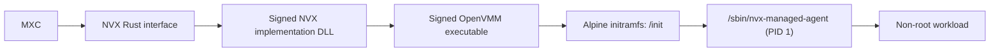
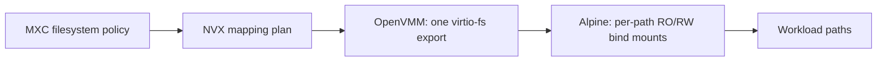

# NVX integration in MXC

**Status:** Integration proposal.

Future
tense describes work proposed for the MXC integration.

## 1. Introduction

[NVX][nvx-readme] is an ultra-light microVM sandbox for running untrusted
workloads with hardware-enforced isolation. It is built on OpenVMM and runs
Linux as its guest. It is a cross-platform microVM sandbox for agentic workloads.

NVX offers hardware-enforced isolation, warm
repeated execution, and direct Rust integration, with rich filesystem and
network controls compared to the existing Nanvix implementation. It will replace
Nanvix as the backend for the `microvm` option.

## 2. NVX distribution and MXC consumption

### 2.1 NVX shipping

NVX will ship:

- A`aci_edge_sandboxes` Rust crate, which will provide the host API;
- A zip containing signed binaries containing OpenVMM, the Linux kernel, and guest
  images; and
- manifests, checksums, provenance, licences, and package inventories.

### 2.2 How MXC will consume NVX

MXC will use a pinned NVX crate version and a matching pinned runtime bundle.
The production ZIP will be made consumable through Rust artifact crates so
Cargo builds can acquire, verify, unpack, and stage it consistently. MXC will
use the interface from the Rust crate and the signed DLL implementation from
the ZIP.

MXC will replace its current MicroVM artifact acquisition path with the NVX
artifact crates while preserving:

- build-time download and staging;
- checksum verification;
- offline builds using pre-fetched artifacts; and
- packaging for the executor, Node SDK, and .NET SDK.
It will also add signature verification for the downloaded binaries.

### 2.3 Key NVX files that MXC will use

| File | Approximate size | Contents |
| --- | ---: | --- |
| NVX implementation DLL | Not yet published | Will provide the signed implementation of the Rust crate interface |
| `openvmm[.exe]` | 22 MB Windows;<br>461-475 MB Linux | Platform OpenVMM executable |
| `vmlinux` | 24 MB | NVX Linux kernel |
| `initramfs.cpio.gz` | 7.4 MB | Alpine userspace and NVX guest agent |

The release also includes the supporting checksum, manifest, provenance,
licence, and package-inventory files.

| Runtime bundle | Compressed | Expanded |
| --- | ---: | ---: |
| Windows WHP | 139 MB | 187 MB |
| Linux KVM | 247 MB | 626 MB |
| Linux MSHV | 247 MB | 641 MB |

These are the current development-bundle sizes and can change.

The current NVX binaries are not signed yet. The production ZIP will contain
the signed implementation DLL, OpenVMM executable, and image tool.
MXC will validate their signatures and the published checksums before staging
or using the files.

### 2.4 Developer packaging and usage

The NVX runtime will be distributed with the SDK for each ecosystem.
Developers will not separately install or invoke OpenVMM.

| Ecosystem | Developer dependency | Packaging behaviour |
| --- | --- | --- |
| Rust | `mxc-sdk` with the `microvm` feature | The feature will include the NVX runtime artifact crate and stage the production ZIP contents |
| Node | `@microsoft/mxc-sdk` and `@microsoft/mxc-nvx-runtime` | The runtime package will supply the matching production ZIP contents |
| .NET | `Microsoft.Mxc.Sdk` and `Microsoft.Mxc.Sdk.Nvx.Runtime` | The runtime NuGet package will supply the matching RID-specific production ZIP contents |

#### Rust

```toml
mxc-sdk = { version = "...", features = ["microvm"] }
```

#### Node

```bash
npm install @microsoft/mxc-sdk @microsoft/mxc-nvx-runtime
```

#### .NET

```xml
<PackageReference Include="Microsoft.Mxc.Sdk" Version="..." />
<PackageReference Include="Microsoft.Mxc.Sdk.Nvx.Runtime" Version="..." />
```

The developer experience will be the same in all three ecosystems:

1. Developers will add the MXC SDK and its NVX runtime dependency.
2. They will select `microvm` in the MXC request.
3. The SDK will locate the packaged NVX runtime for the current platform.
4. MXC will validate the signatures and checksums, then launch OpenVMM through
   the NVX Rust integration.

Developers will not provide paths to `openvmm[.exe]`, `vmlinux`, or
`initramfs.cpio.gz`, and will not communicate with OpenVMM directly.

## 3. Architecture

### 3.1 NVX, OpenVMM, and Alpine Linux

MXC will use the NVX Rust interface and its signed DLL implementation. The DLL
will launch OpenVMM, which will boot the NVX kernel and unpack the Alpine
initramfs into the VM's in-memory root filesystem.

The initramfs contains two relevant agent components:

| Guest path | Role |
| --- | --- |
| `/init` | Runs first, mounts the guest pseudo-filesystems, reads the kernel command line, prepares networking and host filesystem mappings, and resolves the workload identity |
| `/sbin/nvx-managed-agent` | Replaces `/init` for the managed lifecycle and remains running as PID 1 while workloads execute |

The managed agent stays in the initramfs root filesystem and is not exposed
inside the workload's execution context.



### 3.2 MXC integration

The integration will keep `containment: "microvm"` and will route it to NVX
through `mxc_engine`.

| Surface | New NVX integration work |
| --- | --- |
| Rust SDK | Will enable the NVX backend in the SDK and engine build |
| .NET SDK | Will add the `microvm` choice through the existing `mxc_ffi` boundary and package the NVX-enabled native runtime |
| Node SDK | Will add the `microvm` choice to typed configuration and package the NVX-enabled native runtime |

Node and .NET will continue to use the existing `mxc_ffi` boundary. NVX will
be linked on the Rust side; no separate NVX FFI library will be required.

## 4. Filesystem, lifecycle, and network support

The integration will target the MXC `1.1.0-alpha` development schema.

### 4.1 Schema example

```json
{
  "version": "1.1.0-alpha",
  "containment": "microvm",
  "process": {
    "commandLine": "cat /mnt/c/input/message.txt > /mnt/c/output/result.txt",
    "cwd": "/",
    "timeout": 30000
  },
  "filesystem": {
    "readonlyPaths": ["C:\\input"],
    "readwritePaths": ["C:\\output"],
    "deniedPaths": ["C:\\input\\private"]
  },
  "network": {
    "egress": {
      "default": "deny",
      "allow": [{
        "to": [{ "cidr": "203.0.113.0/24" }],
        "ports": [{ "protocol": "tcp", "port": 443 }]
      }]
    },
    "ingress": {
      "default": "deny",
      "hostLoopback": "deny"
    }
  }
}
```

### 4.2 Filesystem

MXC will pass the configured host paths to NVX. NVX currently asks OpenVMM for
one virtio-fs export rooted at the common host directory. The Alpine guest
agent then bind-mounts each requested path separately as read-only or
read-write:



Read-write mappings are
live: a guest write changes the mapped host file immediately. Denied entries
are hidden by OpenVMM within the exported host tree. Linux host permissions
continue to apply to the mapped paths.

| MXC Schema field | Works today |
| --- | --- |
| `filesystem.readonlyPaths` | Yes |
| `filesystem.readwritePaths` | Yes |
| `filesystem.deniedPaths` | Yes |

### 4.3 Network

MXC will pass the directional network policy to NVX. NVX currently converts
the supported rules into OpenVMM network options. OpenVMM attaches a virtual
network device to the guest and uses its portable profile as the host-side,
in-process NAT and filtering data plane.


| MXC Schema field or rule | Works today |
| --- | --- |
| `network.egress.default: allow` | Yes |
| `network.egress.default: deny` | Yes |
| IPv4/CIDR allow and deny rules | Yes |
| TCP and UDP ports and ranges | Yes |
| CIDR `except` entries | Yes |
| `protocol: any` with ports | Yes |
| `network.ingress.default: deny` | Yes |
| `network.ingress.hostLoopback: deny` | Yes |
| IPv6 rules | No |
| ICMP-only rules | No |
| `network.ingress.default: allow` | No |
| `network.ingress.hostLoopback: allow` | No |
| `runtimeConfig.networkProxy` | No |

Unsupported network forms are rejected before the VM starts.

### 4.4 Lifecycle

State-aware MicroVM provision types are not currently registered in the MXC
`1.1.0-alpha` contract. The integration will add them before publishing the
NVX lifecycle through the SDKs.

The proposed provision request will use the same `version`, `containment`,
`filesystem`, and `network` fields as the one-shot example in section 4.1.
The following shows only the state-aware difference:

```json
{
  "phase": "provision",
  "microvm": {
    "provision": {
      "memoryMib": 256,
      "image": "my-python-filesystem:latest",
      "imageTarPath": "C:\\images\\my-python-filesystem.tar"
    }
  }
}
```

The `process` section from the one-shot example will be omitted during
provision. The image fields will reuse the WSLC provision schema under the
`microvm` top-level element. A later `exec` request will supply the process
configuration.

| MXC phase | How NVX handles it |
| --- | --- |
| `provision` | Stores the configuration and returns an NVX sandbox ID |
| `start` | Launches OpenVMM and waits for the guest agent |
| `exec` | Runs a workload in the running VM |
| `stop` | Stops the VM while retaining provisioned state |
| `deprovision` | Removes the provisioned state |
| One-shot | MXC will compose provision, start, exec, stop, and deprovision |

The same running VM can serve repeated `exec` calls. Only one workload runs at
a time; another `exec` waits up to the configured control timeout. Guest-memory
state does not survive `stop`, while changes to mapped host files do.

## 5. UI and other support

| Schema field or capability | Works today | Notes |
| --- | --- | --- |
| `ui` | No | Not supported by design, reject when supplied |
| `process.commandLine` | Yes | Runs as a Linux shell command |
| `process.cwd` | Yes | Must be an absolute guest path |
| `process.env` / `inheritDefaultEnv` | Yes |  |
| `process.timeout` | Yes | Maximum one hour; omitted or `0` means no execution deadline |
| Separate stdout and stderr | Yes | Combined output is limited to 1 MB |
| Live stdin | No | Future work if needed. Workload receives EOF |
| PTY | No | Future work if needed |
| Guest memory override | Yes | Default is 256 MB |
| `fallback` | No | Not supported by design, NVX does not select another backend |

NVX lifecycle errors align with the existing
[MXC SDK error classifications](reference/rust/v1/types.md). The integration
will map the additional NVX execution outcomes as described in
[Appendix B](#appendix-b-nvx-execution-outcome-mapping).

## 6. Image delivery models

The implementation will support two image-delivery models. Both models will ultimately provide MXC with a tar file that contains the inputs needed to run the
workload.

### 6.1 Default NVX image

The default model will use a pre-built static tar published by
[`microsoft/nvx`][nvx-readme]. MXC will pin, download or stage, validate, and
import this tar directly. The tar will match the pinned NVX runtime version
and will provide the default workload filesystem.
**TBD on the workload it will support.**


### 6.2 Custom image

The custom-image model will reuse the existing WSLC image handling code and
schema. The `image` and `imageTarPath` fields will keep the same meaning; only
the top-level element will change from `wslc` to `microvm`.

```json
{
  "microvm": {
    "image": "my-python-filesystem:latest",
    "imageTarPath": "C:\\images\\my-python-filesystem.tar"
  }
}
```

`image` will identify the workload image. `imageTarPath` will identify the
local tar that MXC imports and passes to NVX. The integration will reuse the
existing WSLC image download, conversion, validation, and tar-handling
implementation rather than duplicate it for NVX.

The signed image tool from the production NVX ZIP will download the standard
image, combine it with the workload input, and produce the tar at
`imageTarPath`. The resulting tar will include the workload and image metadata
required by NVX.

MXC will validate the declared checksums for both models. It will also validate
the signatures of the signed implementation DLL, OpenVMM executable, and image
tool before use.

## 7. Host support

| Backend | Requirements | Coverage today |
| --- | --- | --- |
| Windows WHP | Windows x64 with WHP enabled | Live-tested on the selected baseline |
| Linux KVM | Linux x64 with access to `/dev/kvm` | Supported by NVX; not live-tested in the supplied campaign |
| Linux MSHV | Linux x64 with access to `/dev/mshv` | Supported by NVX; not live-tested in the supplied campaign |
| macOS | Not supported | No NVX backend |
| ARM64 | Not supported by the selected runtime | No selected runtime bundle |

Moving to another NVX version will require renewed host-compatibility testing.

## 8. Requirements and end-to-end tests

The NVX backend will be complete when the following areas pass through the
packaged MXC executor and all three SDKs on each supported host backend.

| Area | Required coverage |
| --- | --- |
| Integration | `microvm` routes to NVX for one-shot and state-aware execution |
| Lifecycle | Provision, start, repeated and overlapping exec, caller reconnect, stop, deprovision, invalid transitions, and stale IDs |
| SDKs and FFI | Rust, Node, and .NET produce the same policy and result behaviour; native ownership and cleanup remain correct |
| Filesystem | Read-only, read-write, denied paths, files, directories, multiple mappings, invalid combinations, and Linux permissions |
| Network | Defaults, allow/deny precedence, CIDRs, exclusions, TCP/UDP ranges, and rejection of unsupported rules |
| Process | Command, CWD, environment, timeout, cancellation, output limits, nonzero exits, and descendant cleanup |
| PTY | Confirm unsupported in the initial implementation; add terminal tests when implemented |
| Packaging | Rust crate, npm, and NuGet installation; inclusion of the DLL, OpenVMM, image tool, kernel, and initramfs; tar conversion; static NVX tar staging; automatic runtime discovery; and missing/corrupt artifacts |
| Signing | Validate signatures and checksums and reject unapproved or tampered artifacts |
| Hosts | Real WHP and KVM runs; MSHV if shipped; clear rejection on macOS and unsupported architectures |
| Image models | Verify the default static `microsoft/nvx` tar and the custom-image WSLC code/schema reuse, conversion, validation, and import path |

Negative filesystem and network tests must include a working positive control
so infrastructure failures are not mistaken for policy enforcement.

## Appendix A: Planned MXC to OpenVMM communication

| Connection | Mechanism | Purpose |
| --- | --- | --- |
| MXC to NVX Rust interface | In-process Rust API calls | Will invoke provision, start, execute, stop, and deprovision |
| NVX Rust interface to signed implementation DLL | In-process interface call | Will use the implementation supplied in the production ZIP |
| NVX implementation DLL to `openvmm.exe` | Process launch with CLI arguments | Will supply the kernel, initramfs, hypervisor, filesystem and network configuration, and control-endpoint address |
| NVX implementation DLL to `openvmm.exe`, during startup only | OpenVMM stdin | Will pass a one-time 32-byte authentication capability; stdin will not be the ongoing command channel |
| NVX implementation DLL to `openvmm.exe` | Windows named pipe or Linux Unix domain socket | Will carry ongoing lifecycle and workload control through the NVX framed binary protocol |
| OpenVMM to Alpine guest agent | Dedicated virtio-console | Will carry readiness, workload commands, stdout and stderr, cancellation, shutdown, and execution outcomes |


## Appendix B: NVX execution outcome mapping

| NVX outcome | MXC result |
| --- | --- |
| `Exited(code)` | Will return the workload exit code |
| `Signaled(signal)` | Will return `128 + signal` through the existing integer exit result |
| `TimedOut` | Will return the existing MXC timed-out result |
| `Cancelled` | Will return exit code `137` |
| `Failed(WorkingDirectory)` | Will return `backend_error` with the working-directory failure |
| Other `Failed(...)` outcomes | Will return `backend_error` with the NVX failure reason |
| No outcome available | Will return `backend_error`; it will not invent a workload exit code |

## References and open decisions

### Open decisions

- Future PTY support.

### References

- [NVX README][nvx-readme]
- [NVX Rust API overview][nvx-rust]
- [NVX setup guide][nvx-setup]
- [Selected NVX release][nvx-release]
- [MXC schema](schema.md)
- [MXC architecture](architecture.md)
- [MXC SDK error classifications](reference/rust/v1/types.md)

[nvx-readme]: https://github.com/microsoft/nvx
[nvx-rust]: https://github.com/microsoft/nvx/tree/dev/aci_edge_sandboxes
[nvx-setup]: https://github.com/microsoft/nvx/blob/dev/doc/setup.md
[nvx-release]: https://github.com/microsoft/nvx/releases
