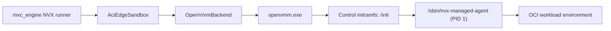
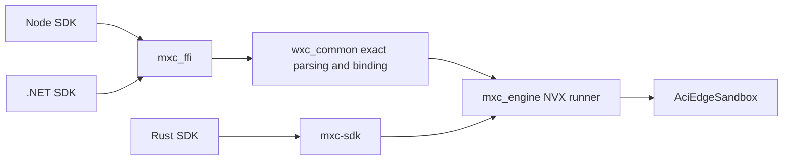
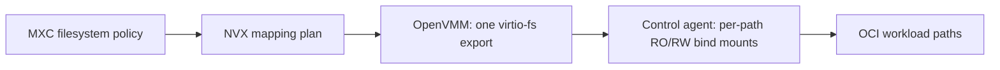

# NVX integration in MXC

**Status:** Integration proposal.

Future tense describes work proposed for the MXC integration.

## 1. Introduction

[NVX][nvx-readme] provides ultra-light microVMs for running
untrusted workloads with hardware-enforced isolation. It is built on OpenVMM,
runs Linux as its guest, and targets cross-platform agentic workloads.

Customers will use NVX through the MXC APIs and will not need to understand
OpenVMM, the guest agent, or image conversion.
The implementation will initially remain experimental or preview while the
integration is validated end to end.

NVX offers hardware-enforced isolation, warm
repeated execution, and direct Rust integration, with rich filesystem and
network controls compared to the existing Nanvix implementation. It will replace
Nanvix as the backend for the `microvm` option.

## 2. NVX distribution and MXC consumption

### 2.1 NVX crate and runtime files

NVX currently provides the `aci_edge_sandboxes` Rust crate. It contains:

- the public `AciEdgeSandbox` and `AsyncAciEdgeSandbox` lifecycle APIs
- the `OpenVmmBackend` Rust implementation
- `artifacts.json`, which pins the platform release
- the optional `bundled` Cargo feature
- the download logic in `build.rs`

With `bundled` enabled, `build.rs` downloads the pinned NVX platform archive
and stages:

- `openvmm.exe`
- `vmlinux`
- `initramfs.cpio.gz`
- `SOURCE-MANIFEST.json`
- `SHA256SUMS`

[Appendix D.1](#d1-archive-and-source-validation) describes archive validation
and corresponding-source delivery.

### 2.2 How MXC will consume NVX

MXC will pin a specific `aci_edge_sandboxes` revision. The NVX runner in
`mxc_engine` will call `AciEdgeSandbox` directly. Enabling the crate's
`bundled` feature will run the NVX `build.rs` download and checksum checks
during the Cargo build.

The final executable or SDK package cannot depend on a Cargo dependency's
`OUT_DIR`. Its build or packaging step must copy the staged `nvx` directory
from `DEP_ACI_EDGE_SANDBOXES_ARTIFACTS_DIR` into the final output.

MXC will add:

- `mxc_build_common::stage_nvx_runtime`, following the existing build-helper
  pattern, to copy the crate's staged files beside a Rust application
- npm and NuGet packaging for the same files
- Authenticode verification when NVX begins publishing signed Windows
  executables
- packaging for the three SDKs and the internal MXC end-to-end executor bundle

[Appendix D](#appendix-d-runtime-packaging-and-validation-details) describes
the package validation and source-file requirements.

### 2.3 Key NVX files that MXC will use

| File | Approximate size | Contents |
| --- | ---: | --- |
| `openvmm.exe` | 22 MB | Windows OpenVMM executable |
| Image download and conversion tool | Not yet published | Will download and convert standard OCI images |
| `vmlinux` | 24 MB | NVX Linux kernel |
| `initramfs.cpio.gz` | Not yet published | Contains the trusted control userspace and NVX guest agent. The OCI image supplies the workload tools. |

The current NVX release is checksum-verified but not Authenticode-signed. MXC
will continue to verify the `artifacts.json` archive digest and `SHA256SUMS`.
When NVX publishes signed Windows executables, MXC will also verify their
Authenticode signer before use.

[Appendix D.3](#d3-release-files-and-future-dll) contains more release-file
details and the open DLL design question.

### 2.4 Developer packaging and usage

The NVX runtime will be distributed with the SDK for each ecosystem.
Developers will not separately install or invoke OpenVMM.

| Ecosystem | Developer dependency |
| --- | --- |
| Rust | `mxc-sdk` with the `microvm` feature |
| Node | `@microsoft/mxc-sdk` and `@microsoft/mxc-nvx-runtime` |
| .NET | `Microsoft.Mxc.Sdk` and `Microsoft.Mxc.Sdk.Nvx.Runtime` |

#### 2.4.1 Rust

```toml
[dependencies]
mxc-sdk = { version = "...", features = ["microvm"] }
```

#### 2.4.2 npm

```bash
npm install @microsoft/mxc-sdk @microsoft/mxc-nvx-runtime
```

The runtime package supplies the NVX files. The base SDK owns
`mxc_ffi.dll`. [Appendix D.4](#d4-sdk-runtime-packaging) describes the package
layout and registration flow.

#### 2.4.3 NuGet

```xml
<PackageReference Include="Microsoft.Mxc.Sdk" Version="..." />
<PackageReference Include="Microsoft.Mxc.Sdk.Nvx.Runtime" Version="..." />
```

For .NET, `Microsoft.Mxc.Sdk` will be the only package that owns
`mxc_ffi.dll`. The runtime package supplies the matching NVX files.
[Appendix D.4](#d4-sdk-runtime-packaging) describes the NuGet copy and
validation requirements.

#### 2.4.4 Common packaging and validation

The developer experience will be the same in all three ecosystems:

1. Developers will add the MXC SDK and its NVX runtime dependency. Rust
   applications will also invoke the staging helper from their build script.
2. They will select `microvm` in the MXC request.
3. The SDK will locate the packaged NVX runtime for the current platform.
   Node will register the separately installed runtime package directory with
   `mxc_ffi`.
4. MXC will validate the signatures and checksums, then launch OpenVMM through
   the NVX Rust integration.

Developers will not provide paths to `openvmm.exe`, `vmlinux`, or
`initramfs.cpio.gz`, and will not communicate with OpenVMM directly.

[Appendix D.6](#d6-package-compatibility-and-runtime-file-validation) defines
version matching, signature checks, and checksum checks.

#### 2.4.5 SDK API exposure

MXC will add a typed MicroVM configuration to each SDK. This
configuration describes which backend and OCI image to use. Developers will
pass that configuration to the existing run, spawn, and lifecycle operations.
MXC will not add separate NVX-specific execution methods.

The language-specific examples are in these locations:

- [npm examples](./nvx-npm-examples.md)
- [.NET examples](./nvx-dotnet-examples.md)

##### Rust availability check

```rust
let support = mxc_sdk::v1::platform_support();
if !support
    .available_methods
    .iter()
    .any(|method| method == "microvm")
{
    let reason = support
        .unavailable_reasons
        .get("microvm")
        .map(String::as_str)
        .unwrap_or("MicroVM is unavailable");
    return Err(reason.into());
}
```

##### Rust `run`

```rust
use mxc_sdk::v1::{
    self,
    configs::MicrovmConfig,
    ContainerRequest,
    Containment,
    WaitResult,
};

fn main() -> Result<(), Box<dyn std::error::Error>> {
    let request = ContainerRequest {
        containment: Containment::Microvm(MicrovmConfig {
            image: "python:3.12-alpine".into(),
            memory_mb: Some(256),
        }),
        timeout_ms: Some(30_000),
        ..ContainerRequest::new("python -c \"print('hello from NVX')\"")
    };

    let result = v1::run(request, Default::default())?;
    print!("{}", String::from_utf8_lossy(&result.stdout));
    eprint!("{}", String::from_utf8_lossy(&result.stderr));

    match result.outcome {
        WaitResult::Exited(code) => println!("exit={code}"),
        WaitResult::TimedOut => println!("timed out"),
    }

    Ok(())
}
```

##### Rust `spawn`

```rust
use std::io::Read;
use std::thread;

use mxc_sdk::v1::{
    self,
    configs::MicrovmConfig,
    ContainerRequest,
    Containment,
};

fn main() -> Result<(), Box<dyn std::error::Error>> {
    let request = ContainerRequest {
        containment: Containment::Microvm(MicrovmConfig {
            image: "python:3.12-alpine".into(),
            memory_mb: Some(256),
        }),
        timeout_ms: Some(30_000),
        ..ContainerRequest::new(concat!(
            "python -u -c \"import sys,time; print('out'); ",
            "print('err', file=sys.stderr); time.sleep(1)\"",
        ))
    };

    let mut process = v1::spawn(request, Default::default())?;
    let mut stdout = process.take_stdout().expect("stdout is piped");
    let mut stderr = process.take_stderr().expect("stderr is piped");

    let stdout_reader = thread::spawn(move || {
        let mut bytes = Vec::new();
        stdout.read_to_end(&mut bytes).map(|_| bytes)
    });
    let stderr_reader = thread::spawn(move || {
        let mut bytes = Vec::new();
        stderr.read_to_end(&mut bytes).map(|_| bytes)
    });

    let outcome = process.wait()?;
    let stdout = stdout_reader.join().expect("stdout reader panicked")?;
    let stderr = stderr_reader.join().expect("stderr reader panicked")?;

    print!("{}", String::from_utf8_lossy(&stdout));
    eprint!("{}", String::from_utf8_lossy(&stderr));
    println!("{outcome:?}");
    Ok(())
}
```

Call `process.kill()` when the application must stop the workload.

##### Rust state-aware lifecycle

```rust
use mxc_sdk::v1::{
    self,
    configs::MicrovmConfig,
    ExecutionRequest,
    ProvisionRequest,
};

fn main() -> Result<(), Box<dyn std::error::Error>> {
    let provisioned = v1::container::provision_container(
        ProvisionRequest::microvm(MicrovmConfig {
            image: "python:3.12-alpine".into(),
            memory_mb: Some(256),
        }),
        Default::default(),
    )?;
    let id = provisioned.container_id;
    let mut start_attempted = false;
    let mut primary_error: Option<Box<dyn std::error::Error>> = None;

    if let Err(error) = (|| -> Result<(), Box<dyn std::error::Error>> {
        start_attempted = true;
        v1::container::start_container(&id, Default::default())?;

        for value in ["first", "second"] {
            let result = v1::container::run_in_container(
                &id,
                ExecutionRequest::new(format!("echo {value}")),
                Default::default(),
            )?;
            println!("{}", String::from_utf8_lossy(&result.stdout));
        }
        Ok(())
    })() {
        primary_error = Some(error);
    }

    if start_attempted {
        if let Err(error) =
            v1::container::stop_container(&id, Default::default())
        {
            eprintln!("stop failed for {id}: {error}");
            primary_error.get_or_insert_with(|| Box::new(error));
        }
    }

    if let Err(error) =
        v1::container::deprovision_container(&id, Default::default())
    {
        eprintln!("deprovision failed for {id}: {error}");
        primary_error.get_or_insert_with(|| Box::new(error));
    }

    if let Some(error) = primary_error {
        return Err(error);
    }
    Ok(())
}
```

[Appendix F.3](#f3-contract-and-sdk-publication) describes contract and SDK
publication.

## 3. Architecture

### 3.1 MXC integration

`mxc_engine` will resolve `containment: "microvm"` to the NVX runner.
[Appendix E.2](#e2-mxc-integration) describes the runner interfaces, SDK
paths, and NVX calls.
[Appendix A](#appendix-a-nvx-openvmm-and-guest-architecture) describes the
NVX, OpenVMM, and guest architecture.

## 4. Filesystem, lifecycle, and network support

The integration will target the MXC `1.1.0-alpha` development schema.

### 4.1 Schema example

[Appendix F.1](#f1-complete-request-example) contains the complete request
example.

### 4.2 Filesystem

[Appendix F](#appendix-f-schema-and-policy-implementation-details) describes
path mapping, access checks, and Windows path restrictions.

| MXC Schema field | Works today |
| --- | --- |
| `filesystem.readonlyPaths` | Yes |
| `filesystem.readwritePaths` | Yes |
| `filesystem.deniedPaths` | Yes |

| Current NVX filesystem limit | Behaviour |
| --- | --- |
| Denied paths | At most 128 hidden paths |
| Hidden relative path syntax | Whitespace, `:`, `\`, and links are rejected |
| Nested Windows mappings | A read-only file inside a read-write directory is rejected |
| Mapping count and length | All bind-mount arguments must fit in the 1024-byte kernel-command-line budget, allowing roughly a dozen typical mappings |
| If any limit above is exceeded | NVX rejects the request before OpenVMM starts. No workload runs. |


### 4.3 Network

[Appendix F](#appendix-f-schema-and-policy-implementation-details) describes
how NVX maps the network policy to OpenVMM.


| MXC Schema field or rule | Works today |
| --- | --- |
| `network.egress.default: allow` | Yes |
| `network.egress.default: deny` | Yes |
| IPv4/CIDR allow and deny rules | Yes |
| TCP and UDP ports and ranges | Yes |
| CIDR `except` entries | Yes |
| `protocol: any` with ports | Yes |
| `network.ingress.default: deny` | Yes |
| `network.ingress.hostLoopback: deny` | Yes |
| IPv6 rules | No |
| ICMP-only rules | No |
| `network.ingress.default: allow` | No |
| `network.ingress.hostLoopback: allow` | No |
| `runtimeConfig.networkProxy` | No |

[Appendix F](#appendix-f-schema-and-policy-implementation-details) lists the
network rule limits and rejection behavior.

### 4.4 Lifecycle

The MXC `1.1.0-alpha` contract does not contain state-aware MicroVM provision
types. MXC will add these types before the SDKs publish the NVX lifecycle.

One-shot and state-aware provision use the same MicroVM configuration.
[Appendix F.4](#f4-state-aware-provision-shape) contains the state-aware
request shape.

| MXC phase | How NVX handles it |
| --- | --- |
| `provision` | Resolves the OCI reference to an immutable digest. Selects or creates the converted artifact. Stores that identity with the configuration. Returns an NVX instance ID. |
| `start` | Launches OpenVMM and waits for the guest agent |
| `exec` | Runs a workload in the running VM |
| `stop` | Stops the VM while retaining provisioned state |
| `deprovision` | Removes the provisioned state |
| One-shot | MXC will compose provision, start, exec, stop, and deprovision |

MXC will preserve the NVX instance ID unchanged. NVX provision returns IDs in
the following form:

```text
aci-edge-sandboxes:<32 lowercase hexadecimal characters>
```

MXC will register the `aci-edge-sandboxes:` prefix in
`mxc_engine::backend_from_prefix` and state-aware dispatch so `start`, `exec`,
`stop`, and `deprovision` route back to the NVX runner.

[Appendix F](#appendix-f-schema-and-policy-implementation-details) describes
ID routing, cleanup behavior, and repeated `exec` calls.

- NVX runs one workload at a time. A second `exec` waits for up to 60 seconds
  by default.
- `stop` waits for up to 30 seconds before forcing the VM to shut down.
- Cancelling an SDK wait does not kill the workload. Use the execution handle
  to cancel the workload and its descendants.

## 5. UI and other support

| Schema field or capability | Works today | Notes |
| --- | --- | --- |
| `ui` | No | Not supported by design, reject when supplied |
| `process.commandLine` | Yes | Runs in the workload image. The control initramfs does not supply workload commands or a fallback shell. |
| `process.cwd` | Yes | Must be an absolute guest path |
| `process.env` / `inheritDefaultEnv` | Yes |  |
| `process.timeout` | Yes | The maximum is one hour. An omitted value or `0` means no execution deadline. |
| Separate stdout and stderr | Yes | Combined output is limited to 1 MB |
| Live stdin | No | Future work if needed. Workload receives EOF |
| PTY | No | Future work if needed |
| Guest memory override | Yes | One-shot and state-aware provision use `microvm.memoryMb`. The default is 256 MB. |
| `fallback` | No | Not supported by design, NVX does not select another backend |

[Appendix F](#appendix-f-schema-and-policy-implementation-details) describes
command execution, environment, output, and result behavior.

**Open question: Should NVX change the output-limit behaviour, for example by truncating output instead of terminating the workload?**

NVX lifecycle errors align with the existing
[MXC SDK error classifications](reference/rust/v1/types.md). The NVX runner
will map the additional NVX execution outcomes as described in
[Appendix B](#appendix-b-nvx-execution-outcome-mapping).

## 6. Image support

The NVX runner will accept a standard OCI image reference. The NVX image tool
will convert that image into the filesystem image attached by OpenVMM.

### 6.1 Standard OCI image and workload

The developer will provide an OCI image reference through `microvm.image`.
The NVX image tool will convert and cache the image for OpenVMM.

The current NVX API does not accept an image or attach a workload filesystem.
NVX must add this support before MXC can run OCI-image-backed workloads.
[Appendix C](#appendix-c-oci-image-conversion-requirements) defines the
conversion, cache, registry, and security requirements.

```json
{
  "microvm": {
    "image": "python:3.12-alpine",
    "memoryMb": 256
  }
}
```

MXC will use the cached artifact when available. A cache miss with
deny-by-default egress will fail without host registry traffic. The planned
prefetch API can populate the same cache before execution.

[Appendix F.2](#f2-schema-additions) describes the schema additions.

## 7. Windows requirement

The initial implementation will support Windows x64. Windows ARM is planned
but will not be initially available.

| Requirement | Developer action |
| --- | --- |
| Hardware virtualisation | Enable Intel VT-x or AMD-V in firmware |
| Windows Hypervisor Platform | Enable the `HypervisorPlatform` Windows optional feature from an elevated shell and reboot |
| Running Windows hypervisor | Ensure hypervisor launch has not been disabled |
| NVX runtime | Install the matching x64 SDK runtime package. MXC will validate the architecture, files, signatures, checksums, and manifest. |

Enable Windows Hypervisor Platform from an elevated PowerShell session:

```powershell
Enable-WindowsOptionalFeature -Online -FeatureName HypervisorPlatform -All
```

[Appendix E.3](#e3-platform-support) describes `platform_support()`,
`unavailableReasons`, and runtime checks.

## 8. Requirements and end-to-end tests

The NVX backend will be complete when the following areas pass through all
three SDKs on Windows x64 with WHP. MXC may also run applicable cases through
`wxc-exec` as an internal end-to-end test path. The relayed `wxc-exec` path is
excluded from state-aware timeout expectations because it cannot represent a
distinct timed-out result. `wxc-exec` is not part of the public NVX SDK API.

| Area | Required coverage |
| --- | --- |
| Integration | `microvm` routes to the NVX runner for one-shot and state-aware execution. Rust, Node, and .NET use this runner. `wxc-exec` is used only for internal E2E tests. |
| Platform support | Add `unavailableReasons` to `mxc_engine::PlatformSupport`. Return it through Rust, Node, and .NET. Include `microvm` only after the NVX runner and `AciEdgeSandbox::probe()` succeed. |
| Lifecycle | Test each lifecycle phase and the exact ID prefix. Test repeated and overlapping exec calls. Test reconnect, invalid transitions, stale IDs, prefix isolation, and one-shot cleanup. |
| State-aware process lifetime | Set `OpenVmmConfig::breakaway_from_job = true`. Return `backend_unavailable` when the Windows job blocks breakaway. Verify that OpenVMM remains active after the `start` process exits. Verify that a later `exec` process reconnects. |
| SDKs and FFI | Rust, Node, and .NET produce the same policy and results. Verify `mxc_ffi` handle ownership and cleanup. Node registers the NVX runtime directory before `getPlatformSupport()` or execution. .NET registers both request shapes in `MxcJsonContext` and tests them in `Microsoft.Mxc.Sdk.AotSmokeTest`. |
| Filesystem | Test read-only, read-write, and denied paths. Test files, directories, multiple mappings, and invalid combinations. Test file ownership, ACL inheritance, protected roots, aliases, reparse points, path limits, and command-line limits. |
| Network | Defaults, allow/deny precedence, CIDRs, exclusions, TCP/UDP ranges, and rejection of unsupported rules |
| Process | Test command, CWD, environment, cancellation, output limits, nonzero exits, and descendant cleanup. Test timeouts through the three in-process SDK paths. Exclude the relayed `wxc-exec` path from timeout tests. |
| PTY | Verify that the initial implementation rejects PTY requests. Add terminal tests when PTY support is available. |
| Packaging | Test Rust, npm, and NuGet installation. Verify that one package owns `mxc_ffi.dll` in each SDK. Test npm directory registration. Test the NuGet `buildTransitive` copy into `nvx/**`. Test invalid RID combinations and missing runtime files. Verify source references. |
| Signing | Validate the Authenticode chain and Microsoft signer. Check all file hashes. Reject runtime directories that an untrusted user can modify. |
| Host | Run tests on Windows x64 with WHP enabled. ARM support remains planned. |
| Image support | Test registry conversion and required-image validation. Test one-shot and state-aware requests. Test generated SDK types, cache misses, prefetch, allowed pulls, converter security tests, and invalid converter output. |

Negative filesystem and network tests must include a working positive control
so infrastructure failures are not mistaken for policy enforcement.

## 9. Long-term plan

- Converge the NVX MicroVM integration under the broader WSL platform.
- Reuse and align session, image, SDK, and runtime concepts with WSLC.
- Allow MXC to replace its direct NVX integration without changing the
  public SDK API.

## Appendices

- [Appendix A: NVX, OpenVMM, and guest architecture](#appendix-a-nvx-openvmm-and-guest-architecture)
- [Appendix B: NVX execution outcome mapping](#appendix-b-nvx-execution-outcome-mapping)
- [Appendix C: OCI image conversion requirements](#appendix-c-oci-image-conversion-requirements)
- [Appendix D: Runtime packaging and validation details](#appendix-d-runtime-packaging-and-validation-details)
- [Appendix E: NVX runner, probe, and platform-support details](#appendix-e-nvx-runner-probe-and-platform-support-details)
- [Appendix F: Schema and policy implementation details](#appendix-f-schema-and-policy-implementation-details)

## Appendix A: NVX, OpenVMM, and guest architecture

### A.1 Guest architecture

The NVX runner will construct `OpenVmmConfig` and call
`AciEdgeSandbox::openvmm()`. That creates the crate's `OpenVmmBackend`, which
launches `openvmm.exe`. OpenVMM boots the NVX kernel and unpacks the minimal
control initramfs into the VM's in-memory control root filesystem.

The initramfs contains only the binaries and libraries required to initialise
and control the microVM, including these two components:

| Guest path | Role |
| --- | --- |
| `/init` | Runs first, mounts the guest pseudo-filesystems, reads the kernel command line, prepares networking and host filesystem mappings, and resolves the workload identity |
| `/sbin/nvx-managed-agent` | Replaces `/init` for the managed lifecycle and remains running as PID 1 while workloads execute |

The managed agent remains in the control initramfs and outside the OCI
workload root filesystem. Workload processes see the converted OCI filesystem
as `/`. They do not see or execute `/sbin/nvx-managed-agent`. The agent
remains PID 1 and handles lifecycle and process-control messages.



### A.2 NVX Rust interface

The NVX Rust interface exposes the following operations:

| Operation | NVX Rust API | Input structure | Output structure |
| --- | --- | --- | --- |
| Validate provision | `AciEdgeSandbox::validate_provision` | `&ProvisionRequest { filesystem?, network?, microvm.provision.memoryMib? }` | `Result<()>` |
| Validate execution | `AciEdgeSandbox::validate_exec` | `&ExecRequest { process { commandLine or argv, cwd?, env?, inheritDefaultEnv?, timeout? }, stdin }` | `Result<()>` |
| Check runtime files and hypervisor | `AciEdgeSandbox::probe` | None | `Result<()>` |
| Provision VM | `AciEdgeSandbox::provision` | `&ProvisionRequest` | `Result<ProvisionResult { sandboxId, metadata? }>` |
| Start VM | `AciEdgeSandbox::start` | `&SandboxId` | `Result<StartResult { metadata? }>` |
| Execute workload | `AciEdgeSandbox::exec` | `&SandboxId`, `&ExecRequest` | `Result<Execution>` with live stdout and stderr pipes, optional stdin pipe, cancellation handle, and wait methods |
| Stop VM | `AciEdgeSandbox::stop` | `&SandboxId` | `Result<StopResult { metadata? }>` |
| Remove provisioned state | `AciEdgeSandbox::deprovision` | `&SandboxId` | Returns `DeprovisionResult`. The ID becomes stale. |
| Wait for execution outcome | `Execution::wait` | Owned `Execution` handle | `Result<ExecOutcome>`: `Exited(code)`, `Signaled(signal)`, `TimedOut`, `Cancelled`, or `Failed(reason)` |
| Wait and collect output | `Execution::wait_with_output` | Owned `Execution` handle | `Result<ExecOutput { outcome, stdout: Vec<u8>, stderr: Vec<u8> }>` |
| Get cancellation handle | `Execution::canceller` | `&Execution` | `Canceller` |
| Cancel execution | `Canceller::cancel` | `&Canceller` | `Result<()>` |

[Appendix E.1](#e1-current-probe-behavior) describes the current `probe()`
result and checks.

`ProvisionRequest` in the selected NVX API does not yet contain an OCI image.
It also currently nests memory under `microvm.provision`. The MXC wire
contract will use the shared flat `microvm { image, memoryMb }` structure for
one-shot and state-aware provision requests. The NVX runner will map that
structure into `aci_edge_sandboxes::ProvisionRequest`. The image work will
extend the NVX provision input. It will add the resolved OCI image or the
converted filesystem-image path and manifest. [Section 6](#6-image-support)
and [Appendix C](#appendix-c-oci-image-conversion-requirements) describe these
fields.

### A.3 Communication boundaries

| Connection | Mechanism | Purpose |
| --- | --- | --- |
| `mxc_engine` NVX runner to `AciEdgeSandbox` | In-process Rust API calls | Will invoke provision, start, exec, stop, and deprovision |
| `OpenVmmBackend` to `openvmm.exe` | Process launch with CLI arguments | Supplies the kernel, initramfs, hypervisor, filesystem and network configuration, and control-endpoint address |
| `OpenVmmBackend` to `openvmm.exe`, during startup only | OpenVMM stdin | Passes a one-time 32-byte authentication capability. This stdin pipe is not the ongoing command channel. |
| `OpenVmmBackend` to `openvmm.exe` | Windows named pipe | Carries ongoing lifecycle and workload control through the NVX framed binary protocol |
| OpenVMM to guest control agent | Dedicated virtio-console | Will carry readiness, workload commands, stdout and stderr, cancellation, shutdown, and execution outcomes |


## Appendix B: NVX execution outcome mapping

| NVX outcome | MXC result |
| --- | --- |
| `Exited(code)` | Will return the workload exit code |
| `Signaled(signal)` | Will return `128 + signal` through the existing integer exit result |
| `TimedOut` through an in-process Piped SDK path | Will return the existing MXC timed-out result |
| `TimedOut` through the `wxc-exec` Relayed path | The relay cannot return a distinct timeout. Tests exclude this path. A returned `TimedOut` value produces `backend_error`. |
| `Cancelled` | Will return exit code `137` |
| `Failed(WorkingDirectory)` | Will return `backend_error` with the working-directory failure |
| Other `Failed(...)` outcomes | Will return `backend_error` with the NVX failure reason |
| No outcome available | Will return `backend_error`. It will not invent a workload exit code. |

## Appendix C: OCI image conversion requirements

| Area | Required definition |
| --- | --- |
| Input identity | Resolve the OCI reference to an immutable digest and record the registry or source |
| Registry authorisation | MXC validates the registry against the MXC registry allowlist before invoking the NVX image tool |
| Execution-time host fetch | A cache miss with deny-by-default egress fails without registry traffic. An automatic pull requires allowed egress. |
| Explicit prefetch | The planned MXC image-prefetch API pulls and converts the image. It uses the registry allowlist and does not create an NVX instance. It stores the result in the same cache. |
| Redirects | The image tool follows a redirect to another registry host only when that host is also permitted |
| Credentials | The initial release will not support private-registry credentials. Future credentials must use an approved host provider. Requests, command lines, logs, and telemetry must not contain them. |
| Conversion timing | Pull and convert before VM start. Reuse a compatible cached conversion when available. |
| Converter security ownership | NVX defines and reviews the containment or no-host-extraction design. NVX also defines path rules, resource limits, output limits, cleanup, and security tests. |
| Converted artifact | Produce a versioned NVX artifact with a manifest identifying the source digest, converter version, runtime compatibility, and checksums |
| Guest integration | Attach the converted artifact to OpenVMM and make it the workload root while `/init` and the managed agent remain in the initramfs outside the workload root |
| OCI metadata | Define how `ENTRYPOINT`, `CMD`, `ENV`, `WORKDIR`, and `USER` interact with MXC `process` settings |
| Writable state | Define the writable layer or scratch lifetime and whether it is discarded on stop or deprovision |
| Cache identity | Key conversions by image digest plus converter and runtime format version rather than by mutable image tag alone |
| Failures | Return registry, conversion, compatibility, and attachment failures as `MxcError` values that name the failed operation and reason |

The signed image tool, completed converter security review, image schema,
converted-artifact format, and runtime attachment are required deliverables
before `microvm.image` is usable.

### C.1 Registry and cache behavior

MXC will use an NVX converted-image cache and an MXC registry allowlist:

1. Use the image from the local cache when it is already available.
2. On a cache miss, reject normal execution when the request uses
   deny-by-default egress. MXC will not perform host registry traffic on behalf
   of that request before the VM exists.
3. Otherwise, resolve the registry host and check the MXC registry allowlist.
4. When the registry is permitted, invoke the signed NVX image tool to pull
   the image and resolve its immutable digest.
5. Convert and cache the NVX-compatible artifact.

An administrator or deployment pipeline can warm the same cache through the
planned MXC image-prefetch API. That API will invoke the signed NVX image tool,
enforce the registry allowlist, and report the resolved digest and converted
artifact. It will not create an NVX instance or use a workload request's
network policy. After prefetch, deny-by-default requests can use the cached
artifact without host network traffic.

`microvm.image` may reference OCI registries such as Docker Hub. The NVX image
tool will define how short image references are resolved. Before any network
access, MXC will identify the effective registry host and apply the same
machine policy to both implicit and explicitly named registries.

The policy will be stored under
`HKEY_LOCAL_MACHINE\SOFTWARE\Policies\Mxc` with the following behaviour:

| Policy state | Behaviour |
| --- | --- |
| Value absent | The policy does not restrict registry hosts. |
| One or more hosts | Only those registry hosts may be contacted |
| Present but empty | No registry may be contacted |
| Present but unreadable | No registry may be contacted |

MXC will own registry authorisation and will validate the registry host before
invoking the image tool. The signed NVX image tool will own DNS resolution,
TLS, registry protocol, redirects, download, digest resolution, and
conversion while enforcing the policy supplied by MXC.

### C.2 Converter security

The NVX team will own the converter's security design for processing
untrusted OCI manifests and layers. The design must include a threat model and
a containment or no-host-extraction method. It must also define path checks,
resource limits, cache boundaries, cleanup, and security tests. Signing
authenticates the converter. It does not contain parser or archive-processing
vulnerabilities. MXC will not enable arbitrary OCI image input until that
design completes security review.

`microvm.image` will accept an OCI image reference rather than an arbitrary
URL. Redirects to another registry host will require that host to be permitted
by the same policy. Private-registry credentials will not be part of the
initial release and will require a separate approved host
credential-provider design.

## Appendix D: Runtime packaging and validation details

### D.1 Archive and source validation

The crate verifies the archive digest from `artifacts.json` and verifies the
staged files against `SHA256SUMS`. The OCI image download and conversion tool
is future NVX work and is not part of the current bundled artifact set.

NVX already publishes the corresponding source for its Linux kernel and
Alpine-based control initramfs. The NVX repository contains the owned guest
and build inputs under `kernel/`, `guest/common/`, and `guest/alpine/`. Its
release tooling collects the exact patched kernel source. It also collects the
recipes and upstream sources for the minimal initramfs packages. The release
publishes them as separate `source/nvx-linux-source-<kernel-version>.tar.gz`
and `source/nvx-alpine-source-<release-version>.tar.gz` artifacts.

NVX records its source details in `SOURCE-MANIFEST.json` and the
control-initramfs package inventory. These files identify the project source,
kernel build, patches, initramfs package sources, published source artifacts,
and hashes. The release also includes the required licences and third-party
notices. MXC will validate and consume these existing source files rather than
require new source-delivery files.

### D.2 Package source files

Before packaging the NVX runtime, MXC will validate `SOURCE-MANIFEST.json`.
MXC will check the references to the matching Linux kernel source.
MXC will also check the references to the control-initramfs source.
MXC will copy the source manifest into the npm and NuGet runtime packages.
It will also copy the package inventory, licences, and notices. The published
`nvx-alpine-source-*` archive covers only the Alpine packages included in that
minimal trusted control environment. MXC will not generate the source
archives. Packaging will fail when required metadata, source references, or
hashes are missing or do not match the runtime version.

### D.3 Release files and future DLL

The release also includes the supporting checksum, manifest, provenance,
licence, and package-inventory files. The numeric OpenVMM and kernel sizes are
from the selected development baseline and can change. The new image tool and
minimal control initramfs sizes have not yet been published.
These artifacts contribute to the staged runtime and SDK package footprint
rather than the published Rust crate archive size.

The NVX team has discussed moving the host implementation behind a signed DLL.
That DLL and its ABI do not exist today. If NVX adopts that design, the DLL
name, exported functions, handle ownership, and versioning rules must be defined
before MXC can consume it.

### D.4 SDK runtime packaging

For Rust, the final executable or SDK package cannot depend on a Cargo
dependency's `OUT_DIR`. MXC will provide
`mxc_build_common::stage_nvx_runtime()` to copy the crate's staged `nvx`
directory from `DEP_ACI_EDGE_SANDBOXES_ARTIFACTS_DIR` into the final output.

`@microsoft/mxc-sdk` will remain the only npm package that owns and loads
`mxc_ffi.dll`. The Node SDK will resolve the runtime package's absolute
platform directory before platform checks or execution. The runtime package
will preserve the `nvx` directory and its required files.

For .NET, `Microsoft.Mxc.Sdk` will be the only package that owns
`mxc_ffi.dll`. Its Windows native library will include the MicroVM integration
but will report `microvm` as unavailable when the NVX assets are absent.
`Microsoft.Mxc.Sdk.Nvx.Runtime` will contain only the RID-specific `nvx`
directory and will declare an exact-version dependency on
`Microsoft.Mxc.Sdk`.

NuGet's default RID-native asset handling flattens files beneath
`runtimes/{rid}/native`. The runtime package will instead store the assets
under `runtimes/{rid}/nvx/**`. It will include
`buildTransitive/Microsoft.Mxc.Sdk.Nvx.Runtime.targets`. That target will copy
the selected RID's complete `nvx` tree into build and publish outputs while
preserving `%(RecursiveDir)`.

The Rust code linked into `mxc_ffi.dll` will resolve the `nvx` directory
relative to the loaded DLL. The copy target will reject unsupported RID and
architecture combinations rather than produce a partial runtime.

The .NET one-shot `Microvm` containment type and
`MicrovmProvisionRequest` will each be registered as `[JsonSerializable]`
roots in `MxcJsonContext`. Their serialization and deserialization will use
the existing `MxcJson` helpers without reflection fallback.
`Microsoft.Mxc.Sdk.AotSmokeTest` will test representative one-shot and
state-aware MicroVM requests through that production JSON path.

### D.5 Node runtime-directory registration

Registration will apply to the current process. It will accept only registered
backend names and absolute canonical paths. A repeated call with the same
backend and path will succeed. A call with a different path will fail. The
registration only supplies the directory. `mxc_engine` will validate the
package version, architecture, manifest, and checksums. Without the runtime
package, Node will not register an NVX runtime directory.
`getPlatformSupport()` will omit `microvm`.

The Node SDK will call the planned registration export before
`getPlatformSupport()`, `run`, `spawn`, or a lifecycle operation:

```text
mxc_register_backend_runtime_directory("microvm", absolutePath)
```

### D.6 Package compatibility and runtime-file validation

The MXC SDK, `mxc_ffi.dll`, and NVX runtime package versions must match.
Before launch, MXC will verify the required files, Windows architecture,
signatures, checksums, and runtime manifest compatibility. A missing or
incompatible runtime will return `backend_unavailable` and identify the
required runtime package or version.

The co-located checksum manifest will not be trusted by itself. The pinned NVX
crate's `artifacts.json` will provide the expected archive digest, and
`SOURCE-MANIFEST.json` will identify the expected control-protocol revision.
MXC will then:

1. validate the Authenticode certificate chain and expected Microsoft signer
   for `openvmm.exe` and the image tool when signed releases are available
2. verify `vmlinux`, the initramfs, and all other runtime files against the
   expected checksums
3. reject a missing signature, invalid certificate chain, unexpected signer,
   manifest mismatch, checksum mismatch, or runtime directory that is writable
   by an untrusted user.

## Appendix E: NVX runner, probe, and platform-support details

### E.1 Current `probe()` behavior

Today, `probe()` returns no structured payload. `Ok(())` means that the
current NVX runtime checks passed. A failure returns an NVX
`backend_unavailable` error with a reason. The current OpenVMM backend checks:

- the host platform is supported
- the configured OpenVMM executable exists
- the configured NVX guest kernel exists
- the configured guest initramfs exists
- the configured hypervisor is available

The current probe does not return versions, capabilities, or artifact
metadata. It also does not authenticate signatures, verify checksums, or check
the image tool and `SOURCE-MANIFEST.json` compatibility. The NVX runner will
perform those MXC checks before calling `probe()`.

### E.2 MXC integration

`mxc_engine` will keep `containment: "microvm"` and resolve it to the NVX
runner.

The NVX runner will follow the existing MXC backend interfaces:

- `ScriptRunner` for run-to-completion
- `SandboxBackend` for streaming `spawn`
- `StatefulSandboxBackend` for provision, start, exec, stop, and deprovision

The existing `platform_support()` function will call the NVX runner's runtime
check. The runner will validate the runtime package, then call
`AciEdgeSandbox::probe()`. Neither check starts a VM.

| SDK | Required changes |
| --- | --- |
| Rust SDK | Will enable the NVX backend in the SDK and engine build |
| .NET SDK | Will add the `microvm` choice through `mxc_ffi`. The matching runtime package will contain only the `nvx` files. |
| Node SDK | Will add the `microvm` choice, keep `mxc_ffi.dll` in the base SDK, resolve the matching NVX runtime package, and pass its directory through the planned `mxc_ffi` registration export |

Node and .NET will continue to use the existing `mxc_ffi` boundary. NVX will
be linked on the Rust side. No separate NVX FFI library will be required.
The supported SDK APIs cover Rust, Node, and .NET. The Node run, spawn, PTY,
and state-aware paths call `mxc_ffi` in-process. NVX will not add support
commitments for legacy Node executor paths or introduce a new NVX CLI or
executor. `wxc-exec` may be built with NVX support only for internal
end-to-end tests over the same `mxc_engine` runner.

#### E.2.1 MXC request and NVX call flow

The SDKs expose typed MXC requests. Node and .NET serialize those requests and
cross the existing `mxc_ffi` boundary. Rust passes typed requests through
`mxc-sdk` directly. Both paths reach the NVX runner in `mxc_engine`.



The NVX runner converts the MXC MicroVM, filesystem, network, and process
fields into the phase-specific NVX request types. It then calls
`AciEdgeSandbox` as follows:

| MXC operation | Input passed to the NVX runner | `AciEdgeSandbox` calls |
| --- | --- | --- |
| `platform_support()` | Registered `nvx` directory, `SOURCE-MANIFEST.json`, `SHA256SUMS`, architecture, and signer information | `probe` |
| One-shot `run` or `spawn` | MicroVM image and memory, filesystem policy, network policy, and process request | Calls `validate_provision`, `provision`, `start`, `validate_exec`, and `exec`. The runner then waits or cancels. Finally, it calls `stop` and `deprovision`. |
| State-aware provision | MicroVM image and memory, filesystem policy, and network policy | `validate_provision` → `provision` |
| State-aware start | NVX instance ID | `start` |
| State-aware execution | NVX instance ID and process request | Calls `validate_exec` and `exec`. The SDK waits through `Execution::wait` or `Execution::wait_with_output`. |
| Execution cancellation | `Execution` handle | `Execution::canceller` → `Canceller::cancel` |
| State-aware stop | NVX instance ID | `stop` |
| State-aware deprovision | NVX instance ID | `deprovision` |

The NVX runner maps lifecycle results, execution outcomes, and errors back to
the existing MXC SDK result and error types.
[Appendix B](#appendix-b-nvx-execution-outcome-mapping) defines the
execution-outcome mapping.

### E.3 Platform support

Developers should check platform support before launch using Rust
`platform_support()`, Node `getPlatformSupport()`, or .NET
`MxcPlatform.GetPlatformSupport()`. Node and .NET call
`mxc_platform_support_json()` in `mxc_ffi`, which returns
`mxc_engine::platform_support()`. No separate public NVX probe API will be
added.

`PlatformSupport.availableMethods` will include `microvm` only when the NVX
runner's runtime checks and `AciEdgeSandbox::probe()` succeed. When they fail,
`PlatformSupport.unavailableReasons["microvm"]` will explain whether the
developer must install the runtime package, enable WHP, or repair runtime
files.

`mxc_engine::PlatformSupport` will add an `unavailableReasons` map from backend
wire name to a specific failure reason. The existing platform-wide `reason` will
remain reserved for a host on which MXC itself is unsupported.

| SDK | Backend-specific unavailable-reason field |
| --- | --- |
| Rust | `PlatformSupport::unavailable_reasons` |
| Node | `PlatformSupport.unavailableReasons` |
| .NET | `PlatformSupport.UnavailableReasons`, keyed by `ContainmentBackend` |

For example, ProcessContainer can work when the NVX runtime package is
missing. The host remains supported. `availableMethods` omits `microvm`.
`unavailableReasons` explains how to install the NVX runtime.

The NVX runner will repeat the same runtime checks before launch. A cached
`PlatformSupport` result will not bypass them.

Missing WHP, disabled hardware virtualisation, absent runtime files,
incompatible guest/runtime versions, and unsupported architectures will return
`backend_unavailable` with remediation. OpenVMM startup failures should
identify the associated log path.

## Appendix F: Schema and policy implementation details

### F.1 Complete request example

```json
{
  "version": "1.1.0-alpha",
  "containment": "microvm",
  "microvm": {
    "image": "python:3.12-alpine",
    "memoryMb": 256
  },
  "process": {
    "commandLine": "cat /mnt/c/nvx-work/input/message.txt > /mnt/c/nvx-work/output/result.txt",
    "cwd": "/",
    "timeout": 30000
  },
  "filesystem": {
    "readonlyPaths": ["C:\\nvx-work\\input"],
    "readwritePaths": ["C:\\nvx-work\\output"],
    "deniedPaths": ["C:\\nvx-work\\input\\private"]
  },
  "network": {
    "egress": {
      "default": "deny",
      "allow": [{
        "to": [{ "cidr": "203.0.113.0/24" }],
        "ports": [{ "protocol": "tcp", "port": 443 }]
      }]
    },
    "ingress": {
      "default": "deny",
      "hostLoopback": "deny"
    }
  }
}
```

### F.2 Schema additions

The `1.1.0-alpha` development contract will add a `microvm` image
configuration for both one-shot and state-aware provision requests.

| Request type | Schema addition |
| --- | --- |
| One-shot | Add `microvm.image` and `microvm.memoryMb` |
| State-aware provision | Register `containment: "microvm"` and reuse `microvm.image` and `microvm.memoryMb` |
| Start, exec, stop, and deprovision | These requests have no image fields. They use the `sandboxId` created during provision. |

`image` will be required and must contain a non-empty OCI image reference.
Omitting it will fail schema or request validation.

The contract changes will also require regenerated development schema and
wire types, plus matching versioned Rust, Node, and .NET SDK types.
[Appendix F.3](#f3-contract-and-sdk-publication) describes publication.
[Appendix F.4](#f4-state-aware-provision-shape) contains the state-aware
request shape.

### F.3 Contract and SDK publication

The wire and SDK changes will be delivered in this order:

1. Add `microvm.image`, `microvm.memoryMb`, state-aware MicroVM provision,
   engine binding, and runtime tests to the development `1.1.0-alpha`
   contract.
2. Keep the wire work development-only while that contract remains mutable.
3. If NVX is ready when `1.1.0` is frozen, publish the fields in stable
   `1.1.0`. Advance `schemas/schema-version.json`
   `sdkMajorTargets["1"]` from `1.0.0` to `1.1.0`. Publish the new Rust,
   Node, and .NET V1 MicroVM types and versioned references. The stable API
   will not require an experimental option.
4. If NVX is not ready, stable `1.1.0` will omit the MicroVM fields. Move them
   into the next mutable contract, such as `1.2.0-alpha`. Do not publish the
   V1 MicroVM SDK types until a stable contract contains those fields.

Contract publication and host availability remain separate. A published
MicroVM backend can still return `backend_unavailable` when the host lacks the
NVX runtime, WHP, or another required capability.

The existing lifecycle operation methods will remain unchanged. Only their
backend-specific request types will expand.

### F.4 State-aware provision shape

The proposed provision request will use the same `version`, `containment`,
`filesystem`, and `network` fields as the one-shot example in
[Appendix F.1](#f1-complete-request-example). The following example shows only
the state-aware difference:

```json
{
  "phase": "provision",
  "microvm": {
    "memoryMb": 256,
    "image": "python:3.12-alpine"
  }
}
```

The `process` section from the one-shot example will be omitted during
provision. One-shot and state-aware provision will use the same `microvm`
structure with required `image` and optional `memoryMb`. A later `exec`
request will supply the process configuration.

### F.5 Filesystem implementation

MXC will pass the configured host paths to NVX. NVX currently asks OpenVMM for
one virtio-fs export rooted at the common host directory. The guest control
agent then bind-mounts each requested path separately as read-only or
read-write:



Read-write mappings are live. A guest write changes the mapped host file
immediately. OpenVMM hides denied entries in the exported host tree.

Filesystem access is enforced at two layers:

| Access control | Enforcer |
| --- | --- |
| Which host paths are exposed or hidden | NVX and OpenVMM |
| Whether an exposed path is read-only or read-write | The NVX guest control agent and OpenVMM |
| Whether the OpenVMM process may access a host file | Windows and NTFS, using OpenVMM's Windows process identity |

If a path is not mapped, NVX and OpenVMM prevent access to it. They also
prevent access to an explicitly denied path. This restriction applies even if
the OpenVMM process can access the path. Windows rejects access when the NTFS
ACL denies access to the OpenVMM process. MXC validates the requested
mappings and starts OpenVMM with the intended Windows identity. MXC does not
check each file operation.

All mapped paths must exist, be on the same Windows volume, and share a common
directory below the volume root. MXC will translate Windows paths into guest
paths: for example, `C:\nvx-work\input` will be available as
`/mnt/c/nvx-work/input`. Exporting an entire volume such as `C:\` will be
rejected.

The initial integration will also reject mappings at or below protected
Windows host roots, including the Windows directory, Program Files, Program
Files (x86), and ProgramData. Validation will use canonical paths and Windows
Known Folder resolution so case differences, short names, junctions, and
reparse points cannot bypass the rule. Both read-only and read-write mappings
will fail before OpenVMM starts and identify the protected root.

### F.6 Network implementation

MXC will pass the directional network policy to NVX. NVX currently converts
the supported rules into OpenVMM network options. OpenVMM presents a virtual
network adapter to the guest. Its portable networking mode processes the
adapter's traffic inside the OpenVMM host process, where it performs NAT and
enforces the configured allow and deny rules.


Unsupported network forms are rejected before the VM starts.

| Network rule behaviour | Current NVX limit |
| --- | --- |
| Deny precedence | A matching deny rule overrides an allow rule |
| Expanded rules | Maximum 256 final allow rules and 256 final deny rules |
| Port ranges | NVX expands a range to individual ports. A range can contain at most 256 ports. |
| `protocol: any` with a port | Expands to one TCP and one UDP rule per port |
| TCP/UDP without a port | Rejected |
| Fully denied or omitted network | No virtual network device is attached |

### F.7 Lifecycle routing and behavior

| Component | Required prefix work |
| --- | --- |
| `mxc_engine` | Map `aci-edge-sandboxes:` to the `microvm` backend in `backend_from_prefix` and state-aware dispatch |
| Rust SDK | Accept and preserve the opaque ID through `ContainerId` |
| Node SDK | Brand returned IDs as `ContainerId<'microvm'>` and include the prefix in lifecycle routing and validation maps |
| .NET SDK | Map the prefix to `ContainmentBackend.Microvm` and preserve it in `ContainerId` |

| Action | Workload effect | VM or state effect |
| --- | --- | --- |
| One-shot completion | Returns the workload outcome | MXC stops and deprovisions the VM |
| One-shot failure during provision, start, or exec | The workload may not start or will be terminated | MXC performs bounded stop and deprovision cleanup while preserving the original error |
| `process.timeout` | NVX terminates the workload and its descendants | A state-aware VM remains running. MXC cleans up a one-shot VM. |
| Cancel or kill an execution handle | Cancels the current workload and its descendants | Does not deprovision a state-aware VM |
| State-aware exec caller exits or loses its control session | The guest agent terminates the active workload | The running VM remains available for a later lifecycle call |
| `stop` during an exec | Waits for the active exec up to the stop timeout, then terminates the VM if required | The VM returns to provisioned state and the active exec fails |
| `deprovision` | Requires the VM to be stopped | Removes the provisioned state |

The same running VM can serve repeated `exec` calls. Only one workload runs at
a time. Another `exec` waits up to the configured control timeout. Guest-memory
state does not survive `stop`. Changes to mapped host files do survive.

### F.8 Process behavior

| Process behaviour | Developer-visible result |
| --- | --- |
| Command execution | The OCI workload image must provide the required shell or executable. The control initramfs does not run workload commands. |
| Environment | An omitted environment uses the OCI image defaults. An explicit list replaces or extends those defaults. The selected shell can set `PWD` and `SHLVL`. |
| Output limit | Combined stdout and stderr are limited to 1 MB. NVX terminates the workload when it exceeds the limit. |
| Nonzero exit | Returned as a workload result, not an SDK or FFI failure |
| Invalid request or unavailable backend | Returned as an MXC error rather than a workload exit code |

## References and open decisions

### Awaited support

- Initial permitted registry set and final MXC registry policy name
- NVX-owned OCI converter threat model, containment and bounded-extraction design, security review, and adversarial test evidence
- NVX signed binaries support
- Documented NVX crate artifact fetching, verification, and staging behaviour
- Decision and ABI for any future NVX implementation DLL
- Windows ARM runtime and SDK package availability
- Future PTY support

### References

- [NVX README][nvx-readme]
- [NVX Rust API overview][nvx-rust]
- [NVX setup guide][nvx-setup]
- [Selected NVX release][nvx-release]
- [MXC schema](schema.md)
- [MXC architecture](architecture.md)
- [MXC SDK error classifications](reference/rust/v1/types.md)

[nvx-readme]: https://github.com/microsoft/nvx
[nvx-rust]: https://github.com/microsoft/nvx/tree/dev/aci_edge_sandboxes
[nvx-setup]: https://github.com/microsoft/nvx/blob/dev/doc/setup.md
[nvx-release]: https://github.com/microsoft/nvx/releases
