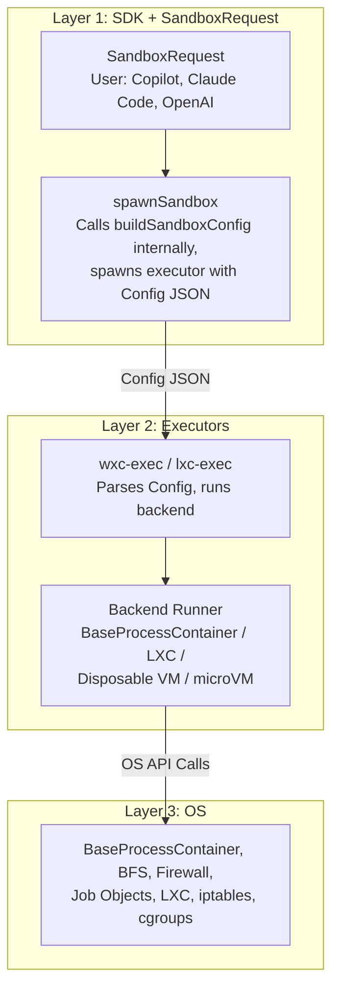
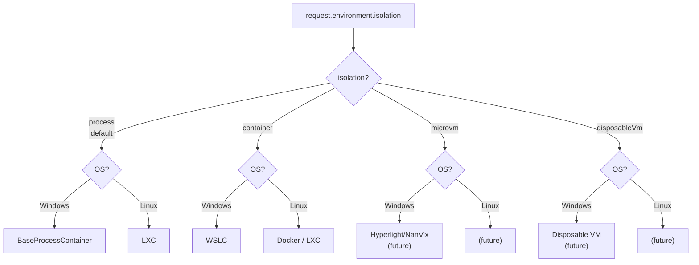

# MXC SandboxRequest Spec v1

---

## TL;DR

**Problem:** MXC's `SandboxPolicy` has 3 fields (version, filesystem, network). We need UI isolation, isolation level
selection, resource limits, and a clear development process: without making the API Windows-specific.

**Solution:** Introduce `SandboxRequest` that separates security intent (`policy`) from runtime selection
(`environment`). ~15 policy fields organized in 5 sections, following an **"intent, not mechanism"** philosophy
inspired by Apple's entitlements model:

```typescript
const request: SandboxRequest = {
  version: "0.5.0-dev",
  policy: {
    filesystem: { readwritePaths: ["/workspace"], readonlyPaths: ["/tools"] },
    network: { policy: "outbound" },              // CHANGED: enum replaces booleans
    ui: { allowWindows: false },                   // NEW: cross-platform UI intent
    resources: { maxMemoryMB: 512 },               // NEW: resource limits
    lifecycle: { destroyOnExit: true },            // NEW: sandbox lifecycle
    timeoutMs: 30000,                              // NEW: top-level execution timeout
  },
  environment: {
    isolation: "process",                          // "process" | "container" | "microvm" | "disposableVm"
  },
};
```

**Key rules:**
1. **Policy** = security intent: what the developer wants to
allow or deny. It is both declarative (expresses intent, not
mechanism) and security-focused (controls permissions and
restrictions). Config = mechanism (how the OS enforces it).
   Developers never see OS primitives.
2. **Environment** = runtime selection (what kind of sandbox).
3. **Config** = the JSON consumed by the executors
(wxc-exec, lxc-exec) to set up the sandbox. Generated by the
SDK from policy + environment. Not user-facing.
4. Default-deny. Omitted field = most restrictive.
5. Every policy field must work on ≥2 platforms. Windows-only
intent stays in `policy` with a platform note. Runtime
selection goes in `environment`.
6. **Additive-only within major versions** (semver 2.0). During
alpha, expect breaking changes.
6. Every policy or environment change requires a config change.
Config can change independently (backend optimizations).

**API:**
```typescript
spawnSandbox(script, request);
```

**For contributors:** See
[authoring-a-new-feature.md](../../authoring-a-new-feature.md) for
the development guide and decision tree, and
[Section 9](#9-worked-example--adding-ui-policy) for the UI policy
walkthrough.

---

## Table of Contents

1. [Problem Statement](#1-problem-statement)
2. [Non-Goals](#2-non-goals)
3. [Design Principles](#3-design-principles)
4. [Architecture](#4-architecture)
5. [Proposed SandboxRequest Model](#5-proposed-sandboxrequest-model)
6. [SandboxRequest → Config Mapping Rules](#6-sandboxrequest--config-mapping-rules)
7. [Versioning & Compatibility](#7-versioning--compatibility)
8. [Development Guide: Adding a New Feature](#8-development-guide--adding-a-new-feature)
9. [Worked Example: Adding UI Policy](#9-worked-example--adding-ui-policy)
10. [Industry Precedent Analysis](#10-industry-precedent-analysis)
11. [FAQ & Decision Log](#11-faq--decision-log)

---

## 1. Problem Statement

MXC provides sandboxed execution environments across Windows and Linux. Developers
interact with MXC through the TypeScript SDK's (`@microsoft/mxc-sdk`)
`SandboxPolicy` object, which today looks like this:

```typescript
type SandboxPolicy = {
  version: string;
  filesystem?: {
    readwritePaths?: string[];
    readonlyPaths?: string[];
    deniedPaths?: string[];
  };
  network?: {
    allowOutbound?: boolean;
    allowLocalNetwork?: boolean;
    proxy?: ...;
  };
};
```

Three fields. That's the entire developer-facing surface for controlling how a container is created, isolated, and
restricted.

Under the hood, the SDK translates this into a `ContainerConfig` JSON (30+ fields across 8 sections) that drives
`wxc-exec` or `lxc-exec` to create the actual container using OS primitives (BaseProcessContainer profiles, BFS
filesystem policies, Windows Firewall rules, LXC bind mounts, iptables chains).

### What's broken

1. **No way to express isolation intent.** The SDK silently defaults to BaseProcessContainer on Windows and LXC on
Linux. Developers cannot request a VM or microVM when stronger isolation is needed.

2. **No UI policy surface.** Contributors adding UI containment (clipboard, window isolation, input injection) don't
know where their work fits: SandboxRequest? Config? Both? The UIPolicy_Schema draft is Windows-specific (Job Object UI
limits, atom tables) but there's no cross-platform abstraction above it.

3. **Unclear boundary between Policy and Config.**
Contributors repeatedly ask: "Should I update SandboxPolicy or
Config? How do I know?" There's no decision framework.

4. **New backends are coming fast.** Disposable VMs, microVMs
(Hyperlight/NanVix), WSLC, and macOS are all planned. Each
has different access controls. The current "map `allowOutbound`
to either a backend-specific setting or a firewall rule"
approach doesn't scale to N backends × M policy surfaces.

### Primary consumers

MXC's first adopters are GitHub Copilot, Claude Code, and OpenAI: AI coding assistants that need an OS-provided way to
sandbox untrusted scripts produced by LLMs. These consumers need a policy surface that is:

- **Simple**: a few lines of code to get a secure sandbox
- **Cross-platform**: same policy works on Windows and Linux
- **Extensible**: new features can be added without breaking
existing code

---

## 2. Non-Goals

This spec does **not** cover:

- **Enterprise policy injection.** IT administrators
injecting restrictions into sandboxes on managed machines
(Group Policy, MDM, config files). This includes discovery and
merge strategy.
- **Runtime permission brokering.** Flatpak-style portals
(user-mediated access dialogs at runtime) are out of scope.
MXC policies are declared upfront and immutable for the sandbox's lifetime.
- **Multi-container orchestration.** Composing multiple sandboxes or sandbox-to-sandbox communication is not addressed
here.
- **Sandbox image management.** Container image pulling, caching, and distribution (relevant to LXC/WSLC) are separate
concerns.
- **Audit logging and telemetry.** How policy decisions are logged for compliance is a separate feature spec.

---

## 3. Design Principles

These principles are derived from analyzing six established sandbox technologies (see [Section
11](#11-industry-precedent-analysis)) and the concrete problems our team faces today.

### Principle 1: Intent, Not Mechanism

> **SandboxRequest describes *what* the developer wants.
> Config describes *how* the OS enforces it.**

A developer says: *"I don't want the sandboxed process to read the clipboard."*  
They write: `clipboard: "none"`.

They never write `JOB_OBJECT_UILIMIT_READCLIPBOARD` or `xdg-portal-disable-clipboard`. Those are mechanisms. Mechanisms
belong in Config and backend runners.

**Modeled after:** Apple's App Sandbox, where developers
declare entitlements (e.g., `com.apple.security.network.client`)
and the OS handles all enforcement internally. In MXC, the
SandboxRequest is the entitlement; Config and backend enforcement
are internal, just as Apple's sandbox profiles are.

### Principle 2: Default-Deny

> **Omitted fields = most restrictive. Adding a field opts *in* to a permission.**

```typescript
// This creates a fully locked-down sandboxed process (the default):
const request: SandboxRequest = { version: "0.5.0-dev", policy: {} };

// This allows outbound network:
const request: SandboxRequest = { version: "0.5.0-dev", policy: { network: { policy: "outbound" } } };
```

Every new field added to SandboxRequest in a future version automatically defaults to "denied" for existing requests
that don't set it. This is a security guarantee.

**Based on:** The design discussion around the UIPolicy_Schema
draft, which established default-deny as the standard for new
policy surfaces in MXC.

### Principle 3: Cross-Platform Where Possible

> **Policy fields should be cross-platform where possible.
> Platform-specific intent is allowed with a platform note.**

Cross-platform fields (e.g., `clipboard`, `filesystem`,
`network`) belong in policy and work on all platforms. The
enforcement mechanism differs per OS, but the intent is the same.

Platform-specific fields (e.g., `ui.ime`, which only applies on
Windows) can also go in policy if the user needs to opt in. They
are marked "Windows only" (or "Linux only") in the docs. The SDK
maps them to Config on the matching platform and silently skips
them on others. Both the SDK library and Config schema need
updates when adding these.

Fields that are purely implementation detail (e.g., AppContainer
capability lists, LXC mount flags) stay in Config only. The user
never sees them.

### Principle 4: Layered Containment

> **MXC is the policy layer. Backends are pluggable. The SDK picks
> the right one.**

The `SandboxRequest` separates security intent (`policy`) from runtime selection (`environment`). The
`environment.isolation` field lets developers declare their desired containment strength: `"process"`, `"container"`,
`"microvm"`, or `"disposableVm"`. The SDK maps this to the best available backend for the current OS. Today
`"process"` is implemented (BaseProcessContainer on Windows, LXC on Linux). Other levels are in development.

**The developer never names a backend directly.** They express
intent; the SDK resolves it.

### Principle 5: Version Is a Contract

> **See [versioning.md](../../versioning.md) for the full
> versioning design.**

The SandboxRequest version and Config schema version are locked
in step. A version number guarantees behavior.

---

## 4. Architecture

MXC has two mechanisms:

1. **SandboxRequest** (policy + environment): the user-facing
input. Developers express security intent (what to allow/deny)
and runtime selection (what kind of sandbox). This is the
TypeScript SDK library API.

2. **Configuration** (Config): the backend-facing JSON schema
used to create containment backends. The SDK generates Config
from the SandboxRequest. Config is consumed by `wxc-exec` and
`lxc-exec` to set up the actual sandbox. Developers do not
write Config directly.

MXC is a **policy layer** that sits above diverse container
technologies. Process containers (BaseProcessContainer on
Windows, LXC on Linux), self-contained environments (WSLC,
Docker), and VMs (disposable VMs, microVMs) are all backends
that MXC can invoke.

```
┌─────────────────────────────────────────────────────────────┐
│ LAYER 1: SDK + SandboxRequest (policy + environment)        │
│                                                             │
│ Users: GitHub Copilot, Claude Code, OpenAI, etc.            │
│                                                             │
│ SandboxRequest (TypeScript): developer-facing intent        │
│   policy:      security intent (filesystem, network, ui)    │
│   environment: runtime selection (isolation, linux distro)  │
│ SDK: buildSandboxConfig(): request → Config JSON            │
│                                                             │
│ Cross-platform. Intent only.                                │
│ SDK detects OS, selects backend, generates Config.          │
└──────────────────────────────┬──────────────────────────────┘
                               │ Config JSON (base64-encoded)
                               ▼
┌─────────────────────────────────────────────────────────────┐
│ LAYER 2: Executors (wxc-exec, lxc-exec)                     │
│                                                             │
│ Parse Config JSON → select backend runner → apply config    │
│ Backends: BaseProcessContainer, LXC,                        │
│           Disposable VM, microVM, WSLC                      │
│                                                             │
│ Rust. Schema-validated. Can be OS-specific.                 │
└──────────────────────────────┬──────────────────────────────┘
                               │ OS API calls
                               ▼
┌─────────────────────────────────────────────────────────────┐
│ LAYER 3: OS Primitives                                      │
│                                                             │
│ Windows: BaseProcessContainer profiles, BFS, Firewall,      │
│          Job Objects, Win32k system call filtering          │
│ Linux: LXC cgroups, bind mounts, iptables, seccomp          │
│                                                             │
│ Kernel and system-level enforcement.                        │
│ Never referenced by name in Layer 1.                        │
└─────────────────────────────────────────────────────────────┘
```

A developer should never need to know that BaseProcessContainer
exists, that BFS is used for filesystem policies, or that
`JOB_OBJECT_UILIMIT_GLOBALATOMS` is the mechanism for atom table
isolation. If they do, the abstraction has failed.

> **OS contributions:** Some features require new OS APIs or
> kernel behaviors that don't exist yet. When that's the case,
> OS changes ship first (e.g., in `os.2020`), then the executor
> (wxc-exec/lxc-exec) calls the new API, then the SDK maps to
> it. See the implementation checklist in
> [Section 9.7](#97-implementation-checklist).

### Config granularity

Config exists to translate policy and environment into something
the executors (wxc-exec, lxc-exec) can act on. It is not a
general-purpose deployment manifest or a way to provide granular
control over every OS knob.

Rules for Config:

- **Every Config field must be reachable** from policy or
environment, either directly or via SDK defaults. If a field
has no path from the user-facing input, it should not exist.
- **Keep Config minimal.** Only add Config fields that the
executors actually need to set up the sandbox. Do not expose
OS internals just because they exist.
- **Config is not user-facing.** Users interact with
SandboxRequest. Config is the internal contract between the
SDK library and the executors. If you find yourself wanting
users to edit Config, that's a signal the field should be in
policy or environment instead.
- **SDK defaults fill the gap.** When policy says
`allowWindows: true`, the SDK sets Config fields like
`ui.isolation: "container"` and `ui.desktopSystemControl: false`
without the user knowing. These are safe defaults derived from
the intent, not arbitrary Config values.

---

## 5. Proposed SandboxRequest Model

> **Full field reference:** See [reference.md](reference.md) for every field, type, default, and example.

The SandboxRequest separates two concerns: **policy** (security intent) and **environment** (runtime selection):

```typescript
type SandboxRequest = {
  version: string;                        // Policy/schema version (semver)
  policy: SandboxPolicy;                  // Security intent
  environment?: SandboxEnvironment;       // Runtime selection (optional)
};

type SandboxPolicy = {
  filesystem?: { ... };                   // readwritePaths, readonlyPaths, deniedPaths, tempDir
  network?: { ... };                      // policy, allowedHosts, blockedHosts,
                                          // proxy, enforcementMode
  ui?: { ... };                           // allowWindows, clipboard,
                                          // allowInputInjection,
                                          // isolation (Win), ime (Win),
                                          // desktopSystemControl (Win),
                                          // systemSettings (Win)
  resources?: { ... };                    // maxMemoryMB, maxCpus
  leastPrivilege?: boolean;               // Least privilege mode (Win)
  integrityLevel?: "inherit"|"low"|"medium"; // Process IL (Win)
  timeoutMs?: number;                     // Execution timeout (ms)
  lifecycle?: { ... };                    // destroyOnExit
};

type SandboxEnvironment = {
  isolation?: "process" | "container"     // Containment strength
    | "microvm" | "disposableVm";
  linux?: {                               // Linux-specific runtime
    distribution?: string;                // e.g., "alpine", "ubuntu"
    release?: string;                     // e.g., "3.23", "24.04"
  };
  vm?: {                                  // VM-specific runtime
    idleTimeoutMs?: number;               // Idle timeout (default: 300000)
    daemonPipeName?: string;              // Pipe name (Win, default: "wxc-sandbox")
  };
};
```

Key design decisions:
- **Default-deny**: `{ version: "0.5.0-dev", policy: {} }` creates
  a fully locked-down sandboxed process (the default)
- **Policy vs Environment**: policy declares what to allow/deny.
  Environment declares what kind of sandbox. Config is internal,
  derived from both.

| Change | Rationale |
|--------|-----------|
| `SandboxRequest` = `policy` + `environment` | Separates security intent from runtime selection. Config is internal. |
| `isolation` in `environment` | It's "what to run in," not "what to restrict." |
| `network.policy` enum | Replaces ambiguous boolean pair (`allowOutbound` + `allowLocalNetwork`). |
| `ui` section | Cross-platform UI intent: `allowWindows`, `clipboard`, `allowInputInjection`. |
| `lifecycle`, `timeoutMs`, `resources`, `filesystem.tempDir` | Security constraints and resource limits as policy fields. |

### What was deliberately NOT added

| Omitted | Reason |
|---------|--------|
| `containment` (backend name) | Developers declare isolation level in `environment.isolation`. The SDK picks the backend. |
| Per-backend Config sections | `appcontainer {}`, `lxc {}`, `wslc {}` are internal Config. Every Config field is derived from policy or environment; there is nothing in Config that a developer sets directly. |
| Audio/video/peripheral access | Future work. |

---

## 6. SandboxRequest → Config Mapping Rules

This section defines how the SDK's `buildSandboxConfig()` function
(currently `buildSandboxPayload()` in the codebase) translates
each SandboxRequest field into backend-specific Config fields.

### 6.1 Environment → Backend Selection

The SDK maps `request.environment.isolation` to a containment backend per OS:

| `request.environment.isolation` | Windows | Linux |
|-------------|---------|-------|
| `"process"` (default) | BaseProcessContainer | LXC |
| `"container"` | WSLC (future) | Docker (future) |
| `"microvm"` | Hyperlight/NanVix (future) | microVM (future) |
| `"disposableVm"` | Disposable VM (future) | (future) |

Today only `"process"` is implemented. Other levels return
`BACKEND_UNAVAILABLE` until their backends ship. The SDK never
silently downgrades.

### 6.2 Network Policy → Config

| `request.policy.network` | BaseProcessContainer | LXC | VM |
|---------------|-------------|-----|------------|
| `policy: "none"` | Network blocked (firewall deny-all). | Network blocked (firewall deny-all). | VM network adapter disabled. |
| `policy: "local"` | Firewall allows localhost + RFC 1918 ranges only. | Firewall allows localhost + RFC 1918 ranges only. | VM NAT to host only. |
| `policy: "outbound"` | Firewall allows all outbound. | Firewall allows all outbound. | VM NAT with internet. |
| `policy: "full"` | Firewall allows all traffic (outbound + inbound). | Firewall allows all traffic, full bridge mode. | VM bridged network. |
| `allowedHosts: [...]` | `network.allowedHosts: [...]` + firewall enforcement. | `network.allowedHosts: [...]` + iptables. | VM firewall rules. |
| `proxy` | `network.proxy` (pass-through). | Error (not yet supported). |

### 6.3 UI Policy → Config

| `request.policy.ui` | BaseProcessContainer (Windows) | LXC (Linux) | Sandbox VM |
|---------------|----------------------|-------------|------------|
| `ui` omitted or `{}` | `ui.disable: true` (full lockdown: Win32k blocked, all UI limits applied). | No X11/Wayland socket. `DISPLAY` unset. | No clipboard/input redirection in RDP session. |
| `allowWindows: true` | `ui.disable: false`, `ui.isolation: "container"` (safe default: per-job handles + atom tables). | Mount X11/Wayland socket. Set `DISPLAY`. | Enable RDP window rendering. |
| `clipboard: "read"` | `ui.clipboard: "read"`. | `xclip` / `wl-copy` read-only access via portal or socket permission. | RDP clipboard: host→guest only. |
| `clipboard: "readwrite"` | `ui.clipboard: "all"`. | Full clipboard socket access. | RDP clipboard: bidirectional. |
| `allowInputInjection: true` | `ui.injection: true`. | Allow `/dev/uinput` access. | RDP input passthrough. |
| `isolation: "atoms"` | `ui.isolation: "atoms"`. | N/A (Windows only). | N/A. |
| `desktopSystemControl: true` | `ui.desktopSystemControl: true`. | N/A (Windows only). | N/A. |
| `systemSettings: "parameters"` | `ui.systemSettings: "parameters"`. | N/A (Windows only). | N/A. |
| `ime: true` | `ui.ime: true`. | N/A (Windows only). | N/A. |

When a UI field is set but the backend doesn't support it
(e.g., Windows-only fields on Linux), the SDK logs a warning
and the field is ignored.

### 6.4 Filesystem → Config

Filesystem mapping is largely pass-through, as it's already cross-platform:

| `request.policy.filesystem` | Config |
|---------------|--------|
| `readwritePaths` | `filesystem.readwritePaths` (BaseProcessContainer: BFS rules, LXC: bind mounts rw) |
| `readonlyPaths` | `filesystem.readonlyPaths` (BaseProcessContainer: BFS rules, LXC: bind mounts ro) |
| `deniedPaths` | `filesystem.deniedPaths` (BaseProcessContainer: BFS deny rules, LXC: tmpfs mask) |
| `tempDir: "shared"` | Add host temp dir to `filesystem.readwritePaths` |
| `tempDir: "isolated"` | Create private temp dir. Add to `filesystem.readwritePaths`. Set `TEMP`/`TMP`/`TMPDIR` env. |

### 6.5 Resources → Config

| `request.policy.resources` | BaseProcessContainer | LXC |
|---------------|-------------|-----|
| `maxMemoryMB` | Job Object memory limit | cgroup `memory.max` |
| `maxCpus` | Job Object CPU rate limit | cgroup `cpuset.cpus` |

> Resources mapping for future backends (WSLC, VMs) will be
> documented when those backends ship.

### 6.6 Lifecycle → Config

| `request.policy.lifecycle` | Config |
|---------------|--------|
| `lifecycle.destroyOnExit` | `lifecycle.destroyOnExit` (pass-through) |

### 6.7 Process & Timeout → Config

| `request.policy` | Config |
|---------------|--------|
| `timeoutMs` | `process.timeout` |

> `env` and `cwd` are passed to `spawnSandbox()` as function parameters,
> not through SandboxRequest. They are mapped to `process.env` and
> `process.cwd` in Config by the SDK at spawn time.

### 6.8 Error Model

The SDK defines a discriminated error type for all policy-related failures:

```typescript
type SandboxRequestError =
  | { code: "UNSUPPORTED_ISOLATION"; isolation: string;
      os: string; message: string }
  | { code: "INVALID_POLICY"; field: string; message: string }
  | { code: "PLATFORM_NOT_SUPPORTED"; os: string; message: string }
  | { code: "BACKEND_UNAVAILABLE"; backend: string;
      reason: string; message: string }
  | { code: "VERSION_MISMATCH"; requestVersion: string;
      sdkVersion: string; message: string };
```

All errors include a human-readable `message` plus structured fields for programmatic handling. Primary consumers
(GitHub Copilot, Claude Code) can switch on `code` to decide how to recover.

### 6.9 `allowedHosts` Interaction with Network Policy

| `network.policy` | `allowedHosts` behavior |
|-------------------|------------------------|
| `"none"` | Ignored. No network access regardless of allowedHosts. |
| `"local"` | **Narrows local range.** Only the specified local hosts are reachable. If omitted, all localhost + RFC 1918 ranges are allowed. |
| `"outbound"` | **Allowlist mode.** Only hosts in `allowedHosts` are reachable. If `allowedHosts` is omitted, all outbound traffic is allowed. |
| `"full"` | Ignored. Full network access regardless of allowedHosts. |

### 6.10 Cross-Field Interactions

Some SandboxRequest fields interact with each other. These rules are enforced by the SDK:

| Field Combination | Behavior |
|-------------------|----------|
| `policy.network.policy: "none"` + `policy.network.proxy` | Proxy is ignored. No network means no proxy. SDK logs a warning. |
| `policy.network.policy: "none"` + `policy.network.allowedHosts` | allowedHosts is ignored. No network means no hosts. |
| `policy.ui.allowWindows: false` + `policy.ui.clipboard` | Clipboard is irrelevant when GUI is disabled. SDK still passes the value to Config for defense-in-depth. |
| `policy.resources.maxMemoryMB` on process isolation | Enforced via Job Object (Windows) or cgroup (Linux). Supported but coarser-grained than full environment/VM resource limits. |

> **Design rule:** When two fields produce ambiguous behavior, the SDK chooses the more restrictive interpretation
and logs a diagnostic message.

---

## 7. Versioning & Compatibility

> **Full versioning details:** See [versioning.md](../../versioning.md).

Key points relevant to SandboxRequest:

- **SandboxRequest version = Config schema version. Always.** Same
number, bumped together.
- **SDK version is independent.** SDK can be v5.0 while
policy/schema is v2.1.
- **SDK supports one major version at a time.** If your request
version is newer than what the SDK knows, it rejects. Users
should upgrade their SDK.
- **No backward compat across major versions.** A major bump
means the MXC SDK can drop support for old policy versions.
This does not affect Windows OS support; it is an MXC SDK
change only.
- **During alpha, expect breaking changes** as SandboxRequest
evolves.
- **Experimental fields** are gated behind
`SandboxSpawnOptions.experimental: true` and don't affect the stable
version number.

---

## 8. Development Guide

> **Full guide:**
> [authoring-a-new-feature.md](../../authoring-a-new-feature.md)

That document covers:
- **Step 0:** Decision tree: where does your feature go?
(policy, environment, Config, or Rust-only)
- **Steps 1–8:** Feature spec → SandboxRequest → SDK mapping →
Config schema → Rust parser → backend runner → tests → version
bump
- **Worked example** of the experimental feature workflow

---

## 9. Worked Example: Adding UI Policy

This section walks through the complete process of adding UI containment support as a concrete example of the
development workflow.

### 9.1 Problem

Processes on Windows can currently interact freely with the GUI subsystem: creating windows, reading the
clipboard, injecting input. This is a security gap for untrusted code execution.

### 9.2 SandboxRequest Addition (Layer 1)

The developer-facing intent is simple:

```typescript
// "I want my sandbox to be able to create windows, but no clipboard and no input injection"
const request: SandboxRequest = {
  version: "0.5.0-dev",
  policy: {
    ui: {
      allowWindows: true,
      clipboard: "none",
      allowInputInjection: false,
    },
  },
  environment: {
    isolation: "process",
  },
};
```

**Cross-platform test:**
- Windows: Maps to Job Object UI limits + Win32k filtering ✅
- Linux (LXC with X11): Maps to X11 socket access + clipboard tool restrictions ✅
- VM: Maps to RDP session settings ✅

All three platforms can enforce these three intents. The field passes Principle 3.

### 9.3 Config Schema Addition (Layer 2)

The Config `ui` section has full Windows-specific granularity (per UIPolicy_Schema):

```json
"ui": {
  "disable": false,
  "clipboard": "none",
  "isolation": "container",
  "desktopSystemControl": false,
  "systemSettings": "none",
  "ime": false,
  "injection": false
}
```

Note: `isolation`, `desktopSystemControl`, `systemSettings`, and
`ime` are Windows-only policy fields. They map directly to Config
`ui` fields of the same name.

### 9.4 Mapping (SDK)

In `buildSandboxConfig()`, the SDK maps `request.policy.ui`
fields to Config:

```typescript
if (platform === 'win32') {
  const ui = request.policy.ui;

  if (ui) {
    config.ui = {
      disable: !(ui.allowWindows ?? false),
      clipboard: mapClipboard(ui.clipboard ?? "none"),
      isolation: ui.isolation ?? "container",
      desktopSystemControl: ui.desktopSystemControl ?? false,
      systemSettings: ui.systemSettings ?? "none",
      ime: ui.ime ?? false,
      injection: ui.allowInputInjection ?? false,
    };
  } else {
    config.ui = { disable: true };
  }
}

function mapClipboard(value: string): string {
  switch (value) {
    case "none": return "none";
    case "read": return "read";
    case "write": return "write";
    case "readwrite": return "all";
    default: return "none";
  }
}
```

### 9.5 Backend Implementation (Rust)

In `appcontainer.rs`, parse the `ui` section from `ContainerConfig` and apply:

```rust
fn apply_ui_policy(&self, ui: &UiConfig, job_handle: HANDLE) -> Result<(), String> {
    if ui.disable {
        // Block Win32k system calls entirely
        self.set_process_mitigation(DisallowWin32kSystemCalls, true)?;
    }

    let mut ui_restrictions = 0u32;

    // Clipboard
    match ui.clipboard.as_str() {
        "none" => {
            ui_restrictions |= JOB_OBJECT_UILIMIT_READCLIPBOARD;
            ui_restrictions |= JOB_OBJECT_UILIMIT_WRITECLIPBOARD;
        }
        "read" => {
            ui_restrictions |= JOB_OBJECT_UILIMIT_WRITECLIPBOARD;
        }
        "write" => {
            ui_restrictions |= JOB_OBJECT_UILIMIT_READCLIPBOARD;
        }
        "all" => { /* no restrictions */ }
        _ => {
            ui_restrictions |= JOB_OBJECT_UILIMIT_READCLIPBOARD;
            ui_restrictions |= JOB_OBJECT_UILIMIT_WRITECLIPBOARD;
        }
    }

    // Isolation level
    match ui.isolation.as_str() {
        "container" => {
            ui_restrictions |= JOB_OBJECT_UILIMIT_HANDLES;
            ui_restrictions |= JOB_OBJECT_UILIMIT_GLOBALATOMS;
        }
        "handles" => {
            ui_restrictions |= JOB_OBJECT_UILIMIT_HANDLES;
        }
        "atoms" => {
            ui_restrictions |= JOB_OBJECT_UILIMIT_GLOBALATOMS;
        }
        "desktop" => { /* no handle/atom restrictions */ }
        _ => {
            ui_restrictions |= JOB_OBJECT_UILIMIT_HANDLES;
            ui_restrictions |= JOB_OBJECT_UILIMIT_GLOBALATOMS;
        }
    }

    // Apply to Job Object
    self.set_job_ui_restrictions(job_handle, ui_restrictions)?;
    Ok(())
}
```

### 9.6 Testing

1. **SDK unit test:** `buildSandboxConfig` with
`policy: { ui: { allowWindows: true, clipboard: "read" } }`
produces Config with `ui.disable: false`, `ui.clipboard: "read"`,
`ui.isolation: "container"`.
2. **Config integration test:** `test_configs/ui_lockdown.json`
with `ui: {}` verifies full lockdown. You can test directly with
`wxc-exec config.json` bypassing the SDK entirely.
3. **SDK integration test** (`cli/cli.test.ts`): Spawn a sandbox
with clipboard access, verify clipboard operations work/fail as
expected.

### 9.7 Implementation checklist

Some features require changes at all three layers. Work
bottom-up: OS first, then executors, then SDK.

1. **OS layer (if needed):** If the feature requires a new OS API
or kernel behavior that doesn't exist yet (e.g., a new Job
Object UI restriction, a new process mitigation), that must
ship in Windows first. Create a PR in `os.2020` to add or
expose the OS primitive. The executor (wxc-exec) will call this
API, so coordinate the API surface with the executor author.
This step is not always needed; many features use existing OS
APIs.

2. **Config layer:** Build the `ui` section in Config schema +
Rust implementation (appcontainer.rs). The executor code calls
the OS APIs from step 1. Test directly with
`wxc-exec config.json` to verify Config fields work end-to-end
against the OS.

3. **SandboxRequest layer:** Add the field to `SandboxPolicy`
(or `SandboxEnvironment`). Add the mapping in
`buildSandboxConfig()` that translates the request into Config.

4. **Verify mapping:** The Config field names/types are the
contract. The mapping rules (Section 6) define how the request
produces Config. Ensure all Config fields are reachable from
policy or environment.

5. **End-to-end validation:** Test through the SDK by calling
`spawnSandbox()` with the new field set. This exercises the
full pipeline: request → SDK → Config → executor → OS.

---

## 10. Industry Precedent Analysis

| Technology | Model | What MXC Adopts |
|-----------|-------|-----------------|
| **Apple App Sandbox** | Entitlements (intent) → sandbox profiles (mechanism). Cross-version stable. | **The two-layer model.** SandboxPolicy = entitlements, Config = profiles. |
| **Flatpak** | `finish-args` (declarative) → Portals (runtime mediation). | **Declarative permissions.** `--share=network` ≈ `network.policy: "outbound"`. |
| **Windows Sandbox** | `.wsb` XML with ~10 simple boolean/enum fields. | **Simplicity.** Small policy surface covers 90% of use cases. (Disposable VM model.) |
| **Chromium** | Broker/target model. Internal-only policies. | **Broker pattern** for mediating access between isolated and non-isolated processes. |

**Key takeaway:** MXC's two-layer model is most closely aligned with Apple's entitlements → profiles, extended to be
cross-platform. The main MXC innovation is that the Config layer targets multiple backends across multiple operating
systems.

---

## Diagrams

### 11.1 End-to-End Data Flow



### Backend Selection



---

## 11. FAQ & Decision Log

### "Should I update policy, environment, or Config?"

Use the decision tree in
[authoring-a-new-feature.md](../../authoring-a-new-feature.md).

- **Policy**: does this restrict what the sandboxed code can do?
(e.g., network access, filesystem, UI, timeouts) → `policy`
- **Environment**: does this choose what kind of sandbox to run
in? (e.g., isolation level, Linux distro/release) → `environment`
- **Config**: the Config is derived from policy + environment.
Every Config field must be reachable from one of those two,
either directly (user sets it) or via SDK defaults (SDK sets it
based on policy/environment values). There should never be a
Config field that has no path from policy or environment.

### "What if my feature doesn't make sense on Linux?"

If it's a security restriction, put it in `policy` with a
"Windows only" note. If it's a runtime selection (what kind of
sandbox to run in), put it in `environment`. Config is derived
from these two; every Config field must be reachable from
policy or environment.

### "Can a developer bypass SandboxRequest and use Config directly?"

**Yes.** Pass Config JSON directly to `wxc-exec config.json`.
Useful for testing Config changes, accessing platform-specific
features, and internal development. The SDK's
`buildSandboxConfig()` is the recommended path for production.


