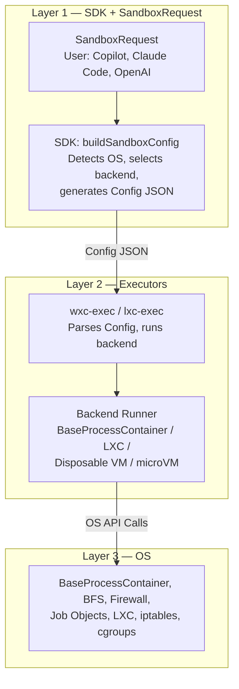
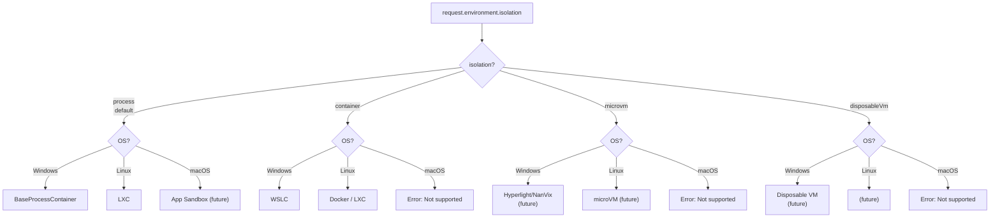

# SandboxPolicy Spec v1

---

## TL;DR

**Problem:** MXC's `SandboxPolicy` has 3 fields (version, filesystem, network). We need UI isolation, isolation level
selection, resource limits, and a clear development process — without making the API Windows-specific.

**Solution:** Introduce `SandboxRequest` that separates security intent (`policy`) from runtime selection
(`environment`). ~15 policy fields organized in 5 sections, following an **"intent, not mechanism"** philosophy
inspired by Apple's entitlements model:

```typescript
const request: SandboxRequest = {
  version: "0.5.0-dev",
  policy: {
    filesystem: { readwritePaths: ["/workspace"], readonlyPaths: ["/tools"] },
    network: { policy: "outbound" },              // CHANGED: enum replaces booleans
    ui: { allowWindows: false },                   // NEW: cross-platform UI intent
    resources: { maxMemoryMB: 512 },               // NEW: resource limits
    lifecycle: { destroyOnExit: true },            // NEW: sandbox lifecycle
    timeoutMs: 30000,                              // NEW: top-level execution timeout
  },
  environment: {
    isolation: "process",                          // "process" | "container" | "microvm" | "disposableVm"
  },
};
```

**Key rules:**
1. **Policy** = security intent (what to allow/deny). Developers express what they want. Config = mechanism (how).
   Developers never see OS primitives.
2. **Environment** = runtime selection (what kind of sandbox). Config = backend materialization. Internal. Derived
   from policy + environment.
3. Default-deny. Omitted field = most restrictive. New fields never break old policies.
4. Every policy field must work on ≥2 platforms. Windows-only intent stays in `policy` with a platform note.
   Runtime selection goes in `environment`.
5. **Additive-only within major versions** (semver 2.0). During alpha, expect breaking changes.
6. Every policy or environment change requires a config change. But config can change independently (backend
   optimizations, bug fixes).

**Two APIs:**
```typescript
// Simple — one call:
spawnSandbox(script, request);

// Advanced — inspect/modify config before spawning:
const config = buildSandboxConfig(request);
spawnSandboxFromConfig(script, config);
```

**For contributors:** See
[authoring-a-new-feature.md](../../authoring-a-new-feature.md) for
the development guide and decision tree, and
[Section 9](#9-worked-example--adding-ui-policy) for the UI policy
walkthrough.

---

## Table of Contents

1. [Problem Statement](#1-problem-statement)
2. [Non-Goals](#2-non-goals)
3. [Design Principles](#3-design-principles)
4. [Architecture](#4-architecture)
5. [Proposed SandboxRequest Model](#5-proposed-sandboxrequest-model)
6. [SandboxRequest → Config Mapping Rules](#6-sandboxrequest--config-mapping-rules)
7. [Versioning & Compatibility](#7-versioning--compatibility)
8. [Development Guide — Adding a New Feature](#8-development-guide--adding-a-new-feature)
9. [Worked Example — Adding UI Policy](#9-worked-example--adding-ui-policy)
10. [Industry Precedent Analysis](#10-industry-precedent-analysis)
11. [FAQ & Decision Log](#11-faq--decision-log)
12. [Post-GA Features](#12-post-ga-features)

---

## 1. Problem Statement

MXC provides sandboxed execution environments across Windows and Linux. Developers
interact with MXC through the TypeScript SDK's (`@microsoft/mxc-sdk`)
`SandboxPolicy` object, which today looks like this:

```typescript
type SandboxPolicy = {
  version: string;
  filesystem?: { readwritePaths?: string[]; readonlyPaths?: string[]; deniedPaths?: string[]; };
  network?: { allowOutbound?: boolean; allowLocalNetwork?: boolean; proxy?: ...; };
};
```

Three fields. That's the entire developer-facing surface for controlling how a container is created, isolated, and
restricted.

Under the hood, the SDK translates this into a `ContainerConfig` JSON (30+ fields across 8 sections) that drives
`wxc-exec` or `lxc-exec` to create the actual container using OS primitives (BaseProcessContainer profiles, BFS
filesystem policies, Windows Firewall rules, LXC bind mounts, iptables chains).

### What's broken

1. **No way to express isolation intent.** The SDK silently defaults to BaseProcessContainer on Windows and LXC on
Linux. Developers cannot request a VM or microVM when stronger isolation is needed.

2. **No UI policy surface.** Contributors adding UI containment (clipboard, window isolation, input injection) don't
know where their work fits: SandboxPolicy? Config? Both? The UIPolicy_Schema draft is Windows-specific (Job Object UI
limits, atom tables) but there's no cross-platform abstraction above it.

3. **No enterprise integration.** IT administrators cannot
inject restrictions into sandboxes on managed machines. This is a
post-GA feature.
machines. There's no discovery mechanism, no merge strategy, no API.

4. **Unclear boundary between Policy and Config.** Contributors repeatedly ask: "Should I update SandboxPolicy or
Config? How do I know?" There's no decision framework.

5. **New backends are coming fast.** Disposable VMs, microVMs (Hyperlight/NanVix), WSLC, and macOS are all planned. Each
has different access controls. The current "map `allowOutbound` to
either a backend-specific setting or a firewall rule"
approach doesn't scale to N backends × M policy surfaces.

### Primary consumers

MXC's first adopters are GitHub Copilot, Claude Code, and OpenAI — AI coding assistants that need an OS-provided way to
sandbox untrusted scripts produced by LLMs. These consumers need a policy surface that is:

- **Simple** — a few lines of code to get a secure sandbox
- **Cross-platform** — same policy works on Windows and Linux
- **Extensible** — new features can be added without breaking
existing code

---

## 2. Non-Goals

This spec does **not** cover:

- **Runtime permission brokering.** Flatpak-style portals (user-mediated access dialogs at runtime) are out of scope.
MXC policies are declared upfront and immutable for the sandbox's lifetime.
- **Multi-container orchestration.** Composing multiple sandboxes or sandbox-to-sandbox communication is not addressed
here.
- **Sandbox image management.** Container image pulling, caching, and distribution (relevant to LXC/WSLC) are separate
concerns.
- **Audit logging and telemetry.** How policy decisions are logged for compliance is a separate feature spec.

---

## 3. Design Principles

These principles are derived from analyzing six established sandbox technologies (see [Section
11](#11-industry-precedent-analysis)) and the concrete problems our team faces today.

### Principle 1: Intent, Not Mechanism

> **SandboxPolicy describes *what* the developer wants. Config describes *how* the OS enforces it.**

A developer says: *"I don't want the sandboxed process to read the clipboard."*  
They write: `clipboard: "none"`.

They never write `JOB_OBJECT_UILIMIT_READCLIPBOARD` or `xdg-portal-disable-clipboard`. Those are mechanisms. Mechanisms
belong in Config and backend runners.

**Modeled after:** Apple's App Sandbox entitlements, where `com.apple.security.network.client` (intent) maps to sandbox
profile rules (mechanism).

### Principle 2: Default-Deny

> **Omitted fields = most restrictive. Adding a field opts *in* to a permission.**

```typescript
// This creates a fully locked-down sandbox:
const request: SandboxRequest = { version: "0.5.0-dev", policy: {} };

// This allows outbound network:
const request: SandboxRequest = { version: "0.5.0-dev", policy: { network: { policy: "outbound" } } };
```

Every new field added to SandboxPolicy in a future version automatically defaults to "denied" for existing requests
that don't set it. This is a security guarantee.

**Modeled after:** Flatpak finish-args and the existing
UIPolicy_Schema draft.

### Principle 3: Cross-Platform by Design

> **Every policy field must be meaningful on at least two platforms. Platform-specific behavior lives only in Config.**

If a concept exists only on Windows (e.g., atom table isolation) or only on Linux (e.g., cgroup memory limits), it
cannot be a policy field. It can be a Config field under a platform-specific section (`appcontainer`, `lxc`).

If a concept is universal (e.g., clipboard access, filesystem paths, network access), it belongs in policy even if
the enforcement mechanism differs per platform. Windows-only intent stays in `policy` with a "Windows only" note.
Runtime selection (isolation level, Linux distribution) goes in `environment`.

**Test:** Before adding a field to policy, answer: "How would this be enforced on Windows? On Linux? On macOS?" If
you can't answer for at least two, it's a Config field.

### Principle 4: Layered Containment

> **MXC is the policy layer. Backends are pluggable. The SDK picks
> the right one.**

The `SandboxRequest` separates security intent (`policy`) from runtime selection (`environment`). The
`environment.isolation` field lets developers declare their desired containment strength: `"process"`, `"container"`,
`"microvm"`, or `"disposableVm"`. The SDK maps this to the best available backend for the current OS. Today
`"process"` is fully implemented (BaseProcessContainer on Windows, LXC on Linux). Other levels are in development.

**The developer never names a backend directly.** They express
intent; the SDK resolves it.

### Principle 5: Version Is a Contract

> **The SandboxRequest version and Config schema version are locked in step. A version number guarantees behavior.**

`version: "0.5.0-dev"` means the exact same set of fields, defaults, and semantics — regardless of which OS or SDK
build is running. If a field was added in 0.6.0, a 0.5.0 request will never see it.

Consequences:
- New policy or environment field → minor version bump (both request and Config schema)
- Removed or changed field → major version bump (both)
- SDK rejects configs with a version higher than it supports
- Old requests on new SDKs: unchanged behavior (new fields auto-deny)

### Principle 6: Composable

> **Policy fragments can be built independently and merged.**

The SDK already supports this pattern through `FilesystemPolicyResult`:

```typescript
const tools = getAvailableToolsPolicy();
const profile = getUserProfilePolicy();
const temp = getTemporaryFilesPolicy();

const request: SandboxRequest = {
  version: "0.5.0-dev",
  policy: {
    filesystem: {
      readonlyPaths: [...tools.readonlyPaths, ...profile.readonlyPaths],
      readwritePaths: [...temp.readwritePaths, workDir],
    },
  },
};
```

This pattern extends to all policy sections.

> **Future direction:** Today the SDK provides catch-all discovery helpers (`getAvailableToolsPolicy`,
`getUserProfilePolicy`, `getTemporaryFilesPolicy`). In future versions, we want targeted fragment APIs that return
policy for specific tools or contexts — e.g.,
`getPythonPolicy()`, `getNodePolicy()`, `getGitPolicy()`. This lets
consumers build precise, minimal policies instead of granting broad read-only access to everything on `PATH`.

### Principle 7: Stability Within Major Versions

> **Within a major version, SandboxRequest is additive-only. Breaking changes require a major version bump per semver
2.0.**

Within a major version (e.g., all 1.x releases):
- Fields can be added but never removed, renamed, or have their defaults changed
- A request written for 1.0 must behave identically on SDK 1.5
- New fields auto-deny (default-deny) so existing requests are never broken

Across major versions (e.g., 1.x → 2.0):
- Fields CAN be removed, renamed, or have defaults changed
- Deprecated fields from the previous major version may be dropped
- The SDK provides a migration guide for each major bump
- Old major versions continue to work on the old SDK (users aren't forced to upgrade)

This follows [semver 2.0](https://semver.org/) strictly. During the 0.x alpha period, breaking changes are permitted
with any minor version bump (per semver 2.0 §4: "Major version zero is for initial development. Anything MAY change at
any time.").

---

## 4. Architecture

MXC is a **policy layer** that sits above diverse container technologies. Process containers (BaseProcessContainer on
Windows, LXC on Linux), self-contained environments (WSLC, Docker), and VMs (disposable VMs, microVMs) are all backends
that MXC can invoke. The `SandboxRequest` is the single, unified API through which developers express their intent —
security policy and runtime environment. The SDK translates that intent into backend-specific configuration.

```
┌─────────────────────────────────────────────────────────────────────────┐
│  LAYER 1: SDK + SandboxRequest (policy + environment)                   │
│                                                                         │
│  Consumers: GitHub Copilot, Claude Code, OpenAI, etc.                  │
│                                                                         │
│  SandboxRequest (TypeScript) — developer-facing intent                 │
│    policy:      security intent (filesystem, network, ui, resources)   │
│    environment: runtime selection (isolation, linux distro)            │
│  SDK: buildSandboxConfig() — compiles request into Config JSON         │
│                                                                         │
│  Cross-platform. No OS-specific fields. Intent only.                   │
│  SDK detects OS, selects backend, generates Config.                    │
└────────────────────────────────┬────────────────────────────────────────┘
                                 │ Config JSON (base64-encoded)
                                 ▼
┌─────────────────────────────────────────────────────────────────────────┐
│  LAYER 2: Executors (wxc-exec, lxc-exec)                               │
│                                                                         │
│  Consumers: The SDK spawns these as child processes                    │
│                                                                         │
│  Parse Config JSON → select backend runner → apply config             │
│  Backends: BaseProcessContainer, LXC, Disposable VM, microVM, WSLC     │
│                                                                         │
│  Rust. Schema-validated. Can be OS-specific.                           │
└────────────────────────────────┬────────────────────────────────────────┘
                                 │ OS API calls
                                 ▼
┌─────────────────────────────────────────────────────────────────────────┐
│  LAYER 3: OS Primitives                                                │
│                                                                         │
│  Windows: BaseProcessContainer profiles, BFS, Windows Firewall,        │
│           Job Objects, Win32k system call filtering                     │
│  Linux: LXC cgroups, bind mounts, iptables, seccomp                    │
│  macOS: App Sandbox profiles, entitlements (future)                     │
│                                                                         │
│  Kernel and system-level enforcement. Never referenced by name         │
│  in Layer 1.                                                            │
└─────────────────────────────────────────────────────────────────────────┘
```

A developer should never need to know that BaseProcessContainer exists, that BFS is used for filesystem policies, or
that `JOB_OBJECT_UILIMIT_GLOBALATOMS` is the mechanism for atom table isolation. If they do, the abstraction has
failed.

---

## 5. Proposed SandboxRequest Model

> **Full field reference:** See [reference.md](reference.md) for every field, type, default, and example.

The SandboxRequest separates two concerns: **policy** (security intent) and **environment** (runtime selection):

```typescript
type SandboxRequest = {
  version: string;                        // Policy/schema version (semver)
  policy: SandboxPolicy;                  // Security intent
  environment?: SandboxEnvironment;       // Runtime selection (optional)
};

type SandboxPolicy = {
  filesystem?: { ... };                   // readwritePaths, readonlyPaths, deniedPaths, tempDir
  network?: { ... };                      // policy, allowedHosts, blockedHosts, proxy
  ui?: { ... };                           // allowWindows, clipboard, allowInputInjection
  resources?: { ... };                    // maxMemoryMB, maxCpus
  timeoutMs?: number;                     // Execution timeout (ms)
  lifecycle?: { ... };                    // destroyOnExit
};

type SandboxEnvironment = {
  isolation?: "process" | "container"     // Containment strength
    | "microvm" | "disposableVm";
  linux?: {                               // Linux-specific runtime options
    distribution?: string;                // e.g., "alpine", "ubuntu"
    release?: string;                     // e.g., "3.23", "24.04"
  };
};
```

Key design decisions:
- **Default-deny** — `{ version: "0.5.0-dev", policy: {} }` creates
  a fully locked-down sandbox
- **Policy vs Environment** — policy declares what to allow/deny.
  Environment declares what kind of sandbox. Config is internal,
  derived from both.
- **No extensions** — platform-specific intent stays in `policy`
  with a "Windows only" or "Linux only" note. Runtime selection
  (isolation, distro) goes in `environment`. This eliminates the
  extensions layer entirely.

| Change | Rationale |
|--------|-----------|
| Introduced `SandboxRequest` wrapper | Separates security intent (`policy`) from runtime selection (`environment`). Config is internal — derived from both. |
| Moved `isolation` to `environment` | Isolation level is a runtime concern, not a security permission. |
| Moved `version` to `SandboxRequest` root | Applies to the entire request, not just the policy section. |
| Replaced `network.allowOutbound` + `allowLocalNetwork` with `network.policy` enum | Two booleans created 4 ambiguous combinations. A single enum (`"none" \| "local" \| "outbound" \| "full"`) is unambiguous. |
| Added `ui` section | Three cross-platform fields: "can it draw?", "can it clipboard?", "can it inject input?" |
| Added `timeoutMs` (top-level in policy) | Execution timeout is a security constraint for untrusted code. `env` and `cwd` remain on `SandboxSpawnOptions`. |
| Removed `extensions` section | Platform-specific intent stays in `policy` with platform notes. Runtime selection goes in `environment`. No need for a separate extensions namespace. |
| Added `resources` section | Resource constraints for memory and CPU limits. |
| Added `lifecycle` section | Developers control whether sandboxes are ephemeral (default) or persistent. Maps to Config `lifecycle.destroyOnExit` and `lifecycle.preservePolicy`. |
| Added `filesystem.tempDir` | Explicit temp directory isolation prevents accidental sharing between sandbox and host. |
| Moved `distribution`/`release` to `environment.linux` | Linux distro is a runtime concern — what environment to run in, not what to permit. |
| Removed `filesystem.clearPolicyOnExit` | Implementation detail. Use `lifecycle.preservePolicy` in Config if needed. |

### What was deliberately NOT added

| Omitted | Reason |
|---------|--------|
| `appcontainer.capabilities` | Implementation detail. The SDK maps `network.policy` to the correct backend-specific enforcement. Developers never set this. |
| `ui.isolation` (desktop/handles/atoms) in policy | Windows-specific granularity. Config-only — it's mechanism, not intent. Cross-platform `ui.allowWindows` is sufficient for most consumers. |
| `ui.ime`, `ui.systemSettings`, `ui.desktopSystemControl` in policy | Windows-specific mechanism. Config-only. |
| `containment` (backend name) | Developer should not name backends. They declare isolation intent; the SDK picks the backend. |
| Per-backend Config sections | `appcontainer {}`, `lxc {}`, `wslc {}` — internal Config only. |
| Audio/video/peripheral access | Future work. Will follow the same pattern: cross-platform policy field + Config for platform-specific mechanism. |

---

## 6. SandboxRequest → Config Mapping Rules

This section defines how the SDK's `buildSandboxConfig()` function translates each SandboxRequest field into
backend-specific Config fields.

### 6.1 Environment → Backend Selection

The SDK maps `request.environment.isolation` to a containment backend per OS:

| `request.environment.isolation` | Windows | Linux |
|-------------|---------|-------|
| `"process"` (default) | BaseProcessContainer | LXC |
| `"container"` | WSLC (future) | Docker (future) |
| `"microvm"` | Hyperlight/NanVix (future) | microVM (future) |
| `"disposableVm"` | Disposable VM (future) | (future) |

Today only `"process"` is fully implemented. Other levels return
`BACKEND_UNAVAILABLE` until their backends ship. The SDK never
silently downgrades.

### 6.2 Network Policy → Config

| `request.policy.network` | BaseProcessContainer | LXC | VM |
|---------------|-------------|-----|------------|
| `policy: "none"` | Network blocked (firewall deny-all). | Network blocked (firewall deny-all). | VM network adapter disabled. |
| `policy: "local"` | Firewall allows localhost + RFC 1918 ranges only. | Firewall allows localhost + RFC 1918 ranges only. | VM NAT to host only. |
| `policy: "outbound"` | Firewall allows all outbound. | Firewall allows all outbound. | VM NAT with internet. |
| `policy: "full"` | Firewall allows all traffic (outbound + inbound). | Firewall allows all traffic, full bridge mode. | VM bridged network. |
| `allowedHosts: [...]` | `network.allowedHosts: [...]` + firewall enforcement. | `network.allowedHosts: [...]` + iptables. | VM firewall rules. |
| `proxy` | `network.proxy` (pass-through). | Error (not yet supported). |

### 6.3 UI Policy → Config

| `request.policy.ui` | BaseProcessContainer (Windows) | LXC (Linux) | Sandbox VM |
|---------------|----------------------|-------------|------------|
| `ui` omitted or `{}` | `ui.disable: true` (full lockdown: Win32k blocked, all UI limits applied). | No X11/Wayland socket. `DISPLAY` unset. | No clipboard/input redirection in RDP session. |
| `allowWindows: true` | `ui.disable: false`, `ui.isolation: "container"` (safe default: per-job handles + atom tables). | Mount X11/Wayland socket. Set `DISPLAY`. | Enable RDP window rendering. |
| `clipboard: "read"` | `ui.clipboard: "read"`. | `xclip` / `wl-copy` read-only access via portal or socket permission. | RDP clipboard: host→guest only. |
| `clipboard: "readwrite"` | `ui.clipboard: "all"`. | Full clipboard socket access. | RDP clipboard: bidirectional. |
| `allowInputInjection: true` | `ui.injection: true`. | Allow `/dev/uinput` access. | RDP input passthrough. |

Platform-specific UI Config fields (`isolation`, `desktopSystemControl`, `systemSettings`, `ime`) are Config-only —
they are mechanism, not intent. The SDK sets safe defaults for these based on the cross-platform `ui` fields.

**Cross-platform handling of unsupported features:**
When a UI field is set but the backend doesn't support it (e.g., clipboard in a headless LXC container), the SDK logs
a warning and the field is ignored. It does not error — the developer's intent is recorded, and the backend applies
what it can.

### 6.4 Filesystem → Config

Filesystem mapping is largely pass-through, as it's already cross-platform:

| `request.policy.filesystem` | Config |
|---------------|--------|
| `readwritePaths` | `filesystem.readwritePaths` (BaseProcessContainer: BFS rules, LXC: bind mounts rw) |
| `readonlyPaths` | `filesystem.readonlyPaths` (BaseProcessContainer: BFS rules, LXC: bind mounts ro) |
| `deniedPaths` | `filesystem.deniedPaths` (BaseProcessContainer: BFS deny rules, LXC: tmpfs mask) |
| `tempDir: "shared"` | Add host temp dir to `filesystem.readwritePaths` |
| `tempDir: "isolated"` | Create private temp dir. Add to `filesystem.readwritePaths`. Set `TEMP`/`TMP`/`TMPDIR` env. |

### 6.5 Resources → Config

| `request.policy.resources` | BaseProcessContainer | LXC |
|---------------|-------------|-----|
| `maxMemoryMB` | Job Object memory limit | cgroup `memory.max` |
| `maxCpus` | Job Object CPU rate limit | cgroup `cpuset.cpus` |

> Resources mapping for future backends (WSLC, VMs) will be
> documented when those backends ship.

### 6.6 Lifecycle → Config

| `request.policy.lifecycle` | Config |
|---------------|--------|
| `lifecycle.destroyOnExit` | `lifecycle.destroyOnExit` (pass-through) |

> When `destroyOnExit: false`, the Config also sets `lifecycle.preservePolicy: true`
> to retain filesystem and network policies across executions.

### 6.7 Process & Timeout → Config

| `request.policy` | Config |
|---------------|--------|
| `timeoutMs` | `process.timeout` |

> `env` and `cwd` are passed to `spawnSandbox()` as function parameters,
> not through SandboxRequest. They are mapped to `process.env` and
> `process.cwd` in Config by the SDK at spawn time.

### 6.8 Error Model

The SDK defines a discriminated error type for all policy-related failures:

```typescript
type SandboxRequestError =
  | { code: "UNSUPPORTED_ISOLATION"; isolation: string;
      os: string; message: string }
  | { code: "INVALID_POLICY"; field: string; message: string }
  | { code: "PLATFORM_NOT_SUPPORTED"; os: string; message: string }
  | { code: "BACKEND_UNAVAILABLE"; backend: string;
      reason: string; message: string }
  | { code: "VERSION_MISMATCH"; requestVersion: string;
      sdkVersion: string; message: string };
```

All errors include a human-readable `message` plus structured fields for programmatic handling. Primary consumers
(GitHub Copilot, Claude Code) can switch on `code` to decide how to recover.

### 6.9 `allowedHosts` Interaction with Network Policy

| `network.policy` | `allowedHosts` behavior |
|-------------------|------------------------|
| `"none"` | Ignored. No network access regardless of allowedHosts. |
| `"local"` | **Invalid.** Local policy uses a fixed host list (localhost + RFC 1918 ranges). Setting `allowedHosts` with `"local"` is a validation error. |
| `"outbound"` | **Allowlist mode.** Only hosts in `allowedHosts` are reachable. If `allowedHosts` is omitted, all outbound traffic is allowed. |
| `"full"` | Ignored. Full network access regardless of allowedHosts. |

This is enforced by validation in `buildSandboxConfig()`:
```typescript
if (request.policy.network?.policy === "local" && request.policy.network?.allowedHosts) {
  throw new SandboxRequestError({
    code: "INVALID_POLICY",
    field: "policy.network.allowedHosts",
    message: "allowedHosts cannot be set when network.policy is 'local'. Local policy uses a fixed host list.",
  });
}
```

### 6.10 Cross-Field Interactions

Some SandboxRequest fields interact with each other. These rules are enforced by the SDK:

| Field Combination | Behavior |
|-------------------|----------|
| `policy.network.policy: "none"` + `policy.network.proxy` | Proxy is ignored. No network means no proxy. SDK logs a warning. |
| `policy.network.policy: "none"` + `policy.network.allowedHosts` | allowedHosts is ignored. No network means no hosts. |
| `policy.ui.allowWindows: false` + `policy.ui.clipboard` | Clipboard is irrelevant when GUI is disabled. SDK still passes the value to Config for defense-in-depth. |
| `policy.resources.maxMemoryMB` on process isolation | Enforced via Job Object (Windows) or cgroup (Linux). Supported but coarser-grained than full environment/VM resource limits. |

> **Design rule:** When two fields produce ambiguous behavior, the SDK chooses the more restrictive interpretation
and logs a diagnostic message.

---

## 7. Versioning & Compatibility

> **Full versioning details:** See [versioning.md](../../versioning.md).

Key points relevant to SandboxRequest:

- **SandboxRequest version = Config schema version. Always.** Same
number, bumped together.
- **SDK version is independent.** SDK can be v5.0 while
policy/schema is v2.1.
- **SDK supports one major version at a time.** If your request
version is newer than what the SDK knows, it rejects. Upgrade SDK.
- **No backward compat across major versions.** Major bump means
the SDK can drop support for old versions.
- **During alpha, expect breaking changes** as SandboxRequest
evolves.
- **Experimental fields** are gated behind
`SandboxSpawnOptions.experimental: true` and don't affect the stable
version number.

---

## 8. Development Guide

> **Full guide:**
> [authoring-a-new-feature.md](../../authoring-a-new-feature.md)

That document covers:
- **Step 0:** Decision tree — where does your feature go?
(policy, environment, Config, or Rust-only)
- **Steps 1–8:** Feature spec → SandboxRequest → SDK mapping →
Config schema → Rust parser → backend runner → tests → version
bump
- **Worked example** of the experimental feature workflow

---

## 9. Worked Example — Adding UI Policy

This section walks through the complete process of adding UI containment support as a concrete example of the
development workflow.

### 9.1 Problem

Sandboxed processes on Windows can currently interact freely with the GUI subsystem: creating windows, reading the
clipboard, injecting input. This is a security gap for untrusted code execution.

### 9.2 SandboxRequest Addition (Layer 1)

The developer-facing intent is simple:

```typescript
// "I want my sandbox to be able to create windows, but no clipboard and no input injection"
const request: SandboxRequest = {
  version: "0.5.0-dev",
  policy: {
    ui: {
      allowWindows: true,
      clipboard: "none",
      allowInputInjection: false,
    },
  },
};
```

**Cross-platform test:**
- Windows: Maps to Job Object UI limits + Win32k filtering ✅
- Linux (LXC with X11): Maps to X11 socket access + clipboard tool restrictions ✅
- VM: Maps to RDP session settings ✅

All three platforms can enforce these three intents. The field passes Principle 3.

### 9.3 Config Schema Addition (Layer 2)

The Config `ui` section has full Windows-specific granularity (per UIPolicy_Schema):

```json
"ui": {
  "disable": false,
  "clipboard": "none",
  "isolation": "container",
  "desktopSystemControl": false,
  "systemSettings": "none",
  "ime": false,
  "injection": false
}
```

Note: `isolation`, `desktopSystemControl`, `systemSettings`, and `ime` are **Config-only** fields with no
cross-platform policy equivalent. They are mechanism, not intent. The SDK sets safe defaults for these based on the
cross-platform `request.policy.ui` fields.

### 9.4 Mapping (SDK)

In `buildSandboxConfig()`, the SDK maps cross-platform `request.policy.ui` fields to Config:

```typescript
if (platform === 'win32') {
  const ui = request.policy.ui;

  if (ui) {
    config.ui = {
      disable: !(ui.allowWindows ?? false),
      clipboard: mapClipboard(ui.clipboard ?? "none"),
      // Cross-platform ui.allowWindows picks a safe default for isolation.
      // Config-only fields get safe defaults — they're mechanism, not intent.
      isolation: "container",
      desktopSystemControl: false,
      systemSettings: "none",
      ime: false,
      injection: ui.allowInputInjection ?? false,
    };
  } else {
    // No ui section = full lockdown
    config.ui = { disable: true };
  }
}

function mapClipboard(value: string): string {
  switch (value) {
    case "none": return "none";
    case "read": return "read";
    case "write": return "write";
    case "readwrite": return "all";
    default: return "none";
  }
}
```

### 9.5 Backend Implementation (Rust)

In `appcontainer.rs`, parse the `ui` section from `ContainerConfig` and apply:

```rust
fn apply_ui_policy(&self, ui: &UiConfig, job_handle: HANDLE) -> Result<(), String> {
    if ui.disable {
        // Block Win32k system calls entirely
        self.set_process_mitigation(DisallowWin32kSystemCalls, true)?;
    }

    let mut ui_restrictions = 0u32;

    // Clipboard
    match ui.clipboard.as_str() {
        "none" => {
            ui_restrictions |= JOB_OBJECT_UILIMIT_READCLIPBOARD;
            ui_restrictions |= JOB_OBJECT_UILIMIT_WRITECLIPBOARD;
        }
        "read" => {
            ui_restrictions |= JOB_OBJECT_UILIMIT_WRITECLIPBOARD;
        }
        "write" => {
            ui_restrictions |= JOB_OBJECT_UILIMIT_READCLIPBOARD;
        }
        "all" => { /* no restrictions */ }
        _ => {
            ui_restrictions |= JOB_OBJECT_UILIMIT_READCLIPBOARD;
            ui_restrictions |= JOB_OBJECT_UILIMIT_WRITECLIPBOARD;
        }
    }

    // Isolation level
    match ui.isolation.as_str() {
        "container" => {
            ui_restrictions |= JOB_OBJECT_UILIMIT_HANDLES;
            ui_restrictions |= JOB_OBJECT_UILIMIT_GLOBALATOMS;
        }
        "handles" => {
            ui_restrictions |= JOB_OBJECT_UILIMIT_HANDLES;
        }
        "atoms" => {
            ui_restrictions |= JOB_OBJECT_UILIMIT_GLOBALATOMS;
        }
        "desktop" => { /* no handle/atom restrictions */ }
        _ => {
            ui_restrictions |= JOB_OBJECT_UILIMIT_HANDLES;
            ui_restrictions |= JOB_OBJECT_UILIMIT_GLOBALATOMS;
        }
    }

    // Apply to Job Object
    self.set_job_ui_restrictions(job_handle, ui_restrictions)?;
    Ok(())
}
```

### 9.6 Testing

1. **SDK test (cross-platform):** `buildSandboxConfig` with `policy: { ui: { allowWindows: true, clipboard: "read" } }`
produces Config with `ui.disable: false`, `ui.clipboard: "read"`, `ui.isolation: "container"`.
2. **Config test:** `test_configs/ui_lockdown.json` with `ui: {}`
verifies full lockdown. You can test directly with
`wxc-exec config.json` bypassing the SDK entirely.
3. **Integration test** (`cli/cli.test.ts`): Spawn a sandbox with
clipboard access, verify clipboard operations work/fail as expected.

### 9.7 Implementation checklist

1. **Config layer:** Build the `ui` section in Config schema + Rust
implementation (appcontainer.rs). Test directly with
`wxc-exec config.json` to verify Config fields work.
2. **SandboxRequest layer:** Add the cross-platform `ui` field to
`SandboxPolicy`. Add the mapping in `buildSandboxConfig()` that
translates policy fields into Config.
3. **Verify mapping:** The Config `ui` section field names/types are
the contract. The mapping rules (Section 9.4) define how
`request.policy.ui` produces Config. Ensure all Config fields are
reachable.
4. **End-to-end validation:** Test through the SDK by setting
`request.policy.ui.allowWindows = true` in a SandboxRequest and
calling `spawnSandbox()`. This exercises the full pipeline:
request → SDK mapping → Config → Rust parser → backend runner → OS.

---

## 10. Industry Precedent Analysis

| Technology | Model | What MXC Adopts |
|-----------|-------|-----------------|
| **Apple App Sandbox** | Entitlements (intent) → sandbox profiles (mechanism). Cross-version stable. | **The two-layer model.** SandboxPolicy = entitlements, Config = profiles. |
| **Flatpak** | `finish-args` (declarative) → Portals (runtime mediation). | **Declarative permissions.** `--share=network` ≈ `network.policy: "outbound"`. |
| **Windows Sandbox** | `.wsb` XML with ~10 simple boolean/enum fields. | **Simplicity.** Small policy surface covers 90% of use cases. (Disposable VM model.) |
| **Docker** | `--cap-add/drop`, seccomp profiles, AppArmor. Mechanism-heavy. | **Anti-pattern.** MXC never exposes OS primitives in SandboxPolicy. |
| **Chromium** | Broker/target model. Internal-only policies. | **Broker pattern** for mediating access between isolated and non-isolated processes. |

**Key takeaway:** MXC's two-layer model is most closely aligned with Apple's entitlements → profiles, extended to be
cross-platform. The main MXC innovation is that the Config layer targets multiple backends across multiple operating
systems.

---

## Diagrams

### 11.1 End-to-End Data Flow



### Backend Selection



---

## 11. FAQ & Decision Log

### "Should I update policy, environment, or Config?"

Use the decision tree in
[authoring-a-new-feature.md](../../authoring-a-new-feature.md). If
the user needs to opt in to a security permission → `policy`. If
it's a runtime selection → `environment`. If not developer-facing
→ Config schema + SDK mapping (SDK sets it internally). Either
way, if the Config schema changes, the SDK changes too.

### "What if my feature doesn't make sense on Linux?"

If it's developer-facing intent, put it in `policy` with a
"Windows only" note. If it's purely internal mechanism, put it in
Config. The cross-platform test (Principle 3) still applies: if a
concept only exists on one platform and has no cross-platform
abstraction, it's Config-only.

### "Can a developer bypass SandboxRequest and use Config directly?"

**Yes.** Pass Config JSON directly to `wxc-exec config.json`.
Useful for testing Config changes, accessing platform-specific
features, and internal development. The SDK's
`buildSandboxConfig()` is the recommended path for production.

---

## 12. Post-GA Features

The following features are not in scope for the initial release.
They will be specified in separate documents.

- **Enterprise Policy Injection** — IT administrators restrict
sandbox permissions on managed machines (Group Policy, MDM, config
files). Most-restrictive-wins merge strategy. Includes
`EffectiveSandboxPolicy` type.

---

## Appendix A: Migration Path from Current SandboxPolicy

### Current (v0.4.0-alpha)
```typescript
const policy: SandboxPolicy = {
  version: "0.4.0-alpha",
  filesystem: { readwritePaths: ["/workspace"], readonlyPaths: ["/tools"] },
  network: { allowOutbound: true },
};
```

### Proposed (v0.5.0-dev)
```typescript
const request: SandboxRequest = {
  version: "0.5.0-dev",
  policy: {
    filesystem: { readwritePaths: ["/workspace"], readonlyPaths: ["/tools"] },
    network: { policy: "outbound" },
  },
  environment: {
    isolation: "process",
  },
};
```

The SDK will accept both old and new network fields during a deprecation window. Old booleans map as follows:
- `allowOutbound: true` → `policy: "outbound"`
- `allowLocalNetwork: true` (without outbound) → `policy: "local"`
- Both true → `policy: "outbound"` (the old booleans never implied inbound listener support, so this does NOT map to
`"full"`)

Deprecated fields emit a console warning and will be removed in the next major version.


