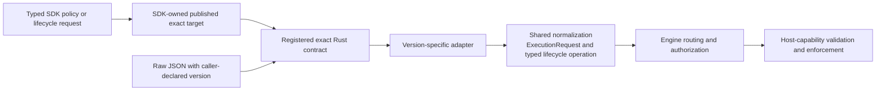

# MXC Versioning Design

> **Audience:** MXC developers

## Architecture at a glance

Versioning determines **which configuration contract is accepted**, not which
backend implementation runs or what the host can enforce. Keep these decisions
separate:

| Decision | Authority |
| --- | --- |
| Which fields and values exist? | The exact Rust contract types and registration in `mxc_contract`. Published contracts are immutable; the development contract can evolve. |
| Which exact contract does a typed SDK emit? | `sdkMajorTargets` in `schemas/schema-version.json`, checked against the exact Rust registry. Callers select a major-version SDK API, not an exact JSON version. |
| Which exact contract does raw JSON use? | The caller's declared, registered `version`. A version range or development opt-in cannot authorize another spelling. |
| Which backend and policy can run? | `mxc_engine` resolves the backend and checks authorization; host capabilities and backend validation determine what can actually be enforced. |

Typed authoring and raw JSON converge before backend execution:



Rust builders construct exact contract values in memory. Node and .NET exact
writers serialize those values to JSON for the native boundary. In either
case, version-specific adapters and shared normalization own the conversion
to runtime requests; SDK policy types and generated schemas do not form
another native configuration authority. The
[native-ingress section](#native-ingress) identifies the deprecated binding
exceptions that remain while the migration is staged.

Publication, SDK targeting, and runtime authorization are independent:
opening `1.1.0-alpha` does not change V1's published target, and accepting
that exact development contract does not grant experimental backend access.
Conversely, experimental authorization does not make a field legal in an
older contract or override backend policy validation.

The sections below distinguish the [three version axes](#the-three-version-axes),
[contract shipping and parsing](#schema-shipping-model),
[SDK major targets](#high-level-sdk-major-targets), and
[backend authorization](#experimental-flag). Artifact regeneration belongs in
[Schema Code Generation](schema-codegen.md); backend execution flow is covered
by [Architecture](architecture.md).

## Core Concepts

### Policy = Intent

The policy (filesystem, network) expresses **what** the user wants — "block network, allow these paths." It does not specify how the OS enforces it, nor which container type to use.

### High-level policy and raw configuration

Rust, .NET, and Node high-level one-shot policy and typed lifecycle APIs do not
take a caller-supplied schema version. Each v1 SDK targets the published exact
`1.0.0` contract internally.

Raw configuration APIs require the caller to declare a registered `version`
to select an immutable historical or mutable development contract.

```typescript
// sdk/node/src/types.ts
const policy: SandboxPolicy = {
  filesystem: { ... },
  network: { ... },
  timeoutMs: 30000,
};
```

The exact JSON emitted internally by a high-level v1 API carries the SDK-owned
version:

```json
{
  "version": "1.0.0",
  "process": { ... },
  "filesystem": { ... },
  "network": { ... }
}
```

### SDK major-version namespaces

Contract-mapped SDK types live in a namespace for their schema-contract major:
`Microsoft.Mxc.Sdk.V1`, `mxc_sdk::v1`, and `@microsoft/mxc-sdk/v1`.
The V1 namespace contains `SandboxPolicy`, its policy sections, containment
selection and backend settings, policy-to-request builders, and typed
state-aware lifecycle request/result/option types and entry points. These APIs
evolve additively as published 1.x contracts grow; the SDK owns the exact
contract target (currently `1.0.0`) and callers do not supply a schema version.
A future breaking schema line adds a side-by-side V2 namespace rather than
replacing V1.

Version-independent APIs stay at the package root: errors and error codes,
running-sandbox handles and output/wait types, platform/backend discovery,
telemetry consent, schema-version constants, raw exact-JSON APIs that take
caller-declared versions, and executor-backed raw config APIs.

### Versioning follows Semver

Per [semver.org](https://semver.org/):
- **Patch** (x.y.Z) — bug fixes only
- **Minor** (x.Y.0) — new features, backward compatible
- **Major** (X.0.0) — breaking changes

## The three version axes

MXC tracks three independent "versions" that are deliberately **never
conflated**. Each answers a different question and changes for different
reasons:

| Axis | What it describes | Where it lives | Who decides it |
|---|---|---|---|
| **Schema (config) version** | The *shape* of the config JSON — which fields exist and what values they accept. | The `version` field in raw configuration; high-level SDK policy omits it. | The raw-config author or, for high-level APIs, the SDK package. |
| **Product version** | The MXC binaries and Rust, Node, and .NET SDK packages. | Rust workspace version (`src/Cargo.toml`), `sdk/node/package.json`, and the .NET SDK project `<Version>`. | The release. |
| **Host capability** | What the *running OS* can actually enforce (e.g. whether the BaseContainer sandbox API is usable, velocity keys, Hyper-V). | Negotiated at runtime — **never a string in the config**. | The host, probed at execution time. |

- **Schema version** selects an exact registered contract at the trust boundary:
  `0.9.0-alpha`, `1.0.0`, or `1.1.0-alpha`.
  Patch and prerelease spelling are significant; `0.6.1-alpha` and `0.8.0-dev`
  are not registered and are rejected. A missing declaration is rejected too.
  Raw SDK entry points enforce the same exact set. High-level v1 one-shot and
  state-aware APIs select stable `1.0.0` internally and expose only the
  backends supported by that contract. The compatibility constants in
  `schemas/schema-version.json` do not authorize other versions within their
  minimum/maximum range.
- **Product version** tracks the shipped artifacts and moves independently of the
  schema version; a binary release can fix bugs without changing the config shape.
  The .NET packaging project passes the release's `PackageVersion` into its
  nuspec; the SDK project's `<Version>` supplies its managed assembly version.
  Windows binaries, including `mxc_ffi.dll`, embed the product version and source
  commit in their version-resource metadata.
  `scripts/check-version-sync.js` keeps the Rust workspace and npm versions in
  step, and `scripts/versioning/check-schema-versions.js` keeps the schema-version
  constants in step — but the two axes are not tied to each other.
- **Host capability** is resolved by runtime negotiation, not by a version string.
  The schema `version` does not select the Windows backend:
  ProcessContainer resolves to BaseContainer or AppContainer purely by host
  capability (see [Version Negotiation](#version-negotiation)). An identical
  policy that is expressible in multiple registered contracts retains the same
  host-capability-driven backend selection.

## Schema Shipping Model

```
mxc/schemas/
├── stable/
│   ├── mxc-config.schema.0.4.0-alpha.json  (retired — below the supported floor)
│   ├── mxc-config.schema.0.5.0-alpha.json  (retired — below the supported floor)
│   ├── mxc-config.schema.0.6.0-alpha.json  (retired — below the supported floor)
│   ├── mxc-config.schema.0.7.0-alpha.json  (retired — below the supported floor)
│   ├── mxc-config.schema.0.8.0-alpha.json  (retired — below the supported floor)
│   ├── mxc-config.schema.0.9.0-alpha.json  (minimum supported)
│   └── mxc-config.schema.1.0.0.json        (shipped — current stable)
└── dev/
    └── mxc-config.schema.1.1.0-alpha.json  (exact closed development contract)
```

Retired stable schema files are **kept as immutable historical artifacts** — the
parser simply stops accepting those versions (the supported floor is
`0.9.0-alpha`). Released schemas are never edited or deleted.

The development artifact is generated from the exact
`mxc_contract::dev` model. It describes all eight closed one-shot and
state-aware roots, including recursively closed experimental structures. The
registered Rust types remain the authority for declared `1.1.0-alpha`
requests; the schema is their derived editor and validation artifact.

Raw JSON is parsed with the exact registered contract named by its `version`
field. High-level Rust, .NET, and Node v1 builders do not accept a caller-supplied
schema version: they construct requests for exact `1.0.0` and reject fields or
backends outside that contract. Repository config validation selects the schema
matching each raw document's declared version.

Only the v1.1 prerelease file under `schemas/dev/` is a generated development
artifact. Published v0.9 and v1.0 are represented by exact Rust contracts and
immutable stable schemas. Exact fixtures and adapter/runtime tests remain
ordinary mutable tests so they can gain regression coverage as implementations
evolve. See [Schema Code Generation](schema-codegen.md) for the regeneration
commands and independent drift/history gates.

### Typed state-aware dispatch

Exact development requests adapt directly to a `StateAwareOperation` and
cross-cutting `ExecutionRequest`. The operation determines its phase:
provision retains a backend tag and optional runtime configuration, while
start, exec, stop, and deprovision carry their required sandbox ID.
`ParsedStateAwareRequest` exposes read-only accessors, not independently
writable phase, containment, or payload fields. Successful production requests
retain neither raw backend JSON nor source text.

The engine resolves provision by containment and later phases by the sandbox
ID prefix. After the existing experimental and build-availability gates, its
checked binding helpers produce `BoundStateAwareRequest<B>` for both relayed
lifecycle dispatch and streaming exec. An incompatible operation/backend pair
is an error, never an absent configuration or a fallback to another backend.
The dispatcher borrows configuration for validation, then moves it into the
phase method. It does not deserialize backend payloads.

Configuration presence is preserved: absent provision configuration is `None`,
a present empty object is `Some(Config { ...: None })`, and an explicit empty
`appId` remains `Some("")`. Outer absent/empty backend sections that have the
same backend meaning need not survive. WSLC uses runtime-owned
`models::WslcProvisionConfig`; the backend still chooses an omitted image's
default. Top-level telemetry and network/UI presence flags remain in common
normalization. Source-aware errors remain at exact structural deserialization.

Exact fixtures cover structural acceptance and rejection, including
`appId: null`. Recording backends cover binding, configuration delivery,
validation order, dry-run behavior, and both exec topologies without requiring
live sandboxes.

Version-specific adapters convert registered JSON contract types into the
private `CommonRequestIR` intermediate representation. Shared normalization in
`normalize_common_request_ir` then validates and converts that representation
into the runtime `ExecutionRequest`; adapters do not perform this second stage.
`ExecutionRequest.source_contract` records the originating registered contract
for diagnostics and telemetry only. Direct typed SDK requests clear that
attribution after exact validation because they did not originate as external
configuration JSON.

Runtime behavior is selected from explicit normalized semantics rather than by
comparing contract-version strings. In particular,
`NetworkEnforcementCompatibility::Strict` is the only mode for registered
exact contracts and direct typed SDK requests. Retired pre-v0.9 contracts
cannot select legacy enforcement behavior. Direct typed SDK construction
clears only source-contract attribution; it does not weaken validation.

### IsolationSession directional networking

The published `0.9.0-alpha` and `1.0.0` contracts accept the standard
directional all-allow posture for IsolationSession:

```json
{
  "egress": { "default": "allow" },
  "ingress": { "default": "allow", "hostLoopback": "allow" }
}
```

Legacy fields, rules, proxies, mixed postures, an empty network object, or
omission are errors. State-aware provision and one-shot exact request parsing
both require `network` structurally, so omission is rejected before backend
validation.

The policy continues through the ordinary cross-cutting network model and
policy identity. No backend-specific acknowledgment field, transport, or hash
projection is introduced.

The stable v0.9 and v1.0 schemas and TypeScript oracles are regenerated from
their published Rust models and compared in CI. Exact fixture and
adapter/runtime tests remain editable so regression coverage can grow without
changing a published JSON contract.

The v1.0 contract preserves the v0.9 request roots and canonical field/value
spellings, but removes the legacy `appcontainer`, `appContainer`, and
`macos_sandbox` aliases. They remain rejected throughout the v1 contract line.
Features that exist only in mutable v1.1 development, including Windows Sandbox
provision and the `vm`, `microvm`, and `hyperlight` one-shot surfaces, are not
accepted by v1.0.

### Trust boundary vs schema defaults

Schemas in `stable/` are immutable: they document the input shape that was
promised at release. They are **not** authoritative for runtime security
defaults. Native contract parsing and backend validation form the trust
boundary for both executor and library callers. Runtime enforcement may apply
stricter defaults than a stable schema declares when a security issue requires
it.

For example, an older stable schema may declare
`network.defaultPolicy` defaulting to `"allow"`. The runtime may treat an
absent `network.defaultPolicy` as `block` regardless of the declared schema
version when the old default is a security bug. The older stable schema is
left unchanged so the release contract stays auditable; newer schemas
document the corrected default. Consumers that need the legacy behavior
must set the field explicitly.

### Shipped vs Experimental

Development features use their intended permanent top-level locations in the
mutable exact contract. JSON location, publication eligibility, and runtime
authorization are separate concerns. This gives editors full autocomplete and
validation without requiring a later field move when a feature graduates.
The engine-owned backend registry in
`src/mxc-sdk/src/core/mxc_engine/backend_registry.rs` records which backend selections
require runtime experimental authorization. Contract publication does not
implicitly change that classification. The flag does not enable otherwise
invalid fields or bypass backend enforcement.

**Rules:**
- **Published contract contents** — shipped, stable, and immutable.
- **Development contract contents** — mutable fields and roots at their
  permanent locations. Inclusion does not imply runtime authorization.
- **Promotion:** Publish the feature in an exact stable contract without
  changing its JSON location. Update backend experimental classification
  separately when that backend is ready for production; publishing a field
  alone does not remove a backend's authorization requirement.

### Published-contract history

`scripts/versioning/check-contract-codegen.js` compares every stable schema
present at the merge base with the current tree. A published schema cannot be
changed or removed. New stable schemas are allowed because they have no
merge-base predecessor.

The same gate requires exactly one development contract and verifies that
every supported stable schema has a published registry entry with the same
version, schema path, and schema identifier. Git already content-addresses the
files, so no separate digest manifest is recorded.

Each `ContractDescriptor` also owns whether that contract generates artifacts
and the request roots used for generation and fixture validation. Each
registered root names its fixture directory and schema definition. The codegen
gate consumes this metadata directly, so a generated contract cannot silently
omit a request root. Legacy v0.6-v0.8 contracts intentionally advertise no
generated request roots.

### High-level SDK major targets

`schemas/schema-version.json` owns `sdkMajorTargets`, the canonical mapping
from each high-level SDK major line to the latest published stable exact
line targets. The v1 line targets `"1": "1.0.0"`. Opening mutable
`1.1.0-alpha` development does not advance that target; publishing stable
`1.1.0` does.

The exact Rust contract registry is authoritative. The schema-version gate
loads that registry through `mxc_schema_gen` and verifies that each mapping:

- names a registered exact stable-version contract;
- stays within the named major line;
- selects the latest published stable contract in that line;
- exists for every published stable major line beginning with v1.

Generated schemas remain derived artifacts and drift oracles. They do not
define the SDK target or the accepted contract shape.

Compatibility comparison and SDK API baselines are intentionally deferred
until the relevant stable and public API artifacts exist. When stable `1.0.0`
and `1.1.0` are both published, structural tooling may compare temporary
projections generated directly from their exact Rust types, while explicit
Rust and fixture tests cover semantic meaning. Rust, Node, and .NET API
baselines are captured when the v1.0 SDK surface is established rather than
through empty placeholder
descriptors.

### Native ingress

The exact JSON execution surface uses `mxc_run_json`, `mxc_spawn_json`, and
the state-aware JSON exports. Typed binding writers select the SDK-owned
contract; raw APIs preserve the caller's exact document. These exports use
the registered contract parser and take non-configuration controls, including
experimental authorization, as typed FFI arguments rather than JSON fields.
The [SDK conformance fixtures](../tests/policy/README.md#sdk-v1-conformance-fixtures)
pair high-level invocations with independently hand-authored expected exact
documents to check mapping intent across Rust, Node, and .NET.

The .NET request probe uses the same exact request writer as execution and
calls `mxc_probe_request_json_with_error`. The private execution and probe
exports and their request parser are removed. Rust SDK policy authoring types
no longer derive serde traits; they build exact contract values rather than
forming another deserializable JSON contract. Exact contract types and
test-only fixture types retain their serialization support.

### Experimental Flag

The experimental flag must be supported at every layer of the stack:

**1. `wxc-exec.exe` / `lxc-exec` (Rust binaries):**
```bash
wxc-exec.exe config.json --experimental
lxc-exec config.json --experimental
# Flag order does not matter — these are equivalent:
wxc-exec.exe --experimental config.json
```

The parser **always** parses fields defined by the selected exact contract;
parsing is flag-independent. The flag authorizes selecting an experimental
backend (MicroVM, Hyperlight, or Windows Sandbox). Without it, native refuses
the request with
`backend_unavailable` on every one-shot and state-aware entry point. The flag
is ignored for production backends, including production-backend fields in a
development contract; unsupported policy still fails closed rather than being
silently ignored. Contract version and backend authorization are separate.
The authorization switch is excluded from policy identity because it does not
change the selected backend's enforcement.

**2. SDK:** policy APIs come from `@microsoft/mxc-sdk/v1`; raw config
spawning comes from `@microsoft/mxc-sdk`.
```typescript
// With policy:
const pty = spawnSandbox("python app.py", policy, {
  experimental: true,
  debug: false
});

// Or with config:
const config = createConfigFromPolicy(policy, "process");
config.process!.commandLine = "python app.py";
const pty = spawnSandboxFromConfig(config, {
  experimental: true,
  debug: false,
});
```

The SDK passes `--experimental` to the underlying binary when this option is set.

### Forking Code for Experimental Features

Developers adding experimental features follow this pattern. For a detailed
step-by-step guide, see [Authoring a New Feature](authoring-a-new-feature.md).

**In the exact development contract (the production parse + schema source of
truth):**

Add the field to the applicable closed request type under
`src/mxc-sdk/src/core/mxc_contract/dev/`, including the backend and phase roots
that admit it.

**In the exact adapter and common request IR:**
```rust
pub(crate) struct CommonRequestIR {
    // ... stable fields ...
    pub(crate) gpu_isolation: Option<GpuIsolation>,
}
```

Edit the authoritative closed mutable contract under
`src/mxc-sdk/src/core/mxc_contract/dev/`, then adapt the exact field into
`CommonRequestIR`. Regenerate the exact schema:

```text
cargo run --manifest-path src/Cargo.toml -p mxc_schema_gen -- schema --version 1.1.0-alpha --out schemas/dev/mxc-config.schema.1.1.0-alpha.json
```

Also regenerate the exact TypeScript oracle with the corresponding
`mxc_schema_gen types --version` command. Do not hand-edit generated artifacts.

**In `models.rs`:**
```rust
pub struct ExecutionRequest {
    // ... stable fields ...
    pub gpu_isolation: Option<GpuIsolationConfig>,
    pub experimental_enabled: bool,  // set by --experimental flag
}
```

**In the version-specific adapter and `config_parser.rs`:** map the exact
contract field into the common request IR, then map its DTO directly to the
corresponding `ExecutionRequest` field inside `normalize_common_request_ir`.

**In the runner (e.g., `appcontainer.rs`):**
```rust
fn run(&mut self, request: &ExecutionRequest, logger: &mut Logger) -> ScriptResponse {
    // ... normal execution ...

    // Experimental features only applied when flag is set
    if request.experimental_enabled {
        if let Some(ref gpu) = request.gpu_isolation {
            self.apply_gpu_isolation(gpu, logger);
        }
    }
}
```

**Promotion process:** When an experimental feature is ready to ship:
1. Carry the field from the mutable development contract into the next exact
   stable contract at the same permanent JSON location, then regenerate its
   exact schema and TypeScript artifacts with `mxc_schema_gen`
2. Add the stable contract adapter mapping while retaining the existing
   `normalize_common_request_ir` domain normalization
3. Remove the `if request.experimental_enabled` guard
4. Bump the minor version
5. Preserve every published contract unchanged; older contracts continue to
   reject the field structurally.

Backend-section validation does not move during promotion: an experimental
backend's exact-contract section already occupies its permanent top-level
location. Existing containment/section consistency rules continue unchanged.

## Data Flow

```
Caller supplies SandboxPolicy (no schema-version field)
        │
        ▼
v1 SDK builds a request for its exact `1.0.0` target
        │
        ▼
MXC validates the request against the selected contract and policy
        │
        ▼
Stage 2: resolve `containment` intent → concrete backend
        │
        ▼
Stage 3: probe host capability → select backend tier
        │  (ProcessContainer: BaseContainer if usable, else AppContainer)
        │
        ▼
For the BaseContainer tier: translate policy → PSEC flat buffer
        │
        ▼
Create process security environment, then launch with CreateProcessW
        │
        ▼
Process runs in sandbox
```

## Exact Contract, Common Request IR, and Runtime Models

MXC deliberately keeps three Rust representations rather than sharing one type
across trust-boundary parsing, common normalization, and backend execution:

- **Exact registered contracts** (`mxc_contract`) — version-, phase-, and
  backend-specific closed request roots. These are the production JSON
  deserialization boundary and the source for authoritative schemas and
  generated exact TypeScript wire types.
- **Common request IR**
  (`mxc_common::common_request_ir::CommonRequestIR`) — the private common
  representation produced by version-specific adapters and consumed by shared
  semantic normalization. It is not a JSON parse or schema generation target.
- **Runtime / domain model** (`models::ExecutionRequest` and friends) — the
  validated, defaults-applied, invariant-rich model the backends consume:
  abstract containment resolved to a concrete backend, `process.commandLine`
  reshaped to `script_code`, enums resolved to domain enums, and required fields
  no longer optional.

The exact contract rejects structural errors first. Version-specific adapters
then perform structural conversion into `CommonRequestIR`.
`normalize_common_request_ir` applies shared defaults and semantic validation
and constructs the runtime model.
The registered contracts admit only directional networking, so their adapters
pass directional network sections to shared normalization. An omitted network
section receives directional deny defaults; shared normalization does not select
a network format from contract provenance or legacy field presence.

Reusable nested DTOs under `mxc_common::wire` help adapters share representations
for common fields. They are not a whole-request deserialization boundary and do
not generate schemas or public SDK types.

### Why the layers stay separate (pros)

### Benefits

- **Exact version boundaries.** Each registered contract owns its accepted JSON
  shape, generated schema, and generated exact TypeScript types. A field cannot
  leak into another version or request phase through a shared permissive root.
- **One validate/normalize boundary.** Defaults, invariant enforcement,
  abstract→concrete backend resolution, and field reshaping all happen in exactly
  one place; backends receive a type whose invariants already hold.
- **Parse, don't validate.** The domain type makes illegal states
  unrepresentable (required fields non-`Option`, enums resolved, containment
  always concrete), so a backend never re-checks "is this set / known?".
- **Shared normalization without shared acceptance.** Exact adapters converge on
  `CommonRequestIR`, so semantic rules stay common without making every version
  deserialize through one rolling request type.
- **Decoupled evolution.** An exact contract can rename, alias, or restructure a
  field without exposing those JSON details to backend code.
- **Backends don't couple to JSON quirks** — camelCase renames, deprecated-spelling
  serde aliases, `$schema`/`_comment` passthrough, and request-root differences
  do not leak into runner code.

### Costs

- **Adapter work.** Adding a field touches each exact contract that accepts it,
  its adapter, `CommonRequestIR` or a phase-specific runtime config, and the
  runtime model when the field survives normalization.
- **Internal drift risk.** Exact adapters and common normalization can diverge.
  Exhaustive destructuring without `..` makes newly added contract fields fail
  compilation until they are deliberately mapped.
- **Indirection.** Tracing one field means following exact request → adapter →
  `CommonRequestIR` → `ExecutionRequest` → backend.

### Why the split is the right call for MXC

The exact contracts must remain JSON-shaped because they define each published
trust boundary and generate its schema and TypeScript representation.
`CommonRequestIR` gives those version-specific contracts one private convergence
point, while `ExecutionRequest` gives backends stable, validated runtime
semantics. Combining any two would either weaken exact-version closure, duplicate
normalization across versions, or expose JSON-specific optionality and aliases to
backends.

The costs are addressable without merging these responsibilities, for example
with shared adapter helpers and compile-time mapping checks. No planned phase
reintroduces a rolling whole-request contract.

## Version Negotiation

Execution resolves a request in three ordered stages. The schema version gates
only the first; it does **not** influence stages 2 or 3.

```
Stage 1 — Exact contract selection (the trust boundary, `config_parser`)
  Does config.version name an exact registered contract?
    missing / malformed → declaration error
    unregistered        → unsupported contract version error
    registered          → deserialize that contract
                          → adapt to CommonRequestIR
                          → normalize and validate into ExecutionRequest
  Patch and prerelease spelling are significant; there is no range fallback.

Stage 2 — Containment resolve (independent of schema version)
  Map the `containment` intent to a concrete backend:
    omitted / "process" → OS-native process sandbox
                          (Windows: ProcessContainer, Linux: Bubblewrap,
                           macOS: Seatbelt)
    "vm"                → host VM-class backend
    explicit backend    → used verbatim

Stage 3 — Host-capability negotiate (runtime probe, no version input)
  For ProcessContainer on Windows:
    BaseContainer usable on this host?  (is_base_container_usable())
      yes → BaseContainer (native OS sandbox API)
      no  → AppContainer fallback tier (BFS when compiled in with the
            `tier2_bfs` feature and `bfscfg.exe` is present, else DACL)
  The chosen tier and any fallback are logged (warnings + "selected isolation
  tier: …"). This capability fallback is the ONLY fallback.
```

For the BaseContainer tier, Stage 3 translates the policy into a PSEC
FlatBuffer, creates a process security environment, and supplies it to
`CreateProcessW`:

```
translate policy → PSEC FlatBuffer
  → CreateProcessSecurityEnvironment(flatbuffer)
  → CreateProcessW(PROC_THREAD_ATTRIBUTE_SECURITY_ENVIRONMENT)
  → success or typed error
```

PSEC compatibility is runtime-probed. MXC selects this tier only when the
installed contract supports the complete requested policy.

**Backend selection is capability-driven, not version-driven** (Stage 3 takes no
version input), and **security policy never fuzzy-falls-back**: if the selected
backend cannot honor the requested filesystem/network policy, execution fails
with a typed, actionable error rather than silently weakening enforcement (see
[Error Contract](#error-contract)).

## OS APIs

The BaseContainer tier creates a process security environment and attaches it
to the child launch:

```c
HRESULT CreateProcessSecurityEnvironment(
    BYTE* specification,
    UINT32 specificationSize,
    HANDLE* securityEnvironment
);

BOOL CreateProcessW(
    ...,
    LPPROC_THREAD_ATTRIBUTE_LIST attributeList,
    ...
);
```

## Error Contract

Negotiation failures are **typed and actionable** — never a silent fallback:

- **JSON and policy-shape failures** distinguish malformed JSON syntax from
  valid JSON that does not match the typed wire contract. Typed failures name
  the full policy path (for example, `network.proxy.localhost`), retain Serde's
  expected type/value information, and include source line/column when parsing
  directly from request text. State-aware per-backend configuration errors are
  prefixed with their full `<backendSection>.<phase>` location. Diagnostic
  text escapes control characters, and errors at secret-bearing paths redact the
  submitted value. After the root JSON value, only whitespace is accepted;
  trailing JSON values or other trailing content are rejected as malformed
  syntax.
- **Contract-version failures** (Stage 1) identify a missing or malformed
  declaration or an unsupported exact version. The SDK retains its
  "older than supported" / "newer than supported" hints for versions outside
  the supported lines, and rejects unregistered in-range spellings with
  "not a registered schema contract". No loader silently chooses a version.
- **Capability failures** (Stage 3) surface on the runner's `ScriptResponse`
  (and the SDK `spawn` path's `MxcError`) as a `BackendUnavailable` failure
  phase when the requested backend's API is absent (e.g. the BaseContainer OS
  sandbox API is not present on this build), with a hint pointing at the host
  requirement — not a downgrade to a weaker backend behind the caller's back.
  (BaseContainer-vs-AppContainer is the one exception, and it is an explicit,
  logged capability tier, not a security relaxation.)
- **Policy-unsupported failures** (a backend that cannot honor a specific policy
  field, e.g. `deniedPaths`) fail with a specific message naming the
  unsupported field. Security policy is deterministic — no relaxation, no fuzzy
  fallback.

The MXC ↔ OS contract therefore reports: which feature failed, whether it was a
version mismatch or a runtime/capability unavailability (e.g. Hyper-V off), and
what the user should do (upgrade OS, enable feature, change the config).

## Experimental Features — Clarifications

**Shipping model:** The shipped schema contains **only** non-experimental
features. Experimental features exist solely for internal development and
testing — they are never shipped to end users. The `--experimental` flag is a
development tool, not a production feature.

**Global flag:** The `--experimental` flag is a single global toggle. When enabled,
all experimental features in the config are active. There is no per-feature
enable/disable mechanism — simplicity over granularity.

**Migration after promotion:** Promotion changes publication and runtime
authorization, not the feature's JSON path. Old contracts retain their exact
historical shapes; new requests must use the shape defined by their declared
exact version.

## Deprecation Aliases

When a wire value is renamed (e.g. `appcontainer` → `processcontainer` in
[#268](https://github.com/microsoft/mxc/pull/268)), the legacy spelling enters a
deprecation window where both forms are accepted on the wire.

**Policy:** alias acceptance belongs to each exact parser contract. The parser,
schema, generated raw type, and raw SDK validator must agree on the spellings
accepted by the declared `config.version`; aliases are not version-independent
parser exceptions.

The historical v0 contracts retain their original compatibility aliases.
`appcontainer` and `appContainer` are accepted by v0.6-v0.9, while
`macos_sandbox` is accepted by v0.7-v0.9. The v1 line removes all three
spellings at its major-version boundary, so raw v1.0 and v1.1 requests must use
`processcontainer`, `processContainer`, and `seatbelt`.

**Observability.** Each exact contract accepts its version-specific legacy
value aliases and normalizes them during exact deserialization, before its
adapter produces `CommonRequestIR`. The private normalization DTOs are not a
JSON trust boundary. Internal raw-string consumers that need containment only
for classification, such as command splicing, recognize aliases explicitly
through `wire::Containment::parse_wire_name`. Alias acceptance is silent in the
native parser; the TypeScript SDK validator may still surface a deprecation hint
via `diagLog` while inspecting raw config.

**Removal.** Removing an accepted alias is a breaking wire change and therefore
belongs at a major-version boundary. Older immutable contracts continue to
accept their historical spellings; the new major rejects them with the
standard exact-contract diagnostic.

## Open Questions

1. **Security of the experimental flag:** Should `--experimental` require
   additional privilege or be restricted to debug builds? A malicious caller could
   pass `--experimental` to enable a feature that weakens the sandbox boundary.

2. **Conflicting experimental features:** If two experimental features have
   conflicting requirements (e.g., one denies a namespace, another relaxes it),
   how are conflicts resolved? First-wins, last-wins, or error?

3. **Per-feature vs global experimental flag:** Should `--experimental` be a
   global toggle (all experimental features on/off), or per-feature
   (`--experimental compartments --experimental gpu-isolation`)? Per-feature
   gives more control but adds complexity to the executor and SDK interfaces.

5. **Shipping experimental features to customers:** Should experimental features
   be shippable to specific customers (e.g., Anthropic, Nemoclaw), or strictly
   internal development only? If shippable, the security and stability
   requirements for experimental features increase significantly. What is the
   delivery mechanism — private npm package drop, feature-flagged public release,
   or a separate experimental binary?

6. **Multiple dev schemas for multiple major versions:** When multiple major
   versions are alive simultaneously (e.g., v1 shipped on OS 26100, v2 shipped
   on OS 27000, v3 in development), promoting a feature may require adding it
   to multiple schemas. For example, if "compartments" is additive, it should
   be added to both `dev/1.vnext.json` and `dev/2.vnext.json` as a minor bump
   for each. If it's breaking, it goes only into `dev/3.vnext.json`. The `dev/`
   folder and promotion process need to support this multi-schema model. Today
   we are pre-1.0 with only one major version, so a single dev schema suffices.

7. **Experimental features modifying stable behavior:** Experimental features
   may need to modify stable behavior. How do we reason about
   and test this?
